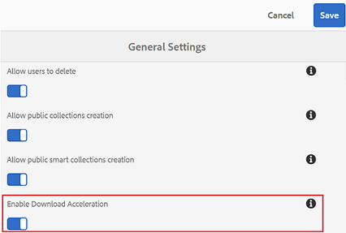

# Speed up the Brand Portal downloads {#guide-to-accelerate-downloads-from-brand-portal}

Brand Portal allows enhancing the download performance of large asset files by integrating with IBM Aspera Connect, which is an install-on-demand application. Die Anwendung nutzt proprietäre Technologie, um TCP-Overhead zu entfernen und die Übertragungsgeschwindigkeit der Asset-Dateien zu verbessern. Diese Integration gewährleistet ein verbessertes Download-Erlebnis.

>[!NOTE]
>
>Download speed varies for users as it depends upon factors such as network bandwidth, server latency, and geographical location of clients.

Ist diese Option aktiviert, können Brand Portal-Benutzer die zum Herunterladen der gewünschten Asset-Dateien von Brand Portal oder über freigegebene Links benötigte Zeit durch die Installation des Aspera Connect-Clients erheblich verkürzen.

## Voraussetzungen für die Beschleunigung des Datei-Downloads {#prerequisites-to-accelerate-file-download}

To download the files faster, ensure the following:

* **[!UICONTROL Enable Download Acceleration (which is disabled by default) from General Settings in the administrative tools panel.]**
* Port 33001 (both TCP and UDP) is open on the firewall. Weitere Informationen zu den Voraussetzungen finden Sie in der [Aspera Connect Client-Dokumentation](https://downloads.asperasoft.com/en/documentation/8).
* Installieren Sie Aspera Connect mit Administratorrechten.
* For platform support of Aspera transfer client, see [Aspera Connect platform support matrix](https://www.asperasoft.com/company/support/transfer-clients/).

## Download domains {#download-domains}

Nachfolgend sind die Download-Domänen für verschiedene geografische Standorte aufgeführt:

| Regionscode | Domäne |
|---|---|
| NA OR1 | downloads-na1.brand-portal.adobe.com |
| NA VA5 | downloads-na2.brand-portal.adobe.com |
| EMEA LON5 | downloads-emea1.brand-portal.adobe.com |
| APAC SIN2 | downloads-apac1.brand-portal.adobe.com |

## Sample download performance using file accelerator {#expected-download-performance-using-file-accelerator}

Die folgende Tabelle zeigt die Downloadleistung für 2 GB-Dateien mit dem Aspera Connect-Dateidownload-Beschleuniger:

**Die beobachteten Ergebnisse variieren je nach Faktoren wie Netzwerkbandbreite, Serverlatenz und Kundenstandort, da sich der Brand Portal-Server bei Oregon (USA) befindet.*

| Client-Standort | Latenz zwischen Client und Server (ms) | Geschwindigkeit mit Aspera Connect File Transfer Accelerator (MBps) | Dauer des Downloads von 2 GB Dateien mit Aspera File Transfer Accelerator (Sekunden) |
|---------------------------|-----------------------------------|---------------------------------------------|-------------------------------------------------------------------------|
| USA, Westen (Nordkalifornien) | 18 | 36 | 57 |
| USA, Westen (Oregon) | 42 | 36 | 57 |
| USA, Osten (Nordvirginia) | 85 | 35 | 58 |
| APAC (Tokio) | 124 | 36 | 57 |
| Noida (India) | 275 | 13.36 | 153 |
| Sydney | 175 | 29 | 70 |
| London | 179 | 35 | 58 |
| Singapur | 196 | 34 | 60 |

## Download-Workflow mit dem Dateibeschleuniger {#download-workflow-using-file-accelerator}

So laden Sie Assets schneller von Brand Portal herunter:

1. Melden Sie sich beim Markenportal mit einem unterstützten Browser an.
2. Suchen Sie nach der gewünschten Asset-Datei oder Sammlung bzw. dem gewünschten Ordner, die bzw. der heruntergeladen werden soll, und wählen Sie diese bzw. diesen aus. Tippen bzw. klicken Sie auf die Option „Herunterladen“.
Das Dialogfeld „Herunterladen“ wird mit der aktivierten Option [Downloadbeschleunigung aktivieren] angezeigt.
   

   >[!NOTE]
   >
   >Die Funktion zum Versenden von E-Mail-Benachrichtigungen mit dem Link zum Herunterladen von Assets wird derzeit nicht unterstützt, solange die Funktion für schnellere Downloads aktiviert ist.

   

3. Tap/click the **[!UICONTROL Download]** option.
Um die Download-Zeiten für Ihr Brand Portal-Mandantenkonto zu verkürzen, müssen Sie die Aspera Connect-Clientanwendung auf Ihrem System installiert haben.

4. **Herunterladen des Aspera Connect-Clients**
Falls der Aspera Connect-Client nicht auf Ihrem System installiert oder der vorhandene installierte Aspera Connect-Client veraltet ist, wird eine Eingabeaufforderung auf der Browser-Seite angezeigt, über die Sie den systemspezifischen Aspera Connect-Client herunterladen können. Wählen Sie dazu die Option **[!UICONTROL Neueste Version herunterladen aus]**.

   

   To download the latest version of Aspera Connect from [https://downloads.asperasoft.com/connect2/](https://downloads.asperasoft.com/connect2/), select **[!UICONTROL Download Now]** and follow the instructions.

5. **Installation des Aspera Connect Client**
Zur Installation von IBM Aspera Connect Client-Setup führen Sie das Setup aus der MSI-Datei der IBM Aspera Connect-Client-Anwendung aus und folgen Sie dem Installationsassistenten.

6. Sobald der Client erfolgreich installiert ist, aktualisieren Sie die Browser-Seite und führen Sie die Download-Schritte erneut aus oder wählen Sie die Option **[!UICONTROL Neu starten]** im Dialogfeld **Download]des Assets (Schritt 2).[!UICONTROL **
When using Aspera Connect for the first time, the browser prompts to open the link using **[!UICONTROL IBM Aspera Connect]**. Damit dieses Dialogfeld in Zukunft nicht mehr angezeigt wird, aktivieren Sie **[!UICONTROL Meine Auswahl für FASP-Verbindungen speichern]**.

   >[!NOTE]
   >
   >Diese Meldung unterscheidet sich von Browser zu Browser.

7. Sie werden in einem Dialogfeld aufgefordert zu bestätigen, ob die Übertragung fortgesetzt werden soll oder nicht. Wählen Sie **[!UICONTROL Zulassen], um zu beginnen.**
Um dieses Dialogfeld zukünftig nicht mehr anzuzeigen, aktivieren Sie **[!UICONTROL Meine Auswahl für alle Verbindungen mit diesem Host verwenden]**.
Der Download beginnt. In einem Dialogfeld wird der Fortschritt des Downloads angezeigt. Use the dialog box to **[!UICONTROL pause]**, **[!UICONTROL resume]**, or **[!UICONTROL cancel]** the download.
Die Aspera Connect-Anwendung bietet im System ein Aktivitätsfenster, über das Benutzer alle Übertragungssitzungen anzeigen und verwalten können. Weitere Informationen finden Sie in der [Dokumentation zum Aspera Connect-Client](https://downloads.asperasoft.com/en/documentation/8).

Bei erfolgreichem Abschluss des Downloads zeigt das Dialogfeld das Verzeichnis an, in das die Assets auf dem System des Benutzers heruntergeladen wurden. Wenn der Download scheitert, wird ein Fehler angezeigt.

>[!NOTE]
>
>There is a known limitation in Aspera Connect client application that no prompt to select download location appears if **[!UICONTROL Always ask me where to save downloaded files]** is enabled under the tab [!UICONTROL Transfers] within [!UICONTROL Preferences]. Geben Sie vor Beginn eines Downloads den Speicherort im Textfeld **[!UICONTROL Heruntergeladene Dateien speichern unter an]**.

## Verwenden des Dateibeschleunigers im Browser Microsoft Edge {#using-file-accelerator-on-microsoft-edge-browser}

Microsoft Edge wird im erweiterten geschützten Modus (EPM, Enhanced Protected Mode) ausgeführt, der eine Kommunikation mit dem Aspera Connect-Server im selben privaten Netzwerk oder mit einer vertrauenswürdigen Website verhindert. Daher wird jedes Mal, wenn eine Verbindung zum Server hergestellt wird, eine Popup-Meldung angezeigt.

Um die Funktion für beschleunigte Downloads in Microsoft Edge zu verwenden, müssen Sie die Brand Portal-Website aus der Liste der vertrauenswürdigen Websites entfernen.

1. Open the Control Panel (press **[!UICONTROL Window key + X]**, then select **[!UICONTROL Control Panel]**).
2. Navigieren Sie zu **[!UICONTROL Netzwerk und Internet &gt; Internetoptionen]**. Klicken Sie auf die Registerkarte **[!UICONTROL Sicherheit].**
3. Klicken Sie auf **[!UICONTROL Zone vertrauenswürdiger Sites]** und dann auf **[!UICONTROL Sites]**.
4. Entfernen Sie die Brand Portal-Website aus der Liste.

## Voreinstellungen für den Aspera Connect-Client {#aspera-connect-client-preferences}

Es gibt einige nützliche Voreinstellungen, die in den Voreinstellungen des IBM Aspera Connect-Clients festgelegt werden können. Klicken Sie dazu mit der rechten Maustaste auf das Symbol und wählen Sie **[!UICONTROL Voreinstellungen aus]**.

Sie können das Standard-Downloadverzeichnis festlegen.

Außerdem kann der Aspera Connect-Client so konfiguriert werden, dass er automatisch bei Systemstart gestartet und ausgeführt wird und so schneller für Downloads verfügbar ist.

## Beheben von Problemen mit der Downloadbeschleunigung {#troubleshoot-issues-with-download-acceleration}

Wenn die Download-Beschleunigung bei Ihnen nicht funktioniert, führen Sie die folgenden Schritte zur Fehlerbehebung aus:

1. Check that ports are not blocked, by visiting [https://test-connect.asperasoft.com](https://test-connect.asperasoft.com/) from your machine.

   Wenn die Ports nicht in Ordnung sind, kontaktieren Sie Ihr Netzwerkteam, um sicherzustellen, dass die Ports 33001 (TCP und UDP) nicht in der Firewall blockiert werden.

2. Wenn die Ports einwandfrei funktionieren, vergewissern Sie sich anschließend, dass Ihr Netzwerk nicht langsam ist. Messen Sie dazu die verfügbare Bandbreite über [/](https://www.speedtest.net/)https://www.speedtest.net/.

   Ist die Brandbreite gering (1–10 MBit/s oder nur KBit/s), rufen Sie die Aspera-Voreinstellungen auf und versuchen Sie, die Bandbreite auf die verfügbare Bandbreite zu beschränken.

3. Um festzustellen, ob die Downloads vom Aspera-Demoserver funktionieren, wählen Sie https://demo.asperasoft.com/aspera/user.\
   (Benutzername: asperaweb, Passwort: demoaspera)

4. Wenn keiner der zuvor genannten Schritte den Fehler beheben kann, heben Sie die Auswahl der Option „Downloadbeschleunigung aktivieren“ auf und verwenden Sie die normale Download-Funktion.
