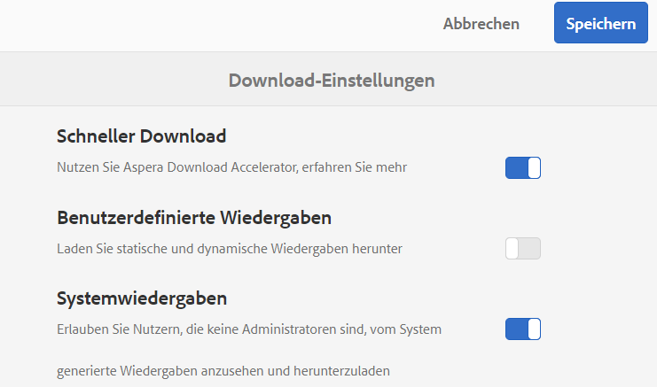
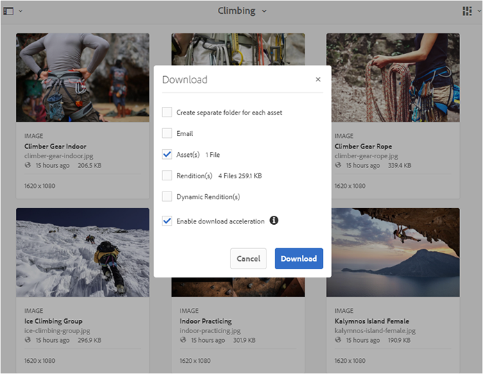
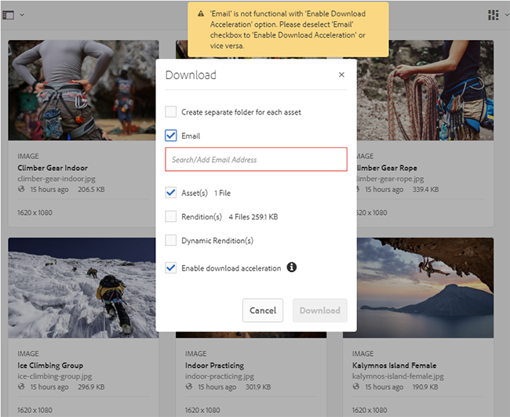
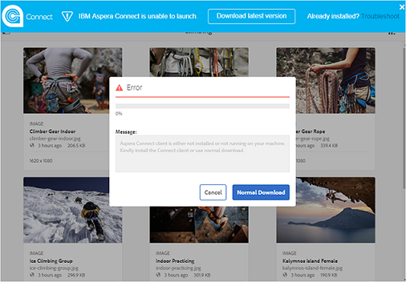
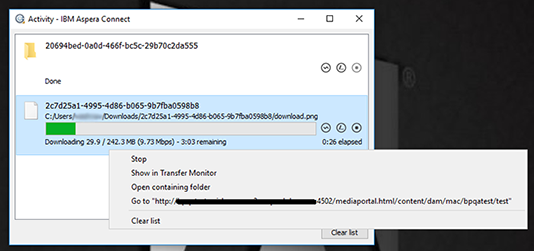
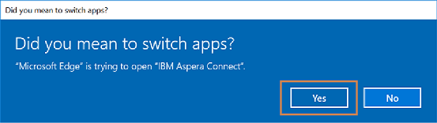
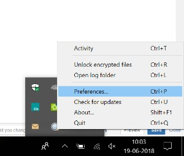
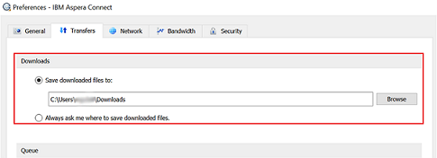
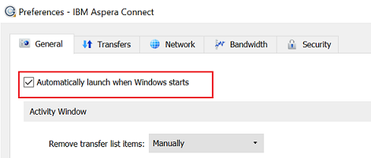

# Beschleunigen von Downloads in Brand Portal{#guide-to-accelerate-downloads-from-brand-portal}

Brand Portal ermöglicht das Verkürzen der Download-Zeiten größerer Asset-Dateien durch die Integration mit IBM Aspera Connect, einer bei Bedarf zusätzlich installierten Anwendung. Die Anwendung nutzt proprietäre Technologie, um TCP-Overheads zu verhindern und Übertragungsgeschwindigkeiten für Asset-Dateien zu verbessern. Diese Integration sorgt für eine Verkürzung der Download-Zeiten.

>[!NOTE]
>
>Die jeweilige Download-Geschwindigkeit variiert jedoch abhängig von Faktoren wie der Netzwerkbandbreite, der Serverlatenz und dem geografischen Standort der Clients.

Die Konfiguration **[!UICONTROL Schneller Download]** ist standardmäßig aktiviert, wodurch die Zeit zum Herunterladen der gewünschten Asset-Dateien von Brand Portal erheblich verringert wird.

## Voraussetzungen für die Beschleunigung des Datei-Downloads          {#prerequisites-to-accelerate-file-download}

Stellen Sie Folgendes sicher, um Dateien schneller herunterzuladen:

* Navigieren Sie zu **[!UICONTROL Tools]** > **[!UICONTROL Download]** und überprüfen Sie, ob die Konfiguration **[!UICONTROL Schneller Download]** in den **[!UICONTROL Download-Einstellungen]** aktiviert ist.
* Port 33001 (TCP und UDP) ist in der Firewall geöffnet. Weitere Informationen zu den Voraussetzungen finden Sie in der [Dokumentation zum Aspera Connect Client](https://downloads.asperasoft.com/en/documentation/8).
* Installieren Sie Aspera Connect mit Administratorrechten.
* Informationen zu den vom Aspera Client unterstützten Plattformen finden Sie in der [Plattform-Unterstützungsmatrix für Aspera Connect](https://www.asperasoft.com/company/support/transfer-clients/).

## Download-Domänen {#download-domains}

Nachfolgend sind die Download-Domänen für verschiedene geografische Standorte aufgeführt:

| Regionscode | Domäne |
|---|---|
| NA OR1 | downloads-na1.brand-portal.adobe.com |
| NA VA5 | downloads-na2.brand-portal.adobe.com |
| EMEA LON5 | downloads-emea1.brand-portal.adobe.com |
| APAC SIN2 | downloads-apac1.brand-portal.adobe.com |

## Beispiele für Download-Zeiten mit dem Dateibeschleuniger {#expected-download-performance-using-file-accelerator}

Die folgende Tabelle zeigt die Download-Zeiten für 2 GB große Dateien mit dem Aspera Connect-Downloadbeschleuniger:

*Die tatsächlichen Ergebnisse variieren aufgrund von Faktoren wie Netzwerkbandbreite, Server-Latenz und Client-Standort. Dabei ist zu berücksichtigen, dass sich der Brand Portal-Server in Oregon (USA) befindet.*

| Client-Standort | Latenz zwischen Client und Server          (ms) | Geschwindigkeit mit dem Aspera-Dateiübertragungsbeschleuniger (MBit/s) | Mit Aspera-Dateiübertragungsbeschleuniger benötigte Zeit für Download von 2-GB-Datei (in Sekunden) |
|---------------------------|-----------------------------------|---------------------------------------------|-------------------------------------------------------------------------|
| USA, Westküste (Nordkalifornien) | 18 | 36 | 57 |
| USA, Westen (Oregon) | 42 | 36 | 57 |
| USA, Ostküste (Nordvirginia) | 85 | 35 | 58 |
| Asien-Pazifik-Raum (Tokio) | 124 | 36 | 57 |
| Noida (Indien) | 275 | 13,36 | 153 |
| Sydney | 175 | 29 | 70 |
| London | 179 | 35 | 58 |
| Singapur | 196 | 34 | 60 |

## Download-Workflow mit dem Dateibeschleuniger {#download-workflow-using-file-accelerator}

So laden Sie Assets schneller von Brand Portal herunter:

1. Melden Sie sich über einen unterstützten Browser bei Brand Portal an.
1. Wählen Sie die Ordner oder Assets aus, die Sie herunterladen möchten. Klicken Sie oben in der Symbolleiste auf das Symbol **[!UICONTROL Download]**. Das Dialogfeld **[!UICONTROL Download]** wird angezeigt, wobei die Kontrollkästchen **[!UICONTROL Asset(s)]** und **[!UICONTROL Download-Beschleunigung aktivieren]** standardmäßig vorausgewählt sind.

   

   >[!NOTE]
   >
   >Die Funktion zum Versenden von E-Mail-Benachrichtigungen mit dem Link zum Herunterladen von Assets wird derzeit nicht unterstützt, solange die Funktion für schnellere Downloads aktiviert ist.

   

1. Klicken Sie auf **[!UICONTROL Download]**.

   Um die Download-Zeiten für Ihr Brand Portal-Mandantenkonto zu verkürzen, müssen Sie die Aspera Connect-Client-Anwendung als Browser-Erweiterung installiert haben.

1. **Herunterladen des Aspera Connect-Clients**

   Falls der Aspera Connect-Client nicht auf Ihrem System installiert oder der vorhandene installierte Aspera Connect-Client veraltet ist, wird eine Eingabeaufforderung auf der Browser-Seite angezeigt, über die Sie den systemspezifischen Aspera Connect-Client herunterladen können. Wählen Sie dazu die Option **[!UICONTROL Neueste Version herunterladen]** aus.

   

   Sie können die neueste Version von Aspera Connect auch von [https://downloads.asperasoft.com/connect2/](https://downloads.asperasoft.com/connect2/) herunterladen. Wählen Sie **[!UICONTROL Jetzt herunterladen]** aus und befolgen Sie die Anweisungen.

1. **Installation des Aspera Connect-Clients**

   Um den IBM Aspera Connect-Client zu installieren, führen Sie das Setup über die MSI-Datei der IBM Aspera Connect-Client-Anwendung aus und folgen Sie dem Installationsassistenten.

1. Nachdem der Client erfolgreich installiert wurde, aktualisieren Sie die Browser-Seite und starten Sie die Download-Schritte erneut.

   Wenn Sie Aspera Client zum ersten Mal verwenden, werden Sie vom Browser aufgefordert, den Link mithilfe von **[!UICONTROL IBM Aspera Connect]** zu öffnen. Damit dieses Dialogfeld in Zukunft nicht mehr angezeigt wird, aktivieren Sie **[!UICONTROL Meine Auswahl für FASP-Verbindungen speichern]**.

   >[!NOTE]
   >
   >Diese Meldung unterscheidet sich von Browser zu Browser.

1. Sie werden in einem Dialogfeld aufgefordert zu bestätigen, ob die Übertragung fortgesetzt werden soll oder nicht. Wählen Sie **[!UICONTROL Zulassen]**, um zu beginnen. 
Um dieses Dialogfeld zukünftig nicht mehr anzuzeigen, aktivieren Sie **[!UICONTROL Meine Auswahl für alle Verbindungen mit diesem Host verwenden]**.
Der Download beginnt. In einem Dialogfeld wird der Fortschritt des Downloads angezeigt. Nutzen Sie das Dialogfeld, um den Download **[!UICONTROL anzuhalten]**, **[!UICONTROL fortzusetzen]** oder **[!UICONTROL abzubrechen]**.
Die Aspera Connect-Anwendung bietet im System ein Aktivitätsfenster, über das Benutzer alle Übertragungssitzungen anzeigen und verwalten können. Weitere Informationen finden Sie in der [Dokumentation zum Aspera Connect-Client](https://downloads.asperasoft.com/en/documentation/8).

Bei erfolgreichem Abschluss des Downloads zeigt das Dialogfeld das Verzeichnis auf dem System des Benutzers an, in das die Assets heruntergeladen wurden. Wenn der Download fehlschlägt, wird ein Fehler angezeigt.

>[!NOTE]
>
>Es gibt in der Aspera Connect-Client-Anwendung die bekannte Einschränkung, dass keine Eingabeaufforderung zur Auswahl des Download-Verzeichnisses angezeigt wird, wenn die Option **[!UICONTROL Immer nach dem Speicherort für die heruntergeladene Dateien fragen]** auf der Registerkarte **[!UICONTROL Übertragungen]** unter **[!UICONTROL Voreinstellungen]** aktiviert ist. Geben Sie vor Beginn eines Downloads den Speicherort im Textfeld **[!UICONTROL Heruntergeladene Dateien speichern unter]** an.

## Verwenden des Dateibeschleunigers im Browser Microsoft Edge {#using-file-accelerator-on-microsoft-edge-browser}

Microsoft Edge wird im erweiterten geschützten Modus (EPM, Enhanced Protected Mode) ausgeführt, der eine Kommunikation mit dem Aspera Connect-Server im selben privaten Netzwerk oder mit einer vertrauenswürdigen Website verhindert. Daher wird jedes Mal, wenn eine Verbindung zum Server hergestellt wird, eine Popup-Meldung angezeigt.

Um die Funktion für beschleunigte Downloads in Microsoft Edge zu verwenden, müssen Sie die Brand Portal-Website aus der Liste der vertrauenswürdigen Websites entfernen.

1. Öffnen Sie die Systemsteuerung (drücken Sie dazu die Tastenkombination **[!UICONTROL Windows-Taste+X]** und wählen Sie dann **[!UICONTROL Systemsteuerung]** aus).
1. Navigieren Sie zu **[!UICONTROL Netzwerk und Internet]** > **[!UICONTROL Internetoptionen]**. Klicken Sie auf die Registerkarte **[!UICONTROL Sicherheit]**.
1. Klicken Sie auf **[!UICONTROL Zone vertrauenswürdiger Sites]** und dann auf **[!UICONTROL Sites]**.
1. Entfernen Sie die Brand Portal-Website aus der Liste.

## Voreinstellungen für den Aspera Connect-Client          {#aspera-connect-client-preferences}

Im IBM Aspera Connect-Client können Sie einige nützliche Voreinstellungen vornehmen, indem Sie mit der rechten Maustaste auf das Symbol klicken und **[!UICONTROL Voreinstellungen]** auswählen.

Sie können das Standard-Downloadverzeichnis festlegen.

Außerdem kann der Aspera Connect-Client so konfiguriert werden, dass er automatisch bei Systemstart gestartet und ausgeführt wird und so schneller für Downloads verfügbar ist.

## Beheben von Problemen mit der Download-Beschleunigung   {#troubleshoot-issues-with-download-acceleration}

Wenn die Download-Beschleunigung bei Ihnen nicht funktioniert, führen Sie die folgenden Schritte zur Fehlerbehebung aus:

1. Vergewissern Sie sich, dass die Ports nicht blockiert sind. Besuchen Sie dazu die Website [https://test-connect.asperasoft.com](https://test-connect.asperasoft.com/) von Ihrem Computer aus.

   Wenn die Ports nicht in Ordnung sind, kontaktieren Sie Ihr Netzwerkteam, um sicherzustellen, dass die Ports 33001 (TCP und UDP) nicht in der Firewall blockiert werden.

1. Wenn die Ports einwandfrei funktionieren, vergewissern Sie sich anschließend, dass Ihr Netzwerk nicht langsam ist. Messen Sie dazu die verfügbare Bandbreite über [https://www.speedtest.net/](https://www.speedtest.net/).

   Ist die Bandbreite gering (1–10 MBit/s oder nur KBit/s), rufen Sie die Aspera-Voreinstellungen auf und versuchen Sie, die Bandbreite auf die verfügbare Bandbreite zu beschränken.

1. Um festzustellen, ob die Downloads vom Aspera-Demoserver funktionieren, wählen Sie [https://demo.asperasoft.com/aspera/user](https://demo.asperasoft.com/aspera/user).\
   (Benutzername: asperaweb, Passwort: demoaspera)

1. Wenn keiner der zuvor genannten Schritte den Fehler beheben kann, heben Sie die Auswahl der Option „Download-Beschleunigung aktivieren“ auf und verwenden Sie die normale Download-Funktion.
