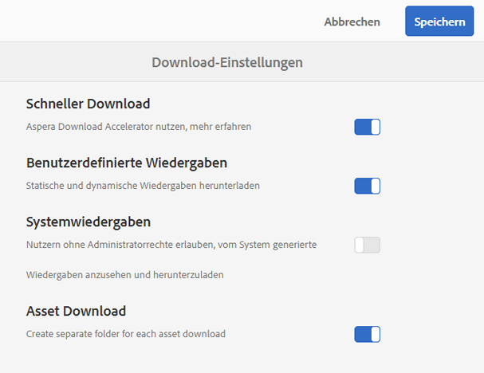
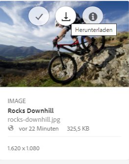

# Beschleunigen von Downloads in Brand Portal {#guide-to-accelerate-downloads-from-brand-portal}

Adobe Experience Manager Assets Brand Portal ermöglicht das Verkürzen der Download-Zeiten größerer Asset-Dateien durch die Integration mit IBM Aspera Connect, einem bei Bedarf zusätzlich installierten Programm. Das Programm nutzt proprietäre Technologie, um TCP-Overheads zu verhindern und Übertragungsgeschwindigkeiten für Asset-Dateien zu verbessern. Diese Integration sorgt für eine Verkürzung der Download-Zeiten.

>[!NOTE]
>
>Die jeweilige Download-Geschwindigkeit variiert jedoch abhängig von Faktoren wie der Netzwerkbandbreite, der Serverlatenz und dem geografischen Standort der Clients.

Die Konfiguration **[!UICONTROL Schneller Download]** ist standardmäßig aktiviert, wodurch die Zeit zum Herunterladen der gewünschten Asset-Dateien von Brand Portal erheblich verringert wird.

## Voraussetzungen für die Beschleunigung des Datei-Downloads {#prerequisites-to-accelerate-file-download}

Stellen Sie Folgendes sicher, um Dateien schneller herunterzuladen:

* Navigieren Sie zu **[!UICONTROL Tools]** > **[!UICONTROL Download]** und überprüfen Sie, ob die Konfiguration **[!UICONTROL Schneller Download]** in den **[!UICONTROL Download-Einstellungen]** aktiviert ist.
* Stellen Sie sicher, dass Port 33001 (TCP und UDP) ist in der Firewall geöffnet ist. Weitere Informationen zu den Voraussetzungen finden Sie in der [Dokumentation zum IBM Aspera Connect Client](https://downloads.asperasoft.com/en/documentation/8).
* **Installieren Sie IBM Aspera Connect 3.9.9** mit Administratorberechtigungen in den Erweiterungen Ihres Browsers (`https://www.ibm.com/docs/en/aspera-connect/3.9.9`).
* Informationen zu den vom Aspera Transfer-Client unterstützten Plattformen finden Sie in der [Plattform-Unterstützungsmatrix für IBM Aspera Connect](https://www.asperasoft.com/company/support/transfer-clients/).

>[!NOTE]
>
>Es gibt ein bekanntes Problem mit IBM Aspera Connect. Der schnelle Download funktioniert nicht mit IBM Aspera Connect Version 3.10 und höher.

## Download-Domains {#download-domains}

Nachfolgend sind die Download-Domains für verschiedene geografische Standorte aufgeführt:

| Regionscode | Domain |
|---|---|
| NA OR1 | downloads-na1.brand-portal.adobe.com |
| NA VA5 | downloads-na2.brand-portal.adobe.com |
| EMEA LON5 | downloads-emea1.brand-portal.adobe.com |
| APAC SIN2 | downloads-apac1.brand-portal.adobe.com |

## Beispiele für Download-Zeiten mit dem Dateibeschleuniger {#expected-download-performance-using-file-accelerator}

Die folgende Tabelle zeigt die Download-Zeiten für 2 GB große Dateien mit dem Aspera Connect-Download-Beschleuniger:

*Die tatsächlichen Ergebnisse variieren aufgrund von Faktoren wie Netzwerkbandbreite, Server-Latenz und Client-Standort. Dabei ist zu berücksichtigen, dass sich der Brand Portal-Server in Oregon (USA) befindet.*

| Client-Standort | Latenz zwischen Client und Server (ms) | Geschwindigkeit mit dem Aspera-Dateiübertragungsbeschleuniger (MBit/s) | Mit Aspera-Dateiübertragungsbeschleuniger benötigte Zeit für Download von 2-GB-Datei (in Sekunden) |
|---------------------------|-----------------------------------|---------------------------------------------|-------------------------------------------------------------------------|
| USA, Westküste (Nordkalifornien) | 18 | 36 | 57 |
| USA, Westen (Oregon) | 42 | 36 | 57 |
| USA, Ostküste (Nordvirginia) | 85 | 35 | 58 |
| Asien-Pazifik-Raum (Tokio) | 124 | 36 | 57 |
| Noida (Indien) | 275 | 13,36 | 153 |
| Sydney | 175 | 29 | 70 |
| London | 179 | 35 | 58 |
| Singapur | 196 | 34 | 60 |

## Download-Workflow mit dem Dateibeschleuniger {#download-workflow-using-file-accelerator}

So laden Sie Assets schneller von Brand Portal herunter:

1. Melden Sie sich bei Ihrem Brand Portal-Mandanten an. Standardmäßig wird die Ansicht **[!UICONTROL Dateien]** geöffnet, die alle veröffentlichten Assets und Ordner enthält.

   Führen Sie einen der folgenden Schritte aus:

   * Wählen Sie die Assets aus, die Sie herunterladen möchten. Klicken Sie oben in der Symbolleiste auf das Symbol **[!UICONTROL Herunterladen]**.

      

   * Um bestimmte Ausgabedarstellungen eines Assets herunterzuladen, halten Sie den Mauszeiger über das Asset und klicken Sie in den Schnellzugriff-Miniaturansichten auf das Symbol **[!UICONTROL Herunterladen]**.

      

1. Das Dialogfeld **[!UICONTROL Herunterladen]** mit allen ausgewählten Assets wird geöffnet.

   Damit die Brand Portal-Ordnerhierarchie beim Herunterladen von Assets erhalten bleibt, aktivieren Sie das Kontrollkästchen **[!UICONTROL Separaten Ordner für jedes Asset erstellen]**.

   Die Schaltfläche „Herunterladen“ gibt die Anzahl der ausgewählten Elemente wieder. Nachdem Sie die Regeln angewendet haben, klicken Sie auf **[!UICONTROL Elemente herunterladen]**. Weitere Informationen zum Anwenden von Regeln finden Sie unter [Herunterladen von Assets](../using/download-assets.md#download-assets).

   

1. Standardmäßig ist die Einstellung **[!UICONTROL Schneller Download]** in den **[!UICONTROL Download-Einstellungen]** aktiviert. Daher wird ein Bestätigungsfeld angezeigt, das dazu auffordert, Assets mit IBM Aspera Connect herunterzuladen.

   Wenn Sie die Assets zum ersten Mal herunterladen und IBM Aspera Connect nicht in Ihrem Browser installiert haben oder die vorhandene Version veraltet ist, werden Sie aufgefordert, den Aspera Download Accelerator (`https://www.ibm.com/docs/en/aspera-connect/3.9.9`) zu installieren.

   

1. **Installation des Aspera Connect-Clients**

   Um den IBM Aspera Connect-Client zu installieren, führen Sie das Setup über die MSI-Datei der IBM Aspera Connect-Client-Anwendung aus und folgen Sie dem Installationsassistenten.

   

1. Nachdem der Client erfolgreich installiert wurde, aktualisieren Sie die Browser-Seite und starten Sie die Download-Schritte erneut.

1. Um **[!UICONTROL Schneller Download]** weiterhin zu verwenden, klicken Sie auf **[!UICONTROL Erlauben]**. Alle ausgewählten Ausgabedarstellungen werden mit IBM Aspera Connect in einen ZIP-Ordner heruntergeladen.

   Bei erfolgreichem Abschluss des Downloads zeigt das Dialogfeld das Verzeichnis auf dem System des Benutzers an, in das die Assets heruntergeladen wurden.

   

   Wenn Sie IBM Aspera Connect nicht verwenden möchten, klicken Sie auf **[!UICONTROL Ablehnen]**. Wenn **[!UICONTROL Schneller Download]** verweigert wird oder fehlschlägt, erstellt das System eine Fehlermeldung. Klicken Sie auf die Schaltfläche **[!UICONTROL Normaler Download]**, um mit dem Herunterladen der Assets fortzufahren.

>[!NOTE]
>
>Wenn die Einstellung **[!UICONTROL Schneller Download]** vom Administrator deaktiviert wird, werden die ausgewählten Ausgabedarstellungen direkt in einen ZIP-Ordner heruntergeladen, ohne dass IBM Aspera Connect verwendet wird.

<!-- 
On successful completion of the download, a dialog box shows the location where assets are downloaded onto the user's system. If there is a failure, it shows error.

   >[!NOTE]
   >
   >There is a known limitation in Aspera Connect client application that no prompt to select download location appears if **[!UICONTROL Always ask me where to save downloaded files]** is enabled under the tab **[!UICONTROL Transfers]** within **[!UICONTROL Preferences]**. Before any download begins, provide the location in the text box **[!UICONTROL Save downloaded files to]**.

1. Log in to Brand Portal using a supported browser.
1. Browse and select the folders or assets you want to download. From the toolbar at the top, click the **[!UICONTROL Download]** icon. the **[!UICONTROL Download]** dialog appears with the **[!UICONTROL Asset(s)]** and **[!UICONTROL Enable download acceleration]** check boxes selected by default. 

   

   >[!NOTE]
   >
   >The functionality to send email notification with the link to download assets is presently not supported while faster downloads are enabled.

   

1. Click **[!UICONTROL Download]**.

   To speed up the download experience on your Brand Portal tenant account, you need to have Aspera Connect client application installed in your browser's extension.

1. **Download Aspera Connect Client**

   If Aspera Connect client is not installed on your system or the existing Aspera Connect client is out of date, a prompt is displayed on the browser page from where you can download the system-specific Aspera Connect client by selecting **[!UICONTROL Download Latest Version]**.

   

   To download the latest version of Aspera Connect from [https://downloads.asperasoft.com/connect2/](https://downloads.asperasoft.com/connect2/), select **[!UICONTROL Download Now]** and follow the instructions.

1. **Install Aspera Connect Client**

   To install IBM Aspera Connect client setup, run the setup from  .msi  file of IBM Aspera Connect client application and follow the installation wizard.

1. Once the client is successfully installed, refresh the browser page and initiate the download steps again.

   When using Aspera Connect for the first time, the browser prompts to open the link using **[!UICONTROL IBM Aspera Connect]**. To skip this dialog in future, enable **[!UICONTROL Remember my choice for FASP links]**.

   >[!NOTE]
   >
   >This message is different on the different browsers.

1. A dialog box confirms whether to proceed the transfer or not. Select **[!UICONTROL Allow]** to begin.
To skip this dialog in future, enable **[!UICONTROL Use my choice for all connections with this host]**.
Download begins. A dialog box shows the progress of the download. Use the dialog box to **[!UICONTROL pause]**, **[!UICONTROL resume]**, or **[!UICONTROL cancel]** the download.
Aspera Connect application provides an Activity Window on the system where user can view and manage all transfer sessions. For more information, refer [Aspera Connect Client documentation](https://downloads.asperasoft.com/en/documentation/8).

On successful completion of the download, a dialog box shows the location where assets are downloaded onto the user's system. If there is a failure, it shows error.

   >[!NOTE]
   >
   >There is a known limitation in Aspera Connect client application that no prompt to select download location appears if **[!UICONTROL Always ask me where to save downloaded files]** is enabled under the tab **[!UICONTROL Transfers]** within **[!UICONTROL Preferences]**. Before any download begins, provide the location in the text box **[!UICONTROL Save downloaded files to]**.
-->

## Verwenden des Dateibeschleunigers im Browser Microsoft Edge {#using-file-accelerator-on-microsoft-edge-browser}

Microsoft Edge wird im erweiterten geschützten Modus (EPM, Enhanced Protected Mode) ausgeführt, der eine Kommunikation mit dem Aspera Connect-Server im selben privaten Netzwerk oder mit einer vertrauenswürdigen Website verhindert. Daher wird jedes Mal, wenn eine Verbindung zum Server hergestellt wird, eine Popup-Meldung angezeigt.

Um die Funktion für beschleunigte Downloads in Microsoft Edge zu verwenden, müssen Sie die Brand Portal-Website aus der Liste der vertrauenswürdigen Websites entfernen.

1. Öffnen Sie die Systemsteuerung (drücken Sie dazu die Tastenkombination **[!UICONTROL Windows-Taste+X]** und wählen Sie dann **[!UICONTROL Systemsteuerung]** aus).
1. Navigieren Sie zu **[!UICONTROL Netzwerk und Internet]** > **[!UICONTROL Internetoptionen]**. Klicken Sie auf die Registerkarte **[!UICONTROL Sicherheit]**.
1. Klicken Sie auf **[!UICONTROL Zone vertrauenswürdiger Sites]** und dann auf **[!UICONTROL Sites]**.
1. Entfernen Sie die Brand Portal-Website aus der Liste.

## Voreinstellungen für den Aspera Connect-Client {#aspera-connect-client-preferences}

Im IBM Aspera Connect-Client können Sie einige nützliche Voreinstellungen vornehmen, indem Sie mit der rechten Maustaste auf das Symbol klicken und **[!UICONTROL Voreinstellungen]** auswählen.

Sie können das Standard-Downloadverzeichnis festlegen.

Außerdem kann der Aspera Connect-Client so konfiguriert werden, dass er automatisch bei Systemstart gestartet und ausgeführt wird und so schneller für Downloads verfügbar ist.

## Beheben von Problemen mit der Download-Beschleunigung {#troubleshoot-issues-with-download-acceleration}

Wenn die Download-Beschleunigung bei Ihnen nicht funktioniert, führen Sie die folgenden Schritte zur Fehlerbehebung aus:

1. Vergewissern Sie sich, dass die Ports nicht blockiert sind. Besuchen Sie dazu die Website [https://test-connect.asperasoft.com](https://test-connect.asperasoft.com/) von Ihrem Computer aus.

   Wenn die Ports nicht in Ordnung sind, kontaktieren Sie Ihr Netzwerkteam, um sicherzustellen, dass die Ports 33001 (TCP und UDP) nicht in der Firewall blockiert werden.

1. Wenn die Ports einwandfrei funktionieren, vergewissern Sie sich anschließend, dass Ihr Netzwerk nicht langsam ist. Messen Sie dazu die verfügbare Bandbreite über [https://www.speedtest.net/](https://www.speedtest.net/).

   Ist die Bandbreite gering (1–10 MBit/s oder nur KBit/s), rufen Sie die Aspera-Voreinstellungen auf und versuchen Sie, die Bandbreite auf die verfügbare Bandbreite zu beschränken.

1. Um festzustellen, ob die Downloads vom Aspera-Demoserver funktionieren, wählen Sie [https://demo.asperasoft.com/aspera/user](https://demo.asperasoft.com/aspera/user).\
   (Benutzername: asperaweb, Passwort: demoaspera)

1. Wenn keiner der zuvor genannten Schritte den Fehler beheben kann, heben Sie die Auswahl der Option „Download-Beschleunigung aktivieren“ auf und verwenden Sie die normale Download-Funktion.
