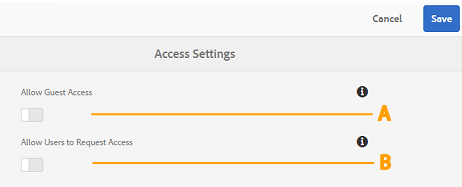
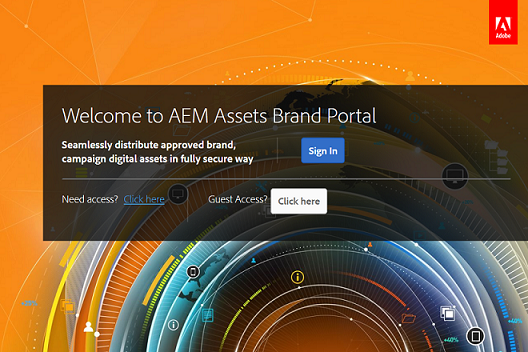

# Verwalten des Benutzerzugriffs auf Brand Portal {#administer-user-access-on-brand-portal}

Ab Adobe Experience Manager Assets Brand Portal 6.4.2 können Administratoren den Gastzugriff konfigurieren und Benutzern ermöglichen, Zugriff auf Brand Portal ihrer Organisation anzufordern. Diese Konfigurationen sind über die Konfigurationen **[!UICONTROL Zugriffseinstellungen]** im Verwaltungsbereich möglich. Beide Einstellungen sind standardmäßig deaktiviert.

**A**   Konfigurationsoption zum Gewähren eines Gastzugangs für Brand Portal über den Link **[!UICONTROL Gastzugang?]** auf dem Brand Portal-Willkommensbildschirm. (Die Option ist standardmäßig deaktiviert.)

**B**   Konfigurationsoption zum Erlauben einer Zugriffsanfrage durch den Benutzer für Brand Portal über den Link **[!UICONTROL Benötigen Sie Zugriff?]** auf dem Brand Portal-Willkommensbildschirm. (Die Option ist standardmäßig deaktiviert.)

## Zulassen des Gastzugangs {#allow-guest-access}

Wenn Sie den Gastzugang zulassen, können Benutzer auf die öffentlichen Assets zugreifen, ohne sich bei Brand Portal anmelden zu müssen.
Um den Gastzugang zuzulassen, muss der Administrator die folgenden Schritte ausführen:

1. Wählen Sie oben in der Symbolleiste das AEM-Logo aus, um die Admin Tools aufzurufen.
1. Wählen Sie im Admin Tools-Bereich die Option **[!UICONTROL Zugang]**, um die Seite **[!UICONTROL Zugangseinstellungen]** zu öffnen.
1. Aktivieren Sie die Konfiguration **[!UICONTROL Gastzugang erlauben]**.
1. **[!UICONTROL Speichern]** Sie die Änderungen.
1. Melden Sie sich ab, um die Änderungen zu übernehmen.

## Erlauben der Zugriffsanfrage durch Benutzer {#allow-users-to-request-access}

Administratoren können Benutzern von Organisationen erlauben, auf dem Willkommensbildschirm den Zugriff auf Brand Portal anzufordern. Administratoren müssen dafür jedoch die Konfigurationsoption **[!UICONTROL Benutzern erlauben, Zugriff anzufordern]** aktivieren, damit der Link für die Zugriffsanfrage auf dem Willkommensbildschirm angezeigt wird.

Administratoren müssen wie folgt vorgehen, um Benutzern von Organisationen zu ermöglichen, den Zugriff auf Brand Portal anzufordern:

1. Wählen Sie oben in der Symbolleiste das AEM-Logo aus, um die Admin Tools aufzurufen.
1. Wählen Sie im Admin Tools-Bereich die Option **[!UICONTROL Zugang]**, um die Seite **[!UICONTROL Zugangseinstellungen]** zu öffnen.
1. Aktivieren Sie die Konfiguration **[!UICONTROL Zugriffsanfrage durch Benutzer zulassen]**.
1. **[!UICONTROL Speichern]** Sie die Änderungen.
1. Melden Sie sich ab, um die Änderungen zu übernehmen.
