# Verwalten von Benutzern, Gruppen und Benutzerrollen {#manage-users-groups-and-user-roles}

Administratoren können mit Adobe Admin Console Benutzer und Produktprofile für AEM Assets Brand Portal erstellen und ihre Rollen mithilfe der Brand Portal-Benutzeroberfläche verwalten. Diese Berechtigung ist für Betrachter und Bearbeiter nicht verfügbar.

In [[!UICONTROL Admin Console]](http://adminconsole.adobe.com/enterprise/overview), you can view all the products associated with your organization. Bei diesen Produkten kann es sich um beliebige Experience Cloud-Lösungen handeln, z. B. Adobe Analytics, Adobe Target oder AEM Brand Portal. Sie müssen das Produkt „AEM Brand Portal“ wählen und Produktprofile anlegen.

<!--
Comment Type: draft

<note type="note">

Product Profiles (formerly known as product configurations*). 

* The nomenclature has changed from product configurations to product profiles in the new Adobe Admin Console.

</note>
-->
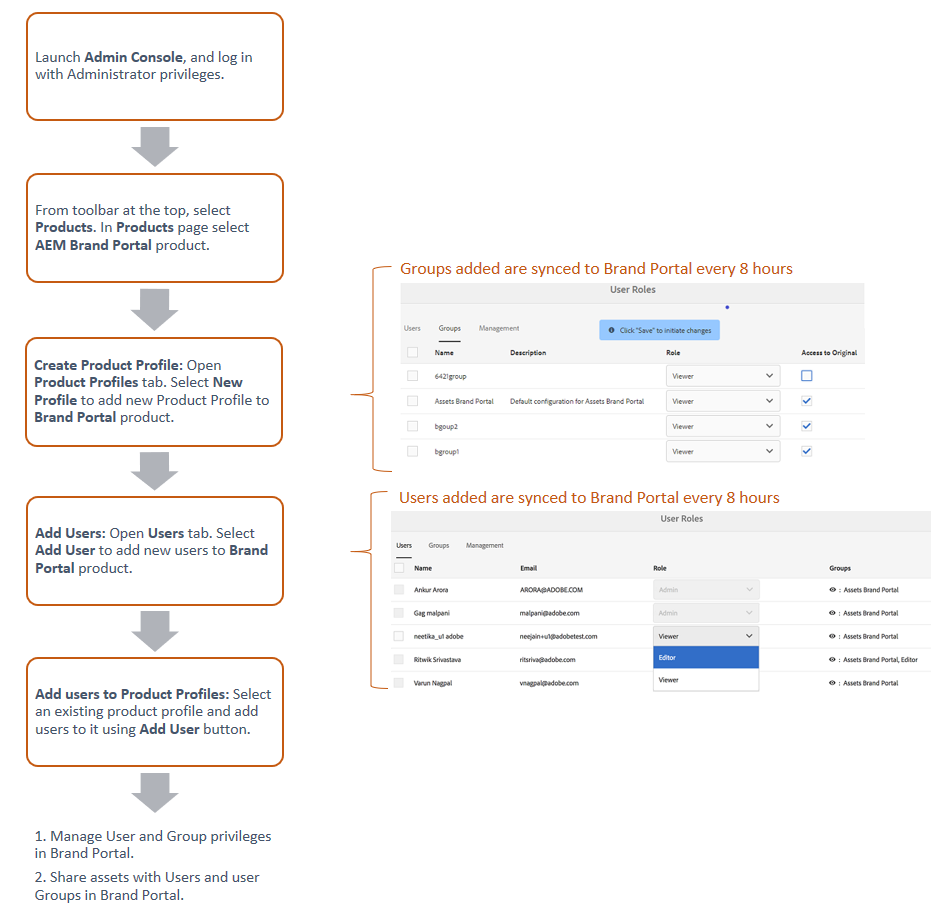

These product profiles are synced with the Brand Portal user interface every 8 hours and visible as groups in Brand Portal. Nachdem Sie Benutzer hinzugefügt, Produktprofile erstellt und Benutzer zu diesen Produktprofilen hinzugefügt haben, können Sie Benutzern und Gruppen im Markenportal Rollen zuweisen.

>[!NOTE]
>
>To create groups in Brand Portal, from Adobe [!UICONTROL Admin Console], use **[!UICONTROL Products &gt; Product Profiles]**, instead of **[!UICONTROL User page &gt; User Groups]**. Product profiles in Adobe [!UICONTROL Admin Console] are used to create groups in Brand Portal.

## Hinzufügen von Benutzern {#add-a-user}

If you are a product administrator, use Adobe [[!UICONTROL Admin Console]](http://adminconsole.adobe.com/enterprise/overview) to create users and assign them to product profiles (*formerly known as product configurations*), which show as groups in Brand Portal. Sie können mit Gruppen Massenvorgänge wie Rollenverwaltung und Asset-Freigabe durchführen.

>[!NOTE]
Neue Benutzer ohne Zugriff auf Brand Portal können über den Brand Portal-Anmeldebildschirm den Zugriff anfordern. Weitere Informationen finden Sie unter [Anfordern von Zugriff auf Brand Portal](../using/brand-portal.md#request-access-to-brand-portal). After you receive access request notifications in your notification area, click the relevant notification and then click **[!UICONTROL Grant Access]**. Alternativ können Sie auch auf den Link in der eingegangenen E-Mail mit der Zugriffsanforderung klicken. Next, to add a user through [Adobe [!UICONTROL Admin Console]](http://adminconsole.adobe.com/enterprise/overview), follow Steps 4-7 in the procedure below.

>[!NOTE]
You can login to [Adobe [!UICONTROL Admin Console]](http://adminconsole.adobe.com/enterprise/overview) directly or from Brand Portal. Wenn Sie sich direkt anmelden, befolgen Sie die unten beschriebenen Schritte 4 bis 7, um einen Benutzer hinzuzufügen.

1. Klicken Sie oben in der AEM-Symbolleiste auf das Adobe-Logo, um auf die Administrator-Tools zuzugreifen.

   

2. Klicken Sie im Admin Tools-Bereich auf **[!UICONTROL Benutzer]**.

   

3. Klicken Sie auf der Seite [!UICONTROL Benutzerrollen] auf die Registerkarte **[!UICONTROL Verwaltung]** und klicken Sie dann auf **[!UICONTROL Admin Console starten]**.

   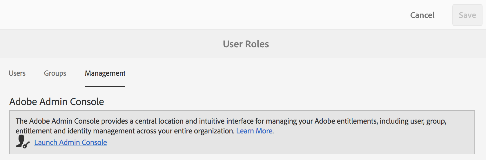

4. Führen Sie in Admin Console einen der folgenden Schritte aus, um einen neuen Benutzer zu erstellen:

   * Klicken Sie oben in der Symbolleiste auf **[!UICONTROL Überblick]**. In the [!UICONTROL Overview] page, click **[!UICONTROL Assign Users]** from the Brand Portal product card.
   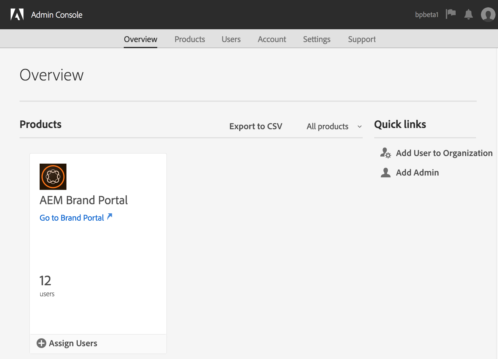

   * Klicken Sie oben in der Symbolleiste auf **[!UICONTROL Benutzer]**. Auf der Seite [!UICONTROL Benutzer] ist in der linken Schiene standardmäßig [!UICONTROL Benutzer] ausgewählt. Klicken Sie auf **[!UICONTROL Benutzer hinzufügen]**.
   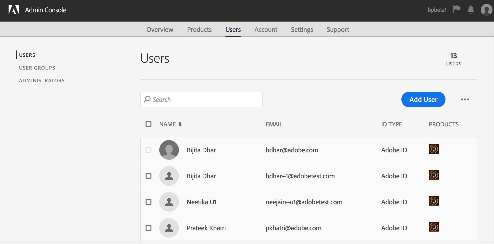

5. Geben Sie im Dialogfeld „Benutzer hinzufügen“ die E-Mail-Adresse des Benutzers ein, den Sie hinzufügen möchten, oder wählen Sie den Benutzer aus der Liste mit Vorschlägen aus, die erscheint, wenn Sie mit der Eingabe beginnen.

   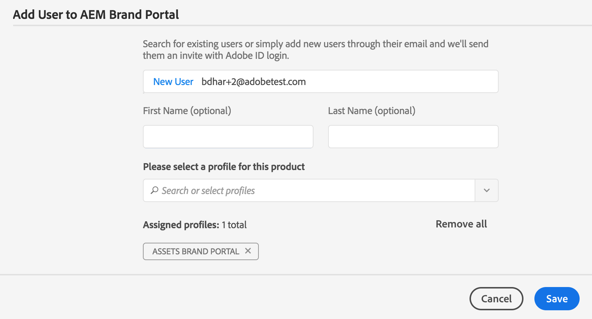

6. Weisen Sie den Benutzer mindestens einem Produktprofil (ehemals „Produktkonfiguration“) zu, damit der Benutzer auf Brand Portal zugreifen kann. Wählen Sie im Feld **[!UICONTROL Wählen Sie ein Profil für dieses Produkt aus]das entsprechende Produktprofil aus.**
7. Klicken Sie auf **[!UICONTROL Speichern]**.  Der hinzugefügte Benutzer erhält eine Begrüßungs-E-Mail. The invited user can access Brand Portal by clicking the link in the welcome email and signing in using an [!UICONTROL Adobe ID]. Weitere Informationen finden Sie unter [Schritte bei der ersten Anmeldung](../using/brand-portal-onboarding.md).

   >[!NOTE]
   If a user is unable to log on to Brand Portal, the Administrator of the organization should visit Adobe [!UICONTROL Admin Console] and check whether the user is present and has been added to at least one product profile.

   Informationen zum Gewähren von Administratorrechten für Benutzer finden Sie unter [Bereitstellen von Administratorrechten für Benutzer](../using/brand-portal-adding-users.md#provideadministratorprivilegestousers).

## Hinzufügen von Produktprofilen {#add-a-product-profile}

Product profiles (formerly known as product configurations) in [!UICONTROL Admin Console] are used to create groups in Brand Portal so that you can perform bulk operations such as role management and asset sharing in Brand Portal. **Brand Portal** ist standardmäßig als Produktprofil verfügbar. Sie können weitere Produktprofile erstellen und Benutzer zu den neuen Produktprofilen hinzufügen.

>[!NOTE]
You can login to [[!UICONTROL Admin Console]](http://adminconsole.adobe.com/enterprise/overview) directly or from Brand Portal. Wenn Sie sich direkt bei [!UICONTROL Admin Console] anmelden, befolgen Sie die unten beschriebenen Schritte 4 bis 7, um ein Produktprofil hinzuzufügen.

1. Klicken Sie oben in der AEM-Symbolleiste auf das Adobe-Logo, um auf die Administrator-Tools zuzugreifen.

   

2. Klicken Sie im Admin Tools-Bereich auf **[!UICONTROL Benutzer]**.

   

3. Klicken Sie auf der Seite [!UICONTROL Benutzerrollen] auf die Registerkarte **[!UICONTROL Verwaltung]** und klicken Sie dann auf **[!UICONTROL Admin Console starten]**.

   

4. Klicken Sie oben in der Symbolleiste auf **[!UICONTROL Produkte]**.
5. Auf der Seite [!UICONTROL Produkte] ist die Option [!UICONTROL Produktprofile] standardmäßig aktiviert. Click **[!UICONTROL New Profile]**.

   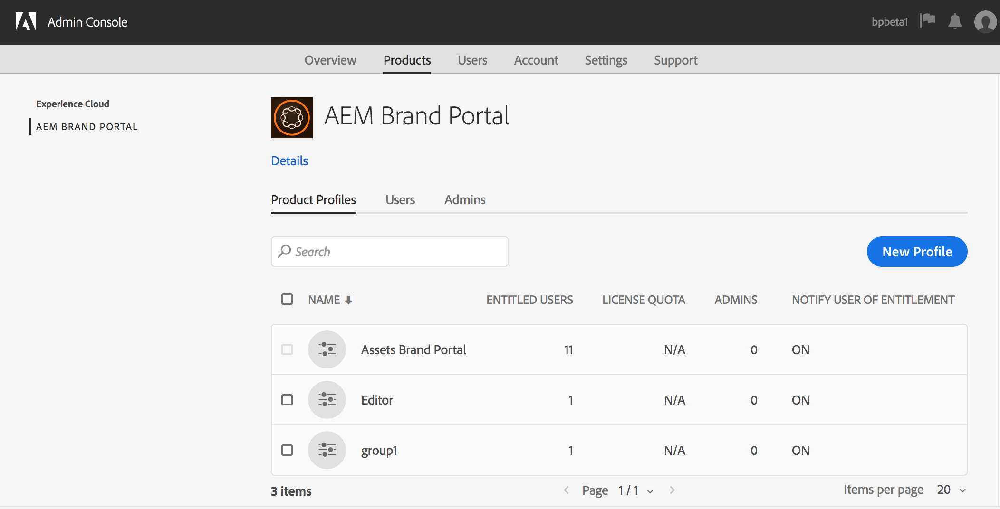

6. Geben Sie auf der Seite [!UICONTROL Neues Profil erstellen] Profilname, Anzeigename und Profilbeschreibung ein und wählen Sie aus, ob Benutzer per E-Mail benachrichtigt werden sollen, wenn sie zum Profil hinzugefügt oder daraus entfernt werden.

   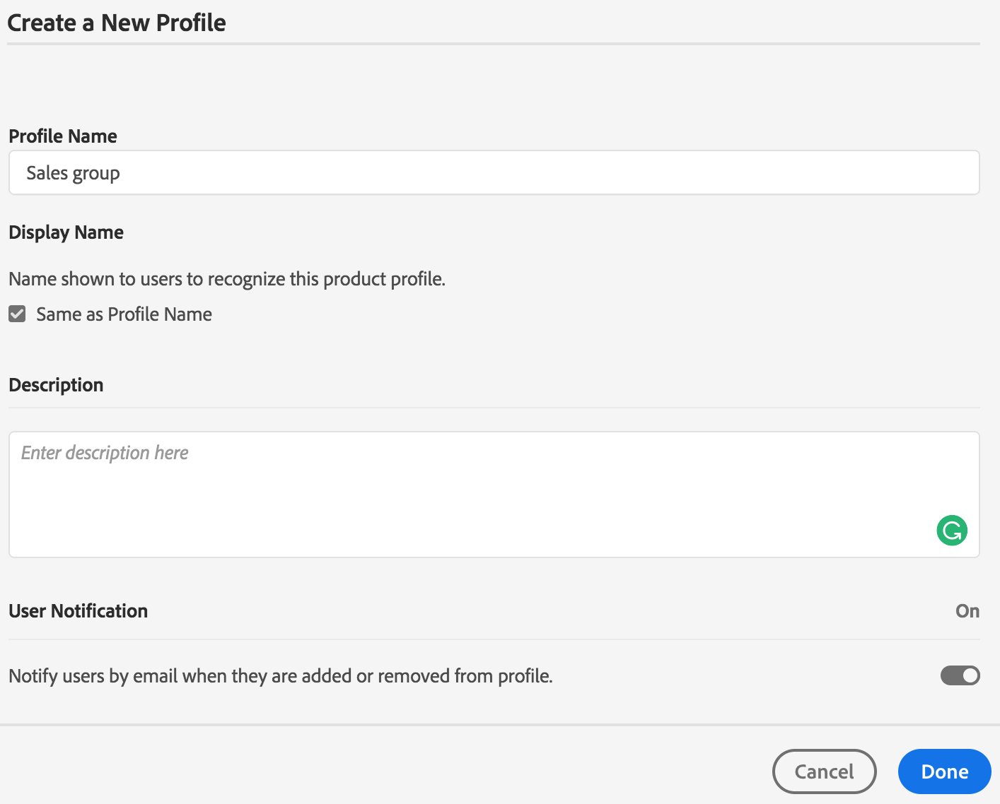

7. Klicken Sie auf **[!UICONTROL Fertig]**. The product configuration group, for example **[!UICONTROL Sales group]**, is added to Brand Portal.

   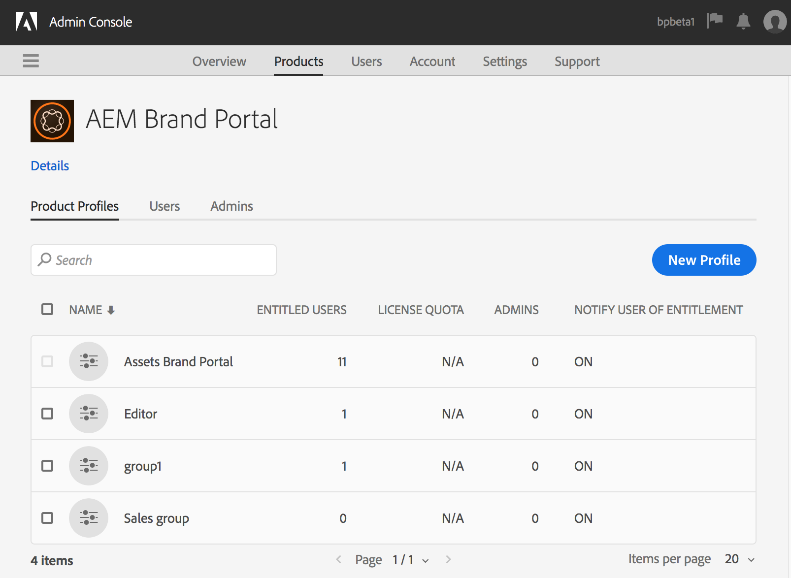

## Hinzufügen von Benutzern zu Produktprofilen {#add-users-to-a-product-profile}

To add users to a Brand Portal group, add them to the corresponding product profile (formerly known as product configurations) in [!UICONTROL Admin Console]. Sie können Benutzer einzeln oder mehrere Benutzer auf einmal hinzufügen.

>[!NOTE]
You can login to [[!UICONTROL Admin Console]](http://adminconsole.adobe.com/enterprise/overview) directly or from Brand Portal. Wenn Sie sich direkt bei Admin Console anmelden, befolgen Sie die unten beschriebenen Schritte 4 bis 7, um Benutzer zu einem Produktprofil hinzuzufügen.

1. Klicken Sie oben in der AEM-Symbolleiste auf das Adobe-Logo, um auf die Administrator-Tools zuzugreifen.

   

2. Klicken Sie im Admin Tools-Bereich auf **[!UICONTROL Benutzer]**.

   

3. Klicken Sie auf der Seite [!UICONTROL Benutzerrollen] auf die Registerkarte **[!UICONTROL Verwaltung]** und klicken Sie dann auf **[!UICONTROL Admin Console starten]**.

   ![Starten [!DNL Admin Console]](assets/launch_admin_console.png)

4. Klicken Sie oben in der Symbolleiste auf **[!UICONTROL Produkte]**.
5. Auf der Seite [!UICONTROL Produkte] ist die Option [!UICONTROL Produktprofile] standardmäßig aktiviert. Öffnen Sie das Produktprofil, zu dem ein Benutzer hinzugefügt werden soll, zum Beispiel [!UICONTROL Vertriebsgruppe].

   

6. Gehen Sie wie folgt vor, um einzelne Benutzer zum Produktprofil hinzuzufügen:

   * Klicken Sie auf **[!UICONTROL Benutzer hinzufügen]**.
   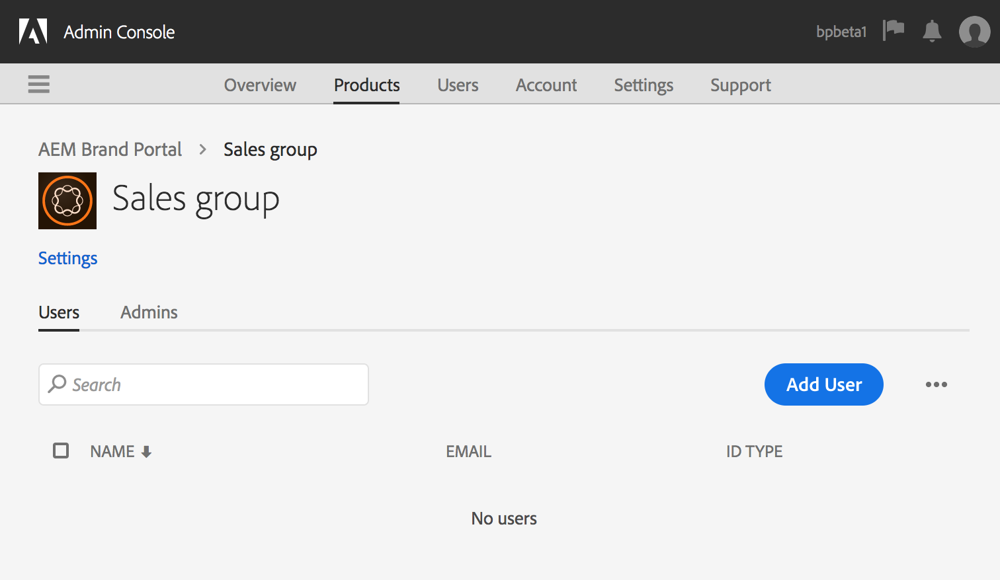

   * Geben Sie auf der Seite [!UICONTROL Benutzer zu Vertriebsgruppe hinzufügen] die E-Mail-Adresse des Benutzers ein, den Sie hinzufügen möchten, oder wählen Sie den Benutzer aus der Liste mit Vorschlägen aus, die erscheint, wenn Sie mit der Eingabe beginnen.
   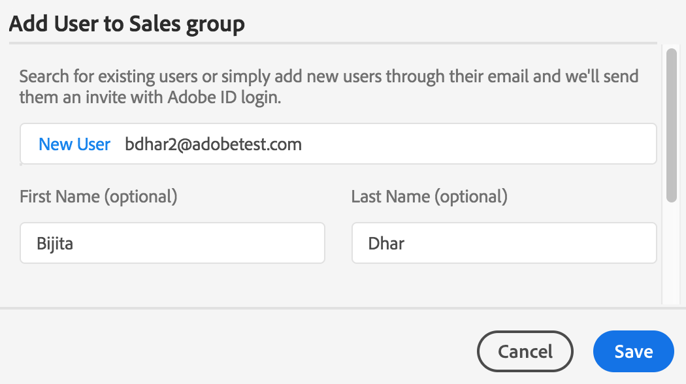

   * Klicken Sie auf **[!UICONTROL Speichern]**.

7. Gehen Sie wie folgt vor, um mehrere Benutzer zum Produktprofil hinzuzufügen:

   * Choose ellipsis (**[!UICONTROL ...) &gt; Add users by CSV]**.
   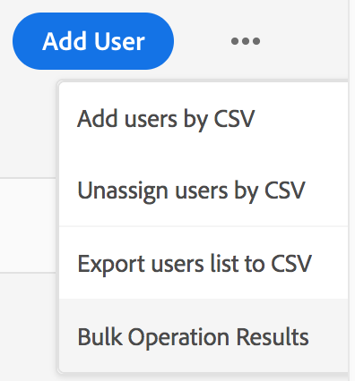

   * Laden Sie auf der Seite **[!UICONTROL Benutzer über CSV hinzufügen]eine CSV-Vorlage herunter oder fügen Sie eine CSV-Datei per Drag-and-Drop hinzu.**
   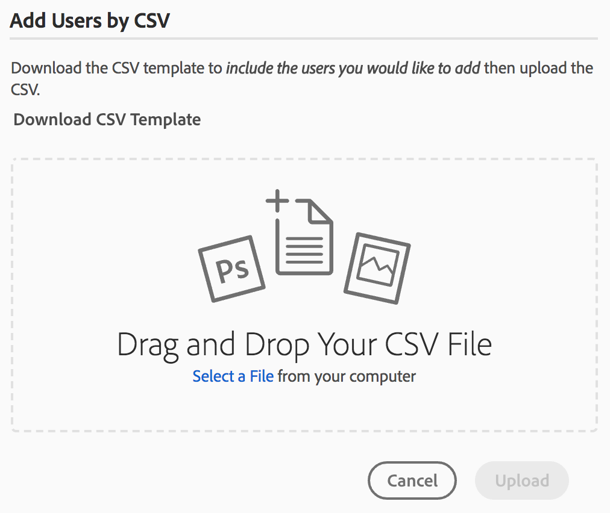

   * Klicken Sie auf **[!UICONTROL Hochladen]**.
   If you added users to the default product profile, that is, Brand Portal, a welcome email is sent to the email ID of the users you added. The invited users can access Brand Portal by clicking the link in the welcome email and signing in using an [!UICONTROL Adobe ID]. Weitere Informationen finden Sie unter [Schritte bei der ersten Anmeldung](../using/brand-portal-onboarding.md).

   Benutzer, die zu einem benutzerdefinierten oder neuen Produktprofil hinzugefügt werden, erhalten keine E-Mail-Benachrichtigung.

## Bereitstellen von Administratorrechten für Benutzer {#provide-administrator-privileges-to-users}

Sie können Brand Portal-Benutzern Berechtigungen als Systemadministrator oder Produkt-Administrator gewähren. Gewähren Sie keine anderen in [!UICONTROL Admin Console] verfügbaren Administratorrechte, z. B. Produktprofil-Administrator, Benutzergruppen-Administrator und Support-Administrator. Weitere Informationen zu diesen Rollen finden Sie unter [Administratorrollen](https://helpx.adobe.com/enterprise/using/admin-roles.html).

>[!NOTE]
You can login to [[!UICONTROL Admin Console]](https://adminconsole.adobe.com/enterprise/overview) directly or from Brand Portal. Wenn Sie sich direkt bei [!UICONTROL Admin Console] anmelden, befolgen Sie die unten beschriebenen Schritte 4 bis 8, um Benutzer zu einem Produktprofil hinzuzufügen.

1. Klicken Sie oben in der AEM-Symbolleiste auf das Adobe-Logo, um auf die Administrator-Tools zuzugreifen.

   

2. Klicken Sie im Admin Tools-Bereich auf **[!UICONTROL Benutzer]**.

   

3. Klicken Sie auf der Seite [!UICONTROL Benutzerrollen] auf die Registerkarte **[!UICONTROL Verwaltung]** und klicken Sie dann auf **[!UICONTROL Admin Console starten]**.

   

4. Klicken Sie oben in der Symbolleiste auf **[!UICONTROL Benutzer]**.
5. Auf der Seite [!UICONTROL Benutzer] ist in der linken Schiene standardmäßig [!UICONTROL Benutzer] ausgewählt. Klicken Sie auf den Benutzernamen des Benutzers, dem Sie Administratorrechte gewähren möchten.

   

6. In the user profile page, locate the **[!UICONTROL Administrative Rights]** section at the bottom, and choose ellipsis (**[!UICONTROL ... &gt; Edit admin rights]**.
   

7. Wählen Sie auf der Seite [!UICONTROL Administratorrechte bearbeiten] die Option „Systemadministrator“ bzw. „Produkt-Administrator“ aus.

   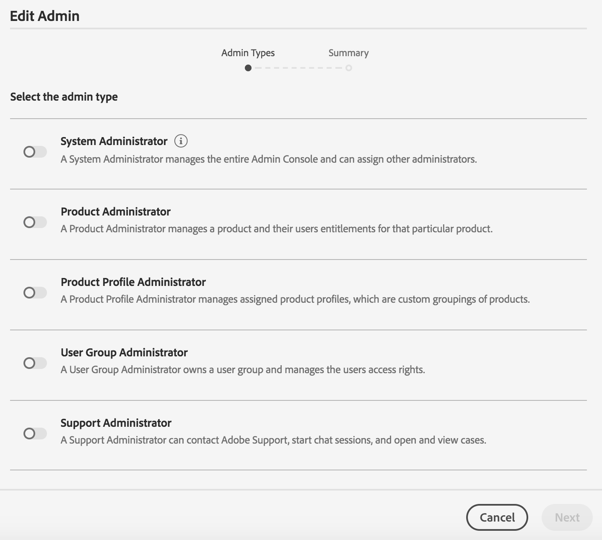

   >[!NOTE]
   Brand Portal unterstützt nur die Rollen "Systemadministrator"und "Produktadministrator".
   Adobe empfiehlt, die Rolle „Systemadministrator“ zu vermeiden, da sie für alle Produkte des jeweiligen Unternehmens unternehmensweite Administratorrechte gewährt. Ein Systemadministrator eines Unternehmens, das drei Marketing Cloud-Produkte nutzt, verfügt z. B. über sämtliche Berechtigungen für alle drei Produkte. Nur ein Systemadministrator kann AEM Assets so konfigurieren, dass Assets von AEM Assets an das Markenportal veröffentlicht werden können. For more information, see [Configure AEM Assets integration with Brand Portal](https://helpx.adobe.com/experience-manager/6-5/assets/using/brand-portal-configuring-integration.html).
   Im Gegensatz dazu gewährt die Rolle „Produkt-Administrator“ ausschließlich Administratorrechte für ein bestimmtes Produkt. Wenn Sie eine detailliertere Zugriffssteuerung im Markenportal erzwingen möchten, verwenden Sie die Rolle "Produktadministrator"und wählen Sie das Produkt als Markenportal aus.

   >[!NOTE]
   Die Administratorrolle „Produktprofil-Administrator“ (ehemals „Konfigurations-Administrator“) wird in Brand Portal nicht unterstützt. Vermeiden Sie die Zuweisung der Administratorrolle „Produktprofil-Administrator“ zu Benutzern.

8. Überprüfen Sie die Auswahl des Administratortyps und klicken Sie auf **[!UICONTROL Speichern]**.

   >[!NOTE]
   Um die Administratorrechte für einen Benutzer zu widerrufen, nehmen Sie auf der Seite [!UICONTROL Administratorrechte bearbeiten] die entsprechenden Änderungen vor und klicken Sie auf **[!UICONTROL Speichern]**.

## Verwalten von Benutzerrollen {#manage-user-roles}

Administratoren können die Rollen für Benutzer in Brand Portal ändern.

Zusätzlich zur Administratorrolle werden in Brand Portal die folgenden Rollen unterstützt:

* [!UICONTROL Betrachter:] Benutzer mit dieser Rolle können Dateien und Ordner anzeigen, die ein Administrator für sie freigegeben hat. Betrachter können zudem nach Assets suchen und diese herunterladen. Sie können jedoch keine Inhalte (Dateien, Ordner, [!UICONTROL Sammlungen]) für andere Benutzer freigeben.
* [!UICONTROL Bearbeiter:] Benutzer mit dieser Rolle verfügen über alle Berechtigungen eines Betrachters. Zusätzlich können Editoren Inhalte (Ordner, [!UICONTROL Sammlungen], Links) für andere Benutzer freigeben.

1. Klicken Sie oben in der AEM-Symbolleiste auf das Adobe-Logo, um auf die Administrator-Tools zuzugreifen.

   

2. Klicken Sie im Admin Tools-Bereich auf **[!UICONTROL Benutzer]**.

   

3. Auf der Seite [!UICONTROL Benutzerrollen] ist die Registerkarte [!UICONTROL Benutzer] standardmäßig ausgewählt. Für den Benutzer, dessen Rolle Sie ändern möchten, wählen Sie **[!UICONTROL Editor]** oder **[!UICONTROL Betrachter]aus der Dropdown-Liste** Rolle **.**

   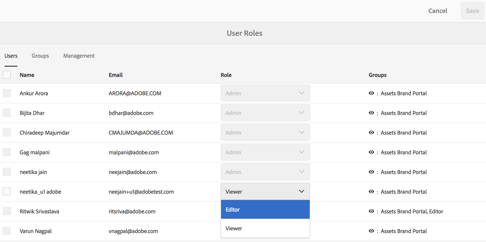

   Wenn Sie gleichzeitig die Rollen mehrerer Benutzer ändern möchten, wählen Sie die entsprechenden Benutzer aus und wählen Sie die gewünschte Rolle in der Dropdown-Liste **[!UICONTROL Rolle]aus.**

   >[!NOTE]
   Bei Administratorbenutzern ist die Liste [!UICONTROL Rolle] deaktiviert. Die Rollen für diese Benutzer können nicht ausgewählt werden.

   >[!NOTE]
   Die Auswahl der Benutzerrolle ist auch dann deaktiviert, wenn der Benutzer zu einer Gruppe mit der Rolle „Bearbeiter“ gehört. Wenn Sie die Bearbeitungsberechtigungen des Benutzers widerrufen möchten, müssen Sie den Benutzer aus der Gruppe mit der Rolle „Bearbeiter“ entfernen oder die Rolle der gesamten Gruppe in „Betrachter“ ändern.

4. Klicken Sie auf **[!UICONTROL Speichern]**. Die Rolle wird für den entsprechenden Benutzer geändert. Wenn Sie mehrere Benutzer ausgewählt haben, werden die Rollen für alle ausgewählten Benutzer gleichzeitig geändert.

   >[!NOTE]
   Änderungen in den Benutzerberechtigungen werden auf der Seite [!UICONTROL Benutzerrollen] erst dann angezeigt, wenn sich die Benutzer erneut bei Brand Portal anmelden.

## Verwalten von Gruppenrollen und -berechtigungen {#manage-group-roles-and-privileges}

Ein Administrator kann einer [Gruppe](../using/brand-portal-adding-users.md#main-pars-title-278567577) von Benutzern in Brand Portal bestimmte Berechtigungen zuweisen. Auf der Registerkarte [!UICONTROL Gruppen] der Seite [!UICONTROL Benutzerrollen] können Administratoren Folgendes tun:

* Sie können Benutzergruppen Rollen zuweisen.
* Schränken Sie Benutzergruppen ein, die Original-Ausgabeformate von Bilddateien (.jpeg, .tiff, .png, .bmp, .gif, .pjpeg, x-portable-anymap, x-portable-bitmap, x-portable-graymap, x-portable-pixmap, x-rgb, x-xbitmap, x-xpixmap, x-icon, image/photoshop, image/x-photoshop, .psd, image/vnd.adobe.photoshop) aus Brand Portal herunterladen können.

>[!NOTE]
Bei über einen Link freigegebenen Assets wird die Zugriffsberechtigung für die Original-Ausgabeformate der Bilddateien basierend auf den Berechtigungen des Benutzers gewährt, der die Assets freigegeben hat.

Führen Sie die folgenden Schritte aus, um die Rolle und die Berechtigung für den Zugriff auf die Originalwiedergaben für bestimmte Gruppenmitglieder zu ändern:

1. Navigieren Sie auf der Seite [!UICONTROL Benutzerrollen] zur Registerkarte **[!UICONTROL Gruppen].**
2. Wählen Sie die Gruppen aus, deren Rollen geändert werden sollen.
3. Wählen Sie die entsprechende Rolle in der Dropdown-Liste [!UICONTROL Rolle] aus.

   Um den Mitgliedern einer Gruppe Zugriff auf die Original-Wiedergaben von Bilddateien (.jpeg, .tiff, .png, .bmp, .gif, .pjpeg, x-portable-anymap, x-portable-bitmap, x-portable-graymap, x-portable-pixmap, x-rgb, x-xbitmap, x-xpixmap, x-icon, image/photoshop, image/x-photoshop, .psd, image/vnd.adobe.photoshop) zu erlauben, die sie aus dem Portal oder über den freigegebenen Link heruntergeladen haben, sollten Sie die Option [!UICONTROL Zugriff auf Original] für diese Gruppe ausgewählt lassen. Standardmäßig ist die Option [!UICONTROL Zugriff auf Original] für alle Benutzer ausgewählt. Möchten Sie verhindern, dass eine Benutzergruppe auf Originalwiedergaben zugreifen kann, heben Sie die Auswahl der Option für diese Gruppe auf.

   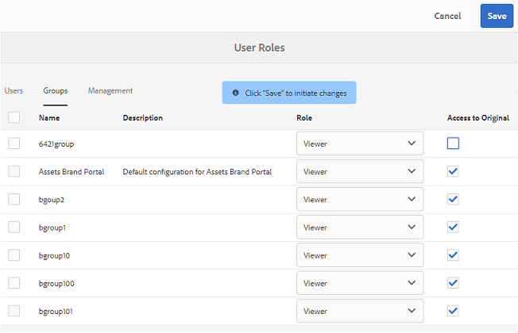

   >[!NOTE]
   Wenn ein Benutzer mehreren Gruppen hinzugefügt wurde und eine dieser Gruppen über Einschränkungen verfügt, gelten die Einschränkungen für diesen Benutzer.
   Darüber hinaus gelten Einschränkungen hinsichtlich des Zugriffs auf Originalwiedergaben der Bilddateien nicht für Administratoren, auch wenn sie Mitglieder eingeschränkter Gruppen sind.

4. Klicken Sie auf **[!UICONTROL Speichern]**. Die Rolle wird für die entsprechenden Gruppen geändert.

   >[!NOTE]
   Die Benutzer-Gruppen-Zuweisung oder die Gruppenmitgliedschaft eines Benutzers wird alle 8 Stunden mit Brand Portal synchronisiert. Änderungen bei Benutzer- oder Gruppenrollen treten nach Abschluss der nächsten Synchronisation in Kraft.
