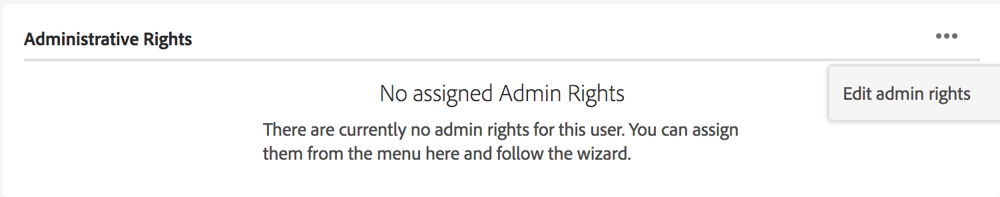

# Manage Users, Groups, and User Roles {#manage-users-groups-and-user-roles}

Administrators can use [!DNL Adobe Admin Console] to create [!DNL AEM Assets Brand Portal] users and product profiles, and manage their roles using the Brand Portal user interface. Diese Berechtigung ist für Betrachter und Bearbeiter nicht verfügbar.

In [Admin Console](http://adminconsole.adobe.com/enterprise/overview), you can view all the products associated with your organization. Ein Produkt könnte eine beliebige [!DNL Experience Cloud] Lösung sein, z [!DNL Adobe Analytics]. B. [!DNL Adobe Target], oder [!DNL AEM Brand Portal]. Sie müssen das Produkt „AEM Brand Portal“ wählen und Produktprofile anlegen.

<!--
Comment Type: draft

<note type="note">

Product Profiles (formerly known as product configurations*). 

* The nomenclature has changed from product configurations to product profiles in the new Adobe Admin Console.

</note>
-->

Diese Produktprofile werden alle 8 Stunden mit der [!DNL Brand Portal] Benutzeroberfläche synchronisiert und als Gruppen angezeigt [!DNL Brand Portal]. Once you add users and create product profiles, and add users to those product profiles, you can assign roles to users and groups in [!DNL Brand Portal].

>[!NOTE]
>
>To create groups in [!DNL Brand Portal], from [!DNL Adobe Admin Console], use **Products** page &gt; **Product Profiles**, instead of **User** page &gt; **User Groups**. Product profiles in [!DNL Adobe Admin Console] are used to create groups in [!DNL Brand Portal].

## Hinzufügen von Benutzern {#add-a-user}

If you are a product administrator, use [[!DNL Adobe Admin Console]](http://adminconsole.adobe.com/enterprise/overview) to create users and assign them to product profiles (*formerly known as product configurations*), which show as groups in [!DNL Brand Portal]. Sie können mit Gruppen Massenvorgänge wie Rollenverwaltung und Asset-Freigabe durchführen.

>[!NOTE]
New users who do not have access to [!DNL Brand Portal] can request access from the login screen of [!DNL Brand Portal]. For more information, refer to [Request access to [!DNL Brand Portal]](../using/brand-portal.md#request-access-to-brand-portal). After you receive access request notifications in your notification area, click the relevant notification and then click **Grant Access**. Sie können auch den Link in der Zugriffsanforderungs-E-Mail erhalten. Next, to add a user through [[!DNL Adobe Admin Console]](http://adminconsole.adobe.com/enterprise/overview), follow Steps 4-7 in the procedure below.

>[!NOTE]
You can login to [[!DNL Adobe Admin Console]](http://adminconsole.adobe.com/enterprise/overview) directly or from [!DNL Brand Portal]. Wenn Sie sich direkt anmelden, befolgen Sie die unten beschriebenen Schritte 4 bis 7, um einen Benutzer hinzuzufügen.

1. From the [!DNL AEM] toolbar at the top, click the Adobe logo to access administrative tools.

   

2. Klicken Sie im Admin Tools-Bereich auf **Benutzer**.

   

3. In the **User Roles** page, click the **Management** tab, then click **Launch Admin Console**.

   

4. Führen Sie in Admin Console einen der folgenden Schritte aus, um einen neuen Benutzer zu erstellen:

   * Klicken Sie oben in der Symbolleiste auf **Überblick**. In the **Overview** page, click **Assign Users** from the **[!DNL AEM Brand Portal]** product card.
   

   * Klicken Sie oben in der Symbolleiste auf **Benutzer**. In the **Users** page, **Users** in the left rail is selected by default. Click **Add User**.
   

5. Geben Sie im Dialogfeld „Benutzer hinzufügen“ die E-Mail-Adresse des Benutzers ein, den Sie hinzufügen möchten, oder wählen Sie den Benutzer aus der Liste mit Vorschlägen aus, die erscheint, wenn Sie mit der Eingabe beginnen.

   

6. Weisen Sie den Benutzer mindestens einem Produktprofil (ehemals „Produktkonfiguration“) zu, damit der Benutzer auf Brand Portal zugreifen kann. Wählen Sie im Feld **Wählen Sie ein Profil für dieses Produkt aus** das entsprechende Produktprofil aus.
7. Klicken Sie auf **Speichern**. An den hinzugefügten Benutzer wird eine Begrüßungs-E-Mail gesendet. The invited user can access [!DNL Brand Portal] by clicking the link in the welcome email and signing in using an [!UICONTROL Adobe ID]. Weitere Informationen finden Sie unter [Schritte bei der ersten Anmeldung](../using/brand-portal-onboarding.md).

   >[!NOTE]
   If a user is unable to log on to [!DNL Brand Portal], the Administrator of the organization should visit Adobe [!UICONTROL Admin Console] and check whether the user is present and has been added to at least one product profile.

   Informationen zum Gewähren von Administratorrechten für Benutzer finden Sie unter [Bereitstellen von Administratorrechten für Benutzer](../using/brand-portal-adding-users.md#provideadministratorprivilegestousers).

## Hinzufügen von Produktprofilen {#add-a-product-profile}

Product profiles (formerly known as product configurations) in [!UICONTROL Admin Console] are used to create groups in [!DNL Brand Portal] so that you can perform bulk operations such as role management and asset sharing in [!DNL Brand Portal]. **[!DNL Brand Portal]** ist standardmäßig als Produktprofil verfügbar. Sie können weitere Produktprofile erstellen und Benutzer zu den neuen Produktprofilen hinzufügen.

>[!NOTE]
You can login to [[!UICONTROL Admin Console]](http://adminconsole.adobe.com/enterprise/overview) directly or from [!DNL Brand Portal]. If you login to [!UICONTROL Admin Console] directly, follow Steps 4-7 in the procedure below to add a product profile.

1. From the [!DNL AEM] toolbar at the top, click the Adobe logo to access administrative tools.

   ![[!DNL AEM]logo (Logo)](assets/aemlogo.png)

2. Klicken Sie im Admin Tools-Bereich auf **Benutzer**.

   

3. In the **User Roles** page, click the **Management** tab, then click **Launch Admin Console**.

   

4. Klicken Sie oben in der Symbolleiste auf **Produkte**.
5. In the **Products** page, **Product Profiles** is selected by default. Click **New Profile**.

   

6. Geben Sie auf der Seite **Neues Profil erstellen** Profilname, Anzeigename und Profilbeschreibung ein und wählen Sie aus, ob Benutzer per E-Mail benachrichtigt werden sollen, wenn sie zum Profil hinzugefügt oder daraus entfernt werden.

   

7. Klicken Sie auf **Fertig**. The product configuration group, for example **Sales group**, is added to Brand Portal.

   

## Hinzufügen von Benutzern zu Produktprofilen {#add-users-to-a-product-profile}

To add users to a [!DNL Brand Portal] group, add them to the corresponding product profile (formerly known as product configurations) in [!UICONTROL Admin Console]. Sie können Benutzer einzeln oder mehrere Benutzer auf einmal hinzufügen.

>[!NOTE]
You can login to [[!DNL Admin Console]](http://adminconsole.adobe.com/enterprise/overview) directly or from [!DNL Brand Portal]. Wenn Sie sich direkt bei Admin Console anmelden, befolgen Sie die unten beschriebenen Schritte 4 bis 7, um Benutzer zu einem Produktprofil hinzuzufügen.

1. From the [!DNL AEM] toolbar at the top, click the Adobe logo to access administrative tools.

   ![[!DNL AEM]logo (Logo)](assets/aemlogo.png)

2. Klicken Sie im Admin Tools-Bereich auf **Benutzer**.

   

3. In the **User Roles** page, click the **Management** tab, then click **Launch Admin Console**.

   ![Start [!DNL Admin Console]](assets/launch_admin_console.png)

4. Klicken Sie oben in der Symbolleiste auf **Produkte**.
5. In the **Products** page, **Product Profiles** is selected by default. Open the product profile to which you want to add a user, for example, **Sales group**.

   

6. Gehen Sie wie folgt vor, um einzelne Benutzer zum Produktprofil hinzuzufügen:

   * Click **Add User**.
   ![Gruppe zum Zuordnen des Produktprofils in [!DNL Brand Portal]](assets/admin_console_productprofilesalesgroup.png)

   * In the **Add User to Sales group** page, type the email ID of the user you want to add or select the user from the list of suggestions that appear as you type.
   

   * Klicken Sie auf **Speichern**.

7. Gehen Sie wie folgt vor, um mehrere Benutzer zum Produktprofil hinzuzufügen:

   * Choose ellipsis (**...**) &gt; **Add users by CSV**.
   

   * In the **Add Users by CSV** page, download a CSV template or drag-and-drop a CSV file.
   

   * Klicken Sie auf **Hochladen**.
   If you added users to the default product profile, that is, [!DNL Brand Portal], a welcome email is sent to the email ID of the users you added. The invited users can access [!DNL Brand Portal] by clicking the link in the welcome email and signing in using an [!UICONTROL Adobe ID]. Weitere Informationen finden Sie unter [Schritte bei der ersten Anmeldung](../using/brand-portal-onboarding.md).

   Benutzer, die zu einem benutzerdefinierten oder neuen Produktprofil hinzugefügt werden, erhalten keine E-Mail-Benachrichtigung.

## Bereitstellen von Administratorrechten für Benutzer {#provide-administrator-privileges-to-users}

You can provide the system administrator or the product administrator privilege to a [!DNL Brand Portal] user. Do not provide other administrative rights available in [!UICONTROL Admin Console], such as product profile administrator, user group administrator, and support administrator. Weitere Informationen zu diesen Rollen finden Sie unter [Administratorrollen](https://helpx.adobe.com/enterprise/using/admin-roles.html).

>[!NOTE]
You can login to [[!UICONTROL Admin Console]](https://adminconsole.adobe.com/enterprise/overview) directly or from [!DNL Brand Portal]. If you login to [!UICONTROL Admin Console] directly, follow Steps 4-8 in the procedure below to add a user to a product profile.

1. From the [!DNL AEM] toolbar at the top, click the Adobe logo to access administrative tools.

   

2. Klicken Sie im Admin Tools-Bereich auf **Benutzer**.

   

3. In the **User Roles** page, click the **Management** tab, then click **Launch Admin Console**.

   

4. Klicken Sie oben in der Symbolleiste auf **Benutzer**.
5. In the **Users** page, **Users** in the left rail is selected by default. Klicken Sie auf den Benutzernamen des Benutzers, dem Sie Administratorrechte gewähren möchten.

   

6. In the user profile page, locate the **Administrative Rights** section at the bottom, and choose ellipsis (**...**) &gt; **Edit admin rights**.
   

7. Wählen Sie auf der Seite **Administratorrechte bearbeiten** die Option „Systemadministrator“ bzw. „Produkt-Administrator“ aus.

   

   >[!NOTE]
   [!DNL Brand Portal] unterstützt nur Systemadministrator- und Produktadministratorrollen.
   [!DNL Adobe] empfiehlt, die Rolle „Systemadministrator“ zu vermeiden, da sie für alle Produkte des jeweiligen Unternehmens unternehmensweite Administratorrechte gewährt. Beispielsweise verfügt ein Systemadministrator einer Organisation, der drei Marketing Cloud-Produkte enthält, über sämtliche Berechtigungen für alle drei Produkte. Only a System Administrator can configure [!DNL AEM] Assets so that assets can be published from [!DNL AEM] Assets to [!DNL Brand Portal]. For more information, see [Configure AEM Assets integration with [!DNL Brand Portal]](https://helpx.adobe.com/experience-manager/6-5/assets/using/brand-portal-configuring-integration.html).
   Im Gegensatz dazu gewährt die Rolle „Produkt-Administrator“ ausschließlich Administratorrechte für ein bestimmtes Produkt. If you want to enforce a more granular access control within [!DNL Brand Portal], use the Product Administrator role and select the product as **[!DNL AEM Brand Portal]**.

   >[!NOTE]
   [!DNL Brand Portal]Die Administratorrolle „Produktprofil-Administrator“ (ehemals „Konfigurations-Administrator“) wird in nicht unterstützt. Vermeiden Sie die Zuweisung der Administratorrolle „Produktprofil-Administrator“ zu Benutzern.

8. Überprüfen Sie die Auswahl des Administratortyps und klicken Sie auf **Speichern**.

   >[!NOTE]
   Um die Administratorrechte für einen Benutzer zu widerrufen, nehmen Sie auf der Seite **Administratorrechte bearbeiten** die entsprechenden Änderungen vor und klicken Sie auf **Speichern**.

## Verwalten von Benutzerrollen {#manage-user-roles}

An Administrator can modify roles for users in [!DNL Brand Portal].

[!DNL Brand Portal] Unterstützt zusätzlich zur Administratorrolle die folgenden Rollen:

* **Betrachter:** Benutzer mit dieser Rolle können Dateien und Ordner anzeigen, die ein Administrator für sie freigegeben hat. Betrachter können auch Assets suchen und herunterladen. However, Viewers cannot share content (files, folders, [!UICONTROL collections]) with other users.
* **Bearbeiter:** Benutzer mit dieser Rolle verfügen über alle Berechtigungen eines Betrachters. In addition, Editors can share content (folders, [!UICONTROL collections], links) with other users.

1. From the [!DNL AEM] toolbar at the top, click the Adobe logo to access administrative tools.

   

2. Klicken Sie im Admin Tools-Bereich auf **Benutzer**.

   

3. In the **User Roles** page, the **Users** tab is selected by default. For the user whose role you want to change, select **Editor** or **Viewer** from the **Role** drop-down.

   

   Wenn Sie gleichzeitig die Rollen mehrerer Benutzer ändern möchten, wählen Sie die entsprechenden Benutzer aus und wählen Sie die gewünschte Rolle in der Dropdown-Liste **Rolle** aus.

   >[!NOTE]
   Bei Administratorbenutzern ist die Liste **Rolle** deaktiviert. Die Rollen für diese Benutzer können nicht ausgewählt werden.

   >[!NOTE]
   Die Auswahl der Benutzerrolle ist auch dann deaktiviert, wenn der Benutzer zu einer Gruppe mit der Rolle „Bearbeiter“ gehört. Wenn Sie die Bearbeitungsberechtigungen des Benutzers widerrufen möchten, müssen Sie den Benutzer aus der Gruppe mit der Rolle „Bearbeiter“ entfernen oder die Rolle der gesamten Gruppe in „Betrachter“ ändern.

4. Klicken Sie auf **Speichern**. Die Rolle wird für den entsprechenden Benutzer geändert. Wenn Sie mehrere Benutzer ausgewählt haben, werden die Rollen für alle ausgewählten Benutzer gleichzeitig geändert.

   >[!NOTE]
   Changes in user permissions are reflected in the **User Roles** page only after the users re-login to Brand Portal.

## Verwalten von Gruppenrollen und -berechtigungen {#manage-group-roles-and-privileges}

An Administrator can associate specific privileges with a [group](../using/brand-portal-adding-users.md#main-pars-title-278567577) of users on Brand Portal. The **Groups** tab on the **User Roles** page allows administrators to:

* Sie können Benutzergruppen Rollen zuweisen.
* Schränken Sie Benutzergruppen ein, die Original-Ausgabeformate von Bilddateien (.jpeg, .tiff, .png, .bmp, .gif, .pjpeg, x-portable-anymap, x-portable-bitmap, x-portable-graymap, x-portable-pixmap, x-rgb, x-xbitmap, x-xpixmap, x-icon, image/photoshop, image/x-photoshop, .psd, image/vnd.adobe.photoshop) aus Brand Portal herunterladen können.

>[!NOTE]
Bei über einen Link freigegebenen Assets wird die Zugriffsberechtigung für die Original-Ausgabeformate der Bilddateien basierend auf den Berechtigungen des Benutzers gewährt, der die Assets freigegeben hat.

Führen Sie folgende Schritte aus, um die Rolle und Rechte für den Zugriff auf ursprüngliche Darstellungen für bestimmte Gruppenmitglieder zu ändern:

1. On the **User Roles** page, navigate to the **Groups** tab.
2. Wählen Sie die Gruppen aus, deren Rollen geändert werden sollen.
3. Wählen Sie die entsprechende Rolle in der Dropdown-Liste **Rolle** aus.

   To allow the members of a group to have access to original renditions of image files (.jpeg, .tiff, .png, .bmp, .gif, .pjpeg, x-portable-anymap, x-portable-bitmap, x-portable-graymap, x-portable-pixmap, x-rgb, x-xbitmap, x-xpixmap, x-icon, image/photoshop, image/x-photoshop, .psd, image/vnd.adobe.photoshop) which they download from the portal or shared link, keep the **Access to  Original** option selected for that group. By default, **Access to Original** option is selected for all the users. Möchten Sie verhindern, dass eine Benutzergruppe auf Original-Ausgabeformate zugreifen kann, heben Sie die Auswahl der Option für diese Gruppe auf.

   

   >[!NOTE]
   Wenn ein Benutzer mehreren Gruppen hinzugefügt wird und eine dieser Gruppen Beschränkungen hat, gelten die Einschränkungen für diesen Benutzer.
   Darüber hinaus gelten Einschränkungen hinsichtlich des Zugriffs auf Original-Ausgabeformate der Bilddateien nicht für Administratoren, auch wenn sie Mitglieder eingeschränkter Gruppen sind.

4. Klicken Sie auf **Speichern**. Die Rolle wird für die entsprechenden Gruppen geändert.

   >[!NOTE]
   The user-to-group association, or the group membership of a user, is synced to  [!DNL Brand Portal] every 8 hours. Änderungen bei Benutzer- oder Gruppenrollen treten nach Abschluss der nächsten Synchronisation in Kraft.
