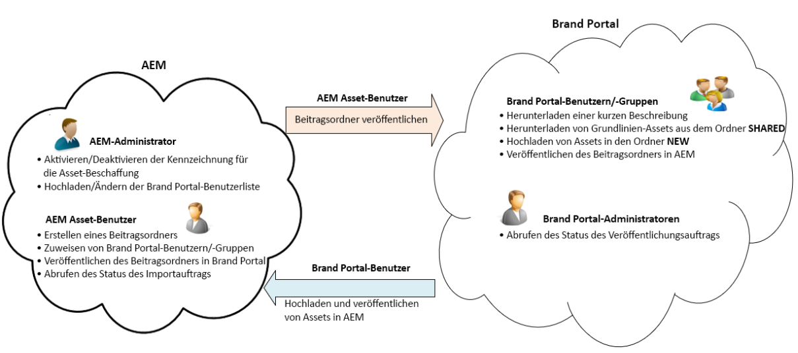

# Überblick über die Asset-Beschaffung {#overview-asset-sourcing-in-bp}

Mit der **Asset-Beschaffung** können AEM-Benutzer (Administratoren/Benutzer ohne Administratorrechte) neue Ordner mit der zusätzlichen Eigenschaft **Asset-Beitrag** erstellen, um sicherzustellen, dass die neu erstellten Ordner von Brand Portal-Benutzern für die Übermittlung von Assets nutzbar sind. Dadurch wird automatisch ein Workflow ausgelöst, mit dem zwei weitere Unterordner namens **SHARED** und **NEW** im neu erstellten **Beitragsordner** erstellt werden. Der AEM-Administrator definiert dann die Anforderung, indem er eine Zusammenfassung der Asset-Typen, die zum Beitragsordner hinzugefügt werden sollen, sowie eine Reihe von Grundlinien-Assets in den Ordner **SHARED** hochlädt, um sicherzustellen, dass Brand Portal-Benutzer über die benötigten Referenzinformationen verfügen. Der Administrator kann aktiven Brand Portal-Benutzern anschließend Zugriff auf den Beitragsordner gewähren, bevor der neu erstellte **Beitragsordner** in Brand Portal veröffentlicht wird. Nachdem die Benutzer Inhalte zum Ordner **NEU** hinzugefügt haben, können sie den Beitragsordner wieder in der AEM-Autorenumgebung veröffentlichen. Bitte beachten Sie, dass es einige Minuten dauern kann, bis der Import abgeschlossen ist und die neu veröffentlichten Inhalte in AEM Assets angezeigt werden.

Darüber hinaus bleiben alle vorhandenen Funktionen unverändert. Brand Portal-Benutzer können Assets aus dem Beitragsordner sowie aus anderen Ordnern anzeigen, suchen und herunterladen, für die sie über entsprechende Berechtigungen verfügen. Administratoren können außerdem den Beitragsordner freigeben, Eigenschaften ändern und Assets zu Sammlungen hinzufügen.

>[!VIDEO](https://video.tv.adobe.com/v/29365/?quality=12)

## Voraussetzungen {#prerequisites}

* AEM Assets as a Cloud Service-Instanz, AEM Assets 6.5.2 oder höher.
* Stellen Sie sicher, dass Ihre AEM Assets-Instanz mit Brand Portal konfiguriert ist. Siehe [Konfigurieren von AEM Assets mit Brand Portal](../using/configure-aem-assets-with-brand-portal.md).

<!--
* Ensure that your Brand Portal tenant is configured with one AEM Assets author instance.
-->

>[!NOTE]
>
>Die Asset-Beschaffungsfunktion ist in AEM Assets as a Cloud Service, AEM Assets 6.5.9 und höher standardmäßig aktiviert.
>
>Die vorhandenen Konfigurationen funktionieren weiterhin mit den früheren Versionen.

>[!NOTE]
>
>Es gibt ein bekanntes Problem in AEM Assets 6.5.4. Brand Portal-Benutzer können beim Aktualisieren auf Adobe Developer Console keine Beitragsordner-Assets in AEM Assets veröffentlichen.
>
>Das Problem wurde in AEM 6.5.5 behoben. Sie können Ihre AEM Assets-Instanz auf das neueste Service Pack AEM 6.5.5 aktualisieren und Ihre Konfigurationen [in Adobe Developer Console](https://docs.adobe.com/content/help/de-DE/experience-manager-65/assets/brandportal/configure-aem-assets-with-brand-portal.html#upgrade-integration-65) aktualisieren.
>
>Zur sofortigen Fehlerbehebung unter AEM 6.5.4 wird empfohlen, [den Hotfix](https://www.adobeaemcloud.com/content/marketplace/marketplaceProxy.html?packagePath=/content/companies/public/adobe/packages/cq650/hotfix/cq-6.5.0-hotfix-33041) herunterzuladen und auf der Autoreninstanz zu installieren.

<!--
## Configure Asset Sourcing {#configure-asset-sourcing}

**Asset Sourcing** is configured from within the AEM Assets author instance. The administrators can enable the Asset Sourcing feature flag configuration from the **AEM Web Console Configuration** and upload the active Brand Portal users list in **AEM Assets**.

>[!NOTE]
>
>Asset Sourcing is by default enabled on AEM Assets as a Cloud Service. The AEM administrator can directly upload the active Brand Portal users to allow them access to the Asset Sourcing feature.

>[!NOTE]
>
>Before you begin with the configuration, ensure that your AEM Assets instance is configured with Brand Portal. See, [Configure AEM Assets with Brand Portal](../using/configure-aem-assets-with-brand-portal.md). 

The following video demonstrates, how to configure Asset Sourcing on your AEM Assets author instance:

>[!VIDEO](https://video.tv.adobe.com/v/29771)
-->

<!--
### Enable Asset Sourcing {#enable-asset-sourcing}

AEM administrators can enable the Asset Sourcing feature flag from within the AEM Web Console Configuration (a.k.a Configuration Manager).

>[!NOTE]
>
>This step is not applicable for AEM Assets as a Cloud Service.

**To enable Asset Sourcing:**
1. Log in to your AEM Assets author instance and open Configuration Manager. 
Default URL: http:// localhost:4502/system/console/configMgr.
1. Search using the keyword **Asset Sourcing** to locate **[!UICONTROL Asset Sourcing Feature Flag Config]**.
1. Click **[!UICONTROL Asset Sourcing Feature Flag Config]** to open the configuration window.
1. Select the **[!UICONTROL feature.flag.active.status]** check box.
1. Click **[!UICONTROL Save]**.

-->

### Hochladen der Brand Portal-Benutzerliste {#upload-bp-user-list}

AEM Administratoren können die Brand Portal-Benutzerkonfigurationsdatei (.csv) mit der aktiven Brand Portal-Benutzerliste in AEM Assets hochladen, um ihnen den Zugriff auf die Asset-Beschaffungsfunktion zu ermöglichen.

Ein Beitragsordner kann nur für die aktiven Brand Portal-Benutzer freigegeben werden, die in der Benutzerliste definiert sind. Die Administratoren können der Konfigurationsdatei auch neue Benutzer hinzufügen und die geänderte Benutzerliste hochladen.

>[!NOTE]
>
>Stellen Sie sicher, dass Ihre AEM Assets-Instanz mit Brand Portal konfiguriert ist. Siehe [Konfigurieren von AEM Assets mit Brand Portal](../using/configure-aem-assets-with-brand-portal.md).

>[!NOTE]
>
>Das Format der CSV-Datei entspricht dem von Admin Console für den Massenimport von Benutzern unterstützten Format. E-Mail-Adresse, Vorname und Nachname sind obligatorisch.

Die Administratoren können neue Benutzer in AEM Admin Console hinzufügen. Weitere Informationen finden Sie unter [Benutzer verwalten](brand-portal-adding-users.md). Nachdem Benutzer in Admin Console hinzugefügt wurden, können diese Benutzer der Benutzerkonfigurationsdatei von Brand Portal hinzugefügt werden. Anschließend kann ihnen die Zugriffsberechtigung auf den Beitragsordner zugewiesen werden.

**Hochladen der Brand Portal-Benutzerliste:**
1. Melden Sie sich bei Ihrer AEM Assets-Instanz an.
1. Navigieren Sie vom Bedienfeld **Tools** zu **[!UICONTROL Assets]** > **[!UICONTROL Brand Portal-Benutzer]**.

1. Das Fenster zum Hochladen von Beitragenden zu Brand Portal wird geöffnet.
Durchsuchen Sie Ihren lokalen Computer und laden Sie die **Konfigurationsdatei (.csv)** hoch, die die Liste der aktiven Brand Portal-Benutzer enthält.
1. Klicken Sie auf **[!UICONTROL Speichern]**.

   

Administratoren können beim Konfigurieren eines Beitragsordners bestimmten Benutzern aus dieser Benutzerliste Zugriff gewähren. Nur die Benutzer, die einem Beitragsordner zugewiesen sind, haben Zugriff auf den Beitragsordner und können Assets aus Brand Portal in AEM Assets veröffentlichen.

## Siehe auch {#reference-articles}

* [Konfigurieren und Veröffentlichen von Beitragsordnern in Brand Portal](brand-portal-publish-contribution-folder-to-brand-portal.md)

* [Veröffentlichen von Beitragsordnern in AEM Assets](brand-portal-publish-contribution-folder-to-aem-assets.md)
