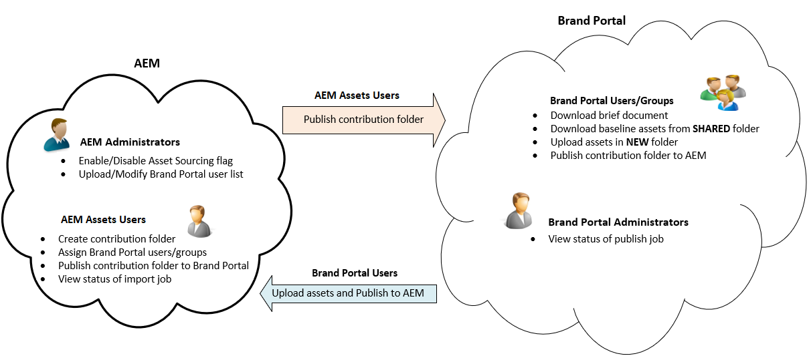

# Überblick über die Asset-Beschaffung {#overview-asset-sourcing-in-bp}

Mit der **Asset-Beschaffung** können AEM-Benutzer (Administratoren/Benutzer ohne Administratorrechte) neue Ordner mit der zusätzlichen Eigenschaft **Asset-Beitrag** erstellen, um sicherzustellen, dass die neu erstellten Ordner von Brand Portal-Benutzern für die Übermittlung von Assets nutzbar sind. Dadurch wird automatisch ein Workflow ausgelöst, mit dem zwei weitere Unterordner namens **SHARED** und **NEW** im neu erstellten **Beitragsordner** erstellt werden. Der AEM-Administrator definiert dann die Anforderung, indem er eine Kurzbeschreibung der Asset-Typen, die zum Beitragsordner hinzugefügt werden sollen, sowie eine Reihe von Grundlinien-Assets in den Ordner **SHARED** hochlädt, um sicherzustellen, dass Brand Portal-Benutzer über die benötigten Referenzinformationen verfügen. Der Administrator kann aktiven Brand Portal-Benutzern anschließend Zugriff auf den Beitragsordner gewähren, bevor der neu erstellte **Beitragsordner** in Brand Portal veröffentlicht wird. Nachdem die Benutzer Inhalte zum Ordner **NEU** hinzugefügt haben, können sie den Beitragsordner wieder in der AEM-Autorenumgebung veröffentlichen. Bitte beachten Sie, dass es einige Minuten dauern kann, bis der Import abgeschlossen ist und die neu veröffentlichten Inhalte in AEM Assets angezeigt werden.

Darüber hinaus bleiben alle vorhandenen Funktionen unverändert. Brand Portal-Benutzer können Assets aus dem Beitragsordner sowie aus anderen Ordnern anzeigen, suchen und herunterladen, für die sie über entsprechende Berechtigungen verfügen. Administratoren können außerdem den Beitragsordner freigeben, Eigenschaften ändern und Assets zu Sammlungen hinzufügen.

## Voraussetzungen {#prerequisites}

* AEM 6.5.2 oder höher.
* Stellen Sie sicher, dass Ihre AEM Assets-Instanz mit Brand Portal konfiguriert ist. Siehe [Konfigurieren von AEM Assets mit Brand Portal](../using/configure-aem-assets-with-brand-portal.md).
* Stellen Sie sicher, dass Ihr Markenportal-Mandant mit einer Autoreninstanz für ein AEM Assets konfiguriert ist.

>[!NOTE]
>
>Asset Sourcing wird vom AEM Assets Cloud-Dienst nicht unterstützt.

>[!VIDEO](https://video.tv.adobe.com/v/29365/?quality=12)

>[!NOTE]
>
>Es gibt ein bekanntes Problem in AEM 6.5.4. Brand Portal-Benutzer können beim Aktualisieren auf Adobe Developer Console keine Beitragsordner-Assets in AEM Assets veröffentlichen.
>
>Das Problem wurde in AEM 6.5.5 behoben. Sie können Ihre AEM Assets-Instanz auf das neueste Service Pack AEM 6.5.5 aktualisieren und Ihre Konfigurationen [in Adobe Developer Console](https://docs.adobe.com/content/help/de-DE/experience-manager-65/assets/brandportal/configure-aem-assets-with-brand-portal.translate.html#upgrade-integration-65) aktualisieren.
>
>Zur sofortigen Fehlerbehebung unter AEM 6.5.4 wird empfohlen, [den Hotfix](https://www.adobeaemcloud.com/content/marketplace/marketplaceProxy.html?packagePath=/content/companies/public/adobe/packages/cq650/hotfix/cq-6.5.0-hotfix-33041) herunterzuladen und auf Ihrer Autoreninstanz zu installieren.

## Siehe auch {#reference-articles}

**Für Administratoren**

* [Konfigurieren der Asset-Beschaffung in AEM](brand-portal-configure-asset-sourcing.md)
* [Hochladen der Brand Portal-Benutzerliste](brand-portal-configure-asset-sourcing.md)
* [Konfigurieren von Beitragsordnern](brand-portal-contribution-folder.md)
* [Hochladen von Grundlinien-Assets in den Beitragsordner](brand-portal-upload-baseline-assets.md)
* [Veröffentlichen von Beitragsordnern in Brand Portal](brand-portal-publish-contribution-folder-to-brand-portal.md)

**Für Brand Portal-Benutzer**

* [Herunterladen von Asset-Anforderungen](brand-portal-download-asset-requirements.md)
* [Hochladen von neuen Assets in den Beitragsordner](brand-portal-upload-assets-to-contribution-folder.md)
* [Veröffentlichen von Beitragsordnern in AEM Assets](brand-portal-publish-contribution-folder-to-aem-assets.md)
