# Anpassen von Hintergrund, Kopfzeilen und E-Mail-Nachrichten {#customize-wallpaper-header-and-email-message}

Brand Portal-Administratoren können einige Aspekte der Benutzeroberfläche für Benutzer anpassen. Sie können ein bestimmtes Hintergrundbild (Bildschirmhintergrund) für die Brand Portal-Anmeldeseite auswählen, Sie können ein Kopfzeilenbild hinzufügen und die Asset-Freigabe-E-Mails an die Marke des Kunden anpassen.

## Anpassen des Hintergrundbilds für den Anmeldebildschirm {#customize-the-login-screen-wallpaper}

Wenn kein benutzerdefiniertes Hintergrundbild mit der Unternehmensmarke definiert ist, wird auf der Anmeldeseite ein Standard-Hintergrundbild verwendet.

1. Klicken Sie oben in der AEM-Symbolleiste auf das Adobe-Logo, um auf die Admin Tools zuzugreifen.

   

1. Klicken Sie im Admin Tools-Bereich auf **[!UICONTROL Branding]**.

   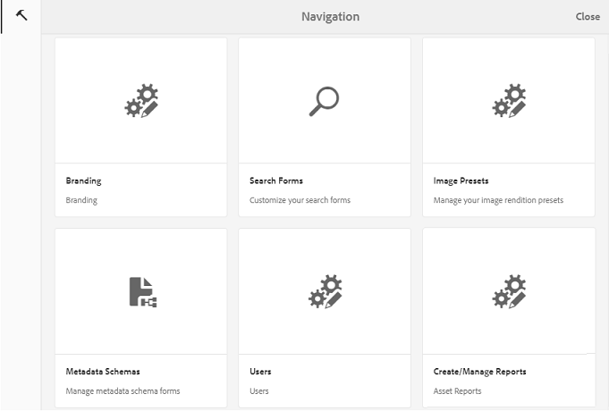

1. Auf der linken Leiste der Seite **[!UICONTROL Branding konfigurieren]** ist standardmäßig **[!UICONTROL Hintergrund]** ausgewählt. Das Standard-Hintergrundbild der Anmeldeseite wird angezeigt.

   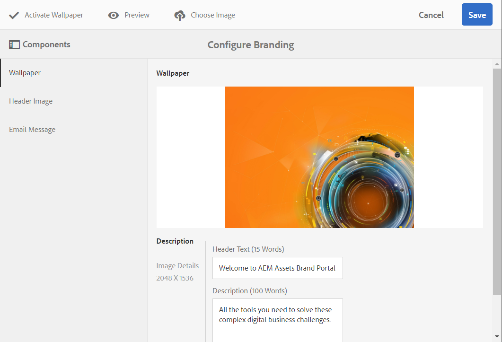

1. Um ein neues Hintergrundbild hinzuzufügen, klicken Sie in der Symbolleiste oben auf das Symbol **[!UICONTROL Bild auswählen]**.

   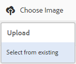

   Führen Sie einen der folgenden Schritte aus:

   * Um ein Bild von Ihrem Computer hochzuladen, klicken Sie auf **[!UICONTROL Hochladen]**. Navigieren Sie zum erforderlichen Bild und laden Sie es hoch.
   * Um ein vorhandenes Brand Portal-Bild zu verwenden, klicken Sie auf **[!UICONTROL Vorhandene wählen]**. Wählen Sie mit der Asset-Auswahl ein Bild aus.

   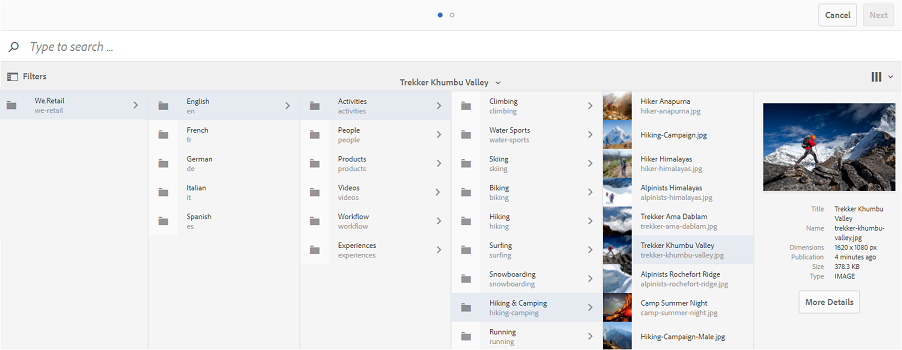

1. Geben Sie den Kopfzeilentext und eine Beschreibung für das Hintergrundbild an. Um die Änderungen zu speichern, klicken Sie oben in der Symbolleiste auf **[!UICONTROL Speichern]**.

1. Klicken Sie oben in der Symbolleiste auf das Symbol **[!UICONTROL Vorschau]**, um eine Vorschau der Brand Portal-Benutzeroberfläche mit dem Bild zu erzeugen.

   

   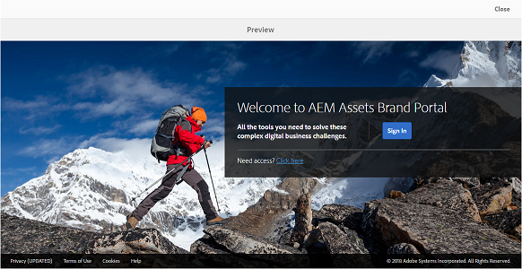

1. Um das standardmäßige Hintergrundbild zu aktivieren bzw. zu deaktivieren, gehen Sie auf der Seite **[!UICONTROL Branding konfigurieren > Hintergrund]** wie folgt vor:

   * Um das Standard-Hintergrundbild auf der Brand Portal-Anmeldeseite anzuzeigen, klicken Sie oben in der Symbolleiste auf **[!UICONTROL Hintergrund deaktivieren]**. Eine Meldung bestätigt, dass das Standardbild deaktiviert wurde.

   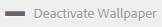

   * Um das benutzerdefinierte Bild auf der Brand Portal-Anmeldeseite wiederherzustellen, klicken Sie in der Symbolleiste auf **[!UICONTROL Hintergrund aktivieren]**. Eine Meldung bestätigt, dass das Bild wiederhergestellt wurde.

   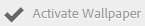

   * Klicken Sie auf **[!UICONTROL Speichern]**, um die Änderungen zu speichern.

## Anpassen der Kopfzeile {#customize-the-header}

Der Header erscheint auf verschiedenen Brand Portal-Seiten, nachdem Sie sich bei Brand Portal angemeldet haben.

1. Klicken Sie oben in der AEM-Symbolleiste auf das Adobe-Logo, um auf die Admin Tools zuzugreifen.

   

1. Klicken Sie im Admin Tools-Bereich auf **[!UICONTROL Branding]**.

   

1. Um die Kopfzeile für die Brand Portal-Benutzeroberfläche anzupassen, wählen Sie auf der Seite **[!UICONTROL Branding konfigurieren]** in der linken Leiste die Option **[!UICONTROL Kopfzeilenbild]** aus. Das Standard-Kopfzeilenbild wird angezeigt.

   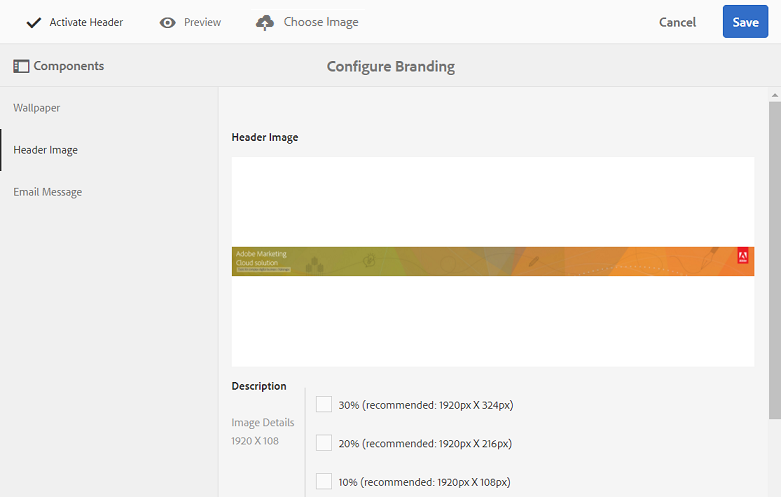

1. Um ein Kopfzeilenbild hochzuladen, klicken Sie auf das Symbol **[!UICONTROL Bild auswählen]** und wählen Sie **[!UICONTROL Hochladen]** aus.

   Um ein vorhandenes Brand Portal-Bild zu verwenden, wählen Sie **[!UICONTROL Vorhandene wählen]** aus.

   

   Wählen Sie mit der Asset-Auswahl ein Bild aus.

   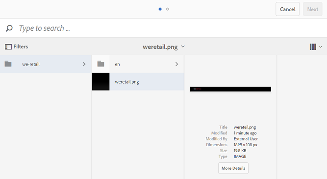

1. Um eine URL im Kopfzeilenbild einzubeziehen, geben Sie sie im Feld **[!UICONTROL Bild-URL]** an. Sie können externe und interne URLs angeben. Interne Links können auch als relative Links angegeben werden, zum Beispiel
   [!UICONTROL `/mediaportal.html/content/dam/mac/tenant_id/tags`].
Dieser Link leitet Benutzer zum Tags-Ordner weiter.
Um die Änderungen zu speichern, klicken Sie oben in der Symbolleiste auf **[!UICONTROL Speichern]**.

   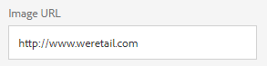

1. Klicken Sie oben in der Symbolleiste auf das Symbol **[!UICONTROL Vorschau]**, um eine Vorschau der Brand Portal-Benutzeroberfläche mit dem Kopfzeilenbild zu erzeugen.

   
   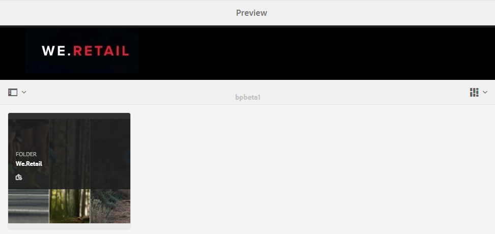

1. Um das Standard-Kopfzeilenbild zu aktivieren bzw. zu deaktivieren, gehen Sie auf der Seite **[!UICONTROL Branding konfigurieren > Kopfzeilenbild]** wie folgt vor:

   * Um zu verhindern, dass ein Kopfzeilenbild auf den Brand Portal-Seiten angezeigt wird, klicken Sie oben in der Symbolleiste auf **[!UICONTROL Kopfzeile deaktivieren]**. Eine Meldung bestätigt, dass das Bild deaktiviert wurde.

   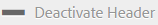

   * Um das Kopfzeilenbild wieder auf den Brand Portal-Seiten anzuzeigen, klicken Sie oben in der Symbolleiste auf **[!UICONTROL Kopfzeile aktivieren]**. Eine Meldung bestätigt, dass das Bild aktiviert wurde.

   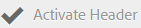

   * Klicken Sie auf **[!UICONTROL Speichern]**, um die Änderungen zu speichern.

## Anpassen der E-Mail-Nachrichten {#customize-the-email-messaging}

Wenn Assets als Link freigegeben werden, erhalten Benutzer eine E-Mail mit dem Link. Administratoren können diese Nachrichten, d. h. das Logo, die Beschreibung und die Fußzeile dieser E-Mails, anpassen.

1. Klicken Sie oben in der AEM-Symbolleiste auf das Adobe-Logo, um auf die Admin Tools zuzugreifen.

   

1. Klicken Sie im Admin Tools-Bereich auf **[!UICONTROL Branding]**.

   

1. Wenn Assets als Link freigegeben oder über E-Mails heruntergeladen und **[!UICONTROL Sammlungen]** freigegeben werden, werden E-Mail-Benachrichtigungen an Benutzer gesendet. Um die E-Mail-Nachricht anzupassen, wählen Sie auf der Seite **[!UICONTROL Branding konfigurieren]** in der linken Leiste die Option **[!UICONTROL E-Mail-Nachricht]** aus.

   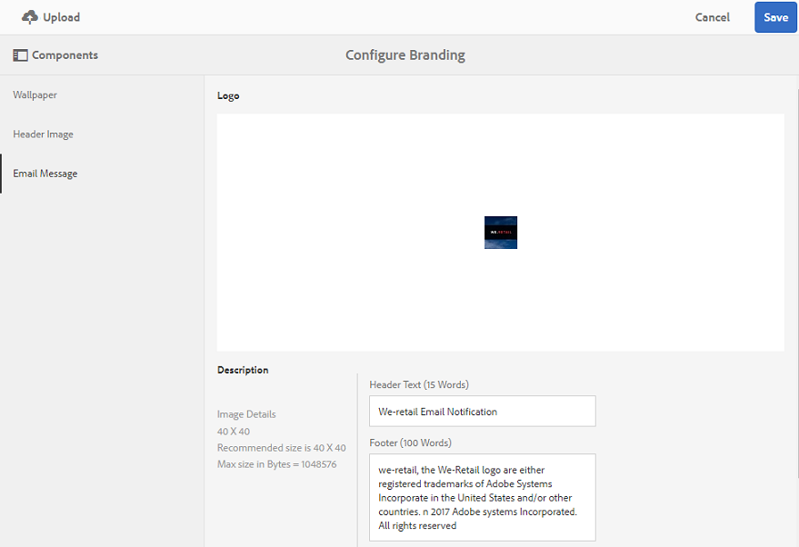

1. Um für ausgehende E-Mails ein Logo hinzuzufügen, klicken Sie oben in der Symbolleiste auf **[!UICONTROL Hochladen]**.

1. Geben Sie im Bereich **[!UICONTROL Beschreibung]** die E-Mail-Kopfzeile und den Fußzeilentext an. Um die Änderungen zu speichern, klicken Sie oben in der Symbolleiste auf **[!UICONTROL Speichern]**.

   >[!NOTE]
   >
   >Wenn Sie nicht die empfohlene Größe für das Logo verwenden oder wenn der Kopfzeilen- oder Fußzeilentext die empfohlene Wortanzahl überschreitet, wird der Inhalt der E-Mail-Nachricht möglicherweise nicht korrekt dargestellt.
