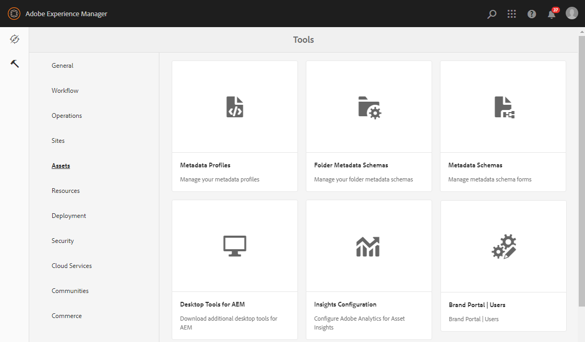
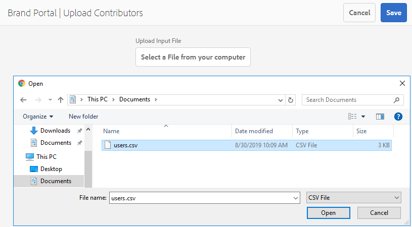

# Konfigurieren der Asset-Beschaffung {#configure-asset-sourcing}

AEM-Administratoren können die **Asset-Beschaffung** in der AEM-Autoreninstanz konfigurieren. Der Administrator aktiviert die Kennzeichnungskonfiguration der Asset-Beschaffungsfunktion in der **AEM-Web-Konsolenkonfiguration** und lädt die Liste der aktiven Brand Portal-Benutzer in **AEM Assets** hoch.

>[!NOTE]
>
>Bevor Sie mit der Konfiguration beginnen, stellen Sie sicher, dass Ihre AEM Assets-Instanz in Brand Portal konfiguriert ist. Siehe [Konfigurieren von AEM Assets mit Brand Portal](../using/configure-aem-assets-with-brand-portal.md).

Das folgende Video demonstriert, wie Sie die Asset-Beschaffung in Ihrer AEM-Autoreninstanz konfigurieren:

>[!VIDEO](https://video.tv.adobe.com/v/29771)

## Aktivieren der Asset-Beschaffung {#enable-asset-sourcing}

AEM-Administratoren können die Asset-Beschaffung über die AEM-Web-Konsolen-Konfiguration (auch Configuration Manager genannt) aktivieren.

**Aktivieren der Asset-Beschaffung:**
1. Melden Sie sich bei Ihrer AEM-Autoreninstanz an und öffnen Sie Configuration Manager.
Standard-URL: http:// localhost:4502/system/console/configMgr
1. Suchen Sie nach **Asset-Beschaffung**, um die **[!UICONTROL Konfiguration der Funktionskennzeichnung für Asset-Beschaffung]** zu finden.
1. Klicken Sie auf **[!UICONTROL Konfiguration der Funktionskennzeichnung für Asset-Beschaffung]**, um das Konfigurationsfenster zu öffnen.
1. Aktivieren Sie das Kontrollkästchen **[!UICONTROL feature.flag.active.status]**
1. Klicken Sie auf **[!UICONTROL Speichern]**.

## Hochladen der Brand Portal-Benutzerliste {#upload-bp-user-list}

AEM-Administratoren können die Datei für die Brand Portal-Benutzerkonfiguration (.csv) hochladen, die eine Liste der aktiven Brand Portal-Benutzer in AEM Assets enthält. Ein Beitragsordner kann nur für die aktiven Brand Portal-Benutzer freigegeben werden, die in der Benutzerliste definiert sind. Administratoren können der Konfigurationsdatei auch neue Benutzer hinzufügen und die geänderte Benutzerliste hochladen.

>[!NOTE]
>
>Das Format der CSV-Datei entspricht dem von Admin Console für den Massenimport von Benutzern unterstützten Format. E-Mail-Adresse, Vorname und Nachname sind obligatorisch.

Administratoren können neue Benutzer in AEM Admin Console hinzufügen. Weitere Informationen finden Sie unter [Benutzer verwalten](brand-portal-adding-users.md). Nachdem Benutzer in Admin Console hinzugefügt wurden, können diese Benutzer der Benutzerkonfigurationsdatei von Brand Portal hinzugefügt werden. Anschließend kann ihnen die Zugriffsberechtigung auf den Beitragsordner zugewiesen werden.

**Hochladen der Brand Portal-Benutzerliste:**
1. Melden Sie sich bei Ihrer AEM-Autoreninstanz an.
Standard-URL: http:// localhost:4502/aem/start.html
1. Navigieren Sie vom Bedienfeld **Tools**  zu **[!UICONTROL Assets > Brand Portal-Benutzer]**.
   
1. Das Fenster zum Hochladen von Beitragenden zu Brand Portal wird geöffnet.
Durchsuchen Sie Ihren lokalen Computer und laden Sie die **Konfigurationsdatei (.csv)** hoch, die die Liste der aktiven Brand Portal-Benutzer enthält.
1. Klicken Sie auf **[!UICONTROL Speichern]**.
   

Administratoren können über diese Benutzerliste Zugriff auf bestimmte Benutzer/Gruppen gewähren, während sie den Beitragsordner konfigurieren.

Weitere Informationen finden Sie unter [Konfigurieren von Beitragsordnern](brand-portal-contribution-folder.md).
