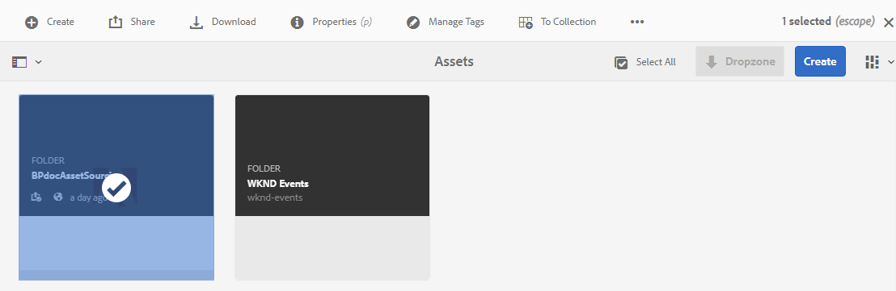

# Konfigurieren von Eigenschaften von Beitragsordnern {#configure-contribution-folder-properties}

Der AEM-Administrator führt beim Konfigurieren der Eigenschaften eines Beitragsordners die folgenden Aktivitäten aus.

* **Beschreibung hinzufügen**: Geben Sie eine allgemeine Beschreibung des Beitragsordners ein.
* **Kurzbeschreibung hochladen**: Laden Sie das Asset-Anforderungsdokument hoch, das Asset-bezogene Informationen enthält.
* **Beitragende hinzufügen**: Fügen Sie Brand Portal-Benutzer oder -Gruppen hinzu, um ihnen Zugriff auf den Beitragsordner zu gewähren.

Die Asset-Anforderung bezieht sich auf die Details, die von Administratoren bereitgestellt werden, um Beitragende (Brand Portal-Benutzer) dabei zu unterstützen, die Notwendigkeit und Anforderungen des Beitragsordners zu verstehen. Der Administrator lädt ein Asset-Anforderungsdokument hoch, das eine Kurzbeschreibung des Asset-Typs enthält, der dem Beitragsordner hinzugefügt werden soll, sowie Asset-bezogene Informationen, wie z. B. Zweck, Typ der Bilder, maximale Größe usw.

Der Administrator kann Brand Portal-Benutzern/-Gruppen anschließend Zugriff auf den Beitragsordner gewähren, bevor der neu erstellte Beitragsordner in Brand Portal veröffentlicht wird.

**Konfigurieren von Eigenschaften von Beitragsordnern:**

1. Melden Sie sich bei Ihrer AEM-Autoreninstanz an.
Standard-URL: http:// localhost:4502/aem/start.html
1. Navigieren Sie zu **[!UICONTROL Assets > Dateien]** und suchen Sie nach dem Beitragsordner.
1. Wählen Sie den Beitragsordner und klicken Sie auf **[!UICONTROL Eigenschaften]** , um das Fenster Ordnereigenschaften zu öffnen.

   

   

1. Navigieren Sie zur Registerkarte **[!UICONTROL Asset-Beitrag]**.
1. Geben Sie eine allgemeine **[!UICONTROL Beschreibung]** des Beitragsordners ein.
1. Klicken Sie auf **[!UICONTROL Kurzbeschreibung hochladen]**, um von Ihrem lokalen Computer aus zu navigieren und ein **Asset-Anforderungsdokument** hochzuladen.

   

1. Geben Sie im Feld **[!UICONTROL Benutzer oder Gruppe hinzufügen]** Brand Portal-Benutzer an, für die Sie den Beitragsordner freigeben möchten. Diese Benutzer können über die Oberfläche des Markenportals auf Inhalte zugreifen und diese in den Beitragsordner hochladen.
1. Klicken Sie auf **[!UICONTROL Speichern]**.

   

>[!NOTE]
>
>Die Suchergebnisse basieren auf der in AEM Assets konfigurierten Brand Portal-Benutzerliste. Vergewissern Sie sich, dass Sie über die aktualisierte Brand Portal-Benutzerliste verfügen. Siehe [Hochladen der Brand Portal-Benutzerliste](brand-portal-configure-asset-sourcing.md).
