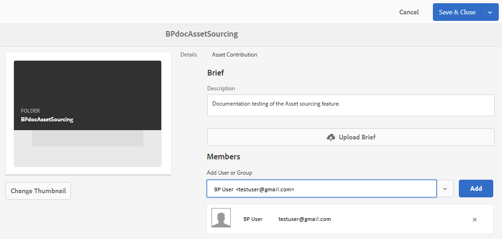

# Eigenschaften des Beitragsordners konfigurieren {#configure-contribution-folder-properties}

AEM-Administrator führt beim Konfigurieren der Eigenschaften eines Beitragsordners die folgenden Aktivitäten aus.

* **Beschreibung** hinzufügen: Geben Sie eine allgemeine Beschreibung des Beitragsordners ein.
* **Kurzbeschreibung** hochladen:  Dokument zur Asset-Anforderung hochladen, das Asset-bezogene Informationen enthält.
* **Mitarbeiter** hinzufügen: Fügen Sie Benutzer oder Gruppen des Markenportals hinzu, um ihnen Zugriff auf den Beitragsordner zu gewähren.

Die Asset-Anforderung bezieht sich auf die Details, die von Administratoren bereitgestellt werden, um Mitarbeiter (Brand Portal-Benutzer) dabei zu unterstützen, die Notwendigkeit und Anforderungen des Beitragsordners zu verstehen. Der Administrator lädt ein Dokument zur Anforderung von Assets hoch, das eine kurze Beschreibung des Asset-Typs enthält, der dem Beitragsordner und Asset-bezogenen Informationen hinzugefügt werden soll, z. B. Zweck, Typ der Bilder, maximale Größe usw.

Anschließend kann der Administrator Benutzern/Gruppen des Markenportals Zugriff auf den Beitragsordner gewähren, bevor der neu erstellte Beitragsordner im Markenportal veröffentlicht wird.

**So konfigurieren Sie Eigenschaften von Beitragsordnern:**
1. Anmelden bei Ihrer AEM-AutoreninstanzStandard-URL: http:// localhost:4502/aem/start.html
1. Navigieren Sie zu **[!UICONTROL Assets &gt; Dateien]** und suchen Sie den Beitragsordner.
1. Wählen Sie den Beitragsordner und klicken Sie auf **[!UICONTROL Eigenschaften]** . Das Fenster "Ordnereigenschaften"wird geöffnet.
   
1. Navigieren Sie zur Registerkarte " **[!UICONTROL Asset-Beitrag]** ".
1. Geben Sie eine allgemeine **[!UICONTROL Beschreibung]** des Beitragsordners ein.
1. Klicken Sie auf Kurzbeschreibung **[!UICONTROL hochladen]** ,  um von Ihrem lokalen Computer aus zu navigieren und ein **Asset-Anforderungsdokument** hochzuladen.
1. Suchen Sie in "Benutzer oder Gruppe **[!UICONTROL hinzufügen]**"nach Benutzern oder Gruppen, für die Sie den Beitragsordner freigeben möchten, und **[!UICONTROL fügen Sie]** Markenportal-Benutzer oder -Gruppen hinzu.
Diese Brand Portal-Benutzer/-Gruppen haben die Berechtigung, auf den Beitragsordner zuzugreifen und Inhalte von ihrer Brand Portal-Oberfläche hochzuladen, ohne Zugriff auf die AEM-Autoreninstanz zu benötigen.
1. Klicken Sie auf **[!UICONTROL Speichern]**.
   

>[!NOTE]
>
>Die Suchergebnisse basieren auf der in AEM Assets konfigurierten Markenportal-Benutzerliste. Vergewissern Sie sich, dass Sie über die aktualisierte Markenportal-Benutzerliste verfügen. Siehe [Benutzerliste](brand-portal-upload-user-list.md)Markenportal hochladen.