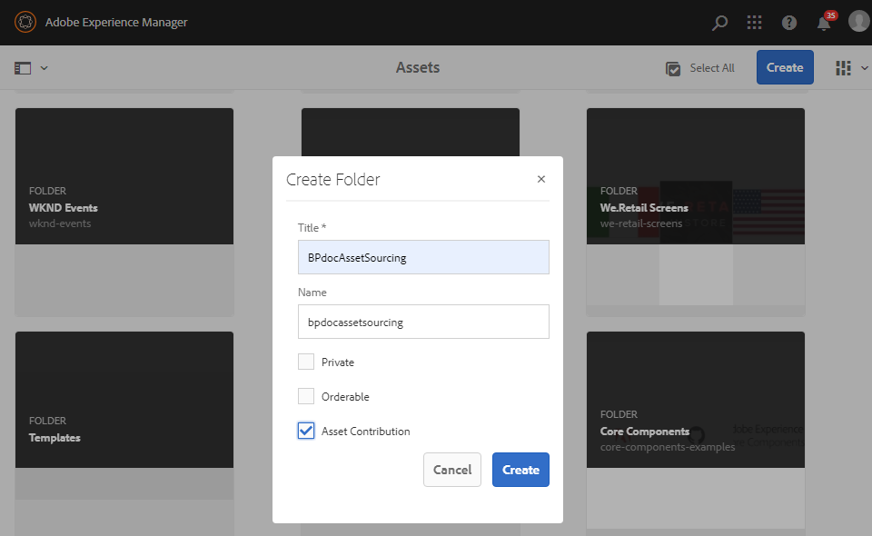
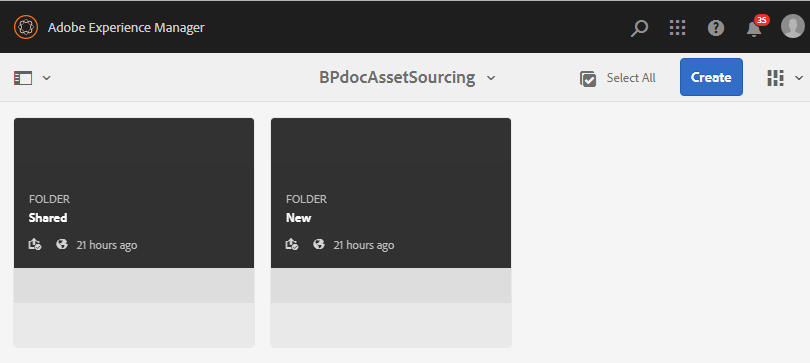

# Erstellen von Beitragsordnern {#create-contribution-folder}

AEM-Administratoren und Benutzer ohne Administratorrechte, die zum Erstellen eines neuen Ordners berechtigt sind, können in AEM Assets einen Beitragsordner erstellen.
Um einen Beitragsordner zu erstellen, erstellen Sie einen neuen Ordner des Typs Asset-Beitrag und stellen Sie sicher, dass der neu erstellte Ordner von Brand Portal-Benutzern für die Übermittlung von Assets nutzbar ist.  Dadurch wird automatisch ein Workflow ausgelöst, mit dem zwei weitere Unterordner namens SHARED und NEW im Beitragsordner erstellt werden.

>[!NOTE]
>
>Sie können mehrere Beitragsordner in einem Ordner erstellen, aber keinen Beitragsordner in einem anderen Beitragsordner.

Erstellen eines Beitragsordners:
1. Melden Sie sich bei Ihrer AEM-Autoreninstanz an.

   Standard-URL: http:// localhost:4502/aem/start.html.

1. Navigieren Sie zu **[!UICONTROL Assets]** > **[!UICONTROL Dateien]**. Es werden alle im AEM Assets-Repository vorhandenen Ordner aufgelistet.

1. Klicken Sie auf **[!UICONTROL Erstellen]**, um einen neuen Ordner zu erstellen. Das Dialogfeld **[!UICONTROL Ordner erstellen]** wird geöffnet.

1. Geben Sie **[!UICONTROL Titel]** und **[!UICONTROL Name]** des Ordners ein und aktivieren Sie das Kontrollkästchen **[!UICONTROL Asset-Beiträge]**.
Wir empfehlen, Kleinbuchstaben ohne Leerzeichen zu verwenden, um den Ordner zu benennen.

1. Klicken Sie auf **[!UICONTROL Erstellen]**. Der Beitragsordner wird im AEM Assets-Repository aufgelistet.

   >[!NOTE]
   >
   >Ein Benutzer ohne Administratorrechte kann einen Asset-Beitragsordner erstellen und freigeben, ihn jedoch nicht ändern oder löschen.

   

1. Klicken Sie, um den Beitragsordner zu öffnen. Es werden zwei Unterordner angezeigt: **[!UICONTROL FREIGEGEBEN]** und **[!UICONTROL NEU]**. Diese werden automatisch im Beitragsordner erstellt.

   

Sie können jetzt die [Eigenschaften des Beitragsordners konfigurieren](brand-portal-configure-contribution-folder-properties.md).

