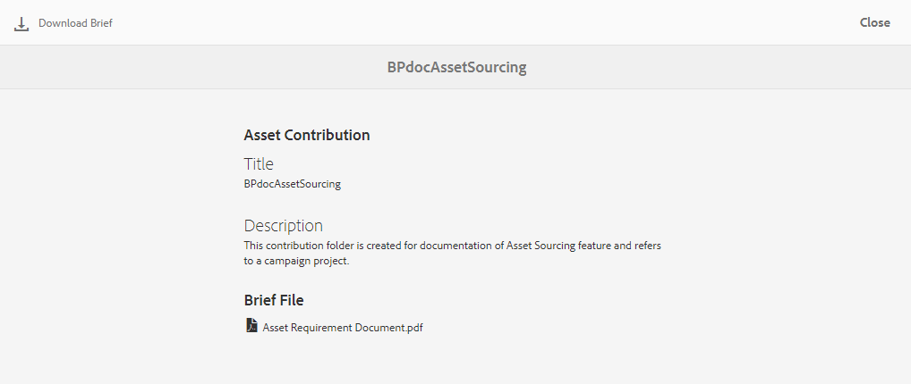
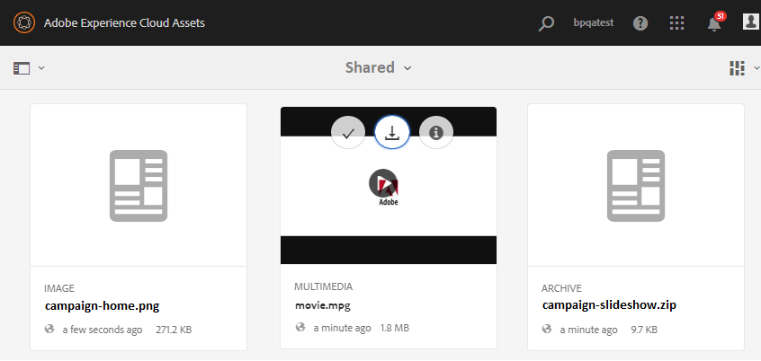

# Asset-Anforderungen herunterladen {#using-asset-souring-in-bp}

Markenportalbenutzer erhalten automatisch E-Mail-/Pulsbenachrichtigungen, sobald ein Beitragsordner vom AEM-Benutzer freigegeben wird. Dadurch können sie das kurze Dokument (Asset-Anforderung) herunterladen und die Grundelemente (Referenzinhalte) aus dem **SHARED** -Ordner herunterladen, um sicherzustellen, dass sie die Asset-Anforderungen verstehen.

Der Brand Portal-Benutzer führt die folgenden Aktivitäten aus, um Asset-Anforderungen herunterzuladen:

* **Download-Übersicht**: Laden Sie die Kurzbeschreibung (Asset-Anforderungsdokument) herunter, die dem Beitragsordner mit Asset-bezogenen Informationen wie Elementtyp, Zweck, unterstützte Formate, maximale Asset-Größe usw. beigefügt ist.
* **Grundlegende Assets** herunterladen: Laden Sie die Grundelemente herunter, mit denen Sie die erforderlichen Asset-Typen verstehen können. Markenportal-Benutzer können diese Assets als Referenz verwenden, um neue Assets als Beitrag zu erstellen.

Das Markenportal-Dashboard spiegelt alle vorhandenen Ordner wider, die dem Markenportal-Benutzer erlaubt sind, zusammen mit dem neu freigegebenen Beitragsordner. In diesem Beispiel hat der Benutzer des Markenportals nur Zugriff auf den neu erstellten Beitragsordner. Es wird kein anderer bestehender Ordner für den Benutzer freigegeben.

**So laden Sie Asset-Anforderungen herunter:**

1. Melden Sie sich bei Ihrer Brand Portal-Instanz an.
1. Wählen Sie den Beitragsordner im Dashboard "Markenportal"aus.
1. Click **[!UICONTROL Properties]** . Das Eigenschaftenfenster wird geöffnet und zeigt Details zum Asset Contribution-Ordner an.
   
1. Klicken Sie auf **[!UICONTROL Kurzbeschreibung]**  herunterladen, um das Asset-Anforderungsdokument auf Ihren lokalen Computer herunterzuladen.
   
1. Gehen Sie zurück zum Markenportal-Dashboard.
1. Klicken Sie auf , um den Beitragsordner zu öffnen. Im Beitragsordner werden zwei Unterordner **[!UICONTROL SHARED]** und **[!UICONTROL NEW]** angezeigt. Der Ordner "SHARED"enthält alle Grundelemente (Referenzinhalte), die von den Administratoren gemeinsam verwendet werden.
1. Sie können den **[!UICONTROL SHARED]** -Ordner mit allen Grundelementen auf Ihrem lokalen Computer herunterladen.
Sie können auch den **[!UICONTROL freigegebenen]** Ordner öffnen und auf das Symbol " **Herunterladen** "klicken,  um einzelne Dateien/Ordner herunterzuladen.
   

Lesen Sie die Beschreibung (Asset-Anforderungsdokument) und lesen Sie die grundlegenden Elemente, um die Asset-Anforderungen zu verstehen. Jetzt können Sie neue Assets für Beiträge erstellen und sie in den Beitragsordner hochladen. Siehe [Hochladen von Assets in den Beitragsordner](brand-portal-upload-assets-to-contribution-folder.md).

