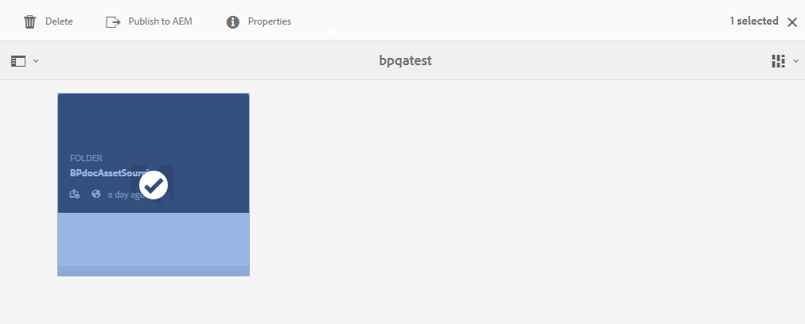

# Herunterladen von Asset-Anforderungen {#using-asset-souring-in-bp}

Brand Portal-Benutzer erhalten automatisch E-Mail-/Pulsbenachrichtigungen, sobald ein Beitragsordner vom AEM-Benutzer freigegeben wird. Damit können sie die Kurzbeschreibung (Asset-Anforderungsdokument) sowie die Grundlinien-Assets (Referenzinhalte) aus dem Ordner **FREIGEGEBEN** herunterladen, um sicherzustellen, dass sie die Asset-Anforderungen verstehen.

Der Brand Portal-Benutzer führt die folgenden Aktivitäten aus, um Asset-Anforderungen herunterzuladen:

* **Kurzbeschreibung herunterladen**: Laden Sie die Kurzbeschreibung (Asset-Anforderungsdokument) herunter, die dem Beitragsordner beigefügt ist und Asset-bezogene Informationen wie Elementtyp, Zweck, unterstützte Formate, maximale Asset-Größe usw. enthält.
* **Grundlinien-Assets herunterladen**: Laden Sie die Grundlinien-Assets herunter, mit denen Sie die erforderlichen Asset-Typen verstehen können. Brand Portal-Benutzer können diese Assets als Referenz verwenden, um neue Assets für Beiträge zu erstellen.

Das Brand Portal-Dashboard enthält alle vorhandenen Ordner, die dem Brand Portal-Benutzer zur Verfügung stehen, sowie den neu freigegebenen Beitragsordner. In diesem Beispiel hat der Brand Portal-Benutzer nur Zugriff auf den neu erstellten Beitragsordner. Es wird kein anderer bestehender Ordner für den Benutzer freigegeben.

**Herunterladen von Asset-Anforderungen:**

1. Melden Sie sich bei Ihrer Brand Portal-Instanz an.
1. Wählen Sie den Beitragsordner im Brand Portal-Dashboard aus.
1. Klicken Sie auf **[!UICONTROL Eigenschaften]** . Das Eigenschaftenfenster wird geöffnet und zeigt Details zum Asset-Beitragsordner an.
   
1. Klicken Sie auf **[!UICONTROL Kurzbeschreibung herunterladen]**, um das Asset-Anforderungsdokument auf Ihren lokalen Computer herunterzuladen.
   
1. Gehen Sie zurück zum Brand Portal-Dashboard.
1. Klicken Sie, um den Beitragsordner zu öffnen. Es werden zwei Unterordner im Beitragsordner angezeigt: **[!UICONTROL FREIGEGEBEN]** und **[!UICONTROL NEU]**. Der Ordner „FREIGEGEBEN“ enthält alle Grundlinien-Assets (Referenzinhalte), die von den Administratoren freigegeben werden.
1. Sie können den Ordner **[!UICONTROL FREIGEGEBEN]** mit allen Grundlinien-Assets auf Ihren lokalen Computer herunterladen.
Sie können auch den Ordner **[!UICONTROL FREIGEGEBEN]** öffnen und auf das Symbol **Herunterladen**  klicken, um einzelne Dateien/Ordner herunterzuladen.
   

Sehen sie sich die Kurzbeschreibung (Asset-Anforderungsdokument) und die Grundlinien-Assets an, um die Asset-Anforderungen zu verstehen. Jetzt können Sie neue Assets für Beiträge erstellen und sie in den Beitragsordner hochladen. Siehe [Hochladen von Assets in den Beitragsordner](brand-portal-upload-assets-to-contribution-folder.md).

