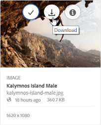

# Herunterladen von Assets aus Brand Portal {#download-assets-from-bp}

<!-- Before update in Download experience - 26th Aug 2020 comment by Vishabh.
 All users can simultaneously download multiple assets and folders accessible to them from Brand Portal. This way, approved brand assets can be securely distributed for offline use. Read on to know how to download approved assets from Brand Portal, and what to expect from the [download performance](../using/brand-portal-download-assets.md#main-pars-header).
-->

Adobe Experience Manager Assets Brand Portal verbessert das Download-Erlebnis, indem es den Benutzern ermöglicht, mehrere Assets und Ordner aus Brand Portal gleichzeitig herunterzuladen. Auf diese Weise können genehmigte Marken-Assets sicher für die Offline-Nutzung verteilt werden. Hier erfahren Sie, wie Sie genehmigte Assets von Brand Portal herunterladen und welche [Download-Zeiten](../using/brand-portal-download-assets.md#expected-download-performance) dabei zu erwarten sind.

>[!NOTE]
>
>In Brand Portal 2020.10.0 (und höher) ist die Einstellung **[!UICONTROL Schneller Download]** standardmäßig aktiviert, wobei IBM Aspera Connect für den beschleunigten Download der Assets verwendet wird. Installieren Sie IBM Aspera Connect 3.9.9 (`https://www.ibm.com/docs/en/aspera-connect/3.9.9`) in der Browser-Erweiterung, bevor Sie die Assets aus Brand Portal herunterladen. Weitere Informationen finden Sie unter [Anleitung zur Beschleunigung von Downloads aus Brand Portal](../using/accelerated-download.md).
>
>Wenn Sie IBM Aspera Connect nicht verwenden und den normalen Download-Vorgang fortsetzen möchten, wenden Sie sich an den Administrator für Brand Portal, um die Einstellung **[!UICONTROL Schneller Download]** zu deaktivieren.

## Konfigurieren des Asset-Downloads {#configure-download}

Brand Portal-Administratoren können die Einstellungen für den Asset-Download und die Benutzergruppen für die Benutzer von Brand Portal konfigurieren und ihnen den Zugriff auf und das Herunterladen von Asset-Ausgabedarstellungen über die Brand Portal-Benutzeroberfläche ermöglichen.

>[!NOTE]
>
>Die auf der Benutzeroberfläche angewendeten Download-Einstellungen erleichtern Brand Portal-Benutzern das Konfigurieren und Herunterladen der Asset-Ausgabedarstellungen. Der Download von Assets auf Programmebene wird nicht eingeschränkt. Beispielsweise können die Benutzer weiterhin mit dem vollständigen URL-Pfad auf die Asset-Ausgabedarstellungen zugreifen und diese herunterladen.

Der Zugriff auf und das Herunterladen von Asset-Ausgabedarstellungen über die Brand Portal-Benutzeroberfläche wird durch die folgenden Konfigurationen definiert:

* Download-Einstellungen aktivieren
* Konfigurieren von Benutzergruppeneinstellungen

### Download-Einstellungen aktivieren {#enable-download-settings}

Die Administratoren können die **[!UICONTROL Download-Einstellungen]** für Assets aktivieren, um die Ausgabedarstellungen zu definieren, auf die die Benutzer von Brand Portal zum Herunterladen zugreifen können.

Die verfügbaren Einstellungen sind:

* **[!UICONTROL Schneller Download]**

   Bietet einen beschleunigten Download der Assets mit IBM Aspera Connect. Standardmäßig ist die Einstellung **[!UICONTROL Schneller Download]** in den **[!UICONTROL Download-Einstellungen]** aktiviert.

* **[!UICONTROL Benutzerdefinierte Ausgabedarstellungen]**

   Ermöglicht das Herunterladen benutzerdefinierter und (oder) dynamischer Ausgabedarstellungen der Assets.

   Alle Asset-Ausgabedarstellungen außer dem Original-Asset und den systemgenerierten Ausgabedarstellungen werden als benutzerdefinierte Ausgabedarstellungen aufgerufen. Dies schließt sowohl statische als auch dynamische Ausgabedarstellungen ein, die für das Asset verfügbar sind. Jeder Benutzer kann eine benutzerdefinierte statische Ausgabedarstellung in Experience Manager Assets erstellen. Allerdings kann nur der Administrator benutzerdefinierte dynamische Ausgabedarstellungen erstellen. Weitere Informationen finden Sie unter [Anwenden von Bildvorgaben oder dynamischen Ausgabedarstellungen](../using/brand-portal-image-presets.md).

* **[!UICONTROL Systemausgabedarstellungen]**

   Aktiviert das Herunterladen systemgenerierter Ausgabedarstellungen der Assets.

   Dies sind die Miniaturansichten, die in Experience Manager Assets auf der Grundlage des Workflows „DAM-Update-Asset“ automatisch generiert werden.

* **[!UICONTROL Asset-Download]**

   Ermöglicht das Herunterladen der Ausgabedarstellungen in einem separaten Ordner für jedes Asset. Die Einstellung gilt für Ordner, Sammlungen und den Massen-Download von Assets (mehr als 20 Assets).

Melden Sie sich bei Ihrem Brand Portal-Mandanten als Administrator an und navigieren Sie zu **[!UICONTROL Tools]** > **[!UICONTROL Download]**.

Die Administratoren können eine beliebige Kombination von Einstellungen für die Benutzer von Brand Portal aktivieren, um ihnen den Zugriff auf und das Herunterladen von Ausgabedarstellungen zu ermöglichen.

>[!NOTE]
>
>Nur die Administratoren können die abgelaufenen Assets herunterladen. Weitere Informationen zu abgelaufenen Assets finden Sie unter [Verwalten der digitalen Rechte von Assets](../using/manage-digital-rights-of-assets.md).

### Konfigurieren von Benutzergruppeneinstellungen {#configure-user-group-settings}

Zusätzlich zu den **[!UICONTROL Download-Einstellungen]** können Brand Portal-Administratoren die Einstellungen für verschiedene Benutzergruppen zum Anzeigen und (oder) Herunterladen der Original-Assets und ihrer Ausgabedarstellungen konfigurieren.

Melden Sie sich bei Ihrem Brand Portal-Mandanten als Administrator an und navigieren Sie zu **[!UICONTROL Tools]** > **[!UICONTROL Benutzer]**. Navigieren Sie auf der Seite **[!UICONTROL Benutzerrollen]** zur Registerkarte **[!UICONTROL Gruppen]**, um die Ansicht und (oder) die Download-Einstellungen für die Benutzergruppen zu konfigurieren.

>[!NOTE]
>
>Wenn ein Benutzer mehreren Gruppen hinzugefügt wurde und eine dieser Gruppen über Einschränkungen verfügt, gelten die Einschränkungen für diesen Benutzer.

Je nach Konfiguration bleibt der Download-Workflow für eigenständige Assets, mehrere Assets, Ordner mit Assets, lizenzierte oder nicht lizenzierte Assets und den Download von Assets über einen Freigabe-Link konstant.

Die folgende Matrix definiert, ob ein Benutzer je nach [Download-Konfigurationen](#configure-download) Zugriff auf die Ausgabedarstellungen hat:

| **Download-Einstellungen: Benutzerdefinierte Ausgabedarstellungen** | **Download-Einstellungen: Systemausgabedarstellungen** | **Benutzergruppeneinstellungen: Original herunterladen** | **Benutzergruppeneinstellungen: Ausgabedarstellungen herunterladen** | **Ergebnis** |
|---|---|---|---|---|
| EIN | EIN | EIN | EIN | Anzeige und Download aller Ausgabedarstellungen |
| EIN | EIN | AUS | AUS | Anzeige des Original-Assets |
| AUS | AUS | EIN | EIN | Anzeige und Download des Original-Assets |
| EIN | AUS | EIN | EIN | Anzeige und Download von Original-Assets und benutzerdefinierten Ausgabedarstellungen |
| AUS | EIN | EIN | EIN | Anzeige und Download der Original-Assets und Systemausgabedarstellungen |
| EIN | AUS | AUS | AUS | Anzeige des Original-Assets |
| AUS | EIN | AUS | AUS | Anzeige des Original-Assets |
| AUS | AUS | AUS | EIN | Anzeige des Original-Assets |
| AUS | AUS | EIN | AUS | Anzeige und Download des Original-Assets |
| AUS | AUS | AUS | AUS | Anzeige des Original-Assets |

## Herunterladen von Assets {#download-assets}

Benutzer von Brand Portal können mehrere Assets, Ordner mit Assets und Sammlungen von der Brand Portal-Oberfläche herunterladen.

>[!NOTE]
>
>Wenden Sie sich an den Administrator für Brand Portal, wenn Sie nicht berechtigt sind, auf die Asset-Ausgabedarstellungen zuzugreifen oder sie herunterzuladen.

Wenn der Benutzer Zugriff auf Ausgabedarstellungen hat, wird dem Benutzer das erweiterte Dialogfeld **[!UICONTROL Herunterladen]** mit den folgenden Funktionen bereitgestellt:

* Anzeigen aller verfügbarer Ausgabedarstellungen eines Assets in der Download-Liste.
* Ausschließen von Ausgabedarstellungen der Assets, die nicht heruntergeladen werden müssen.
* Anwenden desselben Satzes von Ausgabedarstellungen auf alle ähnlichen Asset-Typen mit einem Klick.
* Anwenden unterschiedlicher Sätze von Ausgabedarstellungen auf unterschiedliche Asset-Typen.
* Erstellen Sie einen separaten Ordner für jedes Asset.
* Herunterladen ausgewählter Assets und ihrer Ausgabedarstellungen.

>[!NOTE]
>
>Das Dialogfeld **[!UICONTROL Herunterladen]** wird nur angezeigt, wenn **[!UICONTROL Benutzerdefinierte Ausgabedarstellungen]** und (oder) **[!UICONTROL Systemausgabedarstellungen]** unter **[!UICONTROL Download-Einstellungen]** aktiviert ist.

### Schritte für den Download von Assets {#bulk-download}

Im Folgenden werden die Schritte zum Herunterladen von Assets oder Ordnern mit Assets aus der Benutzeroberfläche von Brand Portal beschrieben:

1. Melden Sie sich bei Ihrem Brand Portal-Mandanten an. Standardmäßig wird die Ansicht **[!UICONTROL Dateien]** geöffnet, die alle veröffentlichten Assets und Ordner enthält.

   Führen Sie einen der folgenden Schritte aus:

   * Wählen Sie die Assets aus, die Sie herunterladen möchten. Klicken Sie oben in der Symbolleiste auf das Symbol **[!UICONTROL Herunterladen]**.

      

   * Um bestimmte Ausgabedarstellungen eines Assets herunterzuladen, halten Sie den Mauszeiger über das Asset und klicken Sie in den Schnellzugriff-Miniaturansichten auf das Symbol **[!UICONTROL Herunterladen]**.

      

      >[!NOTE]
      >
      >Wenn Sie die Assets zum ersten Mal herunterladen und IBM Aspera Connect nicht in Ihrem Browser installiert haben, werden Sie aufgefordert, Aspera Download Accelerator zu installieren (`https://www.ibm.com/docs/en/aspera-connect/3.9.9`).

      >[!NOTE]
      >
      >Wenn die Assets, die Sie herunterladen, auch lizenzierte Assets enthalten, werden Sie zur Seite **[!UICONTROL Copyright-Management]** weitergeleitet. Wählen Sie auf dieser Seite die Assets aus, klicken Sie auf **[!UICONTROL Zustimmen]** und klicken Sie dann auf **[!UICONTROL Herunterladen]**. Wenn Sie ablehnen, werden die lizenzierten Assets nicht heruntergeladen.
      > 
      >An lizenzgeschützte Assets wird eine [Lizenzvereinbarung angehängt](https://experienceleague.adobe.com/docs/experience-manager-65/assets/administer/drm.html?lang=de). Dazu muss die [Metadateneigenschaft](https://experienceleague.adobe.com/docs/experience-manager-65/assets/administer/drm.html) der Assets in Experience Manager Assets entsprechend eingestellt werden.

      

1. Das Dialogfeld **[!UICONTROL Herunterladen]** mit allen ausgewählten Assets wird geöffnet.

   Klicken Sie auf ein beliebiges Asset, um die verfügbaren Ausgabedarstellungen anzuzeigen, und aktivieren Sie die Kontrollkästchen der Ausgaben, die Sie herunterladen möchten.

   Sie können die Ausgabedarstellungen für einzelne Assets manuell auswählen oder ausschließen oder auf das Symbol **Anwenden** klicken, um denselben Satz von Ausgabedarstellungen für ähnliche Asset-Typen (in diesem Beispiel alle Bilddateien) zum Herunterladen auszuwählen. Klicken Sie im Dialogfeld **[!UICONTROL Alle anwenden]** auf **[!UICONTROL Fertig]**, um die Regel auf alle ähnlichen Assets anzuwenden.

   

   Sie können ein Asset auch aus der Download-Liste entfernen (falls erforderlich), indem Sie auf das Symbol **Entfernen** klicken.

   

   Damit die Brand Portal-Ordnerhierarchie beim Herunterladen von Assets erhalten bleibt, aktivieren Sie das Kontrollkästchen **[!UICONTROL Separaten Ordner für jedes Asset erstellen]**.

   Die Schaltfläche „Herunterladen“ gibt die Anzahl der ausgewählten Elemente wieder. Nachdem Sie die Regeln angewendet haben, klicken Sie auf **[!UICONTROL Elemente herunterladen]**.

   

1. Standardmäßig ist die Einstellung **[!UICONTROL Schneller Download]** in den **[!UICONTROL Download-Einstellungen]** aktiviert. Daher wird ein Bestätigungsfeld angezeigt, das dazu auffordert, einen beschleunigten Download mit IBM Aspera Connect zu erlauben.

   Um **[!UICONTROL Schneller Download]** weiterhin zu verwenden, klicken Sie auf **[!UICONTROL Erlauben]**. Alle ausgewählten Ausgabedarstellungen werden mit IBM Aspera Connect in einen ZIP-Ordner heruntergeladen.

   Wenn Sie IBM Aspera Connect nicht verwenden möchten, klicken Sie auf **[!UICONTROL Ablehnen]**. Wenn **[!UICONTROL Schneller Download]** verweigert wird oder fehlschlägt, erstellt das System eine Fehlermeldung. Klicken Sie auf die Schaltfläche **[!UICONTROL Normaler Download]**, um mit dem Herunterladen der Assets fortzufahren.

<!-- removed the known issue from step 2 as it is fixed in 2022.02.0 release.
   >[!CAUTION]
   >
   >(**Experience Manager Assets as a Cloud Service** only) The following known issue will be fixed in the upcoming release:
   >
   >The download dialog lists the smart crop renditions of the selected asset, however, the user cannot download the smart crop renditions.
-->

>[!NOTE]
>
>Wenn die Einstellung **[!UICONTROL Schneller Download]** vom Administrator deaktiviert wird, werden die ausgewählten Ausgabedarstellungen direkt in einen ZIP-Ordner heruntergeladen, ohne dass IBM Aspera Connect verwendet wird.

>[!NOTE]
>
>Wenn die Einstellung **[!UICONTROL Asset-Download]** in **[!UICONTROL Download-Einstellungen]** aktiviert ist, werden die Asset-Ausgabedarstellungen für jedes Asset im ZIP-Ordner in einen separaten Ordner heruntergeladen.
>  
>Wenn die Assets von einem freigegebenen Link heruntergeladen werden, werden die Asset-Ausgabedarstellungen für jedes Asset in einen separaten Ordner im ZIP-Ordner heruntergeladen.
>
>Wenn ein Ordner, eine Sammlung oder mehr als 20 Assets zum Herunterladen ausgewählt sind, wird das Dialogfeld **[!UICONTROL Herunterladen]** übersprungen und alle Asset-Ausgabedarstellungen, auf die der Benutzer zugreifen kann (mit Ausnahme der dynamischen Ausgabedarstellungen), werden direkt in einen ZIP-Ordner heruntergeladen.

>[!NOTE]
>
>Brand Portal unterstützt die Konfiguration von Dynamic Media sowohl im Hybrid- als auch im Scene7-Modus.
>
>(*Bei Ausführung der Experience Manager Assets-Autoreninstanz im **Dynamic Media Hybrid-Modus***)
>
>Um dynamische Ausgabedarstellungen eines Assets als Vorschau anzeigen (oder herunterladen) zu können, stellen Sie sicher, dass Dynamic Media aktiviert ist und die Pyramid TIFF-Ausgabe in der Experience Manager Assets-Autoreninstanz, von der aus die Assets veröffentlicht wurden, vorhanden ist. Wenn ein Asset aus Experience Manager Assets in Brand Portal veröffentlicht wird, wird auch seine Pyramid TIFF-Ausgabedarstellung veröffentlicht.

Wenn Sie nicht [vom Administrator für Zugriff auf die Originalausgaben autorisiert wurden](../using/brand-portal-adding-users.md#main-pars-procedure-202029708), werden die Original-Ausgabedarstellungen der ausgewählten Assets nicht heruntergeladen.

<!-- This issue has been resolved, check with engineering.
>[!NOTE]
>
>Once you have downloaded the asset renditions, the **[!UICONTROL Download]** button is disabled to avoid creating duplicate copies of the renditions. To download more (missing or another copy of renditions), refresh the browser to re-enable the download button.
-->

### Herunterladen von Assets von der Seite mit den Asset-Details {#download-assets-from-asset-details-page}

Neben dem Download-Workflow gibt es eine weitere Möglichkeit, die Ausgabedarstellungen für einzelne Assets direkt von der Seite mit den Asset-Details herunterzuladen.

Benutzer können verschiedene Ausgabedarstellungen in der Vorschau betrachten, bestimmte Ausgabedarstellungen auswählen und sie direkt aus dem Bedienfeld **[!UICONTROL Ausgabedarstellungen]** auf der Seite mit den Asset-Details herunterladen, ohne das Dialogfeld **[!UICONTROL Herunterladen]** öffnen zu müssen.

Führen Sie die folgenden Schritte aus, um Asset-Ausgabedarstellungen von der Seite mit den Asset-Details herunterzuladen:

1. Melden Sie sich bei Ihrem Brand Portal-Mandanten an und klicken Sie auf das Asset, um die Seite mit den Asset-Details zu öffnen.
1. Klicken Sie links auf das Überlagerungssymbol und dann auf **[!UICONTROL Ausgabedarstellungen]**.

   

1. Im Bedienfeld **[!UICONTROL Ausgabedarstellungen]** werden alle verfügbaren Asset-Ausgabedarstellungen basierend auf den [Download-Konfigurationen](#configure-download) für Assets aufgelistet.

   Wählen Sie die gewünschten Ausgabedarstellungen aus und klicken Sie auf **[!UICONTROL Elemente herunterladen]**.

   

1. Standardmäßig ist die Einstellung **[!UICONTROL Schneller Download]** in den **[!UICONTROL Download-Einstellungen]** aktiviert. Daher wird ein Bestätigungsfeld angezeigt, das dazu auffordert, einen beschleunigten Download mit IBM Aspera Connect zu erlauben.

   Um **[!UICONTROL Schneller Download]** weiterhin zu verwenden, klicken Sie auf **[!UICONTROL Erlauben]**. Alle ausgewählten Ausgabedarstellungen werden mit IBM Aspera Connect in einen ZIP-Ordner heruntergeladen.

   Wenn Sie die Verwendung von **[!UICONTROL Schneller Download]** ablehnen, wird eine Fehlermeldung angezeigt. Klicken Sie auf die Schaltfläche **[!UICONTROL Normaler Download]**, um mit dem Herunterladen der Assets fortzufahren.

<!-- removed the known issue from step 3 as it is fixed in 2022.02.0 release.
   >[!CAUTION]
   >
   >(**Experience Manager Assets as a Cloud Service** only) The following known issues will be fixed in the upcoming release:
   >
   >The **[!UICONTROL Renditions]** panel does not list all the static renditions of the assets that are published to Brand Portal after December 16, 2021.
   >
   >The **[!UICONTROL Renditions]** panel lists the smart crop renditions of the asset, however, the user cannot preview or download the smart crop renditions.
-->

>[!NOTE]
>
>Wenn die Einstellung **[!UICONTROL Schneller Download]** vom Administrator deaktiviert wird, werden die ausgewählten Ausgabedarstellungen direkt in einen ZIP-Ordner heruntergeladen, ohne dass IBM Aspera Connect verwendet wird.

>[!NOTE]
>
>Einzeln ausgewählte und heruntergeladene Assets sind im Bericht zu heruntergeladenen Assets sichtbar. Wenn jedoch ein Ordner mit Assets heruntergeladen wird, werden weder der Ordner noch die Assets im Bericht zu heruntergeladenen Assets angezeigt.

<!--
>[!NOTE]
>
>Assets that are individually downloaded are visible in the assets download report. However, if a folder containing assets is downloaded, the folder and assets are not displayed in the assets download report.
-->

<!-- Backup of content before updating the new feature docs.
## Configure asset download {#configure-download}

The download configuration allows the Brand Portal administrators to define the set of renditions available to the Brand Portal users for downloading the assets. The administrator can configure the asset **[!UICONTROL Download]** settings from the Brand Portal interface. 

The available configurations are:

* **[!UICONTROL Fast Download]** 

  Enables high-speed download of the assets. To know more, see [guide to accelerate downloads from Brand Portal](../using/accelerated-download.md).

* **[!UICONTROL Custom Renditions]** 
  
  Download custom and (or) dynamic renditions of the assets. 
  All the asset renditions other than the original asset and system-generated renditions are called as custom renditions. It includes static as well as dynamic renditions available for the asset. Any user can create a custom static rendition in AEM Assets, whereas, only the AEM administrator can create custom dynamic renditions. To know more, see [how to apply image presets or dynamic renditions](../using/brand-portal-image-presets.md)

* **[!UICONTROL System Renditions]** 

  Download system-generated renditions of the assets. These are the thumbnails which are automatically generated in AEM Assets based on the "DAM update asset" workflow. 

Log in to your Brand Portal tenant as an administrator and navigate to **[!UICONTROL Tools]** > **[!UICONTROL Download]**. By default, the **[!UICONTROL Fast Download]** configuration is enabled in the **[!UICONTROL Download Settings]**. 

The administrators can enable any combination to configure the asset download process.

Based on the configuration, the download workflow remains constant for stand-alone assets, multiple assets, folders containing assets, licensed or unlicensed assets, and downloading assets using share link. 

* If both **[!UICONTROL Custom Renditions]** and **[!UICONTROL System Renditions]** configurations are turned-off, the original renditions of the assets are downloaded without any additional dialog being presented to the users.    

* If any of the **[!UICONTROL Custom Renditions]** or **[!UICONTROL System Renditions]** configuration is enabled, an additional **[!UICONTROL Download]** dialog box appears wherein you can choose whether to download the original asset along with its renditions, or download only specific renditions. 

>[!NOTE]
>
>Only the administrators can download the expired assets. For more information about expired assets, see [manage digital rights of assets](../using/manage-digital-rights-of-assets.md).

## Steps to download assets {#steps-to-download-assets}

Following are the steps to download assets or folders containing assets from Brand Portal:

1. From the Brand Portal interface, do one of the following:

   * Select the folders or assets you want to download. From the toolbar at the top, click the **[!UICONTROL Download]** icon.

     

   * To download a specific asset or folder, hover the pointer over the asset or folder and click the **[!UICONTROL Download]** icon available in the quick action thumbnails.

     

     >[!NOTE]
     >
     >If you are downloading the assets for the first time and do not have IBM Aspera Connect installed in your browser, it will prompt you to install the Aspera download accelerator. 

     >[!NOTE]
     >
     >If the assets you are downloading also include licensed assets, you are redirected to the **[!UICONTROL Copyright Management]** page. In this page, select the assets, click **[!UICONTROL Agree]**, and then click **[!UICONTROL Download]**. If you choose to disagree, licensed assets are not downloaded. 
     > 
     >License-protected assets have [license agreement attached]() to them, which is done by setting asset's [metadata property]() in Experience Manager Assets.

     

     
     >[!NOTE]
     >
     >Ensure to select all the required asset renditions while downloading them from the asset details page, and click **[!UICONTROL Download]**. The selected renditions are downloaded to your local machine.
     > 
     >Once you download, the **[!UICONTROL Download]** button is disabled to avoid creating duplicate copies of the downloaded renditions. To download more (missing or another copy of renditions), refresh the browser to re-enable the download button.

     If any of the **[!UICONTROL Custom Renditions]** or **[!UICONTROL System Renditions]** configuration is enabled in the **[!UICONTROL Download Settings]**, the **[!UICONTROL Download]** dialog appears with the **[!UICONTROL Asset(s)]** check box selected by default. If the **[!UICONTROL Fast Download]** configuration is enabled, the **[!UICONTROL Enable download acceleration]** check box is selected by default.

     

     >[!NOTE]
     >
     >If the downloading assets are image files, and you select only the **[!UICONTROL Asset(s)]** check box in the **[!UICONTROL Download]** dialog but are not [authorized by the administrator to have access to the original renditions of image files](../using/brand-portal-adding-users.md#main-pars-procedure-202029708) then no image files are downloaded and a notification appears, stating that you have been restricted by the administrator to access original renditions.

     

1. To download the renditions in addition to the original assets, select the **[!UICONTROL Rendition(s)]** check box. However, if you want to download the system-generated renditions along with the custom renditions, clear the **[!UICONTROL Exclude System Renditions]** check box.

   

   * To download only the renditions, clear the **[!UICONTROL Asset(s)]** check box.

     >[!NOTE]
     >
     >By default, only the assets are downloaded. However, original renditions of image files are not downloaded if you are not [authorized by the administrator to have access to the original renditions of image files](../using/brand-portal-adding-users.md#main-pars-procedure-202029708).

    * To share the selected assets with other users through a link, select the **[!UICONTROL Email]** check box. An email notification is sent to the users with the download link. To know how to download assets from shared links, see [downloading assets from shared links](../using/brand-portal-link-share.md#main-pars-header-1703469193).  

      

      >[!NOTE]
      >
      >The download link on email notification expires after 45 days.
      >
      >The administrators can customize email messages, that is, logo, description, and footer, using the [Branding](../using/brand-portal-branding.md) feature.

    * You can select a predefined image preset or create a custom dynamic rendition from the **[!UICONTROL Download]** dialog box. 

      To apply a [custom image preset to the asset and its renditions](../using/brand-portal-image-presets.md#applyimagepresetswhendownloadingimages), select the **[!UICONTROL Dynamic Rendition(s)]** check box. Specify the image preset properties (such as size, format, color space, resolution, and image modifier) to apply the custom image preset while downloading the asset and its renditions. To download only the dynamic renditions, clear the **[!UICONTROL Asset(s)]** check box.

      

      >[!NOTE]
      >
      >Brand Portal supports configuring Dynamic Media in both - Hybird and Scene 7 mode. 
      >
      >(*If AEM author instance is running on **Dynamic Media Hybrid mode***)
      >
      >To preview or download dynamic renditions of an asset, ensure that the dynamic media is enabled and the asset's Pyramid tiff rendition exists at the AEM Assets author instance from where the assets have been published. When an asset is published to Brand Portal, its Pyramid tiff rendition is also published.
      
  
    * To preserve the Brand Portal folder hierarchy while downloading assets, select the **[!UICONTROL Create separate folder for each asset]** check box. By default, the Brand Portal folder hierarchy is ignored and all the assets are downloaded in one folder in your local system.

1. Click **[!UICONTROL Download]**.

   The assets (and renditions if selected) are downloaded as a zip file to your local folder. However, no zip file is created if a single asset is downloaded without any of the renditions. 

   If you are not [authorized by the administrator to have access to the original renditions](../using/brand-portal-adding-users.md#main-pars-procedure-202029708), the original renditions of the selected assets are not downloaded. 

   >[!NOTE]
   >
   >Assets that are individually downloaded are visible in the assets download report. However, if a folder containing assets is downloaded, the folder and assets are not displayed in the assets download report.
-->

## Erwartete Download-Zeiten {#expected-download-performance}

Die Zeiten von Datei-Downloads variieren unter Umständen für Benutzer an verschiedenen Client-Standorten. Dies ist abhängig von Faktoren wie der lokalen Internet-Verbindung und der Server-Latenz. Die erwartete Download-Zeit für eine 2 GB große Datei an verschiedenen Client-Standorten ist wie folgt, wenn sich der Brand Portal-Server in Oregon in den USA befindet:

| Client-Standort | Latenz zwischen Client und Server | Erwartete Download-Geschwindigkeit | Erforderliche Zeit für den Download einer 2 GB großen Datei |
|-------------------------|-----------------------------------|-------------------------|------------------------------------|
| USA, Westen (Nordkalifornien) | 18 ms | 7,68 MB/s | 4 Minuten |
| USA, Westen (Oregon) | 42 ms | 3,84 MB/s | 9 Minuten |
| USA, Osten (Nordvirginia) | 85 ms | 1,61 MB/s | 21 Minuten |
| Asien-Pazifik-Raum (Tokio) | 124 ms | 1,13 MB/s | 30 Minuten |
| Noida | 275 ms | 0,5 MB/s | 68 Minuten |
| Sydney | 175 ms | 0,49 MB/s | 69 Minuten |
| London | 179 ms | 0,32 MB/s | 106 Minuten |
| Singapur | 196 ms | 0,5 MB/s | 68 Minuten |

>[!NOTE]
>
>Hinweis: Die angegebenen Daten wurden unter Testbedingungen gemessen und können daher für Benutzer an verschiedenen Standorten mit unterschiedlicher Latenz und Bandbreite abweichen.
