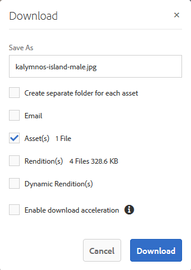
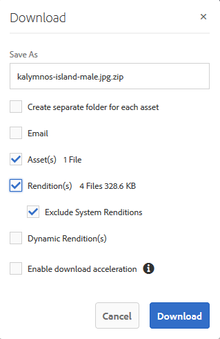

# Herunterladen von Assets {#download-assets}

Alle Benutzer können gleichzeitig mehrere Assets und Ordner von Brand Portal herunterladen, auf die sie zugreifen können. Auf diese Weise können genehmigte Marken-Assets sicher für die Offline-Nutzung verteilt werden. Hier erfahren Sie, wie Sie genehmigte Assets von Brand Portal herunterladen und welche [Download-Zeiten](../using/brand-portal-download-users.md#main-pars-header) dabei zu erwarten sind.

>[!NOTE]
>
>Nur Administratoren können abgelaufenen Assets herunterladen. Weitere Informationen zu abgelaufenen Assets finden Sie unter [Digital Rights Management für Assets](../using/manage-digital-rights-of-assets.md).

## Schritte zum Herunterladen von Assets     {#steps-to-download-assets}

Führen Sie die folgenden Schritte aus, um Assets oder Ordner mit Assets von Brand Portal herunterzuladen:

1. Führen Sie in der Brand Portal-Benutzeroberfläche einen der folgenden Schritte aus:

   * Wählen Sie die Ordner oder Assets aus, die Sie herunterladen möchten. Klicken Sie oben in der Symbolleiste auf das Symbol **[!UICONTROL Download]**.

   

   * Um einen bestimmten Ordner oder ein Asset herunterzuladen, führen Sie den Mauszeiger über den Ordner bzw. das Asset. Klicken Sie in den verfügbaren Schnellzugriff-Miniaturansichten auf das Symbol **[!UICONTROL Download]**.

   

   >[!NOTE]
   >
   >Wenn die Assets, die Sie herunterladen, auch lizenzierte Assets enthalten, werden Sie zur Seite **[!UICONTROL Copyright-Management]** weitergeleitet. Wählen Sie auf dieser Seite die Assets aus, klicken Sie auf **[!UICONTROL Zustimmen]** und klicken Sie dann auf **[!UICONTROL Herunterladen]**. Wenn Sie ablehnen, werden die lizenzierten Assets nicht heruntergeladen.\
   >An lizenzgeschützte Assets wird eine [Lizenzvereinbarung angehängt](https://helpx.adobe.com/de/experience-manager/6-5/assets/using/drm.html#DigitalRightsManagementinAssets). Dazu muss die [Metadateneigenschaft](https://helpx.adobe.com/de/experience-manager/6-5/assets/using/drm.html#DigitalRightsManagementinAssets) der Assets in AEM Assets entsprechend eingestellt werden.

   

   Das Dialogfeld **[!UICONTROL Download]** wird standardmäßig mit der ausgewählten Option **[!UICONTROL Asset(s)]** angezeigt.

   

   >[!NOTE]
   >
   >Wenn es sich bei den Assets, die Sie herunterladen, um Bilddateien handelt und Sie nur die Option **[!UICONTROL Asset(s)]** im Dialogfeld „Herunterladen“ wählen, aber [von einem Administrator nicht berechtigt wurden, auf die Original-Wiedergabeformate der Bilddateien zuzugreifen](../using/brand-portal-adding-users.md#main-pars-procedure-202029708), werden keine Bilddateien heruntergeladen. Dann erscheint der Hinweis, dass der Administrator Ihnen keine Berechtigung für den Zugriff auf Original-Wiedergabeformate erteilt hat.

   

1. Um die Wiedergaben der Assets zusätzlich zu den Assets herunterzuladen, wählen Sie **[!UICONTROL Wiedergabe(n)]** aus. Damit die automatisch generierten Wiedergaben zusammen mit den benutzerdefinierten Wiedergaben heruntergeladen werden, deaktivieren Sie die Option **[!UICONTROL Automatisch erzeugte Ausgaben ausschließen]**, die standardmäßig aktiviert ist.

   

   Um nur die Wiedergaben herunterzuladen, deaktivieren Sie die Option **[!UICONTROL Asset(s)]**.

   >[!NOTE]
   >
   >Standardmäßig werden nur die Assets heruntergeladen. Die Original-Ausgabeformate der Bilddateien werden jedoch nicht heruntergeladen, wenn Sie[ vom Administrator nicht die Berechtigung für den Zugriff auf die Original-Ausgabeformate der Bilddateien erhalten haben](../using/brand-portal-adding-users.md#main-pars-procedure-202029708).

   * Wählen Sie zum Beschleunigen des Downloads der Asset-Dateien von Brand Portal die Option **[!UICONTROL Downloadbeschleunigung aktivieren]** aus und [befolgen Sie die Anweisungen des Assistenten](../using/accelerated-download.md#main-pars-header-405749062). Weitere Informationen zur Beschleunigung von Asset-Downloads finden Sie in der [Anleitung zum Beschleunigen von Downloads von Brand Portal](../using/accelerated-download.md).

   * Um eine [benutzerdefinierte Bildvorgabe zum Asset und seinen Ausgabeformaten](../using/brand-portal-image-presets.md#applyimagepresetswhendownloadingimages) zuzuweisen, wählen Sie **[!UICONTROL Dynamische Ausgabe(n)]** aus. Legen Sie die benutzerdefinierten Eigenschaften für die Bildvorgabe fest (Größe, Format, Farbraum, Auflösung und Bild-Modifikator), um die benutzerdefinierte Bildvorgabe zuzuweisen, die beim Herunterladen des Assets und seiner Ausgabeformate verwendet wird. Um nur die dynamischen Ausgabeformate herunterzuladen,     deaktivieren Sie die Option **[!UICONTROL Asset(s)]**.

   

   >[!NOTE]
   >
   >Um dynamische Ausgabeformate eines Assets als Vorschau anzeigen (oder herunterladen) zu können, stellen Sie sicher, dass das dynamische Medium aktiviert ist und das PTIFF-Ausgabeformat in der AEM-Autoreninstanz, aus der die Assets veröffentlicht wurden, vorhanden ist. Wenn ein Asset in Brand Portal veröffentlicht wird, wird auch sein PTIFF-Ausgabeformat veröffentlicht. Es gibt keine Möglichkeit, das PTIFF-Ausgabeformat in Brand Portal zu generieren.

   * Damit die Brand Portal-Ordnerhierarchie beim Herunterladen von Assets erhalten bleibt, wählen Sie die Option **[!UICONTROL Separaten Ordner für jedes Asset erstellen]** aus. Die Brand Portal-Ordnerhierarchie wird standardmäßig ignoriert und alle Assets werden in einen Ordner auf Ihrem lokalen System heruntergeladen.

   * Um eine E-Mail-Benachrichtigung mit einem Link für den Asset-Download an Benutzer zu senden, wählen Sie **[!UICONTROL E-Mail]**.

   

   >[!NOTE]
   >
   >Der Downloadlink in der E-Mail-Benachrichtigung läuft nach 45 Tagen ab.
   >
   >Administratoren können mit der Funktion [Branding](../using/brand-portal-branding.md) das Logo, die Beschreibung und die Fußzeile der E-Mail-Nachrichten anpassen.

1. Klicken Sie auf **[!UICONTROL Herunterladen]**.

   Die Assets (und Ausgabeformate, sofern ausgewählt) werden als ZIP-Datei in Ihren lokalen Ordner heruntergeladen. Es wird jedoch keine ZIP-Datei erstellt, wenn ein einzelnes Asset ohne eines der Ausgabeformate heruntergeladen wird. Dies gewährleistet einen schnellen Download.

   Die Original-Ausgabeformate der ausgewählten Assets werden nicht heruntergeladen, wenn Sie [vom Administrator nicht die Berechtigung für den Zugriff auf die Original-Ausgabeformate erhalten haben](../using/brand-portal-adding-users.md#main-pars-procedure-202029708).

   >[!NOTE]
   >
   >Einzeln ausgewählte und heruntergeladene Assets sind im Bericht zu heruntergeladenen Assets sichtbar. Wenn jedoch ein Ordner mit Assets heruntergeladen wird, werden weder der Ordner noch die Assets im Bericht zu heruntergeladenen Assets angezeigt.

   Informationen zum Herunterladen von Assets über freigegebene Links finden Sie unter [Herunterladen von Assets über freigegebene Links](../using/brand-portal-link-share.md#main-pars-header-1703469193).

## Erwartete Download-Zeiten {#expected-download-performance}

Die Zeiten von Datei-Downloads variieren unter Umständen für Benutzer an verschiedenen Client-Standorten. Dies ist abhängig von Faktoren wie der lokalen Internetverbindung und der Serverlatenz. Die erwartete Download-Zeit für eine 2 GB große Datei an verschiedenen Client-Standorten ist wie folgt, wenn sich der     Brand Portal-Server in Oregon (USA) befindet:

| Client-Standort | Latenz zwischen Client und Server | Erwartete Download-Geschwindigkeit | Erforderliche Zeit für den Download einer 2 GB großen Datei |
|-------------------------|-----------------------------------|-------------------------|------------------------------------|
| USA, Westen (Nordkalifornien) | 18 ms | 7,68 MB/s | 4 Minuten |
| USA, Westen (Oregon) | 42 ms | 3,84 MB/s | 9 Minuten |
| USA, Osten (Nordvirginia) | 85 ms | 1,61 MB/s | 21 Minuten |
| Asien-Pazifik-Raum (Tokio) | 124 ms | 1,13 MB/s | 30 Minuten |
| Noida | 275 ms | 0,5 MB/s | 68 Minuten |
| Sydney | 175 ms | 0,49 MB/s | 69 Minuten |
| London | 179 ms | 0,32 MB/s | 106 Minuten |
| Singapur | 196 ms | 0,5 MB/s | 68 Minuten |

**Hinweis**: Die angegebenen Daten wurden unter Testbedingungen gemessen und können daher für Benutzer an verschiedenen Standorten mit unterschiedlicher Latenz und Bandbreite abweichen.
