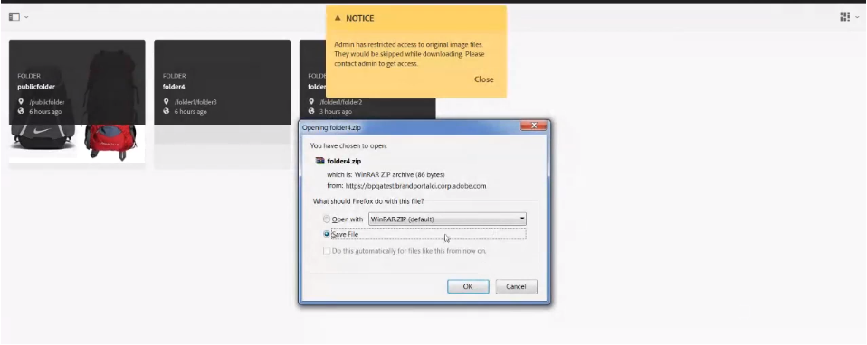

# Herunterladen von Assets {#download-assets}

<!-- Before update in Download experience - 26th Aug 2020 by Vishabh.
 All users can simultaneously download multiple assets and folders accessible to them from Brand Portal. This way, approved brand assets can be securely distributed for offline use. Read on to know how to download approved assets from Brand Portal, and what to expect from the [download performance](../using/brand-portal-download-users.md#main-pars-header).
-->

Adobe Experience Manager Assets Brand Portal verbessert das Downloaderlebnis, indem es den Benutzern ermöglicht, mehrere Assets und Ordner gleichzeitig herunterzuladen, auf die sie über das Markenportal zugreifen können. Auf diese Weise können genehmigte Marken-Assets sicher für die Offline-Nutzung verteilt werden. Hier erfahren Sie, wie Sie genehmigte Assets von Brand Portal herunterladen und welche [Download-Zeiten](../using/brand-portal-download-users.md#expected-download-performance) dabei zu erwarten sind.

>[!NOTE]
>
>Installieren Sie IBM Aspera Connect 3.9.9 in der Browsererweiterung, bevor Sie die Assets aus dem Markenportal herunterladen.

<!--
**Types of renditions in Brand Portal:**

* Original asset rendition

  It is the original binary of the asset uploaded in AEM Assets. 
  
  
* System renditions

  These are the thumbnail renditions which are automatically generated in AEM Assets based on the "DAM update asset" workflow. 
  
* Custom renditions

  These are the additional renditions that an asset might have and its dynamic renditions. Any user can create additional custom renditions, whereas, only the AEM administrator can create dynamic renditions of an image in AEM Assets. To know more, see [how to apply image presets or dynamic renditions](../using/brand-portal-image-presets.md).     
-->

## Asset-Download konfigurieren {#configure-download}

Die Downloadkonfiguration ermöglicht es den Markenportal-Administratoren, die Darstellungen zu definieren, die den Benutzern des Markenportals zum Herunterladen der Assets zur Verfügung stehen. Der Administrator kann die Einstellungen für den Asset- **[!UICONTROL Download]** über die Oberfläche des Markenportals konfigurieren.

Die folgenden Konfigurationen sind verfügbar:

* **[!UICONTROL Schneller Download]**

   Ermöglicht das Hochgeschwindigkeits-Herunterladen der Assets. Weitere Informationen finden Sie unter [Anleitung zur Beschleunigung von Downloads aus dem Markenportal](../using/accelerated-download.md).

* **[!UICONTROL Benutzerdefinierte Wiedergaben]**

   Laden Sie benutzerdefinierte und (oder) dynamische Darstellungen der Assets herunter.
Alle Asset-Darstellungen außer dem ursprünglichen Asset und den systemgenerierten Darstellungen werden als benutzerdefinierte Darstellungen aufgerufen. Es enthält sowohl statische als auch dynamische Darstellungen, die für das Asset verfügbar sind. Jeder Benutzer kann eine benutzerdefinierte statische Darstellung in AEM Assets erstellen, während nur der AEM-Administrator benutzerdefinierte dynamische Darstellungen erstellen kann. Weitere Informationen finden Sie unter [Anwenden von Bildvorgaben oder dynamischen Darstellungen](../using/brand-portal-image-presets.md)

* **[!UICONTROL Systemwiedergaben]**

   Laden Sie systemgenerierte Darstellungen der Assets herunter. Dies sind die Miniaturansichten, die in AEM Assets auf der Grundlage des Arbeitsablaufs &quot;DAM-Update-Asset&quot;automatisch generiert werden.

Melden Sie sich bei Ihrem Markenportal-Mandanten als Administrator an und navigieren Sie zu **[!UICONTROL Tools]** > **[!UICONTROL Herunterladen]**. Standardmäßig ist die **[!UICONTROL Konfiguration für das schnelle Herunterladen]** in den **[!UICONTROL Download-Einstellungen]** aktiviert.

Die Administratoren können jede beliebige Kombination aktivieren, um den Asset-Download-Prozess zu konfigurieren.

Auf der Grundlage der Konfiguration bleibt der Arbeitsablauf zum Herunterladen für eigenständige Assets, mehrere Assets, Ordner mit Assets, lizenzierte oder nicht lizenzierte Assets und das Herunterladen von Assets über den Link &quot;Freigeben&quot; konstant.

* Wenn die Konfigurationen für **[!UICONTROL benutzerdefinierte Darstellungen]** und **[!UICONTROL Systemwiedergaben]** deaktiviert sind, werden die ursprünglichen Darstellungen der Assets heruntergeladen, ohne dass den Benutzern ein zusätzliches Dialogfeld angezeigt wird.

<!--
If all the three download configurations are turned-off, or only the **[!UICONTROL Fast Download]** configuration is enabled, the original assets are directly downloaded on your local system with no additional step required. 
-->

* Wenn eine der Konfigurationen für **[!UICONTROL benutzerdefinierte Darstellungen]** oder **[!UICONTROL Systemwiedergaben]** aktiviert ist, wird ein zusätzliches Dialogfeld zum **[!UICONTROL Herunterladen]** angezeigt, in dem Sie auswählen können, ob das ursprüngliche Asset zusammen mit seinen Darstellungen heruntergeladen oder nur bestimmte Darstellungen heruntergeladen werden sollen.

>[!NOTE]
>
>Nur die Administratoren können die abgelaufenen Assets herunterladen. For more information about expired assets, see [manage digital rights of assets](../using/manage-digital-rights-of-assets.md).

## Schritte zum Herunterladen von Assets     {#steps-to-download-assets}

Im Folgenden werden die Schritte zum Herunterladen von Assets oder Ordnern mit Assets aus dem Markenportal beschrieben:

1. Führen Sie in der Brand Portal-Benutzeroberfläche einen der folgenden Schritte aus:

   * Wählen Sie die Ordner oder Assets aus, die Sie herunterladen möchten. Klicken Sie oben in der Symbolleiste auf das Symbol **[!UICONTROL Download]**.

      

   * Um ein bestimmtes Asset oder einen bestimmten Ordner herunterzuladen, halten Sie den Mauszeiger über das Asset oder den Ordner und klicken Sie auf das Symbol &quot; **[!UICONTROL Herunterladen]** &quot;in den Miniaturbildern der Schnellaktion.

      

      >[!NOTE]
      >
      >Wenn Sie die Assets zum ersten Mal herunterladen und IBM Aspera Connect nicht in Ihrem Browser installiert haben, werden Sie aufgefordert, den Aspera Download Accelerator zu installieren.

      >[!NOTE]
      >
      >Wenn die Assets, die Sie herunterladen, auch lizenzierte Assets enthalten, werden Sie zur Seite **[!UICONTROL Copyright-Management]** weitergeleitet. Wählen Sie auf dieser Seite die Assets aus, klicken Sie auf **[!UICONTROL Zustimmen]** und klicken Sie dann auf **[!UICONTROL Herunterladen]**. Wenn Sie ablehnen, werden die lizenzierten Assets nicht heruntergeladen.
      > 
      >License-protected assets have [license agreement attached](https://helpx.adobe.com/de/experience-manager/6-5/assets/using/drm.html#DigitalRightsManagementinAssets) to them, which is done by setting asset&#39;s [metadata property](https://helpx.adobe.com/de/experience-manager/6-5/assets/using/drm.html#DigitalRightsManagementinAssets) in Experience Manager Assets.

      

      Wenn eine der Konfigurationen für **[!UICONTROL benutzerdefinierte Darstellungen]** oder **[!UICONTROL Systemwiedergaben]** in den **[!UICONTROL Downloadeinstellungen]** aktiviert ist, wird das Dialogfeld &quot; **[!UICONTROL Herunterladen]** &quot;angezeigt, wobei das Kontrollkästchen **[!UICONTROL Assets]** standardmäßig aktiviert ist. Wenn die **[!UICONTROL Konfiguration für schnellen Download]** aktiviert ist, ist das Kontrollkästchen **[!UICONTROL Download-Beschleunigung]** aktivieren standardmäßig aktiviert.

      

      >[!NOTE]
      >
      >If the downloading assets are image files, and you select only the **[!UICONTROL Asset(s)]** check box in the **[!UICONTROL Download]** dialog but are not [authorized by the administrator to have access to the original renditions of image files](../using/brand-portal-adding-users.md#main-pars-procedure-202029708) then no image files are downloaded and a notification appears, stating that you have been restricted by the administrator to access original renditions.

      

1. Um die Darstellungen zusätzlich zu den ursprünglichen Assets herunterzuladen, aktivieren Sie das Kontrollkästchen **[!UICONTROL Darstellung(en)]** . Wenn Sie jedoch die systemgenerierten Darstellungen zusammen mit den benutzerdefinierten Darstellungen herunterladen möchten, deaktivieren Sie das Kontrollkästchen Systemdarstellungen **[!UICONTROL ausschließen]** .

   

   * Wenn Sie nur die Darstellungen herunterladen möchten, deaktivieren Sie das Kontrollkästchen &quot; **[!UICONTROL Asset(s)]** &quot;.

      >[!NOTE]
      >
      >Standardmäßig werden nur die Assets heruntergeladen. Die Original-Ausgabeformate der Bilddateien werden jedoch nicht heruntergeladen, wenn Sie[ vom Administrator nicht die Berechtigung für den Zugriff auf die Original-Ausgabeformate der Bilddateien erhalten haben](../using/brand-portal-adding-users.md#main-pars-procedure-202029708).

   * Um die ausgewählten Assets über einen Link für andere Benutzer freizugeben, aktivieren Sie das Kontrollkästchen &quot; **[!UICONTROL E-Mail]** &quot;. Den Benutzern mit dem Link zum Herunterladen wird eine E-Mail-Benachrichtigung gesendet. To know how to download assets from shared links, see [downloading assets from shared links](../using/brand-portal-link-share.md#main-pars-header-1703469193).

      

      >[!NOTE]
      >
      >Der Link zum Herunterladen in der E-Mail-Benachrichtigung läuft nach 45 Tagen ab.
      >
      >The administrators can customize email messages, that is, logo, description, and footer, using the [Branding](../using/brand-portal-branding.md) feature.

   * Sie können eine vordefinierte Bildvorgabe auswählen oder eine benutzerdefinierte dynamische Darstellung im Dialogfeld &quot; **[!UICONTROL Herunterladen]** &quot;erstellen.

      To apply a [custom image preset to the asset and its renditions](../using/brand-portal-image-presets.md#applyimagepresetswhendownloadingimages), select the **[!UICONTROL Dynamic Rendition(s)]** check box. Geben Sie die Eigenschaften der Bildvorgabe an (z. B. Größe, Format, Farbraum, Auflösung und Bildmodifikator), um die benutzerdefinierte Bildvorgabe beim Herunterladen des Assets und seiner Darstellungen anzuwenden. Wenn Sie nur die dynamischen Darstellungen herunterladen möchten, deaktivieren Sie das Kontrollkästchen &quot; **[!UICONTROL Asset(s)]** &quot;.

      

      >[!NOTE]
      >
      >Markenportal unterstützt die Konfiguration von dynamischen Medien sowohl im Hybird- als auch im Scene7-Modus.
      >
      >(*If AEM (Author) instance is running on **Dynamic Media Hybrid mode***)      >Um dynamische Darstellungen eines Assets Vorschau oder herunterzuladen, stellen Sie sicher, dass das dynamische Medium aktiviert ist und die Pyramid-TIFF-Darstellung des Assets in der AEM Assets-Autoreninstanz vorhanden ist, von der aus die Assets veröffentlicht wurden. Wenn ein Asset in Brand Portal veröffentlicht wird, wird auch sein PTIFF-Ausgabeformat veröffentlicht.

   * To preserve the Brand Portal folder hierarchy while downloading assets, select the **[!UICONTROL Create separate folder for each asset]** check box. Standardmäßig wird die Ordnerhierarchie des Markenportals ignoriert und alle Assets werden in einem Ordner in Ihrem lokalen System heruntergeladen.

1. Klicken Sie auf **[!UICONTROL Herunterladen]**.

   Die Assets (und die Ausgabeformate, sofern ausgewählt) werden als ZIP-Datei in Ihren lokalen Ordner heruntergeladen. Es wird jedoch keine ZIP-Datei erstellt, wenn ein einzelnes Asset ohne eine der Darstellungen heruntergeladen wird.

   Wenn Sie nicht vom Administrator [autorisiert wurden, Zugriff auf die ursprünglichen Darstellungen](../using/brand-portal-adding-users.md#main-pars-procedure-202029708)zu haben, werden die ursprünglichen Darstellungen der ausgewählten Assets nicht heruntergeladen.

   >[!NOTE]
   >
   >Assets, die einzeln heruntergeladen werden, sind im Bericht zum Herunterladen von Assets sichtbar. Wenn jedoch ein Ordner mit Assets heruntergeladen wird, werden der Ordner und die Assets nicht im Bericht zum Herunterladen der Assets angezeigt.

## Erwartete Download-Zeiten {#expected-download-performance}

Die Zeiten von Datei-Downloads variieren unter Umständen für Benutzer an verschiedenen Client-Standorten. Dies ist abhängig von Faktoren wie der lokalen Internetverbindung und der Serverlatenz. Die erwartete Downloadleistung für 2-GB-Dateien an verschiedenen Clientstandorten lautet wie folgt: Der Brand Portal-Server bei Oregon in den USA:

| Client-Standort | Latenz zwischen Client und Server | Erwartete Download-Geschwindigkeit | Dauer zum Herunterladen einer 2-GB-Datei |
|-------------------------|-----------------------------------|-------------------------|------------------------------------|
| USA, Westen (Nordkalifornien) | 18 ms | 7,68 MB/s | 4 Minuten |
| USA, Westen (Oregon) | 42 ms | 3,84 MB/s | 9 Minuten |
| USA, Osten (Nordvirginia) | 85 ms | 1,61 MB/s | 21 Minuten |
| Asien-Pazifik-Raum (Tokio) | 124 ms | 1,13 MB/s | 30 Minuten |
| Noida | 275 ms | 0,5 MB/s | 68 Minuten |
| Sydney | 175 ms | 0,49 MB/s | 69 Minuten |
| London | 179 ms | 0,32 MB/s | 106 Minuten |
| Singapur | 196 ms | 0,5 MB/s | 68 Minuten |

>[!NOTE]
>
>zitierte Daten werden unter Testbedingungen beobachtet, die für Benutzer an unterschiedlichen Orten mit unterschiedlicher Latenz und Bandbreite variieren können.

