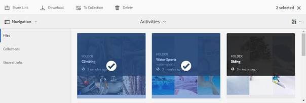
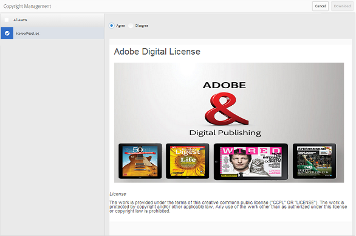

# Herunterladen von Assets {#download-assets}

Alle Benutzer können gleichzeitig mehrere Assets und Ordner von Brand Portal herunterladen, auf die sie zugreifen können. Auf diese Weise können bestätigte Marken-Assets sicher für die Offline-Nutzung verteilt werden. Lesen Sie weiter, um zu erfahren, wie Sie genehmigte Assets von Brand Portal herunterladen und welche [Download-Zeiten](../using/brand-portal-download-users.md#main-pars-header) Sie erwarten können.

>[!NOTE]
>
>Nur Administratoren können abgelaufenen Assets herunterladen. Weitere Informationen zu abgelaufenen Assets finden Sie unter [Digital Rights Management für Assets](../using/manage-digital-rights-of-assets.md).

## Schritte zum Herunterladen von Assets {#steps-to-download-assets}

Führen Sie die folgenden Schritte aus, um Assets oder Ordner mit Assets von Brand Portal herunterzuladen:

1. Führen Sie auf der Marken-Portal-Oberfläche einen der folgenden Schritte aus:

   * Wählen Sie die Ordner oder Assets aus, die Sie herunterladen möchten. From the toolbar at the top, click the **[!UICONTROL Download]** icon.
   

   * Um einen bestimmten Ordner oder ein Asset herunterzuladen, führen Sie den Mauszeiger über den Ordner bzw. das Asset. From the quick action thumbnails available, click the **[!UICONTROL Download]** icon.
   

   >[!NOTE]
   >
   >Wenn die Assets, die Sie herunterladen, auch lizenzierte Assets enthalten, werden Sie zur Seite **[!UICONTROL Copyright-Management]weitergeleitet.** Wählen Sie auf dieser Seite die Assets aus, klicken Sie auf **[!UICONTROL Zustimmen]** und klicken Sie dann auf **[!UICONTROL Herunterladen]**. Wenn Sie ablehnen, werden die lizenzierten Assets nicht heruntergeladen.\
   >License-protected assets have [license agreement attached](https://helpx.adobe.com/experience-manager/6-5/assets/using/drm.html#DigitalRightsManagementinAssets) to them, which is done by setting asset's [metadata property](https://helpx.adobe.com/experience-manager/6-5/assets/using/drm.html#DigitalRightsManagementinAssets) in AEM Assets.

   

   The **[!UICONTROL Download]** dialog box appears with the **[!UICONTROL Asset(s)]** option selected by default.

   

   >[!NOTE]
   >
   >If the assets you are downloading are image files, and you select only the **[!UICONTROL Asset(s)]** option in Download dialog but are not [authorized by the administrator to have access to the original renditions of image files](../using/brand-portal-adding-users.md#main-pars-procedure-202029708) then no image files are downloaded and a Notice prompts, stating that you have been restricted by administrator to access original renditions.

   

2. To download the renditions of assets in addition to the assets, select **[!UICONTROL Rendition(s)]**. However, to allow auto-generated renditions to download along with custom renditions, deselect **[!UICONTROL Exclude Auto Generated Renditions]**, which is selected by default.

   

   To download only the renditions, deselect **[!UICONTROL Asset(s)]**.

   >[!NOTE]
   >
   >Standardmäßig werden nur die Assets heruntergeladen. However, original renditions of image files are not downloaded if you are not [authorized by the administrator to have access to the original renditions of image files](../using/brand-portal-adding-users.md#main-pars-procedure-202029708).

   * Wählen Sie zum Beschleunigen des Downloads der Asset-Dateien von Brand Portal die Option **[!UICONTROL Downloadbeschleunigung aktivieren]** aus und [befolgen Sie die Anweisungen des Assistenten](../using/accelerated-download.md#main-pars-header-405749062). To know more about faster download of assets refer [guide to accelerate downloads from Brand Portal](../using/accelerated-download.md).

   * To apply a [custom image preset to the asset and its renditions](../using/brand-portal-image-presets.md#applyimagepresetswhendownloadingimages), select **[!UICONTROL Dynamic Rendition(s)]**. Legen Sie die benutzerdefinierten Eigenschaften für die Bildvorgabe fest (Größe, Format, Farbraum, Auflösung und Bild-Modifikator), um die benutzerdefinierte Bildvorgabe zuzuweisen, die beim Herunterladen des Assets und seiner Ausgabeformate verwendet wird. Um nur die dynamischen Ausgabeformate herunterzuladen, **[!UICONTROL Asset (s)]** löschen.
   

   >[!NOTE]
   >
   >Um dynamische Darstellungen eines Assets in der Vorschau anzuzeigen (oder herunterzuladen), stellen Sie sicher, dass die dynamischen Medien aktiviert sind und die Pyramid TIFF-Darstellung des Assets auf der AEM-Autoreninstanz vorhanden ist, von wo die Assets veröffentlicht wurden. Wenn ein Asset in Brand Portal veröffentlicht wird, wird seine Pyramid TIFF-Darstellung ebenfalls veröffentlicht. Es gibt keine Möglichkeit, die Pyramid TIFF-Darstellung aus dem Brand Portal zu generieren.

   * To preserve the Brand Portal folder hierarchy while downloading assets, select **[!UICONTROL Create separate folder for each asset]**. Die Brand Portal-Ordnerhierarchie wird standardmäßig ignoriert und alle Assets werden in einen Ordner auf Ihrem lokalen System heruntergeladen.

   * To send an email notification to users with a link for downloading the assets, select **[!UICONTROL Email]**.
   

   >[!NOTE]
   >
   >Der Downloadlink in der E-Mail-Benachrichtigung läuft nach 45 Tagen ab.
   >
   >Administrators can customize email messages, that is, logo, description, and footer, using the [Branding](../using/brand-portal-branding.md) feature.

3. Klicken Sie auf **[!UICONTROL Herunterladen]**.

   Die Assets (und Ausgabeformate, sofern ausgewählt) werden als ZIP-Datei in Ihren lokalen Ordner heruntergeladen. Es wird jedoch keine ZIP-Datei erstellt, wenn ein einzelnes Asset ohne eines der Ausgabeformate heruntergeladen wird. Dies gewährleistet einen schnellen Download.

   Die Original-Ausgabeformate der ausgewählten Assets werden nicht heruntergeladen, wenn Sie [vom Administrator nicht die Berechtigung für den Zugriff auf die Original-Ausgabeformate erhalten haben](../using/brand-portal-adding-users.md#main-pars-procedure-202029708).

   >[!NOTE]
   >
   >Einzeln ausgewählte und heruntergeladene Assets sind im Bericht zu heruntergeladenen Assets sichtbar. Wenn jedoch ein Ordner, der Assets enthält, heruntergeladen wird, werden weder der Ordner noch die Assets im heruntergeladenen Bericht angezeigt.

   To know how to download assets from shared links, refer [downloading assets from shared links](../using/brand-portal-link-share.md#main-pars-header-1703469193).

## Erwartete Download-Zeiten {#expected-download-performance}

Das Dateidownloaderlebnis kann je nach Faktoren, wie z. B. lokale Internetverbindung und Serverlatenz, für Benutzer unterschiedlicher Kundenstandorte unterschiedlich sein. Die erwartete Download-Zeit für eine 2 GB große Datei an verschiedenen Client-Standorten ist wie folgt, wenn sich der  Brand Portal-Server in Oregon (USA) befindet:

| Client-Standort | Latenzzeit zwischen Client und Server | Erwartete Download-Geschwindigkeit | Zeit zum Herunterladen einer 2 GB-Datei |
|-------------------------|-----------------------------------|-------------------------|------------------------------------|
| USA, Westen (Nordkalifornien) | 18 ms | 7,68 MB/s | 4 Minuten |
| USA, Westen (Oregon) | 42 ms | 3,84 MB/s | 9 Minuten |
| USA, Osten (Nordvirginia) | 85 ms | 1,61 MB/s | 21 Minuten |
| APAC (Tokio) | 124 ms | 1,13 MB/s | 30 Minuten |
| Noida | 275 ms | 0,5 MB/s | 68 Minuten |
| Sydney | 175 ms | 0,49 MB/s | 69 Minuten |
| London | 179 ms | 0,32 MB/s | 106 Minuten |
| Singapur | 196 ms | 0,5 MB/s | 68 Minuten |

**Hinweis**: Die genannten Daten werden unter Testbedingungen betrachtet, was für Benutzer an unterschiedlichen Orten unterschiedlich sein kann, wenn unterschiedliche Latenz und Bandbreite erkannt werden.
