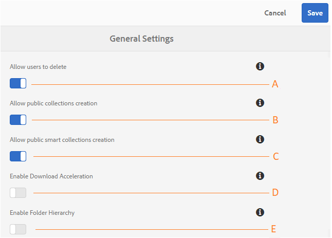

# Verwalten allgemeiner Mandantenkonfigurationen {#administer-general-tenant-configurations}

In AEM Assets Brand Portal können Unternehmen die folgenden Funktionen für bestimmte Mandanten konfigurieren:

* das Löschen von Assets durch Administratoren
* die Erstellung öffentlicher Sammlungen von Benutzern ohne Administratorrechte
* die Erstellung öffentlicher Smart-Sammlungen von Benutzern ohne Administratorrechte
* die Downloadbeschleunigung
* Sichtbarkeit der übergeordneten Hierarchie von freigegebenen Ordnern für Benutzer ohne Administratorrechte

Diese Konfigurationen sind über die Konfigurationen **[!UICONTROL Allgemeine Einstellungen]im Admin Tools-Bereich möglich.**

**Eine** Konfiguration, mit der Administratoren Assets aus dem Markenportal löschen können. (Die Option ist standardmäßig aktiviert.)

**B** -Konfiguration, damit Benutzer, die keine Administratoren sind, öffentliche Sammlungen erstellen können. (Die Option ist standardmäßig aktiviert.)

**C** Konfiguration, die es Benutzern ohne Adminstratorrechte gestattet, öffentliche Smart-Sammlungen zu erstellen. (Die Option ist standardmäßig aktiviert.)

**D**   Konfiguration, die die Downloadbeschleunigung für Assets aktiviert, die vom Portal und über freigegebene Links heruntergeladen werden. (Die Option ist standardmäßig deaktiviert.)

**E** Konfiguration, die Benutzern ohne Administratorrechte (Bearbeitern, Betrachtern und Gastbenutzern) gestattet, die Ordnerhierarchie (vom Stamm) der freigegebenen Ordner anzuzeigen. (Die Option ist standardmäßig deaktiviert.)

## Aktivieren/Deaktivieren der allgemeinen Konfigurationen {#enable-disable-general-configurations}

So aktivieren/deaktivieren Sie jede dieser Konfigurationen:

1. Melden Sie sich mit Administratorrechten an.
1. Wählen Sie in der Symbolleiste am oberen Rand das AEM-Logo aus, um die Admin Tools aufzurufen.
1. Wählen Sie im Admin Tools-Bereich die Option **[!UICONTROL Allgemein]** aus, um die Seite **Allgemeine Einstellungen]zu öffnen.[!UICONTROL **
1. Verwenden Sie den entsprechenden Umschalter, um allgemeine Konfigurationen zu aktivieren/deaktivieren.
1. **[!UICONTROL Speichern]** Sie die Änderungen.
1. Melden Sie sich ab, um die Änderungen zu übernehmen.

## Löschen von Assets in Brand Portal durch Administratoren zulassen {#allow-admin-users-to-delete-assets-from-brand-portal}

**[!UICONTROL Wenn Benutzer die Konfiguration löschen]** können, können Organisationen Benutzern mit Administratorrechten das Löschen von Assets und Ordnern aus dem Markenportal gestatten (oder beschränken).

## Zulassen der Erstellung öffentlicher Sammlungen durch Benutzer ohne Administratorrechte {#allow-public-collections-creation-by-non-admins}

[[!UICONTROL Erstellung öffentlicher Sammlungen zulassen]](../using/brand-portal-share-collection.md#main-pars-text-1915052376) Die Konfiguration steuert, ob Nicht-Administratoren öffentliche Sammlungen im Markenportal erstellen können. Die Konfiguration ist standardmäßig aktiviert. Unternehmen können die Konfiguration deaktivieren, um zu verhindern, dass sich in ihrem Portal zahlreiche öffentliche Sammlungen befinden. Auf diese Weise wird Systemspeicherplatz eingespart.

## Zulassen der Erstellung öffentlicher Smart-Sammlungen durch Benutzer ohne Administratorrechte {#allow-public-smart-collections-creation-by-non-admins}

[[!UICONTROL Erstellung öffentlicher intelligenter Sammlungen zulassen]](../using/brand-portal-searching.md#main-pars-header-500620467) Die Konfiguration steuert, ob Nicht-Administratoren ihre Suchen als intelligente Sammlungen speichern und für diesen Mieter veröffentlichen können. Die Konfiguration ist standardmäßig aktiviert. Unternehmen können die Konfiguration deaktivieren, um zu verhindern, dass Benutzer ohne Administratorrechte eine große Anzahl öffentlicher Smart-Sammlungen im Portal der Organisation erstellen.

## Downloadbeschleunigung aktivieren {#allow-download-acceleration}

[[!UICONTROL Download-Beschleunigung zulassen]](../using/accelerated-download.md) Mithilfe der Konfiguration können Unternehmen beschleunigte Downloads von Assets aus dem Brand Portal und freigegebenen Links ermöglichen, indem sie mit IBM Aspera Connect, einer Anwendung, die bei Bedarf installiert wird, integriert werden. Die Anwendung nutzt proprietäre Technologie, um TCP-Overheads zu verhindern.

## Ordnerhierarchie aktivieren {#enable-folder-hierarchy}

[[!UICONTROL-Ordnerhierarchie aktivieren]](../using/brand-portal-sharing-folders.md#non-admin-user-access-to-shared-folders) Mithilfe der Konfiguration können Administratoren steuern, wie Benutzer ohne Administratorrechte (Editoren, Viewer und Gastbenutzer) die freigegebenen Ordner nach der Anmeldung sehen.
