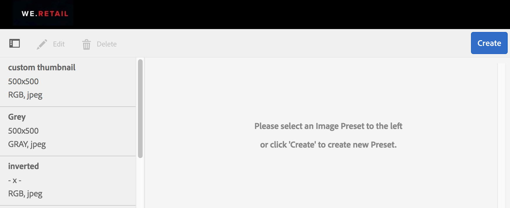
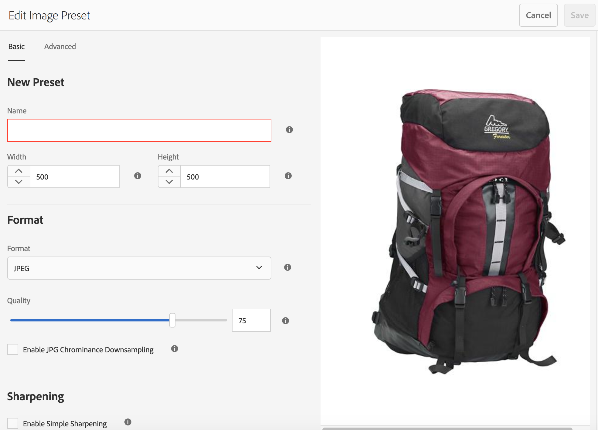
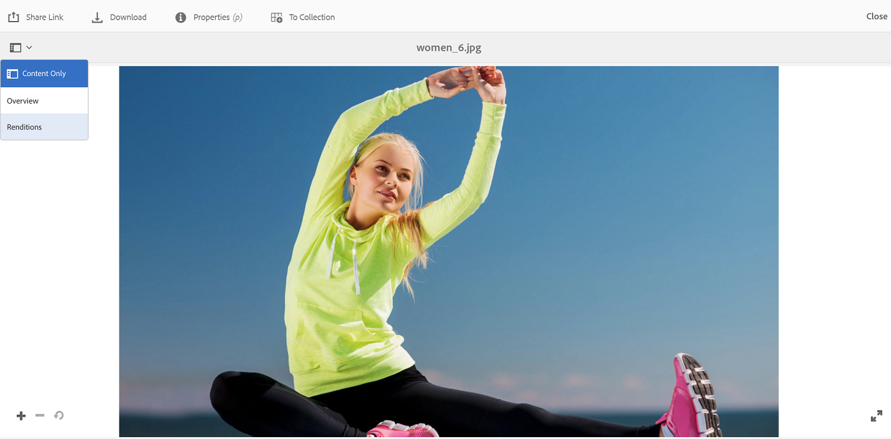
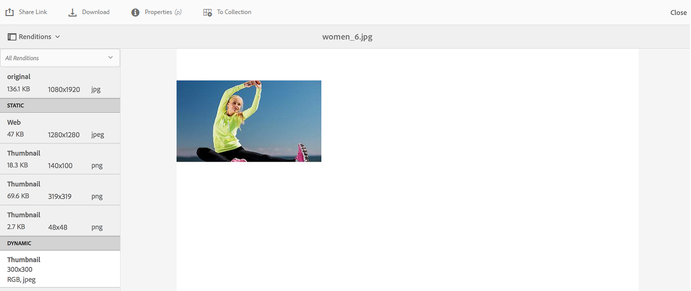
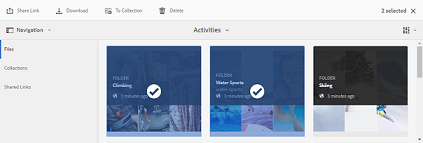
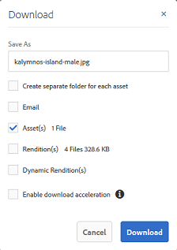
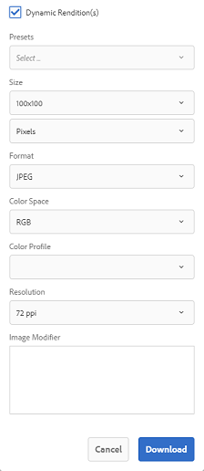

# Anwenden von Bildvorgaben oder dynamischen Wiedergaben{#apply-image-presets-or-dynamic-renditions}

Wie ein Makro ist eine Bildvorgabe eine vordefinierte Sammlung aus Größenangaben und Formatierungsbefehlen, die unter einem Namen gespeichert wird. Mithilfe von Bildvorgaben kann AEM Assets Brand Portal Bilder in unterschiedlichen Größen, Formaten und Eigenschaften dynamisch liefern.

Bildvorgaben werden verwendet, um dynamische Ausgabeformate von Bildern zu generieren, die als Vorschau angezeigt oder heruntergeladen werden können. Wenn Sie eine Vorschau von Bildern und deren Ausgabeformaten anzeigen, können Sie eine Vorgabe auswählen, um Bilder gemäß den Spezifikationen Ihres Administrators umzuformatieren.

To view dynamic renditions of an asset in Brand Portal, ensure that its Pyramid tiff rendition exists at the AEM author instance from where you publish to Brand Portal. Wenn Sie das Asset veröffentlichen, wird auch dessen PTIFF-Ausgabeformat in Brand Portal veröffentlicht. Es gibt keine Möglichkeit, das PTIFF-Ausgabeformat in Brand Portal zu generieren.

>[!NOTE]
>
>Beim Herunterladen von Bildern und deren Ausgabeformaten gibt es keine Möglichkeit, aus den vorhandenen Vorgaben auszuwählen. Stattdessen können Sie die Eigenschaften für eine benutzerdefinierte Bildvorgabe festlegen. Weitere Informationen finden Sie unter [Anwenden von Bildvorgaben beim Herunterladen von Bildern](../using/brand-portal-image-presets.md#main-pars-text-1403412644).

Weitere Informationen zu den Parametern, die für das Erstellen von Bildvorgaben erforderlich sind, finden Sie unter [Verwalten von Bildvorgaben](https://docs.adobe.com/docs/en/AEM/6-0/administer/integration/dynamic-media/image-presets.html).

## Erstellen von Bildvorgaben {#create-an-image-preset}

Administratoren können Bildvorgaben erstellen, die auf der Asset-Detailseite als dynamische Ausgabeformate angezeigt werden. Sie können völlig neue Bildvorgaben erstellen oder eine vorhandene Vorgabe unter einem neuen Namen speichern. Wenn Sie Bildvorgaben erstellen, wählen Sie eine Größe für die Bildbereitstellung und die Formatierungsbefehle aus. Wenn ein Bild für die Anzeige bereitgestellt wird, wird die Darstellung entsprechend den ausgewählten Befehlen optimiert.
Nur Administratoren können Bildvorgaben in Brand Portal erstellen.

Nur Administratoren können Bildvorgaben in Brand Portal erstellen.

>[!NOTE]
>
>Dynamische Wiedergaben werden für Assets erstellt, für die PTIFF verfügbar ist. Wenn also für ein Asset kein Pyramid TIFF-Ausgabeformat in AEM erstellt und in Brand Portal veröffentlicht wird, können nur die zugehörigen Systemausgaben exportiert werden. Dynamische Ausgabeformate werden aber als Option angezeigt.
Der Dynamic Media Hybrid-Modus muss in AEM (Autoreninstanz) aktiviert sein, damit das Pyramid TiFF (PTIFF)-Format eines Assets erstellt werden kann. Wenn ein solches Asset im Markenportal veröffentlicht wird, werden Bildvorgaben angewendet und dynamische Darstellungen angezeigt.

1. Klicken Sie oben in der AEM-Symbolleiste auf das Adobe-Logo, um auf die Administrator-Tools zuzugreifen.

2. Klicken Sie im Admin Tools-Bereich auf **[!UICONTROL Bildvorgaben]**.

   

3. Klicken Sie auf der Seite „Bildvorgaben“ auf **[!UICONTROL Erstellen]**.

   

4. Geben Sie auf der Seite **[!UICONTROL Bildvorgabe bearbeiten]** auf den Registerkarten **[!UICONTROL Allgemein]und** Erweitert] die entsprechenden Werte (einschließlich eines Namens) ein. **[!UICONTROL ** Die Optionen werden in den Optionen für die [Bildvorgabe](https://docs.adobe.com/docs/en/AEM/6-0/administer/integration/dynamic-media/image-presets.html#Image%20preset%20options) hervorgehoben. Vorgaben werden im linken Bereich angezeigt und können nur zusammen mit anderen Assets verwendet werden.

   

   >[!NOTE]
   >
   >Auf der Seite **[!UICONTROL Bildvorgabe bearbeiten]können Sie auch Eigenschaften einer vorhandenen Bildvorgabe bearbeiten.** Um eine Bildvorgabe zu bearbeiten, wählen Sie sie auf der Seite „Bildvorgaben“ aus und klicken Sie auf **[!UICONTROL Bearbeiten]**.

5. Klicken Sie auf **[!UICONTROL Speichern]**. Die Bildvorgabe wird erstellt und auf der Seite „Bildvorgaben“ angezeigt.
6. Um eine Bildvorgabe zu löschen, wählen Sie sie auf der Seite „Bildvorgaben“ aus und klicken Sie auf **[!UICONTROL Löschen]**. Klicken Sie auf der Bestätigungsseite auf **[!UICONTROL Löschen], um den Vorgang zu bestätigen.** Die Bildvorgabe wird von der Seite „Bildvorgaben“ entfernt.

## Anwenden von Bildvorgaben beim Anzeigen der Bildvorschau  {#apply-image-presets-when-previewing-images}

Wenn Sie eine Vorschau von Bildern und deren Wiedergaben anzeigen, können Sie eine vorhandene Vorgabe auswählen, um Bilder gemäß den Spezifikationen Ihres Administrators umzuformatieren.

1. Klicken Sie in der Benutzeroberfläche des Markenportals auf ein Bild, um es zu öffnen.
2. Klicken Sie links auf das Überlagerungssymbol und wählen Sie dann **[!UICONTROL Wiedergaben]**.

   

3. From the **[!UICONTROL Renditions]** list, select the appropriate dynamic rendition, for example, **[!UICONTROL Thumbnail]**. Das Vorschaubild wird basierend auf Ihrer Auswahl des Ausgabeformats dargestellt.

   

## Anwenden von Bildvorgaben beim Herunterladen von Bildern {#apply-image-presets-when-downloading-images}

Beim Herunterladen von Bildern und deren Darstellungen aus dem Markenportal können Sie nicht zwischen den vorhandenen Bildvorgaben wählen. Sie können jedoch die Bildvorgabeneigenschaften anpassen, damit Sie die gewünschten Bilder neu formatieren können.

1. Führen Sie in der Benutzeroberfläche des Markenportals einen der folgenden Schritte aus:

   * Bewegen Sie den Mauszeiger über das Bild, das Sie herunterladen möchten. Klicken Sie in den verfügbaren Schnellzugriff-Miniaturansichten auf das Symbol **[!UICONTROL Download].**
   

   * Wählen Sie das Bild aus, das Sie herunterladen möchten. Klicken Sie oben in der Symbolleiste auf das Symbol **[!UICONTROL Download].**
   

2. Wählen Sie im Dialogfeld **[!UICONTROL Herunterladen]die erforderlichen Optionen aus, je nachdem, ob Sie das Asset mit oder ohne dessen Wiedergaben herunterladen möchten.**

   

3. Um dynamische Wiedergaben der Assets herunterzuladen, wählen Sie die Option **[!UICONTROL Dynamische Ausgabe(n)]aus.**
4. Sie können jedoch auch die Bildvorgabeneigenschaften anpassen, damit Sie die gewünschten Bilder und deren Ausgabeformate beim Herunterladen dynamisch neu formatieren können. Geben Sie hierfür Größe, Format, Farbraum, Auflösung und Bild-Modifikator an.

   

5. Klicken Sie auf **[!UICONTROL Herunterladen]**. Die dynamischen Wiedergaben werden in einer ZIP-Datei zusammen mit dem Bild sowie dessen Wiedergaben, die Sie herunterladen möchten, heruntergeladen. Wenn nur ein Asset heruntergeladen wird, wird jedoch keine Zip-Datei erstellt, um den Download zu beschleunigen.
