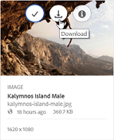

# Anwenden von Bildvorgaben oder dynamischen Ausgabeformaten {#apply-image-presets-or-dynamic-renditions}

Like a macro, an image preset is a predefined [!UICONTROL collection] of sizing and formatting commands saved under a name. Image presets enable [!DNL AEM] Assets [!DNL Brand Portal] to dynamically deliver images of different sizes, formats, and properties.

Bildvorgaben werden verwendet, um dynamische Ausgabeformate von Bildern zu generieren, die als Vorschau angezeigt oder heruntergeladen werden können. Wenn Sie eine Vorschau von Bildern und deren Ausgabeformaten anzeigen, können Sie eine Vorgabe auswählen, um Bilder gemäß den Spezifikationen Ihres Administrators umzuformatieren.

To view dynamic renditions of an asset in [!DNL Brand Portal], ensure that its PTIFF rendition exists at the [!DNL AEM] author instance from where you publish to [!DNL Brand Portal]. When you publish the asset, its PTIFF rendition is also published to [!DNL Brand Portal]. There is no way of generating the PTIFF rendition from [!DNL Brand Portal].

>[!NOTE]
>
>Beim Herunterladen von Bildern und deren Ausgabeformaten gibt es keine Möglichkeit, aus den vorhandenen Vorgaben auszuwählen. Stattdessen können Sie die Eigenschaften für eine benutzerdefinierte Bildvorgabe festlegen. Weitere Informationen finden Sie unter [Anwenden von Bildvorgaben beim Herunterladen von Bildern](../using/brand-portal-image-presets.md#main-pars-text-1403412644).

Weitere Informationen zu den Parametern, die beim Erstellen von Bildvorgaben erforderlich sind, finden Sie unter [Verwalten von Bildvorgaben](https://docs.adobe.com/docs/en//6-0/administer/integration/dynamic-media/image-presets.html)[!DNL AEM].

## Erstellen von Bildvorgaben {#create-an-image-preset}

Administratoren können Bildvorgaben erstellen, die auf der Asset-Detailseite als dynamische Ausgabeformate angezeigt werden. Sie können völlig neue Bildvorgaben erstellen oder eine vorhandene Vorgabe unter einem neuen Namen speichern. Wenn Sie Bildvorgaben erstellen, wählen Sie eine Größe für die Bildbereitstellung und die Formatierungsbefehle aus. Wenn ein Bild für die Anzeige bereitgestellt wird, wird die Darstellung entsprechend den ausgewählten Befehlen optimiert.
Note that only Administrators can create image presets in [!DNL Brand Portal].

Note that only Administrators can create image presets in [!DNL Brand Portal].

>[!NOTE]
>
>Dynamische Ausgabeformate werden für Assets erstellt, für die PTIFF verfügbar ist. So If an asset does not have Pyramid TIFF rendition created on [!DNL AEM] and published to [!DNL Brand Portal], then only its system renditions can be exported, but dynamic renditions are presented as an option.
Dynamic Media Hybrid mode must be enabled on [!DNL AEM] (author) in order to create pyramid tiff (ptiff) of an asset. When such an asset is published to [!DNL Brand Portal], image presets are applied and dynamic renditions are displayed.

1. From the [!DNL AEM] toolbar at the top, click the Adobe logo to access administrative tools.

   !

2. From the administrative tools panel, click **Image Presets**.

   

3. Klicken Sie auf der Seite „Bildvorgaben“ auf **Erstellen**.

   

4. In the **Edit Image Preset** page, enter values into the **Basic** and **Advanced** tabs as appropriate, including a name. Die Optionen werden unter [Bildvorgabeoptionen](https://docs.adobe.com/docs/en//6-0/administer/integration/dynamic-media/image-presets.html#Image%20preset%20options) erläutert[!DNL AEM]. Vorgaben werden im linken Bereich angezeigt und können nur zusammen mit anderen Assets verwendet werden.

   

   >[!NOTE]
   >
   >You can also use the **Edit Image Preset** page to edit the properties of an existing image preset. To edit an image preset, select it from the image presets page, and click **Edit**.

5. Klicken Sie auf **Speichern**. Die Bildvorgabe wird erstellt und auf der Seite „Bildvorgaben“ angezeigt.
6. Um eine Bildvorgabe zu löschen, wählen Sie sie auf der Seite „Bildvorgaben“ aus und klicken Sie auf **Löschen**. Klicken Sie auf der Bestätigungsseite auf **Löschen**, um den Vorgang zu bestätigen. Die Bildvorgabe wird von der Seite „Bildvorgaben“ entfernt.

## Anwenden von Bildvorgaben beim Anzeigen der Bildvorschau  {#apply-image-presets-when-previewing-images}

Wenn Sie eine Vorschau von Bildern und deren Ausgabeformaten anzeigen, können Sie eine vorhandene Vorgabe auswählen, um Bilder gemäß den Spezifikationen Ihres Administrators umzuformatieren.

1. From the [!DNL Brand Portal] interface, click an image to open it.
2. Click the overlay icon on the left, and choose **Renditions**.

   

3. From the **Renditions** list, select the appropriate dynamic rendition, for example, **Thumbnail**. Das Vorschaubild wird basierend auf Ihrer Auswahl des Ausgabeformats dargestellt.

   

## Anwenden von Bildvorgaben beim Herunterladen von Bildern {#apply-image-presets-when-downloading-images}

When downloading images and their renditions from [!DNL Brand Portal], you cannot choose from the existing image presets. Sie können jedoch die Bildvorgabeneigenschaften anpassen, damit Sie die gewünschten Bilder neu formatieren können.

1. From the [!DNL Brand Portal] interface, do one of the following:

   * Bewegen Sie den Mauszeiger über das Bild, das Sie herunterladen möchten. From the quick action thumbnails available, click the **Download** icon.
   

   * Wählen Sie das Bild aus, das Sie herunterladen möchten. From the toolbar at the top, click the **Download** icon.
   

2. Wählen Sie im Dialogfeld **Herunterladen** die erforderlichen Optionen aus, je nachdem, ob Sie das Asset mit oder ohne dessen Ausgabeformate herunterladen möchten.

   

3. Um dynamische Ausgabeformate der Assets herunterzuladen, wählen Sie die Option **Dynamische Ausgabe(n)** aus.
4. Sie können jedoch auch die Bildvorgabeneigenschaften anpassen, damit Sie die gewünschten Bilder und deren Ausgabeformate beim Herunterladen dynamisch neu formatieren können. Geben Sie hierfür Größe, Format, Farbraum, Auflösung und Bild-Modifikator an.

   

5. Klicken Sie auf **Herunterladen**. Die dynamischen Ausgabeformate werden in einer ZIP-Datei zusammen mit dem Bild sowie dessen Ausgabeformaten, die Sie herunterladen möchten, heruntergeladen. Wenn nur ein Asset heruntergeladen wird, wird jedoch keine Zip-Datei erstellt, um den Download zu beschleunigen.
