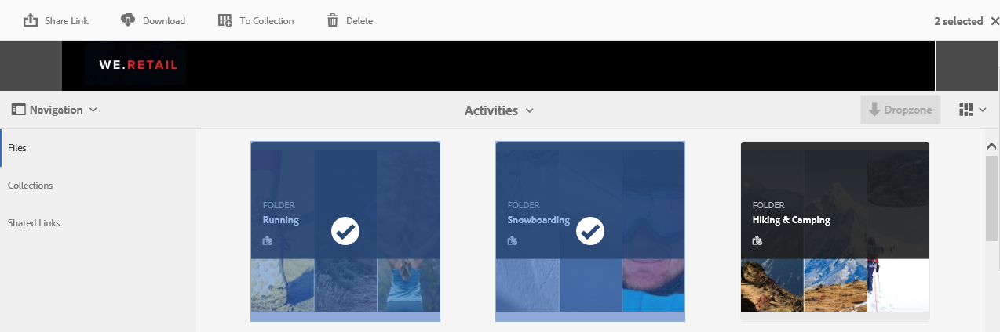
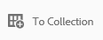
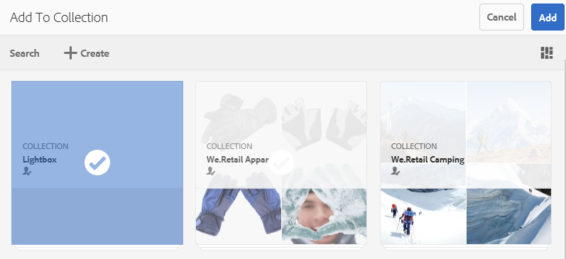
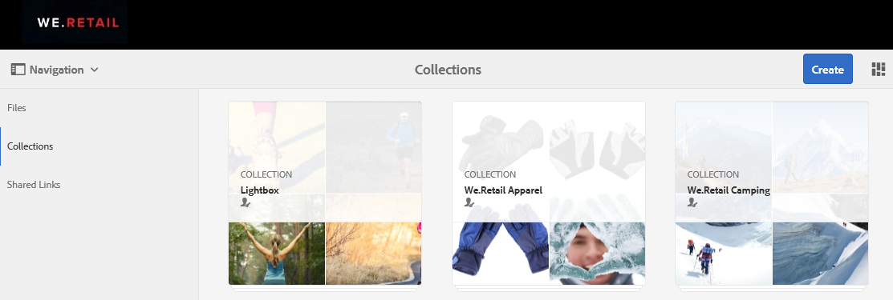
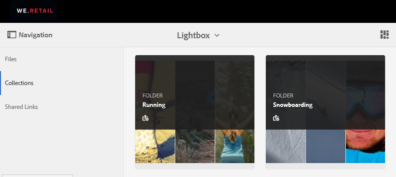
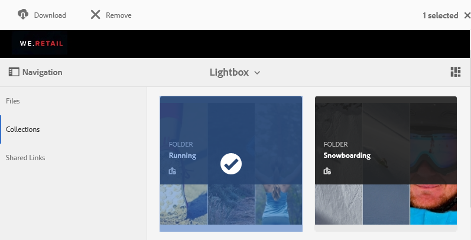

# Verwalten der Lightbox-Sammlung {#manage-the-lightbox-collection}

[!UICONTROL Lightbox] ist ein spezieller Sammlungstyp, der den einfachen Zugriff auf Assets ermöglicht. Jeder Benutzer verfügt über eine exklusive [!UICONTROL Lightbox], die automatisch erstellt wird, wenn er sich erstmals bei Brand Portal anmeldet. Die [!UICONTROL Lightbox]-Sammlung kann nicht gelöscht werden.

## Assets zu Lightbox hinzufügen {#add-assets-to-lightbox}

Gehen Sie wie folgt vor, um Assets zu [!UICONTROL Lightbox] hinzuzufügen:

1. Navigieren Sie zum Speicherort der Assets, die Sie [!UICONTROL Lightbox] hinzufügen möchten, und wählen Sie die Assets aus.

   

1. Klicken Sie oben in der Symbolleiste auf das Symbol „Zu Sammlung hinzufügen“.

   

1. Auf der Seite **[!UICONTROL Zu Sammlung hinzufügen]** ist die [!UICONTROL Lightbox]-Sammlung standardmäßig ausgewählt.

   Klicken Sie auf **[!UICONTROL Hinzufügen]**. Die ausgewählten Assets werden [!UICONTROL Lightbox] hinzugefügt.

   

1. Um die Assets zu überprüfen, die zu [!UICONTROL Lightbox] hinzugefügt wurden, klicken Sie in der linken Leiste auf **[!UICONTROL Sammlungen]** und klicken Sie dann auf die **[!UICONTROL Lightbox]**-Sammlung.

   

   Die zu [!UICONTROL Lightbox] hinzugefügten Assets werden auf der Seite [!UICONTROL Lightbox] angezeigt.

   

## Entfernen von Assets aus Lightbox {#remove-assets-from-lightbox}

1. Um die Assets in [!UICONTROL Lightbox] zu überprüfen, klicken Sie in der linken Leiste  auf **[!UICONTROL Sammlungen]** und klicken Sie dann auf die [!UICONTROL Lightbox]-Sammlung.

   

1. Wählen Sie den Ordner aus, den Sie aus der Sammlung entfernen möchten, und klicken Sie oben in der Symbolleiste auf **[!UICONTROL Entfernen]**.

   

1. Klicken Sie in der Warnmeldung auf **[!UICONTROL Entfernen]**, um den Löschvorgang zu bestätigen.

Der Ordner wird aus der [!UICONTROL Lightbox]-Sammlung gelöscht.
