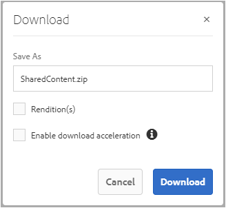

# Freigeben von Assets als Link {#share-assets-as-a-link}

Adobe Experience Manager Assets Brand Portal-Administratoren können Links mehrerer Assets für autorisierte interne Benutzer und externe Einheiten (einschließlich Partnern und Anbietern) freigeben. Bearbeiter können nur die Assets anzeigen und freigeben, die für sie freigegeben wurden.

Die Freigabe von Assets über einen Link ist eine praktische Methode, um die Assets für externe Parteien verfügbar zu machen, ohne dass diese sich bei Brand Portal anmelden müssen.

<!-- Link sharing access is restricted to editors and administrators. 
-->

Weitere Informationen finden Sie unter [Verwalten von Benutzern, Gruppen und Benutzerrollen](../using/brand-portal-adding-users.md#manage-user-roles).

Im Folgenden werden die Schritte zum Freigeben von Assets als Link beschrieben:

1. Melden Sie sich bei Ihrem Brand Portal-Mandanten an. Standardmäßig wird die Ansicht **[!UICONTROL Dateien]** geöffnet, die alle veröffentlichten Assets und Ordner enthält.

1. Wählen Sie die Assets oder Ordner aus, die Sie freigeben möchten, oder navigieren Sie zur Ansicht **[!UICONTROL Sammlungen]**, um die erstellten Sammlungen freizugeben.

   

1. Klicken Sie oben in der Symbolleiste auf das Symbol **[!UICONTROL Link freigeben]**.

   Das Dialogfeld **[!UICONTROL Linkfreigabe]** wird angezeigt.

   

   * Geben Sie im Feld „E-Mail-Adresse“ die E-Mail-Adresse des Benutzers ein, für den Sie den Link freigeben möchten. Sie können den Link für mehrere Benutzer freigeben. Wenn der Benutzer zu Ihrem Unternehmen gehört, wählen Sie die E-Mail-Adresse des Benutzers in den vorgeschlagenen Dropdown-Listeneinträgen aus. Wenn es sich um einen externen Benutzer handelt, geben Sie die vollständige E-Mail-Adresse ein und drücken Sie die **[!UICONTROL Eingabetaste]**. Die E-Mail-Adresse wird der Liste der Benutzer hinzugefügt.

      

   * Geben Sie in das Feld **[!UICONTROL Betreff]** einen Betreff für das freizugebende Asset ein.
   * Geben Sie bei Bedarf eine Nachricht in das Feld **[!UICONTROL Nachricht]** ein.
   * Verwenden Sie im Feld **[!UICONTROL Ablauf]** die Datumsauswahl, um Ablaufdatum und -uhrzeit für den Link festzulegen. Standardmäßig ist das Ablaufdatum auf 7 Tage nach dem Datum der Linkfreigabe gesetzt.
   * Aktivieren Sie das Kontrollkästchen **[!UICONTROL Download der Originaldatei zulassen]**, damit die Empfänger die ursprüngliche Ausgabedarstellung herunterladen können.

   Die über den Link freigegebenen Assets laufen nach dem Datum und der Uhrzeit ab, die im Feld **[!UICONTROL Ablauf]** angegeben sind. Informationen zum Verhalten abgelaufener Assets und Änderungen bei den zulässigen Aktivitäten basierend auf den Benutzerrollen in Brand Portal finden Sie unter [Digital Rights Management für Assets](../using/manage-digital-rights-of-assets.md#asset-expiration).

   >[!NOTE]
   >
   >Standardmäßig läuft der Link nach 7 Tagen ab. Der Link muss über das Dialogfeld **[!UICONTROL Link-Freigabe]** per E-Mail an die Benutzer gesendet werden. Kopieren Sie den Link nicht und geben Sie ihn nicht separat frei.

1. Klicken Sie auf **[!UICONTROL Freigeben]**. Eine Meldung bestätigt, dass der Link für die Benutzer freigegeben wurde. Die Benutzer erhalten eine E-Mail mit dem freigegebenen Link.

   

   >[!NOTE]
   >
   >Administratoren können die E-Mail-Nachrichten anpassen. Dies umfasst das Anpassen von Logo, Beschreibung und Fußzeile mit der Funktion [Branding](../using/brand-portal-branding.md).

## Herunterladen von Assets von freigegebenen Links {#download-assets-from-shared-links}

Klicken Sie auf den Link in der E-Mail, um auf das freigegebene Asset zuzugreifen. Die Seite „AEM-Linkfreigabe“ wird geöffnet.

Gehen Sie wie folgt vor, um die freigegebenen Assets herunterzuladen:

1. Klicken Sie auf die Assets oder Ordner und dann auf das Symbol **[!UICONTROL Herunterladen]** in der Symbolleiste.

   

   >[!NOTE]
   >
   >Derzeit können Sie je nach dem jeweiligen Dateiformat nur für bestimmte Assets eine Vorschau und Miniaturen generieren. Weitere Informationen zu den unterstützen Dateiformaten finden Sie unter [Unterstützte Vorschauen und Miniaturen für Asset-Formate](#preview-thumbnail-support).

1. Das Dialogfeld **[!UICONTROL Download]** wird angezeigt.

   

1. Standardmäßig ist die Einstellung **[!UICONTROL Schneller Download]** in den **[!UICONTROL Download-Einstellungen]** aktiviert. Daher wird ein Bestätigungsfeld angezeigt, in dem der Download mit IBM Aspera Connect fortgesetzt werden kann.

   Um **[!UICONTROL Schneller Download]** weiterhin zu verwenden, klicken Sie auf **[!UICONTROL Erlauben]**.

   Alle ausgewählten Ausgabedarstellungen werden in einen ZIP-Ordner heruntergeladen, der für jedes Asset einen eigenen Ordner enthält.

   >[!NOTE]
   >
   >Beim Herunterladen der Assets von einem freigegebenen Link wird für jedes Asset ein separater Ordner erstellt.
   >
   >Wenn ein Ordner, eine Sammlung oder mehr als 20 Assets zum Herunterladen ausgewählt sind, wird das Dialogfeld **[!UICONTROL Herunterladen]** übersprungen und alle Asset-Ausgabedarstellungen, auf die der Benutzer zugreifen kann (mit Ausnahme der dynamischen Ausgabedarstellungen), werden in einen ZIP-Ordner heruntergeladen, der separate Ordner für jedes Asset enthält.

   >[!NOTE]
   >
   >Original-Ausgabedarstellungen werden nicht über den freigegebenen Link heruntergeladen, wenn der Benutzer, der die Assets als Link freigegeben hat, nicht [vom Administrator autorisiert wurde, auf die Original-Ausgabedarstellungen zuzugreifen](../using/brand-portal-adding-users.md#manage-group-roles-and-privileges).

>[!NOTE]
>
>Brand Portal beschränkt das Herunterladen von Assets über die Link-Freigabe auf eine Dateigröße von maximal **1** GB pro Datei.

<!--
1. The **[!UICONTROL Download]** dialog box appears.

   

    * To speed up the download of asset files shared as the link, select **[!UICONTROL Enable download acceleration]** option and [follow the wizard](../using/accelerated-download.md#download-workflow-using-file-accelerator). To know more about the fast download of assets on Brand Portal refer [Guide to accelerate downloads from Brand Portal](../using/accelerated-download.md).
    
1. To download the renditions of assets in addition to the assets from the shared link, select **[!UICONTROL Rendition(s)]** option. When you do so, **[!UICONTROL Exclude System Renditions]** option appears that is selected by default. This prevents the download of out-of-the-box renditions along with approved assets or their custom renditions.

   However, to allow auto-generated renditions to download along with custom renditions, deselect the **[!UICONTROL Exclude System Renditions]** option.

   >[!NOTE]
   >
   >Original renditions are not downloaded using the shared link if the user who shared the assets as a link is not [authorized by the administrator to have access to the original renditions](../using/brand-portal-adding-users.md#manage-group-roles-and-privileges).

   

1. Click **[!UICONTROL Download]**. The assets (and renditions if selected) are downloaded as a ZIP file to your local folder. However, no zip file is created if a single asset is downloaded without any of the renditions, thereby ensuring speedy download.

-->

## Unterstützung von Vorschauen und Miniaturen für Asset-Formate {#preview-thumbnail-support}

Die folgende Matrix listet die Asset-Formate auf, für die Brand Portal Miniaturen und Vorschauen unterstützt:

| Asset-Format | Miniatur-Unterstützung | Vorschau-Unterstützung |
|--------------|-------------------|-----------------|
| PNG | ✓ | verwalten |
| GIF | verwalten | verwalten |
| TIFF | verwalten | ✕ |
| JPEG | verwalten | verwalten |
| BMP | verwalten | ✕ |
| PNM* | nicht vorhanden | nicht vorhanden |
| PGM* | nicht vorhanden | nicht vorhanden |
| PBM* | nicht vorhanden | nicht vorhanden |
| PPM* | nicht vorhanden | nicht vorhanden |
| PSD | verwalten | ✕ |
| EPS | nicht vorhanden | ✕ |
| DNG | verwalten | ✕ |
| PICT | verwalten | ✕ |
| PSB* | verwalten | ✕ |
| JPG | verwalten | verwalten |
| AI | verwalten | ✕ |
| DOC | ✕ | ✕ |
| DOCX | ✕ | ✕ |
| ODT* | ✕ | ✕ |
| PDF | verwalten | ✕ |
| HTML | ✕ | ✕ |
| RTF | ✕ | ✕ |
| TXT | verwalten | ✕ |
| XLS | ✕ | ✕ |
| XLSX | ✕ | ✕ |
| ODS | ✕ | ✕ |
| PPT | verwalten | ✕ |
| PPTX | ✕ | ✕ |
| ODP | ✕ | ✕ |
| INDD | verwalten | ✕ |
| PS | ✕ | ✕ |
| QXP | ✕ | ✕ |
| EPUB | verwalten | ✕ |
| AAC | ✕ | ✕ |
| MIDI | ✕ | ✕ |
| 3GP | ✕ | ✕ |
| MP3 | ✕ | ✕ |
| MP4 | ✕ | ✕ |
| OGA | ✕ | ✕ |
| OGG | ✕ | ✕ |
| RA | ✕ | ✕ |
| WAV | ✕ | ✕ |
| WMA | ✕ | ✕ |
| DVI | ✕ | ✕ |
| FLV | ✕ | ✕ |
| M4V | ✕ | ✕ |
| MPG | ✕ | ✕ |
| OGV | ✕ | ✕ |
| MOV | ✕ | ✕ |
| WMV | ✕ | ✕ |
| SWF | ✕ | ✕ |
| TGZ | nicht vorhanden | ✕ |
| JAR | verwalten | ✕ |
| RAR | nicht vorhanden | ✕ |
| TAR | nicht vorhanden | ✕ |
| ZIP | verwalten | ✕ |

Die folgende Legende erläutert die in der Matrix verwendeten Symbole:

| Symbol | Bedeutung |
|---|---|
| verwalten | Dieses Dateiformat unterstützt diese Funktion |
| ✕ | Dieses Dateiformat unterstützt diese Funktion nicht |
| nicht vorhanden | Diese Funktion kann auf dieses Dateiformat nicht angewendet werden |
| * | Nach der Veröffentlichung der Assets in Brand Portal ist für diese Funktion Add-on-Unterstützung für dieses Dateiformat in der AEM-Autoreninstanz erforderlich, jedoch nicht in Brand Portal |

## Aufheben der Freigabe von Assets als Link {#unshare-assets-shared-as-a-link}

Gehen Sie wie folgt vor, um die Freigabe eines Assets als Link aufzuheben:

1. Wenn Sie sich bei Brand Portal anmelden, wird standardmäßig die **[!UICONTROL Dateiansicht]** geöffnet. Um die Assets anzuzeigen, die Sie als Links freigegeben haben, navigieren Sie zur Ansicht **[!UICONTROL Freigegebene Links]**.

1. Überprüfen Sie die freigegebenen Links, die in der Liste angezeigt werden.

   

1. Um die Freigabe eines Links aus der Liste aufzuheben, wählen Sie den Link aus und klicken Sie auf das Symbol **[!UICONTROL Freigabe aufheben]** in der Symbolleiste oben.

   

   >[!NOTE]
   >
   >Die Anzeige der freigegebenen Links ist benutzerdefiniert. Die Funktion zeigt nicht alle Links an, die von allen Benutzern eines Mandanten freigegebenen werden.

1. Klicken Sie in der Warnmeldung auf **[!UICONTROL Weiter]**, um das Aufheben der Freigabe zu bestätigen. Der Eintrag für den Link wird aus der Liste freigegebener Links entfernt.
