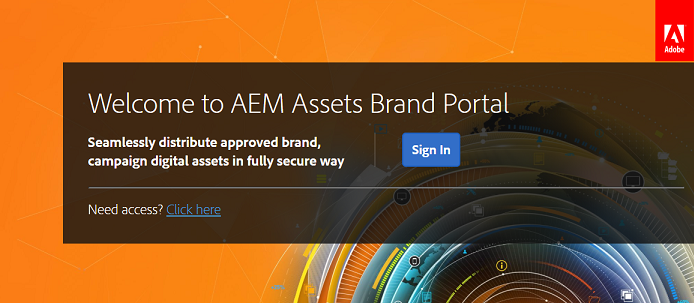

# Schritte bei der ersten Anmeldung {#first-time-login-experience}

Die Schritte bei der ersten Anmeldung sind für alle neuen Experience Manager Assets Brand Portal-Benutzer, einschließlich Administratoren, gleich. Wenn ein Administrator Sie zum Brand Portal-Konto Ihres Unternehmens hinzugefügt hat, müssen Sie keine Einladung annehmen. Das Hinzufügen erfolgt automatisch. Sie erhalten eine Begrüßungs-E-Mail mit einem Link zum Brand Portal-Konto Ihres Unternehmens.

Die folgenden Schritte müssen für Benutzer durchgeführt werden, die sich zum ersten Mal bei Brand Portal anmelden:

1. Öffnen Sie die Begrüßungs-E-Mail und klicken Sie auf **[!UICONTROL Erste Schritte]**.

1. Geben Sie auf der Registrierungsseite Ihre Details ein (einschließlich Vorname, Nachname, Passwort und Land/Region).
   >[!NOTE]
   >
   >Wenn Sie bereits ein Adobe Marketing Cloud-Benutzer sind, wird anstelle der Registrierungsseite die Anmeldeseite angezeigt. Um sich bei Adobe Marketing Cloud anzumelden, geben Sie Ihre Adobe ID und Ihr Kennwort ein.

   >[!NOTE]
   >
   >Wenn Ihr Unternehmen Enterprise IDs verwendet, werden Sie nicht zur Registrierungsseite, sondern zur Enterprise-Anmeldeseite weitergeleitet. Weitere Informationen finden Sie unter [Hilfe zu Enterprise ID, Anmeldung und Konto](https://helpx.adobe.com/de/enterprise/kb/enterprise-id-faq.html).

1. Klicken Sie auf **[!UICONTROL Weiter]**, um zur Brand Portal-Seite Ihres Unternehmens zu wechseln.
1. Klicken Sie auf der Brand Portal-Anmeldeseite auf **[!UICONTROL Anmelden]**, um sich bei Brand Portal anzumelden.

   

   >[!NOTE]
   >
   >Um sich bei Brand Portal anmelden zu können, müssen Sie über die Berechtigung für mindestens ein Experience Manager Assets-Produktprofil verfügen.
