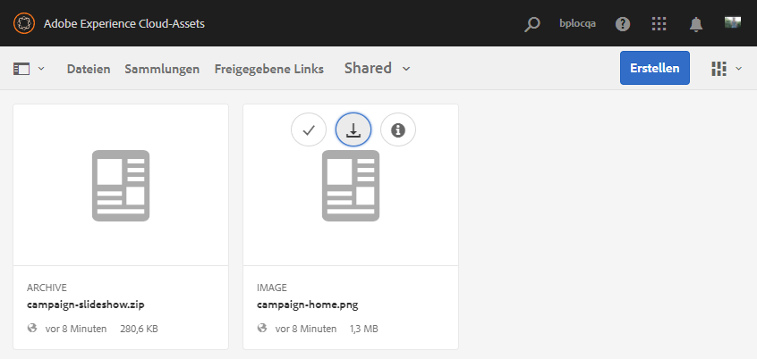
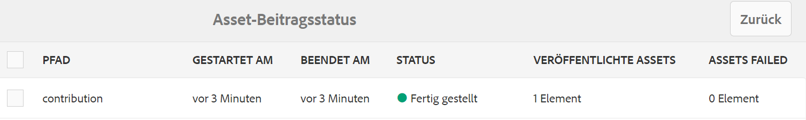
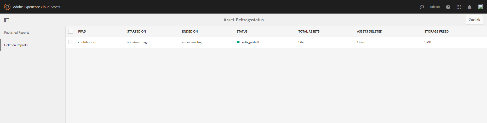
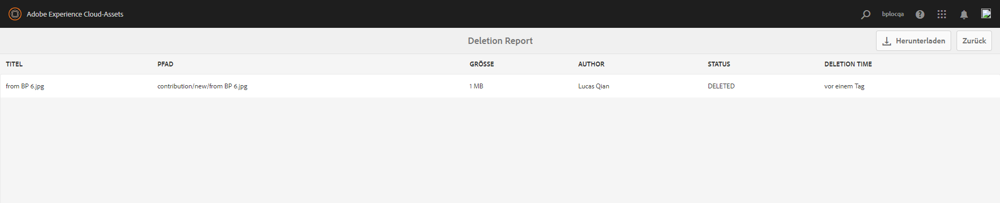

# Veröffentlichen des Beitragsordners in Experience Manager Assets {#using-asset-souring-in-bp}

Brand Portal-Benutzer mit entsprechender Berechtigung können mehrere Assets oder Ordner mit mehreren Assets in den Beitragsordner hochladen. Brand Portal-Benutzer können jedoch nur Assets in den Ordner **NEU** hochladen. Der Ordner **FREIGEGEBEN** ist für die Verteilung von Grundlinien-Assets (Referenzinhalt) vorgesehen, die von den Brand Portal-Benutzern bei der Erstellung von neuen Assets für Beiträge verwendet werden können.

Brand Portal-Benutzer mit Zugriffsberechtigung auf den Beitragsordner können die folgenden Aktivitäten ausführen:

* [Herunterladen von Asset-Anforderungen](#download-asset-requirements)
* [Hochladen von neuen Assets in den Beitragsordner](#uplad-new-assets-to-contribution-folder)
* [Veröffentlichen des Beitragsordners in Experience Manager Assets](#publish-contribution-folder-to-aem)

## Herunterladen von Asset-Anforderungen {#download-asset-requirements}

Brand Portal-Benutzer erhalten automatisch E-Mail-/Push-Benachrichtigungen, sobald ein Beitragsordner vom Experience Manager Assets-Benutzer freigegeben wird. Damit können sie die Zusammenfassung (Asset-Anforderungsdokument) sowie die Grundlinien-Assets (Referenzinhalte) aus dem Ordner **FREIGEGEBEN** herunterladen, um sicherzustellen, dass sie die Asset-Anforderungen verstehen.

Der Brand Portal-Benutzer führt die folgenden Aktivitäten aus, um Asset-Anforderungen herunterzuladen:

* **Mandat herunterladen**: Laden Sie die Zusammenfassung (Asset-Anforderungsdokument) herunter, die dem Beitragsordner beigefügt ist und Asset-bezogene Informationen wie Elementtyp, Zweck, unterstützte Formate, maximale Asset-Größe usw. enthält.
* **Grundlinien-Assets herunterladen**: Laden Sie die Grundlinien-Assets herunter, mit denen Sie die erforderlichen Asset-Typen verstehen können. Brand Portal-Benutzer können diese Assets als Referenz verwenden, um neue Assets für Beiträge zu erstellen.

Das Brand Portal-Dashboard enthält alle vorhandenen Ordner, die dem Brand Portal-Benutzer zur Verfügung stehen, sowie den neu freigegebenen Beitragsordner. In diesem Beispiel hat der Brand Portal-Benutzer nur Zugriff auf den neu erstellten Beitragsordner. Es wird kein anderer bestehender Ordner für den Benutzer freigegeben.

**Herunterladen von Asset-Anforderungen:**

1. Melden Sie sich bei Ihrer Brand Portal-Instanz an.
1. Wählen Sie den Beitragsordner im Brand Portal-Dashboard aus.
1. Klicken Sie auf **[!UICONTROL Eigenschaften]**. Das Fenster „Eigenschaften“ mit den Details zum Beitragsordner wird geöffnet.

   

   

1. Klicken Sie auf die Option **[!UICONTROL Mandat herunterladen]**, um das Asset-Anforderungsdokument auf Ihren lokalen Computer herunterzuladen.

   

1. Gehen Sie zurück zum Brand Portal-Dashboard.
1. Klicken Sie, um den Beitragsordner zu öffnen. Es werden zwei Unterordner im Beitragsordner angezeigt: **[!UICONTROL FREIGEGEBEN]** und **[!UICONTROL NEU]**. Der Ordner „FREIGEGEBEN“ enthält alle Grundlinien-Assets (Referenzinhalte), die von den Administratoren freigegeben werden.
1. Sie können den Ordner **[!UICONTROL FREIGEGEBEN]** mit allen Grundlinien-Assets auf Ihren lokalen Computer herunterladen.
Sie können auch den Ordner **[!UICONTROL FREIGEGEBEN]** öffnen und auf das Symbol **Herunterladen** klicken, um einzelne Dateien/Ordner herunterzuladen.

   

   

Sehen sie sich die Zusammenfassung (Asset-Anforderungsdokument) und die Grundlinien-Assets an, um die Asset-Anforderungen zu verstehen. Jetzt können Sie neue Assets für Beiträge erstellen und sie in den Beitragsordner hochladen.

## Hochladen von Assets in den Beitragsordner {#upload-new-assets-to-contribution-folder}

Nachdem Sie die Asset-Anforderungen durchlaufen haben, können die Brand Portal-Benutzer neue Assets erstellen und sie in den Ordner „NEU“ im Beitragsordner hochladen. Ein Benutzer kann mehrere Assets in einen Asset-Beitragsordner hochladen. Es kann jedoch jeweils nur ein Ordner erstellt werden.

>[!NOTE]
>
>Brand Portal-Benutzer können Assets (maximal **2** GB pro Dateigröße) in den Ordner „NEU“ hochladen.
>
>Der Grenzwert zum Hochladen für jeden Brand Portal-Mandanten beträgt **10** GB. Dies ist der kumulative Wert für sämtliche Beitragsordner.
>
>Die in Brand Portal hochgeladenen Assets werden nicht für Ausgabedarstellungen verarbeitet und enthalten keine Vorschau.

>[!NOTE]
>
>Es wird empfohlen, den Upload-Bereich nach der Veröffentlichung des Beitragsordners in Experience Manager Assets freizugeben, damit er für die anderen Brand Portal-Benutzer verfügbar ist.
>
>Wenn Sie die Upload-Grenze für Ihren Brand Portal-Mandanten über **10** GB hinaus erweitern müssen, wenden Sie sich an den Adobe-Support und geben Sie die Anforderung an.

**Hochladen neuer Assets:**

1. Melden Sie sich bei Ihrer Brand Portal-Instanz an.
Das Brand Portal-Dashboard enthält alle vorhandenen Ordner, die dem Brand Portal-Benutzer zur Verfügung stehen, sowie den neu freigegebenen Beitragsordner.

1. Wählen Sie den Beitragsordner aus und klicken Sie darauf, um ihn zu öffnen. Der Beitragsordner enthält zwei Unterordner - **[!UICONTROL FREIGEGEBEN]** und **[!UICONTROL NEU]**.

1. Klicken Sie auf den **[!UICONTROL Ordner NEU]**.

   

1. Klicken Sie auf **[!UICONTROL Erstellen]** > **[!UICONTROL Dateien]**, um einzelne Dateien oder Ordner (.zip) mit mehreren Assets hochzuladen.

   

1. Suchen Sie nach Assets (Dateien/Ordner) und laden Sie sie in den Ordner **[!UICONTROL NEU]** hoch.

   

Nachdem Sie alle Assets oder Ordner in den Ordner „NEU“ hochgeladen haben, veröffentlichen Sie den Beitragsordner in Experience Manager Assets.

## Veröffentlichen des Beitragsordners in Experience Manager Assets {#publish-contribution-folder-to-aem}

Brand Portal-Benutzer können den Beitragsordner in Experience Manager Assets veröffentlichen, ohne Zugriff auf die Experience Manager Assets-Autoreninstanz zu benötigen.

Vergewissern Sie sich, dass Sie die Asset-Anforderungen erfüllt haben, und laden Sie die neu erstellten Assets in den Ordner **NEU** im Beitragsordner hoch.

**Veröffentlichen des Beitragsordners:**

1. Melden Sie sich bei Ihrer Brand Portal-Instanz an.

1. Wählen Sie den Beitragsordner im Brand Portal-Dashboard aus.
1. Klicken Sie auf **[!UICONTROL In AEM veröffentlichen]**.

   

   

In verschiedenen Phasen des Veröffentlichungs-Workflows wird eine E-Mail-/Pulsbenachrichtigung an den Brand Portal-Benutzer und an Brand Portal-Administratoren gesendet:

1. **In Warteschlange** - Eine Benachrichtigung wird an den Brand Portal-Benutzer und Brand Portal-Administratoren gesendet, wenn ein Publishing-Workflow in Brand Portal ausgelöst wird.

1. **Abgeschlossen** – Eine Benachrichtigung wird an den Brand Portal-Benutzer und Brand Portal-Administratoren gesendet, wenn der Beitragsordner erfolgreich in Experience Manager Assets veröffentlicht wurde.

Nachdem die neu erstellten Assets in Experience Manager Assets veröffentlicht wurden, können Brand Portal-Benutzer sie aus dem Ordner „NEU“ löschen. Der Brand Portal-Administrator kann Assets dagegen sowohl aus dem Ordner „NEU“ als auch aus dem Ordner „FREIGEGEBEN“ löschen.

Sobald die Erstellung eines Beitragsordners erreicht ist, kann der Brand Portal-Administrator den Beitragsordner löschen, um den Upload-Speicherplatz für andere Benutzer freizugeben.

## Status des Veröffentlichungsauftrags {#publishing-job-status}

Es gibt zwei Berichte, die die Administratoren verwenden können, um den Status der Asset-Beitragsordner anzuzeigen, die von Brand Portal aus in Experience Manager Assets veröffentlicht wurden.

* Navigieren Sie in Brand Portal zu **[!UICONTROL Tools]** > **[!UICONTROL Asset-Beitragsstatus]**. Dieser Bericht spiegelt den Status aller Veröffentlichungsaufträge in den verschiedenen Phasen des Veröffentlichungs-Workflows wider.

   

* Gehen Sie in Experience Manager Assets (On-Premise oder Managed Service) zu **[!UICONTROL Assets]** > **[!UICONTROL Aufträge]**. Dieser Bericht spiegelt den endgültigen Status (Erfolg oder Fehler) aller Veröffentlichungsaufträge wider.

   

* Gehen Sie in Experience Manager Assets as a Cloud Service zu **[!UICONTROL Assets]** > **[!UICONTROL Aufträge]**.

   Sie können auch direkt über die globale Navigation zu **[!UICONTROL Aufträge]** gehen.

   Dieser Bericht spiegelt den endgültigen Status (Erfolg oder Fehler) aller Veröffentlichungsaufträge wider, einschließlich des Imports von Assets aus Brand Portal in Experience Manager Assets as a Cloud Service.

   

<!--
>[!NOTE]
>
>Currently, no report is generated in AEM Assets as a Cloud Service for the Asset Sourcing workflow. 
-->

## Automatisches Löschen von in Experience Manager Assets veröffentlichten Assets aus dem Beitragsordner {#automatically-delete-published-assets-from-contribution-folder}

Brand Portal führt nun alle zwölf Stunden automatische Aufträge aus, um alle Beitragsordner zu scannen und alle in AEM veröffentlichten Assets zu löschen. Daher müssen Sie die Assets im Beitragsordner nicht manuell löschen, um die Ordnergröße unter der [Schwellenwert](#upload-new-assets-to-contribution-folder). Sie können auch den Status der Löschvorgänge überwachen, die in den letzten sieben Tagen automatisch ausgeführt wurden. Der Bericht für einen Auftrag enthält die folgenden Details:

* Startzeit des Auftrags
* Auftragsendzeit
* Auftragsstatus
* Gesamtzahl der in einem Auftrag enthaltenen Assets
* Gesamtzahl der Assets, die erfolgreich in einem Auftrag gelöscht wurden
* Gesamtspeicher, der infolge der Auftragsausführung verfügbar gemacht wurde

   

Sie können die Details der einzelnen Assets, die in einem Löschauftrag enthalten sind, auch weiter aufschlüsseln. Details wie der Asset-Titel, die Größe, der Autor, der Löschstatus und die Löschzeit sind im Bericht enthalten.

>[!NOTE]
>
> * Der Adobe-Support kann anfordern, die automatische Löschauftragsfunktion zu deaktivieren und erneut zu aktivieren oder die Ausführungsfrequenz zu ändern.
> * Diese Funktion ist in Experience Manager 6.5.13.0 und höheren Versionen verfügbar.

### Anzeigen und Herunterladen von Löschberichten {#view-delete-jobs}

So zeigen Sie Berichte für einen Löschauftrag an und laden diese herunter:

1. Navigieren Sie in Brand Portal zu **[!UICONTROL Instrumente]**>**[!UICONTROL Asset-Beitragsstatus]**>**[!UICONTROL Löschberichte]** -Option.

1. Wählen Sie einen Auftrag aus und klicken Sie auf **[!UICONTROL Ansicht]** , um den Bericht anzuzeigen.

   Zeigen Sie die Details der einzelnen Assets an, die in einem Löschauftrag enthalten sind. Details wie der Asset-Titel, die Größe, der Autor, der Löschstatus und die Löschzeit sind im Bericht enthalten. Klicken **[!UICONTROL Download]** , um den Bericht für den Auftrag im CSV-Format herunterzuladen.

   Der Löschstatus für ein Asset im Bericht kann die folgenden möglichen Werte aufweisen:

   * **Gelöscht** - Das Asset wurde erfolgreich aus dem Beitragsordner gelöscht.

   * **Nicht gefunden** - Brand Portal konnte das Asset nicht im Beitragsordner finden. Das Asset wurde bereits manuell aus dem Ordner gelöscht.

   * **Übersprungen** - Brand Portal hat den Asset-Löschvorgang übersprungen, da eine neue Version für das Asset im Beitragsordner verfügbar ist, die noch nicht in Experience Manager veröffentlicht wurde.

   * **Fehlgeschlagen** - Brand Portal konnte das Asset nicht löschen. Es gibt drei Versuche, ein Asset mit einer `Failed` Löschstatus. Wenn das Asset beim dritten Versuch, es erneut zu löschen, fehlschlägt, müssen Sie das Asset manuell löschen.

### Bericht löschen

In Brand Portal können Sie auch einen oder mehrere Berichte auswählen und diese manuell löschen.

So löschen Sie einen Bericht:

1. Navigieren Sie zu **[!UICONTROL Instrumente]**>**[!UICONTROL Asset-Beitragsstatus]**>**[!UICONTROL Löschberichte]** -Option.

1. Wählen Sie einen oder mehrere Berichte aus und klicken Sie auf **[!UICONTROL Löschen]**.

