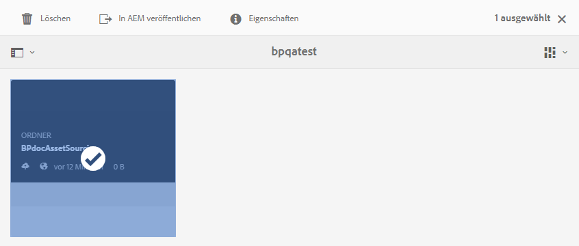

# Veröffentlichen des Beitragsordners in AEM Assets {#publish-contribution-folder-to-aem}

Markenportbenutzer können den Beitragsordner in AEM Assets veröffentlichen, ohne Zugriff auf die AEM-Autoreninstanz zu benötigen.

Vergewissern Sie sich, dass Sie die [Asset-Anforderungen](brand-portal-download-asset-requirements.md) erfüllt haben und laden Sie die neu erstellten Assets im Ordner " **NEW** "im Beitragsordner hoch. Siehe [Hochladen von Assets in den Beitragsordner](brand-portal-upload-assets-to-contribution-folder.md).

**So veröffentlichen Sie den Beitragsordner:**

1. Melden Sie sich bei Ihrer Brand Portal-Instanz an.
1. Wählen Sie den Beitragsordner im Dashboard "Markenportal"aus.
1. Klicken Sie auf **[!UICONTROL Auf AEM]** veröffentlichen .
   

In verschiedenen Phasen des Veröffentlichungs-Workflows wird eine E-Mail-/Puls-Benachrichtigung an das Markenportal und AEM, Administrator und Benutzer gesendet:
1. **Warteschlange** - Wenn der Veröffentlichungs-Workflow im Markenportal ausgelöst wird, wird der Beitragsordner vom Markenportal in AEM veröffentlicht.
1. **Wird ausgeführt** - Wenn AEM Assets mit dem Importieren des Beitragsordners beginnen.
1. **Abgeschlossen** : Nach Abschluss der Veröffentlichungsaktion wird der Beitragsordner erfolgreich in AEM Assets importiert.

