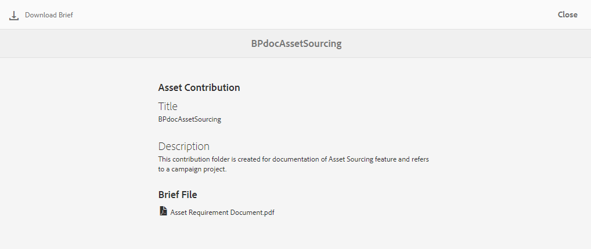
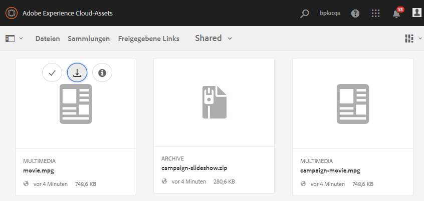
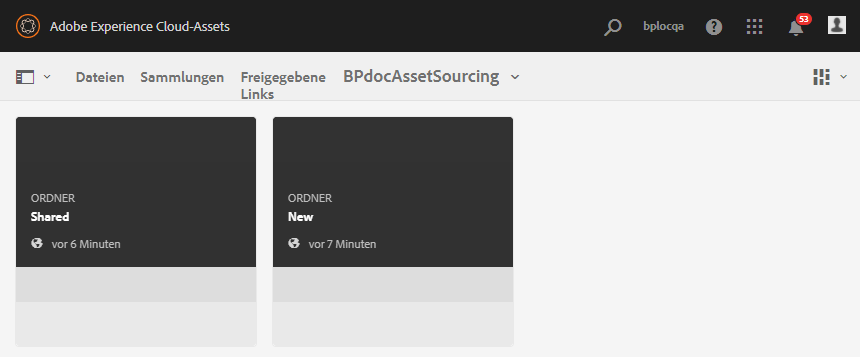
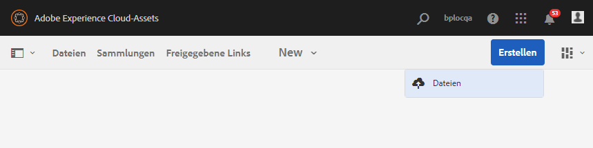
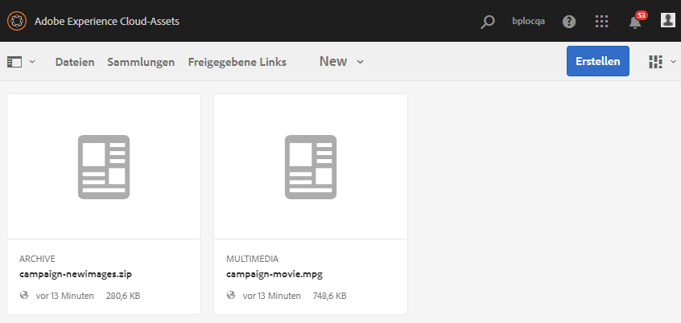
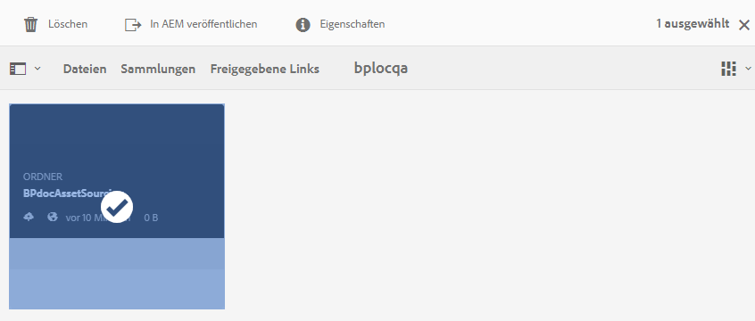
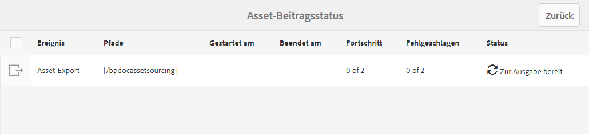
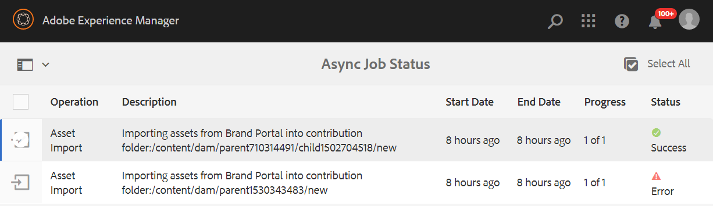
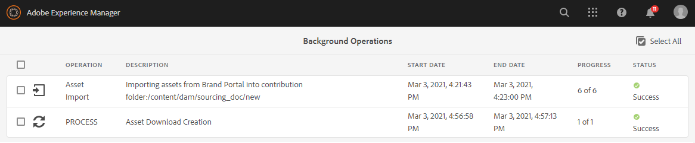

# Veröffentlichen von Beitragsordnern in AEM Assets {#using-asset-souring-in-bp}

Brand Portal-Benutzer mit entsprechender Berechtigung können mehrere Assets oder Ordner mit mehreren Assets in den Beitragsordner hochladen. Brand Portal-Benutzer können jedoch nur Assets in den Ordner **NEU** hochladen. Der Ordner **FREIGEGEBEN** ist für die Verteilung von Grundlinien-Assets (Referenzinhalt) vorgesehen, die von den Brand Portal-Benutzern bei der Erstellung von neuen Assets für Beiträge verwendet werden können.

Brand Portal-Benutzer mit Zugriffsberechtigung auf den Beitragsordner können die folgenden Aktivitäten ausführen:

* [Herunterladen von Asset-Anforderungen](#download-asset-requirements)
* [Hochladen von neuen Assets in den Beitragsordner](#uplad-new-assets-to-contribution-folder)
* [Veröffentlichen von Beitragsordnern in AEM Assets](#publish-contribution-folder-to-aem)

## Herunterladen von Asset-Anforderungen {#download-asset-requirements}

Brand Portal-Benutzer erhalten automatisch E-Mail-/Pulsbenachrichtigungen, sobald ein Beitragsordner vom AEM-Benutzer freigegeben wird. Damit können sie die Zusammenfassung (Asset-Anforderungsdokument) sowie die Grundlinien-Assets (Referenzinhalte) aus dem Ordner **FREIGEGEBEN** herunterladen, um sicherzustellen, dass sie die Asset-Anforderungen verstehen.

Der Brand Portal-Benutzer führt die folgenden Aktivitäten aus, um Asset-Anforderungen herunterzuladen:

* **Mandat herunterladen**: Laden Sie die Zusammenfassung (Asset-Anforderungsdokument) herunter, die dem Beitragsordner beigefügt ist und Asset-bezogene Informationen wie Elementtyp, Zweck, unterstützte Formate, maximale Asset-Größe usw. enthält.
* **Grundlinien-Assets herunterladen**: Laden Sie die Grundlinien-Assets herunter, mit denen Sie die erforderlichen Asset-Typen verstehen können. Brand Portal-Benutzer können diese Assets als Referenz verwenden, um neue Assets für Beiträge zu erstellen.

Das Brand Portal-Dashboard enthält alle vorhandenen Ordner, die dem Brand Portal-Benutzer zur Verfügung stehen, sowie den neu freigegebenen Beitragsordner. In diesem Beispiel hat der Brand Portal-Benutzer nur Zugriff auf den neu erstellten Beitragsordner. Es wird kein anderer bestehender Ordner für den Benutzer freigegeben.

**Herunterladen von Asset-Anforderungen:**

1. Melden Sie sich bei Ihrer Brand Portal-Instanz an.
1. Wählen Sie den Beitragsordner im Brand Portal-Dashboard aus.
1. Klicken Sie auf **[!UICONTROL Eigenschaften]**. Das Fenster „Eigenschaften“ mit den Details zum Beitragsordner wird geöffnet.

   

   

1. Klicken Sie auf die Option **[!UICONTROL Mandat herunterladen]**, um das Asset-Anforderungsdokument auf Ihren lokalen Computer herunterzuladen.

   

1. Gehen Sie zurück zum Brand Portal-Dashboard.
1. Klicken Sie, um den Beitragsordner zu öffnen. Es werden zwei Unterordner im Beitragsordner angezeigt: **[!UICONTROL FREIGEGEBEN]** und **[!UICONTROL NEU]**. Der Ordner „FREIGEGEBEN“ enthält alle Grundlinien-Assets (Referenzinhalte), die von den Administratoren freigegeben werden.
1. Sie können den Ordner **[!UICONTROL FREIGEGEBEN]** mit allen Grundlinien-Assets auf Ihren lokalen Computer herunterladen.
Sie können auch den Ordner **[!UICONTROL FREIGEGEBEN]** öffnen und auf das Symbol **Herunterladen** klicken, um einzelne Dateien/Ordner herunterzuladen.

   

   

Sehen sie sich die Zusammenfassung (Asset-Anforderungsdokument) und die Grundlinien-Assets an, um die Asset-Anforderungen zu verstehen. Jetzt können Sie neue Assets für Beiträge erstellen und sie in den Beitragsordner hochladen.

## Hochladen von Assets in den Beitragsordner {#uplad-new-assets-to-contribution-folder}

Nachdem Sie die Asset-Anforderungen durchlaufen haben, können die Brand Portal-Benutzer neue Assets erstellen und sie in den Ordner „NEU“ im Beitragsordner hochladen.

>[!NOTE]
>
>Brand Portal-Benutzer können Assets nur in den Ordner „NEU“ hochladen.
>
>Der Upload-Grenzwert für jeden Brand Portal-Mandanten beträgt **10** GB. Dies ist ein kumulativer Wert für sämtliche Beitragsordner.

>[!NOTE]
>
>Es wird empfohlen, den Upload-Bereich nach der Veröffentlichung des Beitragsordners in AEM Assets freizugeben, damit er für die anderen Brand Portal-Benutzer verfügbar ist.
>
>Wenn Sie die Upload-Grenze für Ihren Brand Portal-Mandanten über **10** GB hinaus erweitern müssen, wenden Sie sich an den Adobe-Support und geben Sie die Anforderung an.

**Hochladen neuer Assets:**

1. Melden Sie sich bei Ihrer Brand Portal-Instanz an.
Das Brand Portal-Dashboard enthält alle vorhandenen Ordner, die dem Brand Portal-Benutzer zur Verfügung stehen, sowie den neu freigegebenen Beitragsordner.

1. Wählen Sie den Beitragsordner aus und klicken Sie darauf, um ihn zu öffnen. Der Beitragsordner enthält zwei Unterordner - **[!UICONTROL FREIGEGEBEN]** und **[!UICONTROL NEU]**.

1. Klicken Sie auf den **[!UICONTROL Ordner NEU]**.

   

1. Klicken Sie auf **[!UICONTROL Erstellen]** > **[!UICONTROL Dateien]**, um einzelne Dateien oder Ordner (.zip) mit mehreren Assets hochzuladen.

   

1. Suchen Sie nach Assets (Dateien/Ordner) und laden Sie sie in den Ordner **[!UICONTROL NEU]** hoch.

   

Nachdem Sie alle Assets oder Ordner in den Ordner „NEU“ hochgeladen haben, veröffentlichen Sie den Beitragsordner in AEM Assets.

## Veröffentlichen von Beitragsordnern in AEM Assets {#publish-contribution-folder-to-aem}

Brand Portal-Benutzer können den Beitragsordner in AEM Assets veröffentlichen, ohne Zugriff auf die AEM-Autoreninstanz zu benötigen.

Vergewissern Sie sich, dass Sie die Asset-Anforderungen erfüllt haben, und laden Sie die neu erstellten Assets in den Ordner **NEU** im Beitragsordner hoch.

**Veröffentlichen des Beitragsordners:**

1. Melden Sie sich bei Ihrer Brand Portal-Instanz an.

1. Wählen Sie den Beitragsordner im Brand Portal-Dashboard aus.
1. Klicken Sie auf **[!UICONTROL In AEM veröffentlichen]**.

   

   

In verschiedenen Phasen des Veröffentlichungs-Workflows wird eine E-Mail-/Pulsbenachrichtigung an den Brand Portal-Benutzer und an Brand Portal-Administratoren gesendet:
1. **In Warteschlange** - Eine Benachrichtigung wird an den Brand Portal-Benutzer und Brand Portal-Administratoren gesendet, wenn ein Publishing-Workflow in Brand Portal ausgelöst wird.

1. **Abgeschlossen** - Eine Benachrichtigung wird an den Brand Portal-Benutzer und Brand Portal-Administratoren gesendet, wenn der Beitragsordner erfolgreich in AEM Assets veröffentlicht wurde.

Nachdem die neu erstellten Assets in AEM Assets veröffentlicht wurden, können Brand Portal-Benutzer sie aus dem Ordner „NEU“ löschen. Der Brand Portal-Administrator kann Assets dagegen sowohl aus dem Ordner „NEU“ als auch aus dem Ordner „FREIGEGEBEN“ löschen.

Sobald die Erstellung eines Beitragsordners erreicht ist, kann der Brand Portal-Administrator den Beitragsordner löschen, um den Upload-Speicherplatz für andere Benutzer freizugeben.

## Status des Veröffentlichungsauftrags {#publishing-job-status}

Es gibt zwei Berichte, die die Administratoren verwenden können, um den Status der Asset-Beitragsordner anzuzeigen, die von Brand Portal aus in AEM Assets veröffentlicht wurden.

* Navigieren Sie in Brand Portal zu **[!UICONTROL Tools]** > **[!UICONTROL Asset-Beitragsstatus]**. Dieser Bericht spiegelt den Status aller Veröffentlichungsaufträge in den verschiedenen Phasen des Veröffentlichungs-Workflows wider.

   

* Navigieren Sie in AEM Assets (On-Premise oder Managed Service) zu **[!UICONTROL Assets]** > **[!UICONTROL Aufträge]**. Dieser Bericht spiegelt den endgültigen Status (Erfolg oder Fehler) aller Veröffentlichungsaufträge wider.

   

* Navigieren Sie in AEM Assets as a Cloud Service zu **[!UICONTROL Assets]** > **[!UICONTROL Aufträge]**.

   Sie können auch direkt über die globale Navigation zu **[!UICONTROL Aufträge]** navigieren.

   Dieser Bericht spiegelt den endgültigen Status (Erfolg oder Fehler) aller Veröffentlichungsaufträge wider, einschließlich des Imports von Assets aus Brand Portal in AEM Assets as a Cloud Service.

   

<!--
>[!NOTE]
>
>Currently, no report is generated in AEM Assets as a Cloud Service for the Asset Sourcing workflow. 
-->

