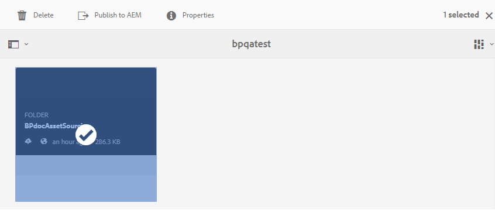

# Veröffentlichen von Beitragsordnern in AEM Assets {#publish-contribution-folder-to-aem}

Brand Portal-Benutzer können den Beitragsordner in AEM Assets veröffentlichen, ohne Zugriff auf die AEM-Autoreninstanz zu benötigen.

Vergewissern Sie sich, dass Sie die [Asset-Anforderungen](brand-portal-download-asset-requirements.md) erfüllt haben, und laden Sie die neu erstellten Assets in den Ordner **NEU** im Beitragsordner hoch. Siehe [Hochladen von Assets in den Beitragsordner](brand-portal-upload-assets-to-contribution-folder.md).

**Veröffentlichen des Beitragsordners:**

1. Melden Sie sich bei Ihrer Brand Portal-Instanz an.
1. Wählen Sie den Beitragsordner im Brand Portal-Dashboard aus.
1. Klicken Sie auf **[!UICONTROL In AEM veröffentlichen]** .
   

In den verschiedenen Phasen des Veröffentlichungs-Workflows wird eine E-Mail-/Puls-Benachrichtigung an den Brand Portal-Benutzer und AEM-Administrator gesendet:
1. **Warteschlange** - Eine Benachrichtigung wird an den Brand Portal-Benutzer gesendet, wenn im Brand Portal ein Veröffentlichungs-Workflow ausgelöst wird.

1. **Abgeschlossen** : Nach Abschluss des Veröffentlichungs-Workflows wird eine Benachrichtigung an den Markenportal-Benutzer und den AEM-Administrator gesendet, d. h. der Beitragsordner wurde erfolgreich in AEM Assets veröffentlicht.

