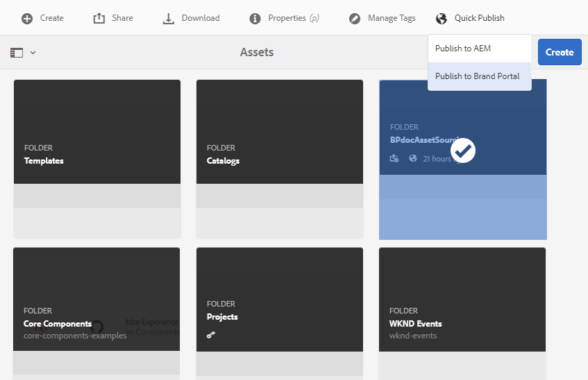

# Veröffentlichen von Beitragsordnern in Brand Portal {#publish-contribution-folder-to-brand-portal}

Sobald der [Beitragsordner konfiguriert ist](brand-portal-configure-contribution-folder-properties.md), kann der AEM-Benutzer (Administratoren/Benutzer ohne Administratorrechte) den Beitragsordner aus AEM Assets in Brand Portal veröffentlichen. Brand Portal-Benutzer/-Gruppen, die Zugriff auf den Beitragsordner haben, erhalten nach Abschluss der Veröffentlichungsaktion eine E-Mail-/Pulsbenachrichtigung.

**Veröffentlichen des Beitragsordners:**

1. Melden Sie sich bei Ihrer AEM-Autoreninstanz an.
Standard-URL: http:// localhost:4502/aem/start.html
1. Navigieren Sie zu **[!UICONTROL Assets > Dateien]** und suchen Sie nach dem Beitragsordner, in dem Sie in Brand Portal veröffentlichen möchten.
1. Wählen Sie den Beitragsordner aus und klicken Sie auf **[!UICONTROL Quick Publish > In Brand Portal veröffentlichen]**.
   
Sie erhalten eine Erfolgsmeldung, sobald der Beitragsordner in Brand Portal veröffentlicht wurde.

Eine E-Mail-/Pulsbenachrichtigung wird an die Brand Portal-Benutzer gesendet, die dem Beitragsordner zugewiesen sind. Die Brand Portal-Benutzer können auf den Beitragsordner zugreifen und mit dem Beitrag beginnen. Siehe [Hochladen von Assets in den Beitragsordner](brand-portal-upload-assets-to-contribution-folder.md).