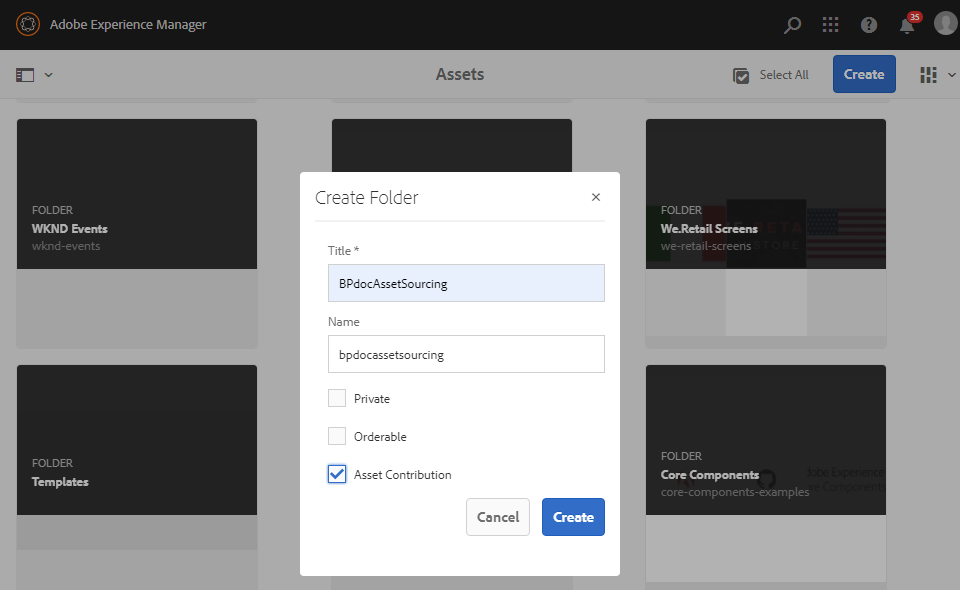
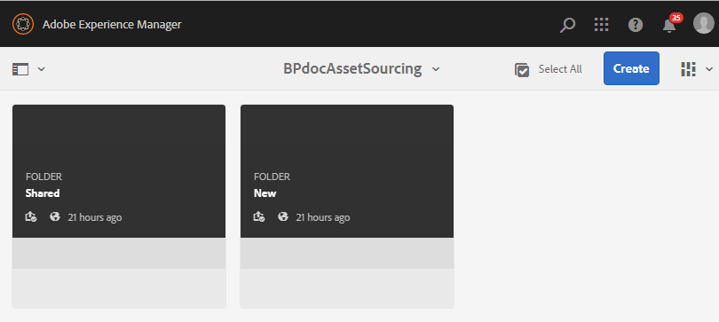

# Konfigurieren von Beitragsordnern in AEM Assets {#configure-contribution-folder}

Bei der gemeinsamen Asset-Beschaffung können AEM-Benutzer (Administratoren und Benutzer ohne Administratorrechte) neue Ordner des Typs **Asset-Beitrag** erstellen, um sicherzustellen, dass die neu erstellten Ordner von Brand Portal-Benutzern für die Übermittlung von Assets nutzbar sind.  Dadurch wird automatisch ein Workflow ausgelöst, mit dem zwei weitere Unterordner namens **SHARED** und **NEW** im neu erstellten **Beitragsordner** erstellt werden.

Der AEM-Benutzer definiert dann die Asset-Anforderungen, indem er eine Zusammenfassung der Asset-Typen, die zum Beitragsordner hinzugefügt werden sollen, sowie eine Reihe von Grundlinien-Assets in den Ordner **SHARED** hochlädt, um sicherzustellen, dass Brand Portal-Benutzer über die benötigten Informationen verfügen. Der Administrator kann aktiven Brand Portal-Benutzern anschließend Zugriff auf den Beitragsordner gewähren, bevor der neu erstellte Beitragsordner in Brand Portal veröffentlicht wird.

Das folgende Video zeigt, wie Sie einen Beitragsordner in AEM Assets konfigurieren:

>[!VIDEO](https://video.tv.adobe.com/v/30547)

Der AEM-Benutzer führt beim Konfigurieren eines Beitragsordners die folgenden Aktivitäten aus:

* [Erstellen von Beitragsordnern](#create-contribution-folder)
* [Hochladen von Asset-Anforderungen und Zuweisen von Beitragenden](#configure-contribution-folder-properties)
* [Hochladen von Grundlinien-Assets](#uplad-new-assets-to-contribution-folder)
* [Veröffentlichen von Beitragsordnern aus AEM Assets in Brand Portal](#publish-contribution-folder-to-brand-portal)

## Erstellen von Beitragsordnern {#create-contribution-folder}

AEM-Administratoren und Benutzer ohne Administratorrechte, die zum Erstellen eines neuen Ordners berechtigt sind, können in AEM Assets einen Beitragsordner erstellen.
Um einen Beitragsordner zu erstellen, erstellen Sie einen neuen Ordner des Typs Asset-Beitrag und stellen Sie sicher, dass der neu erstellte Ordner von Brand Portal-Benutzern für die Übermittlung von Assets nutzbar ist.  Dadurch wird automatisch ein Workflow ausgelöst, mit dem zwei weitere Unterordner namens SHARED und NEW im Beitragsordner erstellt werden.

>[!NOTE]
>
>Sie können mehrere Beitragsordner in einem Ordner erstellen. Erstellen Sie keinen Beitragsordner in einem anderen Beitragsordner.

Sie können die Eigenschaften des Beitragsordners sowohl separat als auch beim Erstellen des Beitragsordners konfigurieren. In diesem Beispiel konfigurieren wir die Eigenschaften separat.

**Erstellen eines Beitragsordners:**
1. Melden Sie sich bei Ihrer AEM Assets-Instanz an.

1. Navigieren Sie zu **[!UICONTROL Assets]** > **[!UICONTROL Dateien]**. Es werden alle im AEM Assets-Repository vorhandenen Ordner aufgelistet.

1. Klicken Sie auf **[!UICONTROL Erstellen]**, um einen neuen Ordner zu erstellen. Das Dialogfeld **[!UICONTROL Ordner erstellen]** wird geöffnet.

1. Geben Sie **[!UICONTROL Titel]** und **[!UICONTROL Name]** des Ordners ein und aktivieren Sie das Kontrollkästchen **[!UICONTROL Asset-Beiträge]**.
Wir empfehlen, Kleinbuchstaben ohne Leerzeichen zu verwenden, um den Ordner zu benennen.

1. Klicken Sie auf **[!UICONTROL Erstellen]**. Der Beitragsordner wird im AEM Assets-Repository aufgelistet.

   >[!NOTE]
   >
   >Ein Benutzer ohne Administratorrechte kann einen Asset-Beitragsordner erstellen und freigeben, ihn jedoch nicht ändern oder löschen.

   

1. Klicken Sie, um den Beitragsordner zu öffnen. Es werden zwei Unterordner angezeigt: **[!UICONTROL FREIGEGEBEN]** und **[!UICONTROL NEU]**. Diese werden automatisch im Beitragsordner erstellt.

   

## Konfigurieren von Eigenschaften von Beitragsordnern {#configure-contribution-folder-properties}

Der AEM-Administrator führt beim Konfigurieren der Eigenschaften eines Beitragsordners die folgenden Aktivitäten aus.

* **Beschreibung hinzufügen**: Geben Sie eine allgemeine Beschreibung des Beitragsordners ein.
* **Zusammenfassung hochladen**: Laden Sie das Asset-Anforderungsdokument hoch, das Asset-bezogene Informationen enthält.
* **Beitragende hinzufügen**: Fügen Sie Brand Portal-Benutzer hinzu, um ihnen Zugriff auf den Beitragsordner zu gewähren.

Die Asset-Anforderung bezieht sich auf die Details, die von Administratoren bereitgestellt werden, um Beitragende (Brand Portal-Benutzer) dabei zu unterstützen, die Notwendigkeit und Anforderungen des Beitragsordners zu verstehen. Der Administrator lädt ein Asset-Anforderungsdokument hoch, das eine Zusammenfassung des Asset-Typs enthält, der dem Beitragsordner hinzugefügt werden soll, sowie Asset-bezogene Informationen, wie z. B. Zweck, Typ der Bilder, maximale Größe usw.

**Konfigurieren von Eigenschaften von Beitragsordnern:**

1. Melden Sie sich bei Ihrer AEM Assets-Instanz an.

1. Navigieren Sie zu **[!UICONTROL Assets > Dateien]** und suchen Sie nach dem Beitragsordner.
1. Wählen Sie den Beitragsordner aus und klicken Sie auf **[!UICONTROL Eigenschaften]**, um das Fenster „Ordnereigenschaften“ zu öffnen.

   

   

1. Navigieren Sie zur Registerkarte **[!UICONTROL Asset-Beitrag]**.
1. Geben Sie eine allgemeine **[!UICONTROL Beschreibung]** des Beitragsordners ein.
1. Klicken Sie auf **[!UICONTROL Zusammenfassung hochladen]**, um von Ihrem lokalen Computer aus zu navigieren und ein **Asset-Anforderungsdokument** hochzuladen.

   

1. Geben Sie im Feld **[!UICONTROL Benutzer hinzufügen]** Brand Portal-Benutzer an, für die Sie den Beitragsordner freigeben möchten. Diese Benutzer können über die Brand Portal-Oberfläche Inhalte in diesem Beitragsordner abrufen oder in ihn hochladen.
1. Klicken Sie auf **[!UICONTROL Speichern]**.

   

>[!NOTE]
>
>Die Suchergebnisse basieren auf der in AEM Assets konfigurierten Brand Portal-Benutzerliste. Vergewissern Sie sich, dass Sie über die aktualisierte Brand Portal-Benutzerliste verfügen.

## Hochladen von Assets in den Beitragsordner {#uplad-new-assets-to-contribution-folder}

Brand Portal-Benutzer können die Asset-Anforderungen herunterladen, um zu verstehen, warum Beiträge nötig sind.
Sie können dann neue Assets für Beiträge erstellen und sie in den Ordner NEU im Beitragsordner hochladen.

>[!NOTE]
>
>Brand Portal-Benutzer können Assets nur in den Ordner „NEU“ hochladen.
>
>Der Upload-Grenzwert für jeden Brand Portal-Mandanten beträgt **10** GB. Dies ist ein kumulativer Wert für sämtliche Beitragsordner.

Nachdem die neu erstellten Assets in AEM Assets veröffentlicht wurden, können Brand Portal-Benutzer sie aus dem Ordner „NEU“ löschen. Der Brand Portal-Administrator kann Assets dagegen sowohl aus dem Ordner „NEU“ als auch aus dem Ordner „FREIGEGEBEN“ löschen.

Sobald die Erstellung eines Beitragsordners erreicht ist, kann der Brand Portal-Administrator den Beitragsordner löschen, um den Upload-Speicherplatz für andere Benutzer freizugeben.

>[!NOTE]
>
>Es wird empfohlen, den Upload-Bereich nach der Veröffentlichung des Beitragsordners in AEM Assets freizugeben, damit er für die anderen Brand Portal-Benutzer verfügbar ist.
>
>Wenn Sie die Upload-Grenze für Ihren Brand Portal-Mandanten über **10** GB hinaus erweitern müssen, wenden Sie sich an den Adobe-Support und geben Sie die Anforderung an.

**Hochladen neuer Assets:**

1. Melden Sie sich bei Ihrer Brand Portal-Instanz an.
Das Brand Portal-Dashboard enthält alle vorhandenen Ordner, die dem Brand Portal-Benutzer zur Verfügung stehen, sowie den neu freigegebenen Beitragsordner.

1. Wählen Sie den Beitragsordner aus und klicken Sie darauf, um ihn zu öffnen. Der Beitragsordner enthält zwei Unterordner - **[!UICONTROL FREIGEGEBEN]** und **[!UICONTROL NEU]**.

1. Klicken Sie auf den **[!UICONTROL Ordner NEU]**.

   

1. Klicken Sie auf **[!UICONTROL Erstellen]** > **[!UICONTROL Dateien]**, um einzelne Dateien oder Ordner (.zip) mit mehreren Assets hochzuladen.

   

1. Suchen Sie nach Assets (Dateien/Ordner) und laden Sie sie in den Ordner **[!UICONTROL NEU]** hoch.

   

Nachdem Sie alle Assets oder Ordner in den Ordner „NEU“ hochgeladen haben, veröffentlichen Sie den Beitragsordner in AEM Assets.

## Veröffentlichen von Beitragsordnern in Brand Portal {#publish-contribution-folder-to-brand-portal}

Sobald der Beitragsordner konfiguriert ist, kann der AEM-Benutzer (Administratoren/Benutzer ohne Administratorrechte) den Beitragsordner aus AEM Assets in Brand Portal veröffentlichen. Brand Portal-Benutzer, die Zugriff auf den Beitragsordner haben, erhalten nach Abschluss der Veröffentlichungsaktion eine E-Mail-/Pulsbenachrichtigung.

**Veröffentlichen des Beitragsordners:**

1. Melden Sie sich bei Ihrer AEM Assets-Instanz an.

1. Navigieren Sie zu **[!UICONTROL Assets > Dateien]** und suchen Sie nach dem Beitragsordner, in dem Sie in Brand Portal veröffentlichen möchten.
1. Wählen Sie den Beitragsordner aus und klicken Sie auf **[!UICONTROL Quick Publish]** > **[!UICONTROL In Brand Portal veröffentlichen]**.

   

   Sie erhalten eine Erfolgsmeldung, sobald der Beitragsordner in Brand Portal veröffentlicht wurde.

Eine E-Mail-/Pulsbenachrichtigung wird an die Brand Portal-Benutzer gesendet, die dem Beitragsordner zugewiesen sind. Die Brand Portal-Benutzer können auf den Beitragsordner zugreifen und mit dem Beitrag beginnen. Weitere Informationen finden Sie unter [Hochladen von Assets in den Beitragsordner und Veröffentlichen in AEM Assets](brand-portal-publish-contribution-folder-to-aem-assets.md).
