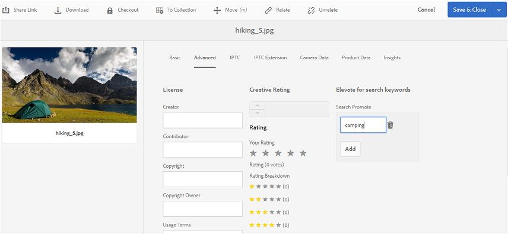

# Veröffentlichen von Tags in Brand Portal {#publish-tags-to-brand-portal}

Erfahren Sie, wie Sie Tags aus AEM Assets in Brand Portal veröffentlichen.

Tags sind nützlich zum Verwalten von Assets und verbessern die Suchbarkeit der Assets, mit denen sie verknüpft sind. Tags sind vergleichbar mit Suchbegriffen oder Bezeichnungen (Metadaten), die den Assets beigefügt sind. Mithilfe von Tags werden Assets bei einer Suche schnell gefunden. Informationen dazu, wie Tags den Assets in AEM Assets zugewiesen werden, finden Sie im Artikel [Verwenden von Tags zum Verwalten von Assets](https://helpx.adobe.com/experience-manager/6-5/assets/using/organize-assets.html#Usetagstoorganizeassets).

Tags (die mit Assets und Sammlungen in AEM verknüpft sind) werden automatisch in Brand Portal veröffentlicht, wenn Sie Assets (und Sammlungen) mit verknüpften Tags zum Markenportal. Die veröffentlichten Tags sind hilfreich bei der Suche nach verknüpften Assets.

>[!NOTE]
>
>Daher wird empfohlen, Tags exklusiv in Brand Portal zu veröffentlichen, bevor Assets (und Sammlungen) veröffentlicht werden, mit denen die Tags verknüpft sind. Hierdurch werden Assets (und Sammlungen) schneller in Brand Portal veröffentlicht.

## Tags verwalten {#manage-tags}

You can use the pre-existing tags to attach to an asset or create new tags from AEM Tags console (**[!UICONTROL Tools | Tagging | AEM Tags]**). In beiden Fällen müssen Sie die Tags zuerst in Brand Portal veröffentlichen und sie dann mit den entsprechenden Assets verknüpfen.

Führen Sie die folgenden Schritte aus, um Tags in AEM zu erstellen, in Brand Portal zu veröffentlichen und mit den entsprechenden Assets (oder Sammlungen) zu verknüpfen:

1. **Erstellen von Tags**
Sign in to AEM Author instance with administrative privileges, and access **[!UICONTROL AEM Tags]** console from global navigation:

   1. Select **[!UICONTROL Tools]**

   1. Select **[!UICONTROL General]**

   1. Select **[!UICONTROL Tagging]**

1. Klicken Sie auf **[!UICONTROL Erstellen]** und wählen Sie dann die Option **Tag erstellen[!UICONTROL .]**
1. Geben Sie Folgendes an:

   * **[!UICONTROL Titel]**
      *(erforderlich)* Ein Anzeigetitel für das Tag.
   * **[!UICONTROL Name]**
      *(erforderlich)* Ein Name für das Tag. Wenn Sie keinen festlegen, wird ein gültiger Knotenname aus dem Titel erstellt. See [TagID](https://helpx.adobe.com/experience-manager/6-5/sites/developing/using/framework.html#TagID).
   * **Beschreibung**
      *(optional)* Eine Beschreibung des Tags.
   * **Tag-Pfad** JCR-Pfad des Tags.

1. Wählen Sie **[!UICONTROL Übermitteln]aus, um das Tag zu erstellen.**

   Nachdem Sie ein Tag in der AEM-Instanz erstellt haben, ist das Tag verfügbar, das an ein Asset angehängt werden kann (im Abschnitt "Eigenschaften"oder im Abschnitt "Tags verwalten"dieses Assets).

1. **Veröffentlichen Sie das Tag in Brand Portal**.

   Go to **[!UICONTROL AEM Tags]** console ([!UICONTROL Tools | Tagging | AEM Tags]), select the desired tag and Publish to Brand Portal.

1. **Hängen Sie das Tag an ein Asset (oder eine Sammlung)** an.

   Wählen Sie ein Asset (oder eine Sammlung) aus und hängen Sie das gewünschte Tag mithilfe des Bereichs „Eigenschaften“ oder „Tags verwalten“ dieses Assets an. To know more about how to assign tags to assets in AEM Assets, refer [use tags to organize assets](https://helpx.adobe.com/experience-manager/6-5/assets/using/organize-assets.html#Usetagstoorganizeassets).

1. **Veröffentlichen Sie die Assets (oder Sammlungen) in Brand Portal**.\
   Wenn Sie ein Asset (oder eine Sammlung) in Brand Portal veröffentlichen, ist das beigefügte Tag auch in Brand Portal verfügbar.

   Um das angehängte Tag im entsprechenden Asset (oder in der Sammlung) in Brand Portal zu sehen, melden Sie sich bei Brand Portal an und wählen Sie das Asset im Bereich „Eigenschaften“ aus.

## Suche priorisieren {#search-promote}

In AEM Assets Brand Portal können Sie bestimmte Assets priorisieren, damit sie in den Suchanfragen, die auf einem Suchbegriff-Tag basieren, ganz oben in den Suchergebnissen erscheinen.

Um ein Asset für einen Suchbegriff zu priorisieren, führen Sie die folgenden Schritte aus:

1. Öffnen Sie die Seite **[!UICONTROL Eigenschaften]eines Assets in der AEM-Autoreninstanz.**
1. Navigieren Sie zur Registerkarte **[!UICONTROL Erweitert].**
1. Klicken Sie in **[!UICONTROL Suche priorisieren]** im Bereich **[!UICONTROL Für Suchbegriffe erhöhen]auf** Hinzufügen], um die Suchbegriffe oder Tags hinzuzufügen.**[!UICONTROL **

   

1. Speichern Sie die Änderungen.
1. Veröffentlichen Sie das Asset in Brand Portal.
1. Melden Sie sich bei Brand Portal an. Rufen Sie die Registerkarte **[!UICONTROL Erweitert]** im Bereich **Eigenschaften]des Assets auf.[!UICONTROL **
Beachten Sie, dass der Suchbegriff aus **[!UICONTROL Suche priorisieren]auch in den Eigenschaften dieses Assets sichtbar ist.**
