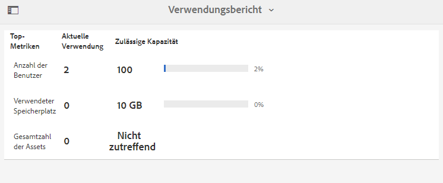
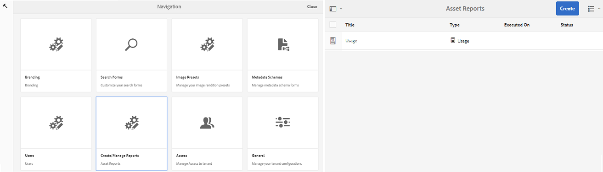

# Arbeiten mit Berichten {#work-with-reports}

Die Berichterstellungsfunktion ist hilfreich, um die Brand Portal-Nutzung zu bewerten und festzustellen, wie interne und externe Benutzer mit genehmigten Assets interagieren. Administratoren können den Brand Portal-Verwendungsbericht anzeigen, der immer auf der Seite „Asset-Berichte“ verfügbar ist. Auch Berichte über Benutzeranmeldungen und heruntergeladene, abgelaufene, veröffentlichte und über Links freigegebene Assets können erzeugt und auf der Seite „Asset-Berichte“ angezeigt werden. Diese Berichte sind hilfreich bei der Analyse der Ressourcenbereitstellung, mit deren Hilfe Sie wichtige Erfolgsmetriken ableiten können, um die Akzeptanz genehmigter Ressourcen innerhalb und außerhalb Ihrer Organisation zu messen.

Die Berichtverwaltungsoberfläche ist intuitiv und enthält detaillierte Optionen und Steuerungen, mit denen Sie auf gespeicherte Berichte zugreifen können. Über die Seite „Asset-Berichte“, auf der alle bisher erstellten Berichte aufgelistet werden, können Sie Berichte anzeigen, herunterladen oder löschen.

## Anzeigen von Berichten {#view-reports}

Gehen Sie wie folgt vor, um einen Bericht anzuzeigen:

1. Tippen oder klicken Sie in der Symbolleiste oben auf das Experience Manager-Logo, um auf die Admin-Tools zuzugreifen.

   

1. Klicken Sie im Admin-Tools-Bereich auf **[!UICONTROL Berichte erstellen/verwalten]**, um die Seite **[!UICONTROL Asset-Berichte]** zu öffnen.

   

1. Greifen Sie von der Seite „Asset-Berichte“ aus auf den **[!UICONTROL Nutzungsbericht]** und andere generierte Berichte zu.

   >[!NOTE]
   >
   >Der Verwendungsbericht ist ein Standardbericht, der in Brand Portal erstellt wird. Er kann nicht erstellt oder gelöscht werden. Sie können jedoch Berichte zu Downloads, Ablaufdaten, Veröffentlichungen, Linkfreigaben und Benutzeranmeldungen erstellen, herunterladen und löschen.

   Um einen Bericht anzuzeigen, klicken Sie auf den Link zum Bericht. Alternativ wählen Sie den Bericht aus und tippen/klicken Sie in der Symbolleiste auf das Symbol „Anzeigen“.

   Der **[!UICONTROL Verwendungsbericht]** zeigt Informationen zur Anzahl der aktiven Brand Portal-Benutzer, den von allen Assets belegten Speicherplatz sowie die Gesamtzahl der Assets in Brand Portal an. Die Brand Portal-Benutzer, die keinem Produktprofil in der Admin Console zugewiesen sind, gelten als inaktive Benutzer und werden im **[!UICONTROL Verwendungsbericht]** nicht angezeigt.
Der Bericht zeigt außerdem die zulässige Kapazität für jede dieser Informationsmetriken an.

   

   Der Bericht **[!UICONTROL Benutzeranmeldungen]** bietet Informationen zu Benutzern, die sich bei Brand Portal angemeldet haben. Der Bericht enthält die Anzeigenamen, die E-Mail-IDs, die Rollen (Admin, Betrachter, Bearbeiter, Gast), die Gruppen, Angaben zur letzten Anmeldung, den Aktivitätsstatus und die Anzahl der Anmeldungen von jedem Benutzer seit der Bereitstellung von Brand Portal 6.4.2 bis zum Zeitpunkt der Berichterstellung.

   

   Der Bericht **[!UICONTROL Download]** listet alle Assets auf und zeigt Details zu allen Assets an, die in einem bestimmten Zeitraum heruntergeladen wurden.

   

   >[!NOTE]
   >
   >Der Asset-Bericht **[!UICONTROL Download]** zeigt nur Assets an, die einzeln über Brand Portal ausgewählt und heruntergeladen wurden. Wenn ein Benutzer einen Ordner mit Assets heruntergeladen hat, werden der Ordner bzw. die Assets im Ordner nicht im Bericht angezeigt.

   Der Bericht **[!UICONTROL Ablauf]** zeigt alle Assets (inklusive Details) an, die in einem bestimmten Zeitraum abgelaufen sind.

   

   Der Bericht **[!UICONTROL Veröffentlichen]** zeigt Informationen zu allen Assets an, die in einem bestimmten Zeitraum von Experience Manager Assets in Brand Portal veröffentlicht wurden.

   

   >[!NOTE]
   >
   >Der Bericht „Veröffentlichen“ zeigt keine Informationen zu Inhaltsfragmenten an, da diese nicht in Brand Portal veröffentlicht werden können.

   Der Bericht zur **[!UICONTROL Linkfreigabe]** listet alle Assets auf, die über Links von der Brand Portal-Benutzeroberfläche aus in einem bestimmten Zeitrahmen freigegeben wurden. Der Bericht beinhaltet auch Informationen, wann und von welchem Benutzer das Asset über den Link freigegeben wurde und wann der Link abläuft, sowie Angaben zur Anzahl freigegebener Links für den Mandanten (und Benutzer, für die der Asset-Link freigegeben wurde). Die Spalten im Bericht zur Linkfreigabe können nicht angepasst werden.

   

   >[!NOTE]
   >
   >Der Bericht zur Linkfreigabe zeigt keine Benutzer an, die Zugriff auf das über den Link freigegebene Asset haben oder die das Asset über den Link heruntergeladen haben.
   >
   >Zum Nachverfolgen von Downloads über den freigegebenen Link müssen Sie den Bericht „Download“ nach der Auswahl der Option **[!UICONTROL Nur Downloads über Link-Freigabe]** auf der Seite **[!UICONTROL Bericht erstellen]** erzeugen. Der Benutzer (heruntergeladen von) ist in diesem Fall jedoch anonym.

## Erstellen von Berichten {#generate-reports}

Administratoren können die folgenden Standardberichte generieren und verwalten. Sobald sie generiert wurden, werden sie zur späteren Verwendung [zugänglich](../using/brand-portal-reports.md#main-pars-header) gespeichert:

* Benutzeranmeldungen
* Download
* Ablauf
* Veröffentlichen
* Link-Freigabe

Die Spalten in den Berichten „Download“, „Ablauf“ und „Veröffentlichen“ können für die Anzeige angepasst werden. Gehen Sie wie folgt vor, um einen Bericht zu generieren:

1. Tippen oder klicken Sie in der Symbolleiste oben auf das Experience Manager-Logo, um auf die Admin-Tools zuzugreifen.

1. Tippen/klicken Sie im Admin-Tools-Bereich auf **[!UICONTROL Berichte erstellen/verwalten]**, um die Seite **[!UICONTROL Asset-Berichte]** zu öffnen.

   

1. Tippen/klicken Sie auf der Seite „Asset-Berichte“ auf **[!UICONTROL Erstellen]**.
1. Wählen Sie auf der Seite **[!UICONTROL Bericht erstellen]** den Bericht aus, den Sie erstellen möchten, und tippen/klicken Sie auf **[!UICONTROL Weiter]**.

   

1. Konfigurieren Sie die Berichtdetails. Geben Sie den Titel, die Beschreibung, die Ordnerstruktur (wo soll der Bericht ausgeführt und welche Statistiken sollen generiert werden) und den Datumsbereich für die Berichte **[!UICONTROL Download]**, **[!UICONTROL Ablauf]** und **[!UICONTROL Veröffentlichen]** an.

   

   Für den **[!UICONTROL Bericht zur Linkfreigabe]** müssen nur die Parameter für den Titel, die Beschreibung und den Datumsbereich festgelegt werden.

   

   >[!NOTE]
   >
   >Die Sonderzeichen # und % im Berichtstitel werden bei der Berichtserstellung durch einen Bindestrich (-) ersetzt.

1. Tippen/klicken Sie auf **[!UICONTROL Weiter]**, um die Spalten für die Berichte „Download“, „Ablauf“ und „Veröffentlichen“ zu konfigurieren.
1. Aktivieren oder deaktivieren Sie dazu die entsprechenden Kontrollkästchen. Um zum Beispiel die Namen von Benutzern (die Assets heruntergeladen haben) im Bericht **[!UICONTROL Download]** anzuzeigen, wählen Sie **[!UICONTROL Heruntergeladen von]** aus. Die folgende Abbildung veranschaulicht die Auswahl von Standardspalten im Bericht „Download“.

   

   Sie können einem Bericht auch benutzerdefinierte Spalten hinzufügen, um weitere Daten für Ihre individuellen Anforderungen anzuzeigen.

   Gehen Sie wie folgt vor, um benutzerdefinierte Spalten in den Berichten „Download“, „Veröffentlichen“ oder „Ablauf“ hinzuzufügen:

   1. Um eine benutzerdefinierte Spalte anzuzeigen, tippen/klicken Sie auf **[!UICONTROL Hinzufügen]** innerhalb von [!UICONTROL Benutzerdefinierte Spalten].
   1. Geben Sie im Feld **[!UICONTROL Spaltenname]** den Namen der Spalte ein.
   1. Wählen Sie die Eigenschaftsauswahl, um auszuwählen, welche Eigenschaft der Spalte zugewiesen werden soll.

      
Alternativ können Sie den Pfad im Feld „Eigenschaftspfad“ eingeben.

      

      Tippen/klicken Sie auf **Hinzufügen** und wiederholen Sie die Schritte 2 und 3, um weitere benutzerdefinierte Spalten hinzuzufügen.

1. Tippen/klicken Sie auf **[!UICONTROL Erstellen]**. Eine Meldung benachrichtigt Sie darüber, dass die Berichtserstellung startet.

## Herunterladen von Berichten {#download-reports}

Führen Sie einen der folgenden Schritte aus, um einen Bericht zu speichern und als CSV-Datei herunterzuladen:

* Wählen Sie auf der Seite „Asset-Berichte“ einen Bericht aus und tippen/klicken Sie oben in der Symbolleiste auf **[!UICONTROL Download]**.

* Öffnen Sie auf der Seite „Asset-Berichte“ einen Bericht. Wählen Sie oben auf der Berichtseite die Option **[!UICONTROL Download]**.

## Löschen von Berichten {#delete-reports}

Zum Löschen eines vorhandenen Berichts müssen Sie den Bericht auf der Seite **[!UICONTROL Asset-Berichte]** auswählen und dann in der Symbolleiste am oberen Rand auf **[!UICONTROL Löschen]** tippen bzw. klicken.

>[!NOTE]
>
>Der Bericht **[!UICONTROL Verwendung]** kann nicht gelöscht werden.
