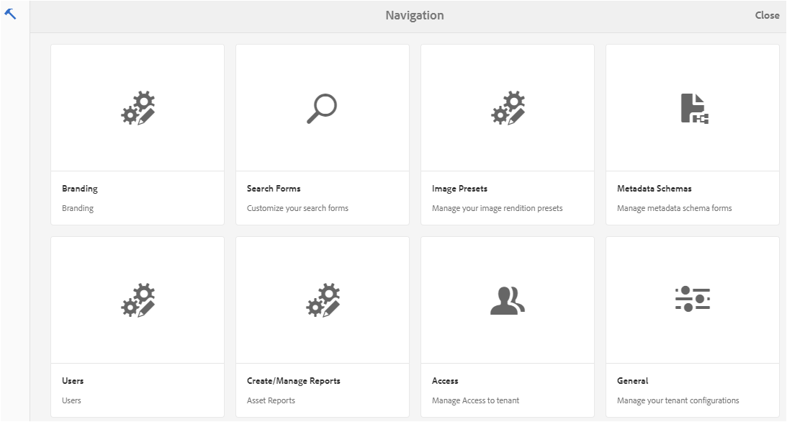
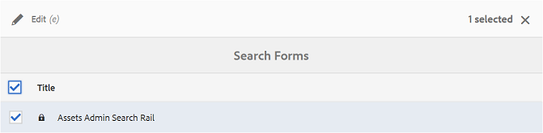
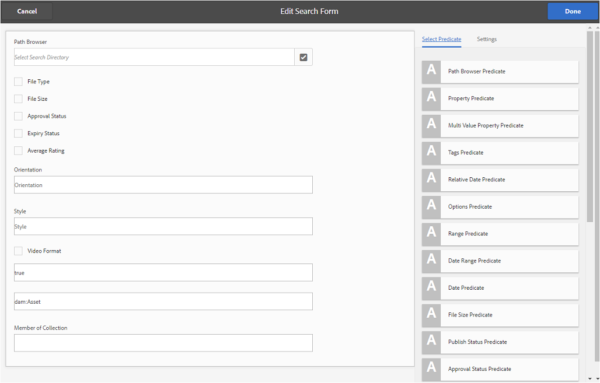
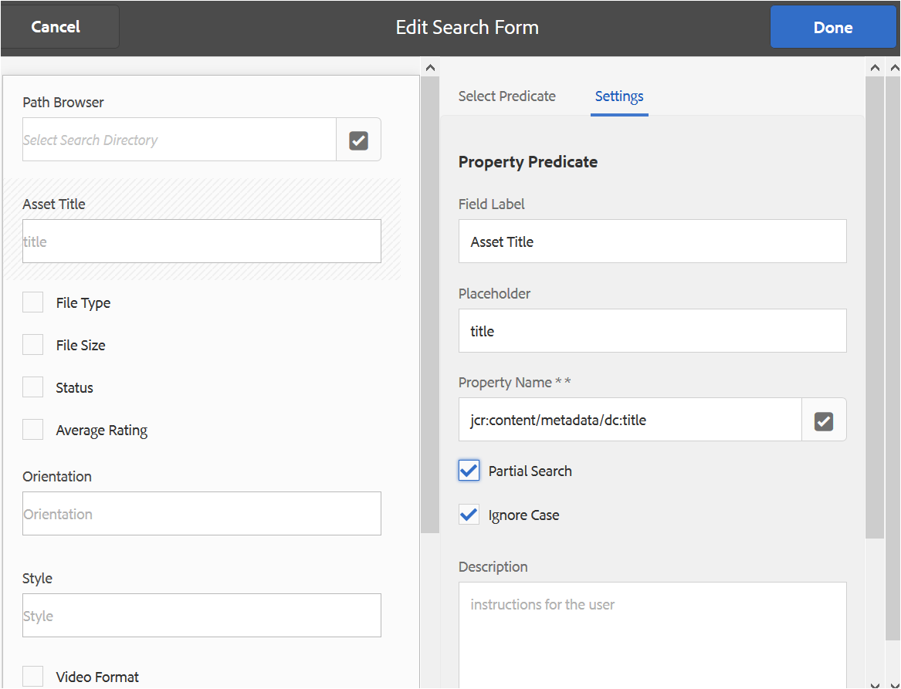
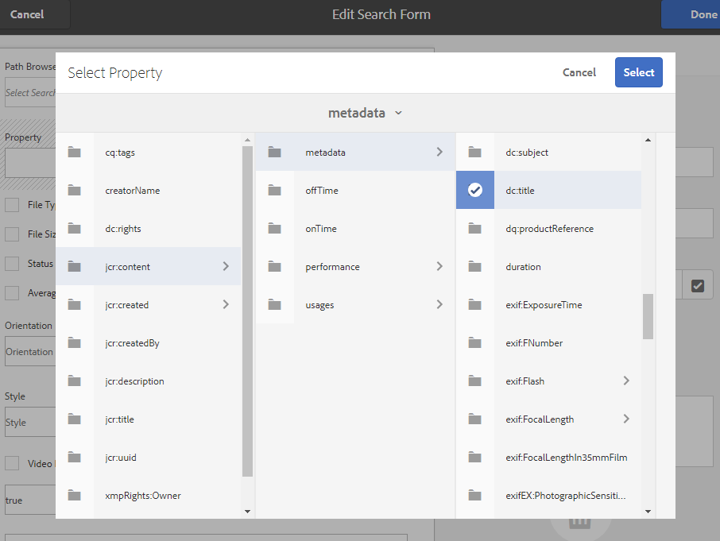
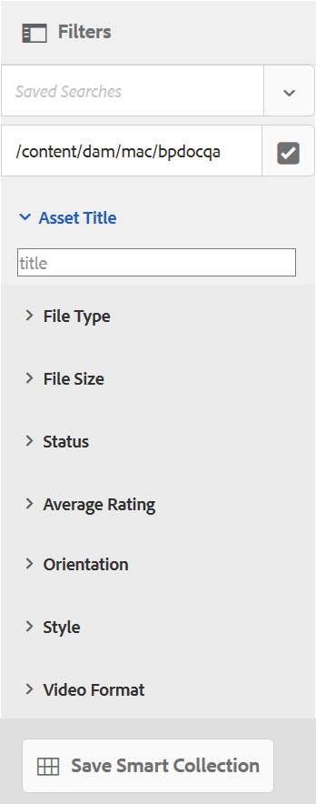
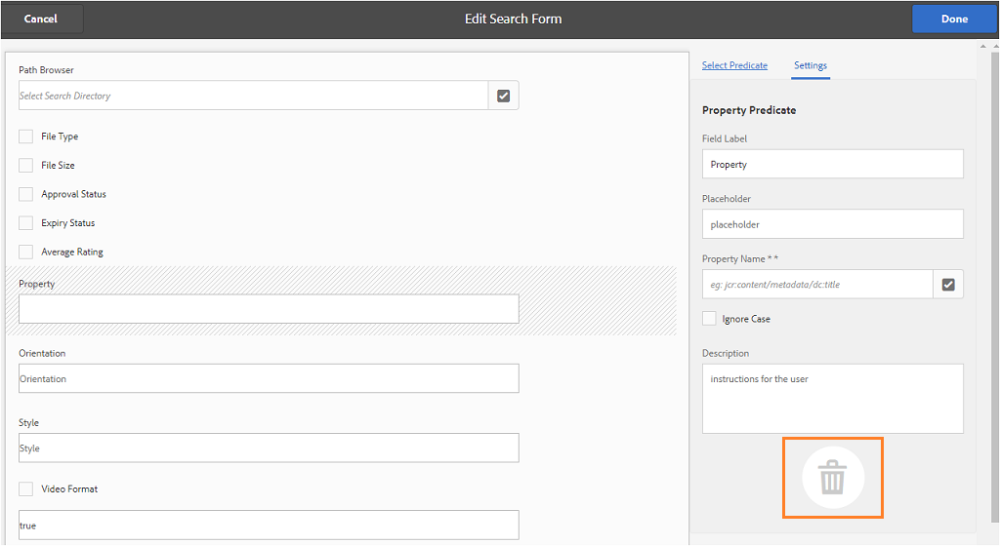

# Verwenden benutzerdefinierter Suchfacetten {#use-custom-search-facets}

Administratoren können Sucheigenschaften zum Bereich [!UICONTROL Filter] hinzufügen, um die Suche anzupassen und die Suchfunktion auf diese Weise vielseitiger zu gestalten.

Brand Portal unterstützt die [Facettensuche](../using/brand-portal-searching.md#search-using-facets-in-filters-panel) für die detaillierte Suche nach genehmigten Marken-Assets. Hierzu wird das Bedienfeld [**Filter** ](../using/brand-portal-searching.md#search-using-facets-in-filters-panel)verwendet. Suchfacetten sind im Bereich „Filter“ über das **[!UICONTROL Suchformular]** in den Admin-Tools verfügbar. Auf der Seite „Suchformular“ in den Admin-Tools gibt es ein Standardformular namens „Asset-Admin-Suchschienenseite“. Administratoren können jedoch den Bereich &quot;Standardfilter&quot;anpassen, indem sie das standardmäßige Suchformular (Asset-Admin-Suchschiene) bearbeiten, indem Sucheigenschaften hinzugefügt, geändert oder entfernt werden. Dadurch wird die Suchfunktion vielseitiger.

Sie können verschiedene Sucheigenschaften verwenden, um den Bereich **[!UICONTROL Filter]** anzupassen. Fügen Sie beispielsweise das Eigenschaftsprädikat hinzu, um nach Assets zu suchen, die einer einzelnen Eigenschaft entsprechen, die Sie in diesem Prädikat angeben. Fügen Sie das Optionsprädikat hinzu, um nach Assets zu suchen, die einem oder mehreren Werten entsprechen, die Sie für eine bestimmte Eigenschaft angeben. Fügen Sie das Datumsbereichsprädikat hinzu, um nach Assets zu suchen, die innerhalb eines bestimmten Datumsbereichs erstellt wurden.

>[!NOTE]
>
>In Experience Manager Assets können Unternehmen [die angepassten Suchformulare aus der AEM-Autoreninstanz](../using/publish-schema-search-facets-presets.md#publish-search-facets-to-brand-portal) in Brand Portal veröffentlichen, anstatt dieselben Formulare noch einmal in Brand Portal zu erstellen.

## Hinzufügen von Sucheigenschaften {#add-a-search-predicate}

Gehen Sie wie folgt vor, um dem Bereich **[!UICONTROL Filter]** Sucheigenschaften hinzuzufügen:

1. Klicken Sie auf das Experience Manager-Logo oben in der Symbolleiste, um auf weitere Admin-Tools zuzugreifen.

   

1. Klicken Sie im Admin-Tools-Bereich auf **[!UICONTROL Suchformulare]**.

   

1. Wählen Sie auf der Seite **[!UICONTROL Suchformulare]** die Option **[!UICONTROL Asset-Admin-Suchschiene]** aus.

   

1. Klicken Sie oben in der Symbolleiste auf **[!UICONTROL Bearbeiten]**, um die Seite „Suchformular bearbeiten“ zu öffnen.

   

1. Ziehen Sie auf der Seite [!UICONTROL Suchformular bearbeiten] eine Eigenschaft von der Registerkarte [!UICONTROL Eigenschaft auswählen] in den Hauptbereich. Ziehen Sie beispielsweise **[!UICONTROL Eigenschaftsprädikat]**.

   Das Feld **[!UICONTROL Eigenschaft]** wird im Hauptbereich angezeigt und die Registerkarte **[!UICONTROL Einstellungen]** auf der rechten Seite zeigt die Eigenschaftsprädikate an.

   

   >[!NOTE]
   >
   >Mit der Kopfzeilenbeschriftung auf der Registerkarte **[!UICONTROL Einstellungen]** wird der Typ der gewählten Eigenschaft identifiziert.

1. Geben Sie auf der Registerkarte **[!UICONTROL Einstellungen]** eine Beschriftung, Platzhaltertext und eine Beschreibung für das Eigenschaftsprädikat ein.

   * Wählen Sie **[!UICONTROL Teilsuche]**, wenn Sie eine Teilphrasensuche (und Platzhaltersuche) für Assets basierend auf dem angegebenen Eigenschaftswert zulassen möchten. Das Prädikat unterstützt standardmäßig die Volltextsuche.
   * Wählen Sie **[!UICONTROL Groß-/Kleinschreibung ignorieren]**, wenn bei der auf dem Eigenschaftswert basierenden Asset-Suche nicht zwischen Groß- und Kleinschreibung unterschieden werden soll. Standardmäßig wird bei der Suche nach Eigenschaftswerten im Suchfilter zwischen Groß- und Kleinschreibung unterschieden.

   >[!NOTE]
   >
   >Nach Aktivierung des Kontrollkästchens **[!UICONTROL Teilsuche]** wird **[!UICONTROL Groß-/Kleinschreibung ignorieren]** standardmäßig aktiviert.

1. Öffnen Sie die Eigenschaftsauswahl im Feld **[!UICONTROL Eigenschaftsname]** und wählen Sie dann die Eigenschaft aus, auf deren Basis die Suche ausgeführt werden soll. Alternativ können Sie einen Namen für die Eigenschaft eingeben. Geben Sie beispielsweise `jcr :content/metadata/dc:title` oder `./jcr:content/metadata/dc:title` ein.

   >[!NOTE]
   >
   >In Brand Portal werden alle String-Eigenschaften (mit Ausnahme der Eigenschaften, die mit `xmp`) in `jcrcontent/metadata` von `dam:asset` sind standardmäßig indiziert.
   >
   >Jede indizierte Eigenschaft kann beim Erstellen eines Eigenschaftsprädikats verwendet werden. Wenn eine nicht indizierte Eigenschaft konfiguriert ist, liefert die Suchanfrage für eine nicht indizierte Eigenschaft möglicherweise kein Suchergebnis.

   

1. Klicken Sie auf **[!UICONTROL Fertig]**, um die Einstellungen zu speichern.
1. Klicken Sie in der Benutzeroberfläche von [!UICONTROL Assets] auf das Überlagerungssymbol und wählen Sie **[!UICONTROL Filter]**, um zum Bereich **[!UICONTROL Filter]** zu wechseln. Das Prädikat **[!UICONTROL Eigenschaft]** wird dem Bereich hinzugefügt.

   

1. Geben Sie in das Textfeld **[!UICONTROL Eigenschaft]** einen Titel für das Asset ein, das gesucht werden soll. Zum Beispiel „Adobe“. Wenn Sie eine Suche durchführen, werden Assets, deren Titel „Adobe“ entspricht, in den Suchergebnissen angezeigt.

## Liste der Sucheigenschaften {#list-of-search-predicates}

Sie können die folgenden Prädikate auf ähnliche Weise wie **[!UICONTROL Eigenschaftsprädikate]** zum Bereich **[!UICONTROL Filter]** hinzufügen:

| **Prädikatsname** | **Beschreibung** | **Eigenschaften** |
|-------|-------|----------|
| **[!UICONTROL Pfadbrowser]** | Sucheigenschaft, um Assets in einem bestimmten Speicherort zu suchen. **Hinweis:** *Für einen angemeldeten Benutzer zeigt der Pfadbrowser beim Filtern nur die Inhaltsstruktur der Ordner (und ihrer Vorgängerelemente) an, die für den Benutzer freigegeben wurden.*   Administratoren können nach Assets in einem beliebigen Ordner suchen, indem sie mit dem Pfadbrowser zu diesem Ordner navigieren.  Nicht-Administratoren können dagegen Assets in einem Ordner suchen, auf den sie Zugriff haben, indem sie zu diesem Ordner im Pfadbrowser navigieren. | <ul><li>Feldbezeichnung</li><li>Pfad</li><li>Beschreibung</li></ul> |
| **[!UICONTROL Eigenschaft]** | Sucht nach Assets basierend auf einer bestimmten Metadaten-Eigenschaft. **Hinweis:** *Nach Aktivierung der Teilsuche wird standardmäßig „Groß-/Kleinschreibung ignorieren“ aktiviert*. | <ul><li>Feldbezeichnung</li><li>Platzhalter</li><li>Eigenschaftsname</li><li>Teilsuche</li><li>Groß-/Kleinschreibung ignorieren</li><li> Beschreibung</li></ul> |
| **[!UICONTROL Mehrwert-Eigenschaft]** | Funktioniert ähnlich wie ein Eigenschaftsprädikat, erlaubt jedoch mehrere Eingabewerte, die durch ein Trennzeichen (standardmäßig ein KOMMA[,]) getrennt werden, um in den Suchergebnissen Assets anzuzeigen, die mit einem dieser Eingabewerte übereinstimmen. | <ul><li>Feldbezeichnung</li><li>Platzhalter</li><li>Eigenschaftsname</li><li>Unterstützung von Trennzeichen</li><li>Groß-/Kleinschreibung ignorieren</li><li>Beschreibung</li></ul> |
| **[!UICONTROL Tags]** | Sucheigenschaft, um Assets basierend auf Tags zu suchen. Sie können die Pfadeigenschaft konfigurieren, um verschiedene Tags in der Tag-Liste zu füllen. *Hinweis: Administratoren müssen ggf. den Pfadwert ändern, z. B. [!UICONTROL `/etc/tags/mac/<tenant_id>/<custom_tag_namespace>`], wenn sie das Suchformular aus AEM veröffentlichen. In diesem Fall darf der Pfad keine Mandanten-ID enthalten, z. B. [!UICONTROL `/etc/tags/<custom_tag_namespace>`]. | <ul><li>Feldbezeichnung</li><li>Eigenschaftsname</li><li>Pfad</li><li>Beschreibung</li></ul> |
| **[!UICONTROL Pfad]** | Sucheigenschaft, um Assets in einem bestimmten Speicherort zu suchen. | <ul><li>Feldbezeichnung</li><li>Pfad</li><li>Beschreibung</li></ul> |                                                     |
| **[!UICONTROL Relatives Datum]** | Sucheigenschaft, um Assets basierend auf dem relativen Datum ihrer Erstellung zu suchen. | <ul><li>Feldbezeichnung</li><li>Eigenschaftsname</li><li>Relatives Datum</li></ul> |
| **[!UICONTROL Bereich]** | Sucheigenschaft, um Assets innerhalb eines bestimmten Eigenschaftswert-Bereichs zu suchen. Im Bereich „Filter“ können Sie den Mindest- und den Höchstwert für den Bereich angeben. | <ul><li>Feldbezeichnung</li><li>Eigenschaftsname</li><li>Beschreibung</li></ul> |
| **[!UICONTROL Datumsbereich]** | Sucheigenschaft, um Assets zu suchen, die innerhalb eines bestimmten Bereichs für eine Datumseigenschaft erstellt wurden. Im Bereich „Filter“ können Sie das Start- und das Enddatum angeben. | <ul><li>Feldbezeichnung</li><li>Platzhalter</li><li>Eigenschaftsname</li><li>Textbereich (von)</li><li>Textbereich (bis)</li><li>Beschreibung</li></ul> |
| **[!UICONTROL Datum]** | Sucheigenschaft für eine Schieberegler-basierte Suche nach Assets basierend auf einer Datumseigenschaft | <ul><li>Feldbezeichnung</li><li>Eigenschaftsname</li><li>Beschreibung</li></ul> |
| **[!UICONTROL Dateigröße]** | Sucheigenschaft, um Assets basierend auf ihrer Größe zu suchen. | <ul><li>Feldbezeichnung</li><li>Eigenschaftsname</li><li>Pfad</li><li>Beschreibung</li></ul> |
| **[!UICONTROL Asset zuletzt geändert]** | Sucheigenschaft, um Assets basierend auf dem Datum der letzten Änderung zu suchen. | <ul><li>Feldbezeichnung</li><li>Eigenschaftsname</li><li>Beschreibung</li></ul> |
| **[!UICONTROL Genehmigungsstatus]** | Sucheigenschaft, um Assets basierend auf der Genehmigungsmetadateneigenschaft zu suchen. Der standardmäßige Eigenschaftsname lautet **dam:status**. | <ul><li>Feldbezeichnung</li><li>Eigenschaftsname</li><li>Beschreibung</li></ul> |
| **[!UICONTROL Checkout-Status]** | Sucheigenschaft, um Assets basierend auf dem Checkout-Status eines Assets zum Zeitpunkt der Veröffentlichung aus AEM Assets zu suchen. | <ul><li>Feldbezeichnung</li><li>Eigenschaftsname</li><li>Beschreibung</li></ul> |
| **[!UICONTROL Ausgecheckt von]** | Sucheigenschaft, um Assets basierend auf dem Benutzer zu suchen, der das Asset ausgecheckt hat. | <ul><li>Feldbezeichnung</li><li>Eigenschaftsname</li><li>Beschreibung</li></ul> |
| **[!UICONTROL Gültigkeitsstatus]** | Sucheigenschaft, um Assets basierend auf ihrem Gültigkeitsstatus zu suchen. | <ul><li>Feldbezeichnung</li><li>Eigenschaftsname</li><li>Beschreibung</li></ul> |
| **[!UICONTROL Mitglied der Sammlung]** | Sucheigenschaft, um Assets basierend darauf zu suchen, ob ein Asset zu einer Sammlung gehört. | Beschreibung |
| **[!UICONTROL Ausgeblendet]** | Diese Eigenschaft ist für Endbenutzer nicht ausdrücklich sichtbar und wird bei versteckten Beschränkungen verwendet, meist zum Einschränken der Suchergebnistypen auf **dam:Asset**. | <ul><li>Feldbezeichnung</li><li>Eigenschaftsname</li><li>Beschreibung</li></ul> |

>[!NOTE]
>
>* Nicht anwenden **[!UICONTROL Options-Eigenschaft]**, **[!UICONTROL Status-Eigenschaft für Veröffentlichung]**, und **[!UICONTROL Bewertungseigenschaft]** da diese Eigenschaften in Brand Portal nicht unterstützt werden.
>* Ordnertypeigenschaft `(nt:folder type)` wird in Brand Portal nicht unterstützt und kann Leistungsprobleme verursachen. Wenn es im veröffentlichten benutzerdefinierten Suchformular vorhanden ist, kann es durch Bearbeiten des Suchformulars gelöscht werden.

## Löschen von Sucheigenschaften {#delete-a-search-predicate}

Gehen Sie wie folgt vor, um eine Sucheigenschaft zu löschen:

1. Klicken Sie auf das Adobe-Logo, um auf die Admin-Tools zuzugreifen.

   

1. Klicken Sie im Admin-Tools-Bereich auf **[!UICONTROL Suchformulare]**.

   

1. Wählen Sie auf der Seite **[!UICONTROL Suchformulare]** die Option **[!UICONTROL Asset-Admin-Suchschiene]** aus.

   

1. Klicken Sie oben in der Symbolleiste auf **[!UICONTROL Bearbeiten]**, um die Seite „Suchformular bearbeiten“ zu öffnen.

   

1. Wählen Sie auf der Seite [!UICONTROL Suchformular bearbeiten] im Hauptbereich die Eigenschaft aus, die Sie löschen möchten. Wählen Sie beispielsweise **[!UICONTROL Eigenschaftsprädikat]**.

   Die Registerkarte **[!UICONTROL Einstellungen]** auf der rechten Seite zeigt die Eigenschaftsprädikat-Felder an.

1. Klicken Sie zum Löschen des Eigenschaftsprädikats auf das Papierkorbsymbol. Klicken Sie im Dialogfeld **[!UICONTROL Feld löschen]** auf **[!UICONTROL Löschen]**, um die Löschaktion zu bestätigen.

   Das Feld **[!UICONTROL Eigenschaftsprädikat]** wird vom Hauptbereich entfernt und die Registerkarte **[!UICONTROL Eigenschaften]** wird leer angezeigt.

   

1. Klicken Sie zum Speichern der Änderungen in der Symbolleiste auf **[!UICONTROL Fertig]**.
1. Klicken Sie in der Benutzeroberfläche von **[!UICONTROL Assets]** auf das Überlagerungssymbol und wählen Sie **[!UICONTROL Filter]**, um zum Bereich **[!UICONTROL Filter]** zu wechseln. Das Prädikat **[!UICONTROL Eigenschaft]** wurde aus dem Bereich entfernt.

   
