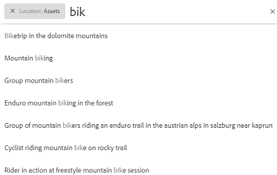
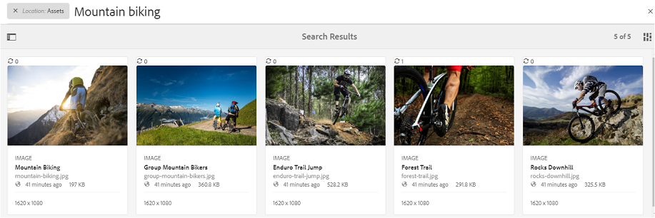
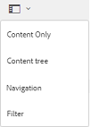
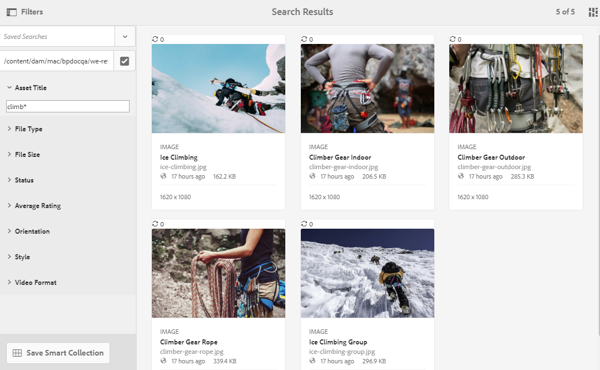
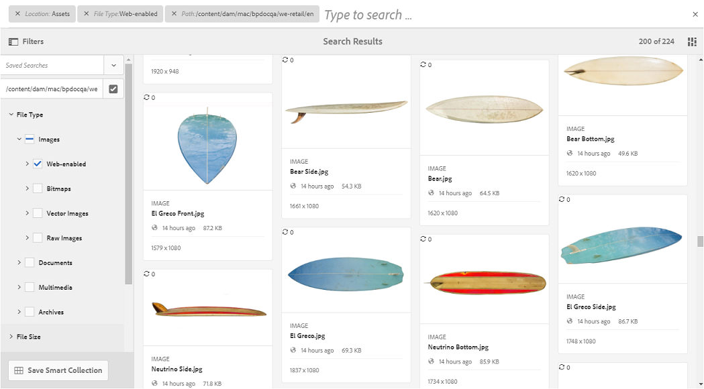
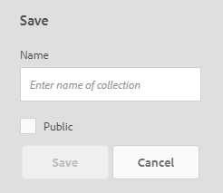
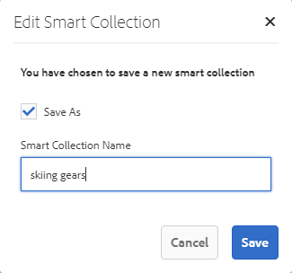

# Suchen von Assets in Brand Portal {#search-assets-on-brand-portal}

Die Suchfunktion in Brand Portal ermöglicht Ihnen die schnelle Suche nach relevanten Assets mittels Omnisearch und Facettensuche. Die Facettensuche verwendet Filter, um die Suche weiter einzugrenzen. Sie können Ihre Suchvorgänge auch als Smart-Sammlungen für die Zukunft speichern.

## Suchen von Assets mithilfe von Omnisearch {#search-assets-using-omnisearch}

Gehen Sie wie folgt vor, um in Brand Portal nach Assets zu suchen:

1. Klicken Sie in der Symbolleiste auf das Symbol **[!UICONTROL Suchen]** oder drücken Sie die „**[!UICONTROL /]**“-Taste, um Omnisearch zu starten.

   

1. Geben Sie in das Suchfeld einen Suchbegriff für die Assets ein, die Sie suchen möchten.

   

   >[!NOTE]
   >
   >Hierfür sind mindestens 3 Zeichen in Omnisearch erforderlich, damit Suchvorschläge angezeigt werden.

1. Wählen Sie aus den relevanten Vorschlägen in der Dropdown-Liste ein Asset aus, auf das Sie schnell zugreifen möchten.

   

   *Asset-Suche mithilfe von Omnisearch*

Weitere Informationen zum Suchverhalten in Bezug auf mit Smart-Tags versehenen Assets finden Sie unter [Nachvollziehen von Suchergebnissen und -verhalten](https://helpx.adobe.com/de/experience-manager/6-5/assets/using/search-assets.html).

## Suche mithilfe von Facetten im Bereich „Filter“  {#search-using-facets-in-filters-panel}

Suchfacetten im Bereich „Filter“ fügen Granularität zu Ihrer Suche hinzu und machen die Suchfunktion effizient. Suchfacetten verwenden mehrere Dimensionen (Prädikate), mit denen Sie komplexe Suchvorgänge durchführen können. Sie können einfach einen Drilldown zur gewünschten Detailtiefe durchführen, um die Suche zu konzentrieren.

Wenn Sie beispielsweise nach einem Bild suchen, können Sie auswählen, ob Sie ein Bitmap- oder ein Vektorbild möchten. Sie können den Umfang der Suche weiter verringern, indem Sie den MIME-Typ für das Bild in der Dateityp-Suchfacette angeben. Wenn Sie nach Dokumenten suchen, können Sie auf ähnliche Weise das gewünschte Format festlegen, z. B. PDF oder MS Word.

Der Bereich **[!UICONTROL Filter]** enthält einige Standardfacetten, wie z. B. **[!UICONTROL Pfadbrowser]**, **[!UICONTROL Dateityp]**, **[!UICONTROL Dateigröße]**, **[!UICONTROL Status]** und **[!UICONTROL Ausrichtung]**. Sie können jedoch [benutzerdefinierte Suchfacetten hinzufügen](../using/brand-portal-search-facets.md) oder spezifische Suchfacetten aus dem Bereich **[!UICONTROL Filter]** entfernen, indem Sie im zugrunde liegenden Suchformular Prädikate hinzufügen oder entfernen. Siehe die Liste aller verfügbaren und verwendbaren [Suchprädikate in Brand Portal](../using/brand-portal-search-facets.md#list-of-search-predicates).

So können Sie mit den verfügbaren [Suchfacetten](../using/brand-portal-search-facets.md) die Filter auf Ihre Suche anwenden:

1. Klicken Sie auf das Symbol „Überlagerung“ und wählen Sie **[!UICONTROL Filter]**.

   

1. Wählen Sie im Bereich **[!UICONTROL Filter]** auf der linken Seite die entsprechenden Optionen aus, um die relevanten Filter anzuwenden.
Verwenden Sie beispielsweise die folgenden Standardfilter:

   * Nutzen Sie den **[!UICONTROL Pfadbrowser]** um Assets in einem bestimmten Verzeichnis zu suchen. Der Standardsuchpfad der Sucheigenschaft für den Pfadbrowser lautet `/content/dam/mac/<tenant-id>/`. Dieser kann durch Bearbeiten des Standardsuchformulars konfiguriert werden.
   >[!NOTE]
   >
   >Für Benutzer ohne Administratorrechte zeigt der [!UICONTROL Pfadbrowser] im Bereich [!UICONTROL Filter] nur die Inhaltsstruktur der Ordner (und der Vorgängerordner) an, die für sie freigegeben sind.\
   >Administratoren können über den Pfadbrowser zu einem beliebigen Ordner in Brand Portal navigieren.

   * **[!UICONTROL Dateityp]**, um den Typ (Bild, Dokument, Multimedia, Archiv) der gesuchten Asset-Datei anzugeben. Darüber hinaus können Sie den Umfang Ihrer Suche einschränken. Geben Sie zum Beispiel den MIME-Typ (TIFF, Bitmap, GIMP-Bilder) für Bilder oder Formate (PDF oder MS Word) für die Dokumente an.
   * **[!UICONTROL Dateigröße]**, um nach Assets basierend auf ihrer Größe zu suchen. Sie können die untere und obere Grenze für den Größenbereich ausgeben, um Ihre Suche einzuschränken und die Maßeinheit für die Suche anzugeben.
   * **[!UICONTROL Status]**, um basierend auf dem Asset-Status, z. B. Genehmigung (Genehmigt, Änderung angefordert, Abgelehnt, Ausstehend) und Ablauf, nach Assets zu suchen.
   * **[!UICONTROL Durchschnittliche Bewertung]**, um nach Assets, basierend auf ihrer Bewertung, zu suchen.
   * **[!UICONTROL Ausrichtung]**, um nach Assets, basierend auf ihrer Ausrichtung (horizontal, vertikal, quadratisch), zu suchen.
   * **[!UICONTROL Stil]**, um basierend auf dem Stil (farbig, einfarbig) der Assets nach Assets zu suchen.
   * **[!UICONTROL Videoformat]**, um basierend auf dem Format von Video-Assets (DVI, Flash, MPEG4, MPEG, OGG Theora, QuickTime, Windows Media, WebM) nach Video-Assets zu suchen.

   Sie können im Bedienfeld „Filter“ [benutzerdefinierte Suchfacetten](../using/brand-portal-search-facets.md) verwenden, indem Sie das zugrunde liegende Suchformular bearbeiten.

   * Wenn im Suchformular verwendet, können Sie mithilfe von **[!UICONTROL Eigenschaftsprädikat]** nach Assets suchen, die mit einer Metadateneigenschaft übereinstimmen, der das Prädikat zugeordnet ist.\
      Wenn beispielsweise das Eigenschaftsprädikat [!UICONTROL `jcr:content /metadata/dc:title`] zugeordnet ist, können Sie Assets auf Grundlage ihres Titels suchen.\
      Das [!UICONTROL Eigenschaftsprädikat] unterstützt die Textsuche nach Folgendem:

      **Unvollständige Begriffe**
Wenn Sie die Asset-Suche mithilfe unvollständiger Suchbegriffe im Eigenschaftsprädikat ermöglichen möchten, aktivieren Sie im Suchformular das Kontrollkästchen **[!UICONTROL Teilsuche]**.\
      Auf diese Weise können Sie nach gewünschten Assets suchen, selbst wenn Sie nicht den genauen Wortlaut/die genauen Begriffe angeben, die in den Asset-Metadaten verwendet werden.\
      Sie haben folgende Möglichkeiten:
      * Geben Sie im Bedienfeld „Filter“ in der Facette ein Wort an, das im gesuchten Satz vorhanden ist. Suchen Sie beispielsweise nach dem Begriff **klettern** (und das Eigenschaftsprädikat ist der Eigenschaft [!UICONTROL `dc:title`] zugeordnet), dann werden alle Assets mit dem Wort **klettern** in der Titelphrase zurückgegeben.
      * Geben Sie einen Teil des Wortes ein, das im Suchbegriff vorkommt, und setzen Sie in die Lücken das Platzhalterzeichen (*) ein.
Beispiel für die Suche nach:
         * **klettern*** gibt alle Assets zurück, deren Titelphrase Wörter enthält, die mit den Zeichen „klettern“ beginnen.
         * ***klettern** gibt alle Assets zurück, deren Titelphrase Wörter enthält, die mit den Zeichen „klettern“ enden.
         * **\*klettern\*** gibt alle Assets zurück, deren Titelphrase Wörter enthält, die die Zeichen „klettern“ enthalten.

Um eine Suche ohne Groß-/Kleinschreibung im Eigenschaftsprädikat zuzulassen, aktivieren Sie das Kontrollkästchen       **Text ohne Berücksichtigung der Groß- und Kleinschreibung**
Um die Suche im Eigenschaftsprädikat ohne Berücksichtigung der Groß-/Kleinschreibung zuzulassen, aktivieren Sie das Kontrollkästchen **[!UICONTROL Groß- und Kleinschreibung ignorieren]** im Suchformular. Bei der Textsuche im Eigenschaftsprädikat wird standardmäßig zwischen Groß- und Kleinschreibung unterschieden.
   >[!NOTE]
   >
   >Nach Aktivierung des Kontrollkästchens **[!UICONTROL Teilsuche]** wird **[!UICONTROL Groß-/Kleinschreibung ignorieren]** standardmäßig aktiviert.

   

   Die Suchergebnisse werden entsprechend den angewendeten Filtern angezeigt, zusammen mit der Anzahl der Suchergebnisse.

   

   Asset-Suchergebnis mit Suchergebniszählung.

1. Sie können einfach zu einem Element in den Suchergebnissen navigieren und mit der Schaltfläche „Zurück“ in Ihrem Browser zum selben Suchergebnis zurückkehren, ohne die Suchabfrage erneut starten zu müssen.

## Suchen als Smart-Sammlung speichern {#save-your-searches-as-smart-collection}

Sie können die Sucheinstellungen als Smart-Sammlung speichern, damit Sie dieselbe Suche zu einem späteren Zeitpunkt wiederholen können, ohne die Einstellungen erneut vornehmen zu müssen.

So speichern Sie die Sucheinstellungen als Smart-Sammlung:

1. Tippen/klicken Sie auf **[!UICONTROL Smart-Sammlung speichern]** und geben Sie einen Namen für die Smart-Sammlung ein.

   Damit die Smart-Sammlung von allen Benutzern verwendet werden kann, aktivieren Sie die Option **[!UICONTROL Öffentlich]**. Eine Meldung bestätigt, dass die Smart-Sammlung erstellt und zur Liste der gespeicherten Suchen hinzugefügt wurde.

   >[!NOTE]
   >
   >Benutzer ohne Administratorrechte können daran gehindert werden, Smart-Sammlungen öffentlich zu machen. So kann verhindert werden, dass Benutzer ohne Administratorrechte eine große Anzahl öffentlicher Smart-Sammlungen im Brand Portal der Organisation erstellen. Unternehmen können die Konfiguration **[!UICONTROL Erstellung öffentlicher Smart-Sammlungen zulassen]** im Admin Tools-Bereich unter den Einstellungen **[!UICONTROL Allgemein]** deaktivieren.

   

1. Um die Smart-Sammlung unter einem anderen Namen zu speichern, aktivieren oder deaktivieren Sie das Kontrollkästchen **[!UICONTROL Öffentlich]** und klicken Sie auf **[!UICONTROL Smart-Sammlung bearbeiten]**.

   

1. Wählen Sie im Dialogfeld **[!UICONTROL Smart-Sammlung bearbeiten]** die Option **[!UICONTROL Speichern unter]** aus und geben Sie einen Namen für die Smart-Sammlung ein. Klicken Sie auf **[!UICONTROL Speichern]**.

   
