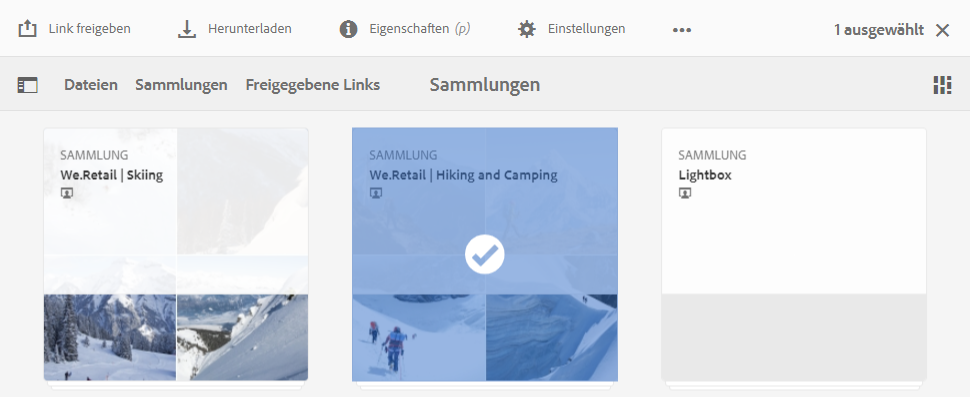
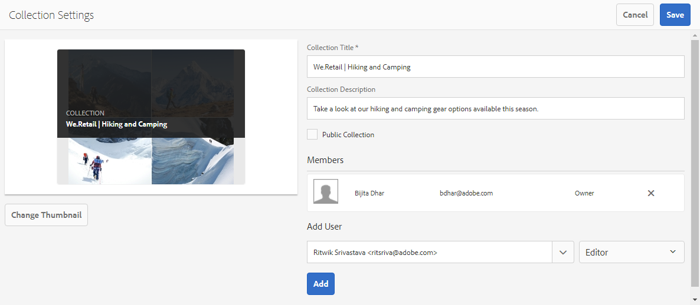
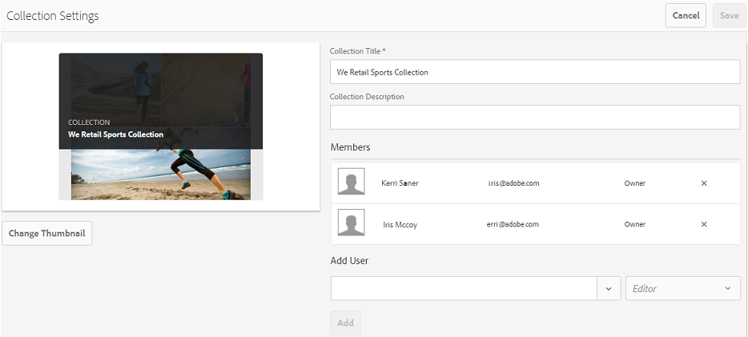
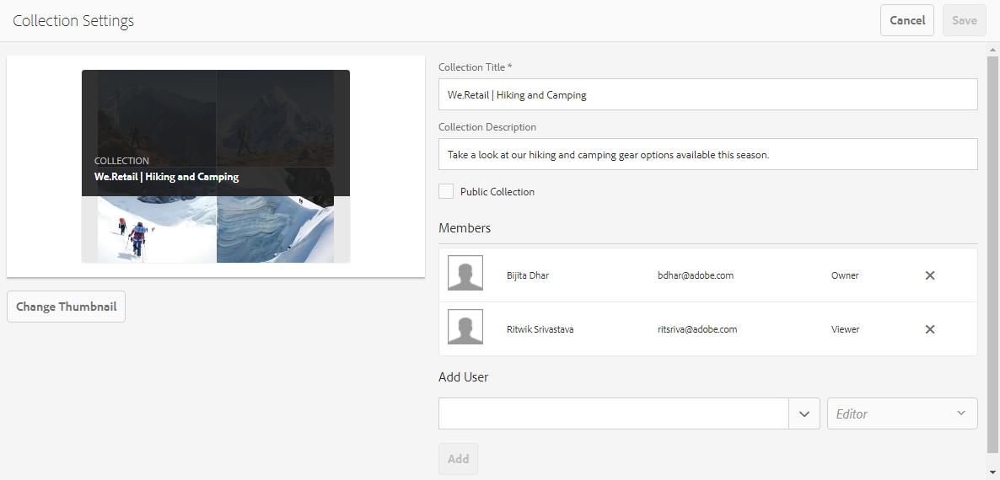
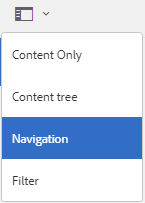
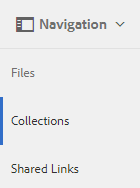

# Freigeben von Sammlungen {#share-collections}

Eine Sammlung stellt eine Gruppe verwandter Assets dar, die zusammen in Adobe Experience Manager Assets Brand Portal gespeichert werden. Benutzer können Smart-Sammlungen erstellen, indem sie [OmniSearch oder die Facettensuche anwenden, um verwandte Assets herauszufiltern](brand-portal-searching.md) und sie zusammen zu speichern, damit sie leicht zugänglich sind und von anderen Benutzern von Brand Portal gemeinsam genutzt werden können.

Die Administratoren können eine Sammlung für die autorisierten Benutzer von Brand Portal freigeben oder die Freigabe aufheben. Bearbeiter und Betrachter können nur die Sammlungen anzeigen und freigeben, die sie selbst erstellt haben, die für sie freigegeben wurden oder die als „Öffentlich“ festgelegt sind.

>[!NOTE]
>
>Bearbeiter können eine öffentliche Sammlung nicht in eine nicht öffentliche Sammlung ändern. Daher steht für sie das Kontrollkästchen **[!UICONTROL Öffentliche Sammlung]** im Dialogfeld **[!UICONTROL Einstellungen für Sammlung]** nicht zur Verfügung.

## Freigeben von Sammlungen {#share-collection}

Im Folgenden finden Sie die Schritte zum Freigeben einer Sammlung für die autorisierten Benutzer von Brand Portal:

1. Melden Sie sich bei Ihrem Brand Portal-Mandanten an. Standardmäßig wird die Ansicht **[!UICONTROL Dateien]** geöffnet, die alle veröffentlichten Assets und Ordner enthält.

1. Klicken Sie oben in der Schnellnavigation auf **[!UICONTROL Sammlungen]**.

1. Führen Sie in der Konsole **[!UICONTROL Sammlungen]** einen der folgenden Schritte aus:

   * Bewegen Sie den Mauszeiger über die Sammlung, die Sie freigeben möchten. Klicken Sie in den verfügbaren Schnellzugriff-Miniaturansichten der Sammlung auf das Symbol **[!UICONTROL Einstellungen]**.

      

   * Wählen Sie die Sammlung aus, die Sie freigeben möchten. Klicken Sie oben in der Symbolleiste auf **[!UICONTROL Einstellungen]**.

      

1. Wählen Sie im Dialogfeld **[!UICONTROL Einstellungen für Sammlung]** die Benutzer aus, für die Sie die Sammlung freigeben möchten, und wählen Sie für einen Benutzer die Rolle aus, die seiner globalen Rolle entspricht. Weisen Sie zum Beispiel die Rolle „Bearbeiter“ einem globalen Bearbeiter und die Rolle „Betrachter“ einem globalen Betrachter zu.

   Um die Sammlung dagegen für alle Benutzer unabhängig von der Gruppenmitgliedschaft und Rolle verfügbar zu machen, aktivieren Sie das Kontrollkästchen **[!UICONTROL Öffentliche Sammlung]**, damit die Sammlung als „Öffentlich“ festgelegt ist.

   >[!NOTE]
   >
   >Sie können festlegen, dass Benutzer ohne Administratorrechte Sammlungen nicht als „Öffentlich“ festlegen können, um zu verhindern, dass eine große Anzahl öffentlicher Sammlungen erstellt wird. Auf diese Weise wird Systemspeicherplatz eingespart. Unternehmen können die Konfigurationseinstellung **[!UICONTROL Erstellung öffentlicher Sammlungen zulassen]** in den **[!UICONTROL Allgemeinen Einstellungen]** im Admin Tools-Bereich deaktivieren.

   

   Bearbeiter können eine öffentliche Sammlung nicht in eine nicht öffentliche Sammlung ändern. Daher steht für sie das Kontrollkästchen **[!UICONTROL Öffentliche Sammlung]** im Dialogfeld **[!UICONTROL Einstellungen für Sammlung]** nicht zur Verfügung.

   

1. Klicken Sie auf die Schaltfläche **[!UICONTROL Hinzufügen]**, um den Benutzer hinzuzufügen, und klicken Sie dann auf **[!UICONTROL Speichern]**. Die Sammlung wird für die Benutzer freigegeben.

   >[!NOTE]
   >
   >Die Rolle der Benutzer legt fest, welchen Zugriff sie auf die Assets und Ordner in der Sammlung erhalten. Wenn ein Benutzer keinen Zugriff auf Assets hat, wird eine leere Sammlung für den Benutzer freigegeben. Die Rolle der Benutzer legt außerdem fest, welche Aktionen ihnen für die Sammlung zur Verfügung stehen.

## Freigabe von Sammlungen aufheben {#unshare-a-collection}

Gehen Sie wie folgt vor, um die Freigabe einer zuvor freigegebenen Sammlung aufzuheben:

1. Wählen Sie in der Konsole **[!UICONTROL Sammlungen]** die Sammlung aus, deren Freigabe Sie aufheben möchten.

   Klicken Sie oben in der Symbolleiste auf **[!UICONTROL Einstellungen]**.

   

1. Klicken Sie im Dialogfeld **[!UICONTROL Einstellungen für Sammlung]** unter dem Abschnitt **[!UICONTROL Mitglieder]** auf das **[!UICONTROL x]**-Symbol neben den Benutzern, um sie aus der Liste der Benutzer zu entfernen, die Zugriff auf die Sammlung haben.

   

1. Eine Warnmeldung wird angezeigt. Klicken Sie auf **[!UICONTROL Bestätigen]**, um die Freigabe der Sammlung aufzuheben.

1. Klicken Sie auf **[!UICONTROL Speichern]**, um die Änderungen zu speichern.

   Nachdem der Benutzer aus der Liste der freigegebenen Benutzer entfernt wurde, wird die nicht freigegebene Sammlung aus der Konsole **[!UICONTROL Sammlungen]** des Benutzers entfernt.

<!--
1. Click the overlay icon on the left, and choose **[!UICONTROL Navigation]**.

   

1. From the siderail on the left, click **[!UICONTROL Collections]**.

   

1. From the **[!UICONTROL Collections]** console, do one of the following:

    * Hover the pointer over the collection you want to share. From the quick action thumbnails available for the collection, click the **[!UICONTROL Settings]** icon.

   

    * Select the collection you want to share. From the toolbar at the top, click **[!UICONTROL Settings]**.
    
   

1. In the [!UICONTROL Collection Settings] dialog box, select the users or groups with whom you want to share the collection and select the role for a user or a group to match their global role. For example, assign the Editor role to a global editor, the Viewer role to a global viewer.

   Alternatively, to make the collection available to all users irrespective of their group membership and role, make it public by selecting the **[!UICONTROL Public Collection]** check-box.

   >[!NOTE]
   >
   >However, non-admin users can be restricted from creating public collections, to avoid having numerous public collections so that system space can be saved. Organizations can disable the **[!UICONTROL Allow public collections creation]** configuration from [!UICONTROL General] settings available in admin tools panel.

   

   Editors cannot change a public collection to a non-public collection and, therefore, do not have **[!UICONTROL Public Collection]** check-box available in **[!UICONTROL Collection Settings]** dialog.

   

1. Select **[!UICONTROL Add]**, and then **[!UICONTROL Save]**. The collection is shared with the chosen users.

   >[!NOTE]
   >
   >A user's role governs access to the assets and folders inside a collection. If a user does not have access to assets, an empty collection is shared with the user. Also, a user's role governs the actions available for collections.

## Unshare a collection {#unshare-a-collection}

To unshare a previously shared collection, do the following:

1. From the **[!UICONTROL Collections]** console, select the collection you want to unshare.

   In the toolbar, click **[!UICONTROL Settings]**.

   

1. On the **[!UICONTROL Collection Settings]** dialog box, under **[!UICONTROL Members]**, click the **[!UICONTROL x]** symbol next to users or groups to remove them from the list of users you shared the collection with.

   

1. In the warning message box, click **[!UICONTROL Confirm]** to confirm unshare.

   Click **[!UICONTROL Save]**.

1. Log in to Brand Portal with the credentials of the user you removed from the shared list. The collection is removed from the **[!UICONTROL Collections]** console.
-->
