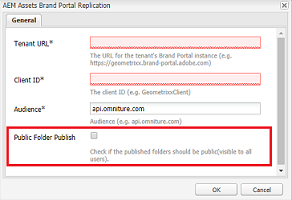
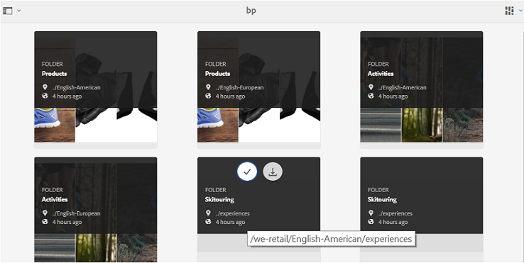
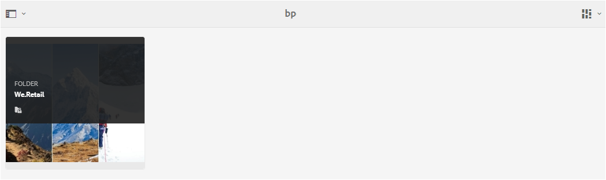
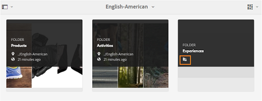
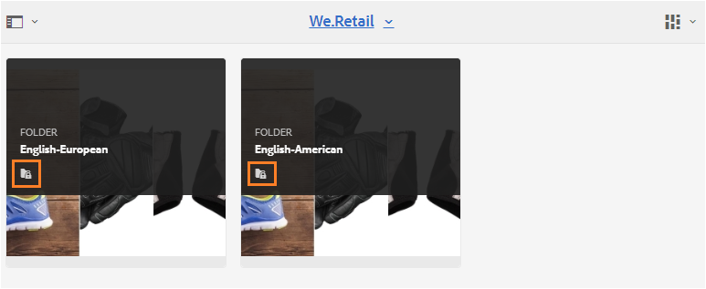
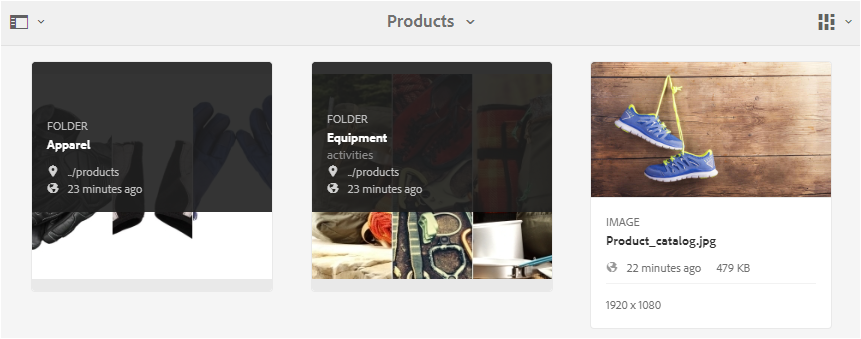
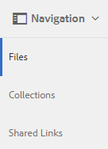
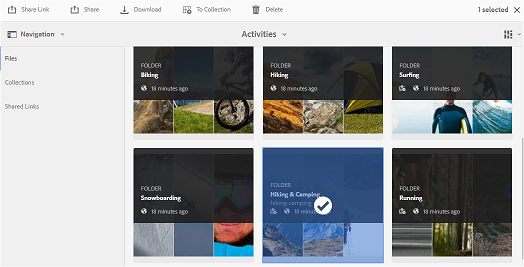
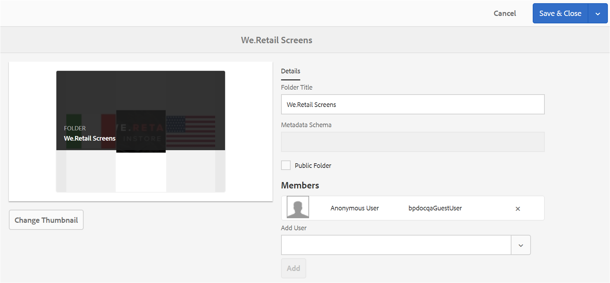
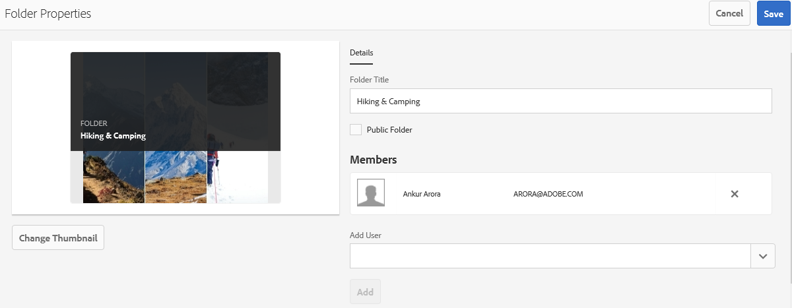

# Ordner in Brand Portal freigeben {#share-folders}

Assets müssen in Brand Portal aus einer vorkonfigurierten AEM-Autoreninstanz veröffentlicht werden, da Brand Portal die Asset-Erfassung nicht unterstützt.

## Workflow zur Ordnerfreigabe in Brand Portal   {#folder-sharing-workflow-in-brand-portal}

Nachfolgend werden der Ordnerfreigabe-Arbeitsablauf und der Benutzerzugriff beschrieben:

* Standardmäßig werden alle aus AEM Assets in Brand Portal veröffentlichten Ordner nur für den Brand Portal-Administrator angezeigt, wenn sie bei der Konfiguration der Replikation nicht als „Öffentlich“ gekennzeichnet sind.
* Der Administrator nutzt die Konsole **[!UICONTROL Ordnereigenschaften]**, um einen Ordner für ausgewählte Benutzer oder Gruppen freizugeben. Nur die Benutzer und Gruppen, für die die Ordner freigegeben wurden, können den Ordner nach dem Anmelden bei Brand Portal sehen. Der Ordner ist für andere Benutzer nicht sichtbar.
* Der Administrator kann auch festlegen, dass ein Ordner öffentlich zugänglich gemacht wird, und zwar durch das Kontrollkästchen **[!UICONTROL Öffentlicher Ordner]**in den**[!UICONTROL  Ordnereigenschaften]**. Ein öffentlicher Ordner ist für alle Benutzer sichtbar.

* Wenn sich Benutzer bei Brand Portal anmelden, sehen sie unabhängig von den Benutzerrollen und Berechtigungen alle öffentlichen Ordner sowie die Ordner, die direkt für sie oder ihre Gruppe freigegeben wurden. Private Ordner oder für andere Benutzer freigegebene Ordner sind nicht für alle Benutzer sichtbar.

### Freigeben von Ordnern für Benutzergruppen in Brand Portal {#sharing-folders-with-user-groups-on-brand-portal}

Die Zugriffsrechte für die Assets eines Ordners hängen von den Zugriffsrechten für den jeweiligen übergeordneten Ordner ab, unabhängig von den Einstellungen der untergeordneten Ordner. Dieses Verhalten wird in AEM durch [ACLs](https://helpx.adobe.com/experience-manager/6-5/sites/administering/using/security.html#PermissionsinAEM) gesteuert, da untergeordnete Ordner die ACLs von den jeweiligen übergeordneten Ordnern erben. Wenn beispielsweise Ordner A den Ordner B enthält und dieser wiederum den Ordner C, haben Benutzergruppen (oder Benutzer), die Zugriffsrechte für Ordner A haben, auch dieselben Zugriffsrechte für Ordner B und Ordner C. Da Ordner B dem Ordner A untergeordnet ist, erbt er die ACLs von Ordner A. Und da Ordner C dem Ordner B untergeordnet ist, erbt er die ACLs von Ordner B.

Entsprechend haben Benutzergruppen (oder Benutzer), die nur Zugriffsberechtigungen für den Ordner B haben, dieselben Berechtigungen für den Ordner C, aber nicht für Ordner A. Daher wird empfohlen, dass Unternehmen ihre Inhalte so anordnen, dass die am meisten exponierten Assets in die untergeordneten Ordner eingefügt werden. Der Zugriff vom untergeordneten Ordner auf den Stammordner kann eingeschränkt werden.

### Veröffentlichen von öffentlichen Ordnern {#public-folder-publish}

Sofern die Option **[!UICONTROL Öffentlichen Ordner veröffentlichen]**bei der Konfiguration der Brand Portal-Replikation nicht aktiviert wurde, haben Benutzer ohne Administratorrechte (z. B. Editoren und Betrachter) keinen Zugriff auf Assets, die aus AEM Assets in Brand Portal veröffentlicht wurden.

Wenn die Option **[!UICONTROL Öffentlichen Ordner veröffentlichen]**deaktiviert ist, müssen Administratoren diese Assets mithilfe der Freigabefunktion speziell für Benutzer ohne Administratorrechte freigeben.

>[!NOTE]
>
>Die Option **[!UICONTROL Veröffentlichung eines öffentlichen Ordners]**ist ab AEM-Version 6.3.2.1 verfügbar.

## Zugriff auf freigegebene Ordner {#access-to-shared-folders}

In der folgenden Matrix werden die Zugriffsberechtigungen und die Berechtigungen für Freigabe/Aufheben der Freigabe für verschiedene Benutzerrollen dargestellt:

|  | Zugriff auf alle Ordner, die aus AEM Assets in Brand Portal veröffentlicht wurden | Zugriff auf freigegebene Ordner | Freigabe/Aufheben der Freigabe von Ordnerrechten |
|---------------|-----------|-----------|------------|
| Administrator | Ja | Ja | Ja |
| Bearbeiter | Nein* | Ja, nur wenn die Ordner für die Benutzer oder deren Gruppe freigegeben wurden | Ja, nur für die Ordner, die für die Benutzer oder deren Gruppe freigegeben wurden |
| Betrachter | Nein* | Ja, nur wenn die Ordner für die Benutzer oder deren Gruppe freigegeben wurden | Nein |
| Gastbenutzer | Nein* | Ja, nur wenn die Ordner für die Benutzer oder deren Gruppe freigegeben wurden | Nein |

**Standardmäßig ist die Option **[!UICONTROL Öffentlichen Ordner veröffentlichen]**bei der Konfiguration der Replikation von Brand Portal mit AEM-Autor deaktiviert. Wenn die Option aktiviert ist, können standardmäßig alle Benutzer (auch Benutzer ohne Administratorrechte) auf die in Brand Portal veröffentlichten Ordner zugreifen.*

### Zugriff von Benutzern ohne Administratorrechte auf freigegebene Ordner   {#non-admin-user-access-to-shared-folders}

Benutzer ohne Administratorrechte können nur auf die Ordner zugreifen, die in Brand Portal für sie freigegeben sind. Wie diese Ordner jedoch im Portal angezeigt werden, wenn sich die Benutzer anmelden, hängt von den Einstellungen der Konfiguration **[!UICONTROL Ordnerhierarchie aktivieren]**.

**Wenn die Konfiguration deaktiviert ist**

Benutzer ohne Administratorrechte, die sich bei Brand Portal anmelden, sehen auf der   Zielseite, bei der Anmeldung in Brand Portal.

**Wenn die Konfiguration aktiviert ist**

Benutzer ohne Administratorrechte, die sich bei Brand Portal anmelden, sehen die Ordnerstruktur (angefangen beim Stammordner) und die freigegebenen Ordner in den jeweiligen übergeordneten Ordnern.

Diese übergeordneten Ordner sind virtuelle Ordner und für sie können keine Aktionen durchgeführt werden. Sie können diese virtuellen Ordner an einem Schlosssymbol erkennen.

Im Gegensatz zu freigegebenen Ordnern sind keine Aktionsaufgaben zu sehen, wenn Sie den Mauszeiger auf die Ordner bewegen oder sie in der **[!UICONTROL Kartenansicht]**auswählen. Die Schaltfläche**[!UICONTROL &#x200B;Überblick]** wird angezeigt, wenn Sie einen virtuellen Ordner in der **[!UICONTROL Spaltenansicht]**und**[!UICONTROL  Listenansicht]** auswählen.

>[!NOTE]
>
>Beachten Sie, dass das Standardminiaturbild der virtuellen Ordner das Miniaturbild des ersten freigegebenen Ordners ist.

   

## Freigeben von Ordnern {#how-to-share-folders}

Führen Sie folgende Schritte aus, um einen Ordner in Brand Portal für Benutzer freizugeben:

1. Klicken Sie links auf das Überlagerungssymbol und wählen Sie dann **[!UICONTROL Navigation]**.

   

1. Wählen Sie links in der Seitenleiste **[!UICONTROL Dateien]**aus.

   

1. Wählen Sie in der Brand Portal-Benutzeroberfläche den Ordner aus, den Sie freigeben möchten.

   

1. Klicken Sie oben in der Symbolleiste auf **[!UICONTROL Freigeben]**.

   

   Die Konsole [!UICONTROL Ordnereigenschaften] wird angezeigt.

   

1. Geben Sie in der Konsole **[!UICONTROL Ordnereigenschaften]**im Feld**[!UICONTROL  Ordnertitel]** den Titel des Ordners an, wenn die Benutzer den Standardnamen nicht sehen sollen.
1. Wählen Sie aus der Liste **[!UICONTROL Benutzer hinzufügen]**den Benutzer oder die Gruppe aus, für den/die Sie den Ordner freigeben möchten, und klicken Sie auf**[!UICONTROL  Hinzufügen]**.
Um den Ordner nur für Gastbenutzer und keine anderen Benutzer freizugeben, wählen Sie **[!UICONTROL Anonyme Benutzer]**aus dem Dropdown-Menü**[!UICONTROL  Mitglieder]**.

   

   >[!NOTE]
   >
   >Um den Ordner allen Benutzern unabhängig von ihrer Gruppenzugehörigkeit und -rolle zur Verfügung zu stellen, machen Sie ihn öffentlich, indem Sie das Kontrollkästchen **[!UICONTROL Öffentlicher Ordner]**aktivieren.

1. Klicken Sie, falls nötig, auf **[!UICONTROL Miniaturbild ändern]**, um das Miniaturbild für den Ordner zu ändern.
1. Klicken Sie auf **[!UICONTROL Speichern]**.
1. Um auf den freigegebenen Ordner zuzugreifen, melden Sie sich bei Brand Portal mit den Anmeldeinformationen des Benutzers an, für den Sie den Ordner freigegeben haben. Überprüfen Sie den freigegebenen Ordner in der Benutzeroberfläche.

## Aufheben der Freigabe von Ordnern   {#unshare-the-folders}

Gehen Sie wie folgt vor, um die vormalige Freigabe eines Ordners aufzuheben:

1. Wählen Sie in der Brand Portal-Benutzeroberfläche den Ordner aus, dessen Freigabe Sie aufheben möchten.

   

1. Klicken Sie oben in der Symbolleiste auf **[!UICONTROL Freigeben]**.
1. Klicken Sie in der Konsole **[!UICONTROL Ordnereigenschaften]**unter**[!UICONTROL  Mitglieder]** auf das **[!UICONTROL x]**-Symbol neben einem Benutzer um diesen aus der Liste der Benutzer zu entfernen, für die Sie den Ordner freigegeben haben.

   

1. Klicken Sie in der Warnmeldung auf **[!UICONTROL Bestätigen]**, um das Aufheben der Freigabe zu bestätigen.
Klicken Sie auf**[!UICONTROL  Speichern]**.

1. Melden Sie sich bei Brand Portal mit den Anmeldeinformationen des Benutzers an, den Sie aus der freigegebenen Liste entfernt haben. Der Ordner ist in der Brand Portal-Oberfläche für den Benutzer nicht mehr verfügbar.
