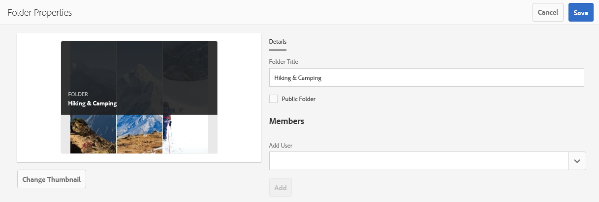

# Ordner auf Markenportal freigeben {#share-folders}

Assets müssen in Brand Portal aus einer vorkonfigurierten AEM-Autoreninstanz veröffentlicht werden, da Brand Portal die Asset-Erfassung nicht unterstützt.

## Workflow zur Ordnerfreigabe in Brand Portal {#folder-sharing-workflow-in-brand-portal}

Nachfolgend werden der Ordnerfreigabe-Arbeitsablauf und der Benutzerzugriff beschrieben:

* Standardmäßig werden alle aus AEM Assets in Brand Portal veröffentlichten Ordner nur für den Brand Portal-Administrator angezeigt, wenn sie bei der Konfiguration der Replikation nicht als „Öffentlich“ gekennzeichnet sind.
* The Administrator uses the **Folder Properties** console to share a folder with selective users or groups. Nur die Benutzer und Gruppen, für die die Ordner freigegeben wurden, können den Ordner nach dem Anmelden bei Brand Portal sehen. Der Ordner ist für andere Benutzer nicht sichtbar.
* The Administrator can also choose to make a folder public through the **Public Folder** check box in the **Folder Properties** console. Ein öffentlicher Ordner ist für alle Benutzer sichtbar.

* Wenn sich Benutzer bei Brand Portal anmelden, sehen sie unabhängig von den Benutzerrollen und Berechtigungen alle öffentlichen Ordner sowie die Ordner, die direkt für sie oder ihre Gruppe freigegeben wurden. Private Ordner oder für andere Benutzer freigegebene Ordner sind nicht für alle Benutzer sichtbar.

### Share folders with user groups on Brand Portal {#sharing-folders-with-user-groups-on-brand-portal}

Die Zugriffsrechte für die Assets eines Ordners hängen von den Zugriffsrechten für den jeweiligen übergeordneten Ordner ab, unabhängig von den Einstellungen der untergeordneten Ordner. Dieses Verhalten wird in AEM durch [ACLs](https://helpx.adobe.com/experience-manager/6-5/sites/administering/using/security.html#PermissionsinAEM) gesteuert, da untergeordnete Ordner die ACLs von den jeweiligen übergeordneten Ordnern erben. Wenn beispielsweise Ordner A den Ordner B enthält und dieser wiederum den Ordner C, haben Benutzergruppen (oder Benutzer), die Zugriffsrechte für Ordner A haben, auch dieselben Zugriffsrechte für Ordner B und Ordner C. Da Ordner B dem Ordner A untergeordnet ist, erbt er die ACLs von Ordner A. Und da Ordner C dem Ordner B untergeordnet ist, erbt er die ACLs von Ordner B.

Benutzergruppen (oder Benutzer) haben dieselben Zugriffsberechtigungen für Ordner C, jedoch nicht für Ordner A. Es wird daher empfohlen, dass die Unternehmen ihren Inhalt so anordnen, dass die meisten offen gelegten Assets im untergeordneten Ordner platziert werden und von Kindern zum Stammordner-Zugriff eingeschränkt werden können.

### Veröffentlichen von öffentlichen Ordnern {#public-folder-publish}

Unless the **Public Folder Publish** option is selected while configuring Brand Portal replication, non-admin users (such as Editors and Viewers) do not have access to assets published from AEM Assets to Brand Portal.

If the **Public Folder Publish** option is disabled, administrators need to specifically share these assets with non-admin users using share capability.

>[!NOTE]
>
>The option to enable **Public Folder Publish** is available in AEM 6.3.2.1 onwards.

## Zugriff auf freigegebene Ordner {#access-to-shared-folders}

In der folgenden Matrix werden die Zugriffsberechtigungen und die Berechtigungen für Freigabe/Aufheben der Freigabe für verschiedene Benutzerrollen dargestellt:

|  | Zugriff auf alle Ordner, die aus AEM Assets in Brand Portal veröffentlicht wurden | Zugriff auf freigegebene Ordner | Freigabe/Aufheben der Freigabe von Ordnerrechten |
|---------------|-----------|-----------|------------|
| Administrator | Ja | Ja | Ja |
| Bearbeiter | Nein* | Ja, nur wenn die Ordner für die Benutzer oder deren Gruppe freigegeben wurden | Ja, nur für die für sie freigegebenen Ordner oder für die Gruppe, zu der sie gehören |
| Betrachter | Nein* | Ja, nur wenn die Ordner für die Benutzer oder deren Gruppe freigegeben wurden | Nein |
| Gastbenutzer | Nein* | Ja, nur wenn die Ordner für die Benutzer oder deren Gruppe freigegeben wurden | Nein |

** Standardmäßig ist **die Option Öffentlichen**Ordner veröffentlichen deaktiviert, während die Replizierung von Brand Portal mit AEM Author konfiguriert wird. Wenn die Option aktiviert ist, können standardmäßig alle Benutzer (auch Benutzer ohne Administratorrechte) auf die in Brand Portal veröffentlichten Ordner zugreifen.* 

### Zugriff von Benutzern ohne Administratorrechte auf freigegebene Ordner {#non-admin-user-access-to-shared-folders}

Benutzer ohne Administratorrechte können nur auf die Ordner zugreifen, die in Brand Portal für sie freigegeben sind. Wie diese Ordner jedoch im Portal angezeigt werden, wenn sich die Benutzer anmelden, hängt von den Einstellungen der Konfiguration „Ordnerhierarchie aktivieren“ ab.

**Wenn die Konfiguration deaktiviert ist**

Benutzer ohne Administratorrechte, die sich bei Brand Portal anmelden, sehen auf der Einstiegsseite beim Anmelden beim Brand Portal.

**Wenn die Konfiguration aktiviert ist**

Benutzer ohne Administratorrechte, die sich bei Brand Portal anmelden, sehen die Ordnerstruktur (angefangen beim Stammordner) und die freigegebenen Ordner in den jeweiligen übergeordneten Ordnern.

Diese übergeordneten Ordner sind virtuelle Ordner und für sie können keine Aktionen durchgeführt werden. Sie können diese virtuellen Ordner an einem Schlosssymbol erkennen.

Im Gegensatz zu freigegebenen Ordnern sind keine Aktionsaufgaben zu sehen, wenn Sie den Mauszeiger auf die Ordner bewegen oder sie in der Kartenansicht auswählen. Die Schaltfläche „Überblick“ wird angezeigt, wenn Sie einen virtuellen Ordner in der Spaltenansicht und Listenansicht auswählen.

>[!NOTE]
>
>Beachten Sie, dass das Standardminiaturbild der virtuellen Ordner das Miniaturbild des ersten freigegebenen Ordners ist.

   

## Freigeben von Ordnern {#how-to-share-folders}

Führen Sie folgende Schritte aus, um einen Ordner in Brand Portal für Benutzer freizugeben:

1. Klicken Sie links auf das Überlagerungssymbol und wählen Sie dann **Navigation**.

   

2. From the siderail on the left, select **Files**.

   

3. Wählen Sie in der Marken-Portal-Oberfläche den Ordner aus, den Sie freigeben möchten.

   

4. From the toolbar at the top, select **Share**.

   

   Die Konsole **Ordnereigenschaften** wird angezeigt.

   

5. Geben Sie in der Konsole **Ordnereigenschaften** im Feld **Ordnertitel** den Titel des Ordners an, wenn die Benutzer den Standardnamen nicht sehen sollen.
6. Wählen Sie aus der Liste **Benutzer hinzufügen** den Benutzer oder die Gruppe aus, für den/die Sie den Ordner freigeben möchten, und klicken Sie auf **Hinzufügen**.
To share the folder with guest users only, and no other users, select **Anonymous Users** from the **Members** dropdown.

   

   >[!NOTE]
   >
   >To make the folder available to all users irrespective of their group membership and role, make it public by selecting the **Public Folder** check box.

7. Klicken Sie, falls nötig, auf **Miniaturbild ändern**, um das Miniaturbild für den Ordner zu ändern.
8. Klicken Sie auf **Speichern**.
9. Um auf den freigegebenen Ordner zuzugreifen, melden Sie sich bei Markenportal mit den Anmeldeinformationen des Benutzers an, für den Sie den Ordner freigegeben haben. Überprüfen Sie den freigegebenen Ordner in der Benutzeroberfläche.

## Aufheben der Freigabe von Ordnern {#unshare-the-folders}

Führen Sie folgende Schritte aus, um die Freigabe eines zuvor freigegebenen Ordners aufzuheben:

1. Wählen Sie in der Marken-Portal-Oberfläche den Ordner aus, den Sie aufheben möchten.

   

2. From the toolbar at the top, click **Share**.
3. In the **Folder Properties** console, under **Members**, click the **x** symbol next to a user to remove them from the list of users you shared the folder with.

   

4. Klicken Sie in der Warnmeldung auf **Bestätigen**, um das Aufheben der Freigabe zu bestätigen.
Klicken Sie auf **Speichern**.

5. Melden Sie sich bei Brand Portal mit den Anmeldeinformationen des Benutzers an, den Sie aus der freigegebenen Liste entfernt haben. Der Ordner ist nicht mehr in der Marken-Portal-Oberfläche für den Benutzer verfügbar.
