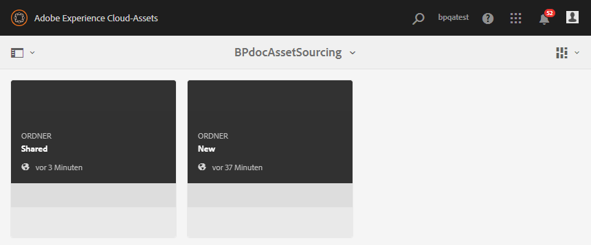
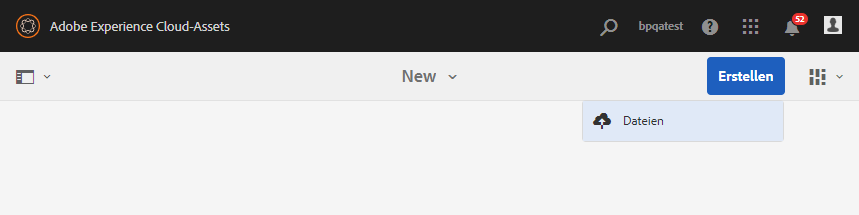
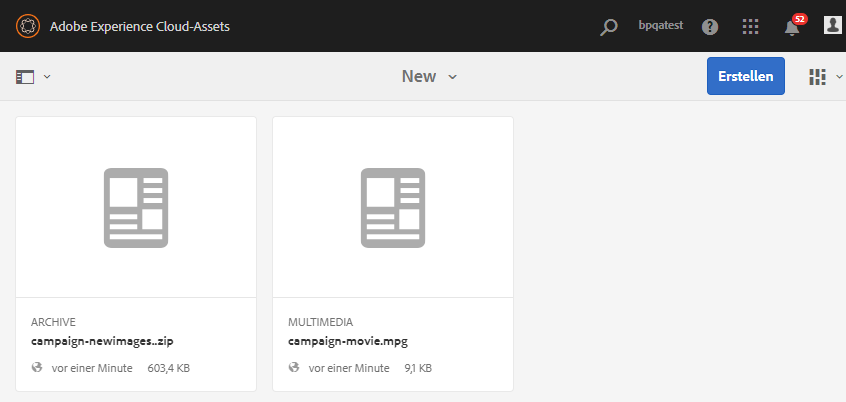

# Neue Assets in den Beitragsordner hochladen {#uplad-new-assets-to-contribution-folder}

Benutzer von Brand Portal [laden die Asset-Anforderungen](brand-portal-download-asset-requirements.md) herunter - ein kurzes Dokument, das dem Beitragsordner angehängt ist, und laden Grundelemente aus dem **SHARED** -Ordner herunter, um die Beitragsanforderungen zu verstehen.
Markenportal-Benutzer können dann neue Assets als Beitrag erstellen und sie in den **NEUEN** Ordner im Beitragsordner hochladen.

>[!NOTE]
>
>Markenportal-Benutzer können Inhalte/Assets nur in den **NEUEN** Ordner hochladen. Sie sind nicht berechtigt, ein hochgeladenes Asset zu löschen.
>
>Maximale Upload-Grenze für ein Markenportal-Konto/Mieter ist **10** GB.

**So laden Sie neue Assets hoch:**

1. Melden Sie sich bei Ihrer Brand Portal-Instanz an.
Das Markenportal-Dashboard spiegelt alle vorhandenen Ordner wider, die dem Markenportal-Benutzer erlaubt sind, zusammen mit dem neu freigegebenen Beitragsordner.
1. Klicken Sie auf , um den Beitragsordner zu öffnen. Im Beitragsordner werden zwei Unterordner **[!UICONTROL SHARED]** und **[!UICONTROL NEW]** angezeigt.
1. Klicken Sie auf **[!UICONTROL NEU]** Ordner.
   
1. Klicken Sie auf **[!UICONTROL Erstellen &gt; Dateien]**  , um einzelne Dateien oder Ordner (.zip) mit mehreren Assets hochzuladen.
   
1. Suchen Sie nach neuen Assets (Dateien/Ordner) und laden Sie sie in den **[!UICONTROL NEUEN]** Ordner hoch.
   

Nach dem Hochladen kann der Brand Portal-Benutzer den Beitragsordner wieder in AEM Assets veröffentlichen. Siehe Ordner "Beitrag [veröffentlichen"in AEM Assets](brand-portal-publish-contribution-folder-to-aem-assets.md).