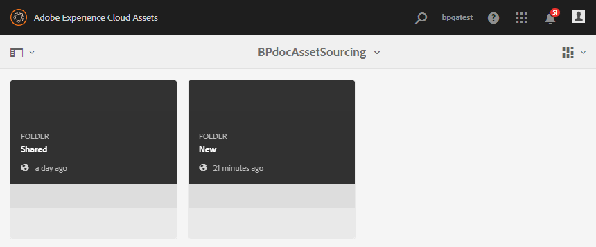

# Hochladen von Assets in den Beitragsordner {#uplad-new-assets-to-contribution-folder}

Brand Portal-Benutzer können [die Asset-Anforderungen herunterladen](brand-portal-download-asset-requirements.md), um zu verstehen, warum Beiträge nötig sind.
Sie können dann neue Assets für Beiträge erstellen und sie in den Ordner NEU im Beitragsordner hochladen.

>[!NOTE]
>
>Brand Portal-Benutzer können Assets nur in den Ordner „NEU“ hochladen.
>
>Der Upload-Grenzwert für jeden Brand Portal-Mandanten beträgt **10** GB. Dies ist ein kumulativer Wert für sämtliche Beitragsordner.

Nachdem die neu erstellten Assets in AEM Assets veröffentlicht wurden, können Brand Portal-Benutzer sie aus dem Ordner „NEU“ löschen. Der Brand Portal-Administrator kann Assets dagegen sowohl aus dem Ordner „NEU“ als auch aus dem Ordner „FREIGEGEBEN“ löschen.

Sobald die Erstellung eines Beitragsordners erreicht ist, kann der Brand Portal-Administrator den Beitragsordner löschen, um den Upload-Speicherplatz für andere Benutzer freizugeben.

>[!NOTE]
>
>Es wird empfohlen, den Upload-Bereich nach der Veröffentlichung des Beitragsordners in AEM Assets freizugeben, damit er für die anderen Brand Portal-Benutzer verfügbar ist.
>
>Wenn Sie die Upload-Grenze für Ihren Brand Portal-Mandanten über **10** GB hinaus erweitern müssen, wenden Sie sich an den Adobe-Support und geben Sie die Anforderung an.

**Hochladen neuer Assets:**

1. Melden Sie sich bei Ihrer Brand Portal-Instanz an.
Das Brand Portal-Dashboard enthält alle vorhandenen Ordner, die dem Brand Portal-Benutzer zur Verfügung stehen, sowie den neu freigegebenen Beitragsordner.

1. Wählen Sie den Beitragsordner aus und klicken Sie darauf, um ihn zu öffnen. Der Beitragsordner enthält zwei Unterordner - **[!UICONTROL FREIGEGEBEN]** und **[!UICONTROL NEU]**.

1. Klicken Sie auf den **[!UICONTROL Ordner NEU]**.

   

1. Klicken Sie auf **[!UICONTROL Erstellen]** > **[!UICONTROL Dateien]**, um einzelne Dateien oder Ordner (.zip) mit mehreren Assets hochzuladen.

   

1. Suchen Sie nach Assets (Dateien/Ordner) und laden Sie sie in den Ordner **[!UICONTROL NEU]** hoch.

   

Nachdem Sie alle Assets oder Ordner in den Ordner „NEU“ hochgeladen haben, veröffentlichen Sie den Beitragsordner in AEM Assets. Siehe [Veröffentlichen von Beitragsordnern in AEM Assets](brand-portal-publish-contribution-folder-to-aem-assets.md).
