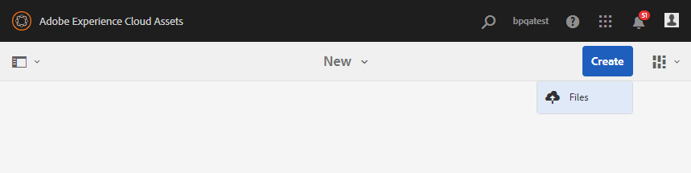

# Hochladen von Assets in den Beitragsordner {#uplad-new-assets-to-contribution-folder}

Brand Portal-Benutzer [laden die Asset-Anforderungen](brand-portal-download-asset-requirements.md) herunter – ein kurzes Dokument, das dem Beitragsordner angehängt ist – und laden Grundlinien-Assets aus dem Ordner **FREIGEGEBEN** herunter, um die Notwendigkeit von Beiträgen zu verstehen.
Brand Portal-Benutzer können dann neue Assets für Beiträge erstellen und sie in den Ordner **NEU** im Beitragsordner hochladen.

>[!NOTE]
>
>Brand Portal-Benutzer können Inhalte/Assets nur in den Ordner **NEU** hochladen. Sie haben keine Berechtigung zum Löschen hochgeladener Assets.
>
>Für Brand Portal-Konten/-Mandanten beträgt die maximale Dateigröße für Uploads **10** GB.

**Hochladen neuer Assets:**

1. Melden Sie sich bei Ihrer Brand Portal-Instanz an.
Das Brand Portal-Dashboard enthält alle vorhandenen Ordner, die dem Brand Portal-Benutzer zur Verfügung stehen, sowie den neu freigegebenen Beitragsordner.
1. Klicken Sie, um den Beitragsordner zu öffnen. Es werden zwei Unterordner im Beitragsordner angezeigt: **[!UICONTROL FREIGEGEBEN]** und **[!UICONTROL NEU]**.
1. Klicken Sie auf den Ordner **[!UICONTROL NEU]**.
   
1. Klicken Sie auf **[!UICONTROL Erstellen > Dateien]**, um einzelne Dateien oder Ordner (.zip) mit mehreren Assets hochzuladen.
   
1. Suchen Sie nach neuen Assets (Dateien/Ordner) und laden Sie sie in den Ordner **[!UICONTROL NEU]** hoch.
   

Nach dem Hochladen kann der Brand Portal-Benutzer den Beitragsordner wieder in AEM Assets veröffentlichen. Siehe [Veröffentlichen von Beitragsordnern in AEM Assets](brand-portal-publish-contribution-folder-to-aem-assets.md).