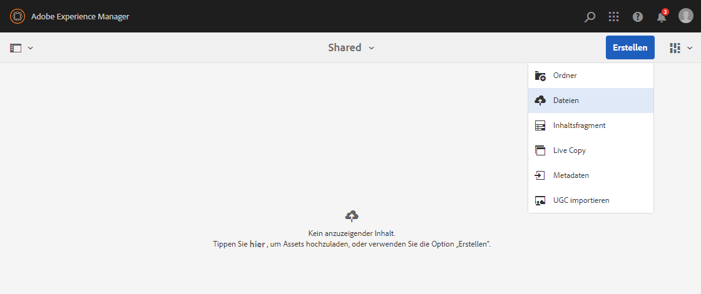
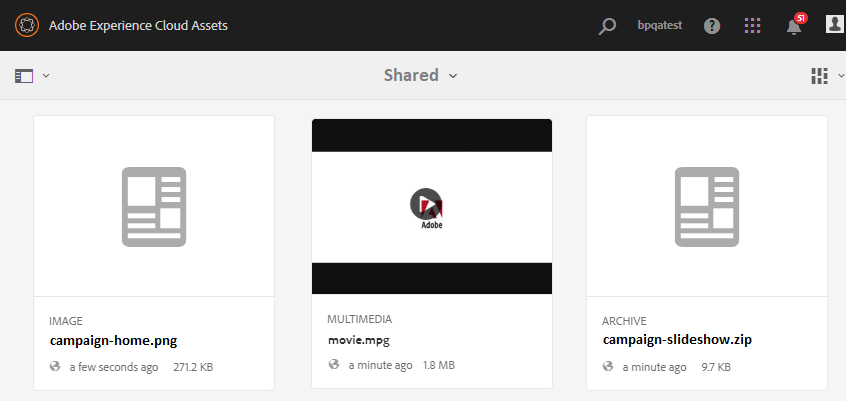

# Hochladen von Grundlinien-Assets {#upload-baseline-assets}

Der AEM-Administrator lädt Grundlinien-Assets in den Ordner **FREIGEGEBEN** hoch, damit die Brand Portal-Benutzer die Asset-Typen verstehen können, die während des Beitrags erforderlich sind. Diese Assets können von den Brand Portal- Benutzern beim Erstellen neuer Assets für Beiträge als Referenzinhalt verwendet werden.

**Hochladen von Grundlinien-Assets:**

1. Melden Sie sich bei Ihrer AEM-Autoreninstanz an.
Standard-URL: http:// localhost:4502/aem/start.html
1. Navigieren Sie zu **[!UICONTROL Assets > Dateien]** und suchen Sie nach dem Beitragsordner, in den Sie Grundlinien-Assets hochladen möchten.
1. Klicken Sie, um den Beitragsordner zu öffnen. Es werden zwei Unterordner im Beitragsordner angezeigt: **[!UICONTROL FREIGEGEBEN]** und **[!UICONTROL NEU]**.
1. Klicken Sie auf den Ordner **[!UICONTROL FREIGEGEBEN]**.
1. Klicken Sie auf **[!UICONTROL Erstellen > Dateien]** , um einzelne Assets hochzuladen.
Oder klicken Sie auf **[!UICONTROL Erstellen > Ordner]**, um einen Ordner (.zip) mit mehreren Assets hochzuladen.
   
1. Suchen Sie nach Grundlinien-Assets (Dateien/Ordner) und laden Sie sie in den Ordner **[!UICONTROL FREIGEGEBEN]** hoch.
   

Nach dem Hochladen können Administratoren den Beitragsordner in Brand Portal veröffentlichen. Siehe [Veröffentlichen von Beitragsordnern in Brand Portal](brand-portal-publish-contribution-folder-to-brand-portal.md).