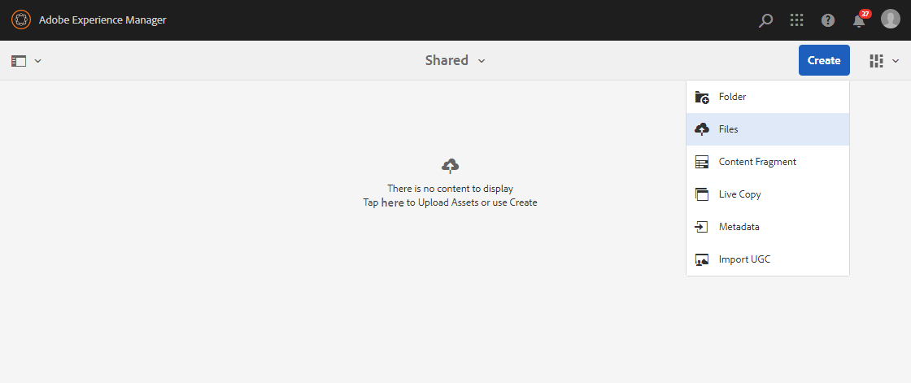

# Hochladen von Grundlagenelementen {#upload-baseline-assets}

AEM-Administrator lädt Grundlegende Assets in den **SHARED** -Ordner hoch, damit die Benutzer von Brand Portal besser verstehen können, welche Assets während des Beitrags benötigt werden. Diese Assets können von den Benutzern des Markenportals als als Referenzinhalt verwendet werden, während neue Assets als Beitrag erstellt werden.

**So laden Sie Grundlagenelemente hoch:**

1. Melden Sie sich bei Ihrer AEM-Autoreninstanz an.
Standard-URL: http:// localhost:4502/aem/start.html
1. Navigieren Sie zu **[!UICONTROL Assets &gt; Dateien]** und suchen Sie den Beitragsordner, in den Sie Grundelemente hochladen möchten.
1. Klicken Sie auf , um den Beitragsordner zu öffnen. Im Beitragsordner werden zwei Unterordner **[!UICONTROL SHARED]** und **[!UICONTROL NEW]** angezeigt.
1. Klicken Sie auf **[!UICONTROL Freigegebenen]** Ordner.
1. Klicken Sie auf **[!UICONTROL Erstellen &gt; Dateien]**  , um einzelne Assets hochzuladen.
Oder klicken Sie auf **[!UICONTROL Erstellen &gt; Ordner]** , um den Ordner (.zip) mit mehreren Assets hochzuladen.
   
1. Durchsuchen Sie Grundlegende Assets (Dateien/Ordner) und laden Sie sie in den **[!UICONTROL freigegebenen]** Ordner hoch.
   

Nach Abschluss des Uploads können Administratoren den Beitragsordner im Markenportal veröffentlichen. Siehe Ordner "Beitrag [veröffentlichen"im Markenportal](brand-portal-publish-contribution-folder-to-brand-portal.md).