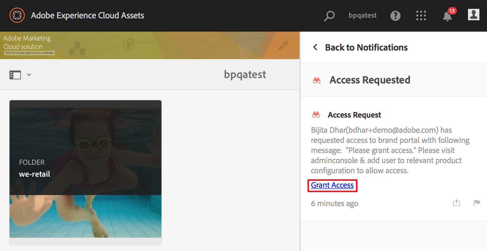

# Überblick über AEM Assets Brand Portal {#overview-of-aem-assets-brand-portal}

Als Vermarkter müssen Sie manchmal mit Kanalpartnern und internen Geschäftsbenutzern zusammenarbeiten, um schnell relevante digitale Inhalte für Kunden zu erstellen, zu verwalten und bereitzustellen. Die zeitnahe Bereitstellung relevanter Inhalte für die gesamte Customer Journey ist ein wichtiger Faktor für Nachfragegenerierung, Konversionen, Interaktionen und Kundenloyalität.

Die Entwicklung von Lösungen, die die effiziente und sichere Freigabe genehmigter Marken-Logos, Richtlinien, Kampagnen-Assets oder Produktfotos für erweiterte interne Teams, Partner und Reseller unterstützen, ist jedoch eine Herausforderung.

**Mit Adobe Experience Manager (AEM) Assets Brand Portal können Sie problemlos genehmigte Kreativ-Assets abrufen, kontrollieren und sicher an externe Parteien und interne Geschäftsbenutzer auf allen Geräten verteilen.** Brand Portal ermöglicht effizientere Asset-Freigabe, schnellere Time-to-Market für Assets sowie verringerte Risiken von Nicht-Compliance und unbefugten Zugriff.

Mit der browserbasierten Portalumgebung können Sie Assets mühelos hochladen, durchsuchen, suchen, in einer Vorschau anzeigen und in genehmigte Formate exportieren.

## Benutzerrollen im Markenportal {#Personas}

Markenportal unterstützt die folgenden Benutzerrollen:

* Gastbenutzer
* Betrachter
* Bearbeiter
* Administrator

Die folgende Tabelle enthält die Aufgaben, die Benutzer mit diesen Rollen ausführen können:

|  | **Durchsuchen** | **Suchen** | **Download** | **Ordner freigeben** | **Sammlungen freigeben** | **Assets als Link freigeben** | **Zugriff auf Admin Tools** |
|--- |--- |--- |--- |--- |--- |--- |--- |
| **Gastbenutzer** | ✓* | ✓* | ✓* | x | x | x | x |
| **Betrachter** | ✓ | ✓ | ✓ | x | x | x | x |
| **Bearbeiter** | ✓ | ✓ | ✓ | ✓ | ✓ | ✓ | x |
| **Administrator** | ✓ | ✓ | ✓ | ✓ | ✓ | ✓ | ✓ |

* Gastbenutzer können nur Assets durchsuchen, auf Assets zugreifen oder nach Assets suchen, die sich in öffentlichen Ordnern und Sammlungen befinden.

### Gastbenutzer {#guest-user}

Jeder Benutzer mit eingeschränktem Zugriff auf Assets in Brand Portal, der nicht authentifiziert wird, ist ein Gastbenutzer. Über die Gastsitzung können Benutzer auf öffentliche Ordner und Sammlungen zugreifen. Als Gastbenutzer können Sie durch die Asset-Details navigieren und die vollständige Asset-Ansicht der Mitglieder öffentlicher Ordner und Sammlungen haben. You can search, download, and add public assets to [!UICONTROL Lightbox] collection.

In einer Gastsitzung können Sie jedoch keine Sammlungen und gespeicherten Suchen erstellen und sie weiter freigeben. Benutzer in einer Gastsitzung können nicht auf Einstellungen für Ordner und Sammlungen zugreifen und keine Assets als Link. Diese Aufgaben kann ein Gastbenutzer ausführen:

[Öffentliche Assets durchsuchen und darauf zugreifen](browse-assets-brand-portal.md)

[Nach öffentlichen Assets suchen](brand-portal-searching.md)

[Öffentliche Assets herunterladen](brand-portal-download-users.md)

[Fügen Sie Assets zu [! UICONTROL Lightbox]](brand-portal-light-box.md#add-assets-to-lightbox)

### Betrachter {#viewer}

Ein Brand Portal-Standardbenutzer ist meist ein Benutzer mit der Rolle Betrachter. Ein Benutzer mit dieser Rolle kann auf erlaubte Ordner, Sammlungen und Assets zugreifen. Der Benutzer kann außerdem Assets durchsuchen, als Vorschau anzeigen, herunterladen und exportieren (ursprüngliche oder bestimmte Ausgabeformate), Kontoeinstellungen konfigurieren sowie Assets suchen. Diese Aufgaben kann ein Betrachter ausführen:

[Assets durchsuchen](browse-assets-brand-portal.md)

[Suchen nach Assets](brand-portal-searching.md)

[Herunterladen von Assets](brand-portal-download-users.md)

### Bearbeiter {#editor}

Ein Benutzer mit der Rolle Bearbeiter kann alle Aufgaben ausführen, die einem Betrachter zur Verfügung stehen. Zusätzlich kann ein Bearbeiter die Dateien und Ordner anzeigen, die ein Administrator freigegeben hat. Ein Benutzer mit der Rolle Bearbeiter kann außerdem Inhalte (Dateien, Ordner und Sammlungen) für andere Benutzer freigeben.

Neben den Aufgaben, die ein Betrachter ausführen kann, stehen dem Bearbeiter folgende Aufgaben zur Verfügung:

[Ordner freigeben](brand-portal-sharing-folders.md)

[Sammlungen freigeben](brand-portal-share-collection.md)

[Assets als Link freigeben](brand-portal-link-share.md)

### Administrator {#administrator}

An administrator includes a user marked as system administrator or Brand Portal product administrator in [!UICONTROL Admin Console]. Administratoren können Systemadministratoren und Benutzer hinzufügen und entfernen, Vorgaben definieren, E-Mails an Benutzer senden sowie Portalnutzung und Speicherberichte anzeigen.

Ein Administrator kann alle Aufgaben ausführen, die ein Editor die folgenden zusätzlichen Aufgaben ausführen kann:

[Verwalten von Benutzern, Gruppen und Benutzerrollen](brand-portal-adding-users.md)

[Anpassen von Hintergrund, Seitenkopfzeilen und E-Mails](brand-portal-branding.md)

[Verwenden benutzerdefinierter Suchfacetten](brand-portal-search-facets.md)

[Verwenden von Metadatenschema-Formularen](brand-portal-metadata-schemas.md)

[Anwenden von Bildvorgaben oder dynamischen Ausgabeformaten](brand-portal-image-presets.md)

[Arbeiten mit Berichten](brand-portal-reports.md)

Zusätzlich zu den oben genannten Aufgaben stehen AEM Assets-Autoren folgende Aufgaben zur Verfügung:

[Konfigurieren der Integration von AEM Assets mit Brand Portal](https://helpx.adobe.com/experience-manager/6-5/assets/using/brand-portal-configuring-integration.html)

[Veröffentlichen von Ordnern in Brand Portal](https://helpx.adobe.com/experience-manager/6-5/assets/using/brand-portal-publish-folder.html)

[Veröffentlichen von Sammlungen in Brand Portal](https://helpx.adobe.com/experience-manager/6-5/assets/using/brand-portal-publish-collection.html)

## Alternativer Alias für Brand Portal-URL {#tenant-alias-for-portal-url}

Ab dem Markenportal 6.4.3 können Unternehmen eine alternative (Alias) URL für die vorhandene URL ihres Markenportals haben. Die Alias-URL kann durch ein alternatives Präfix in der URL erstellt werden.\
Beachten Sie, dass nur das Präfix der Brand Portal-URL angepasst werden kann und nicht die gesamte URL. For example, an organization with existing domain **[!UICONTROL geomettrix.brand-portal.adobe.com]** can get **[!UICONTROL geomettrixinc.brand-portal.adobe.com]** created on request.

Eine AEM-Autoreninstanz kann jedoch nur mit der Mandanten-ID-URL [konfiguriert](https://helpx.adobe.com/experience-manager/6-5/assets/using/brand-portal-configuring-integration.html) werden und nicht mit einer (alternativen) Mandantenalias-URL.

>[!NOTE]
>
>Um einen Alias für einen Mandantennamen in einer vorhandenen Portal-URL zu erhalten, müssen sich Organisationen an den Adobe-Support wenden und das Erstellen eines neuen Mandantenalias anfordern. Bei der Bearbeitung dieses Antrags wird zuerst geprüft, ob der Alias verfügbar ist. Trifft dies zu, wird der Alias erstellt.
>
>Um den alten Alias zu ersetzen oder zu löschen, muss der gleiche Prozess befolgt werden.

## Anfordern von Zugriff auf Brand Portal {#request-access-to-brand-portal}

Benutzer können über den Anmeldebildschirm Zugriff auf Brand Portal anfragen. These requests are sent to Brand Portal administrators, who grant access to users through the Adobe [!UICONTROL Admin Console]. Sobald der Zugriff gewährt wurde, erhalten die Benutzer eine Benachrichtigungs-E-Mail.

Gehen Sie wie folgt vor, um Zugriff anzufragen:

1. From the Brand Portal login page, select **[!UICONTROL Click here]** corresponding to **[!UICONTROL Need Access?]**. However, to enter the guest session, select the **[!UICONTROL Click here]** corresponding to **[!UICONTROL Guest Access?]**.

   

   Die Seite [!UICONTROL Zugriff anfragen] wird geöffnet.

2. To request access to an organization’s Brand Portal, you must have a valid [!UICONTROL Adobe ID], [!UICONTROL Enterprise ID], or [!UICONTROL Federated ID].

   In the [!UICONTROL Request Access] page, sign in using your ID (scenario 1) or create an [!UICONTROL Adobe ID] (scenario 2):
   ![[!UICONTROL Zugriff anfordern]](assets/bplogin_request_access_2.png)

   **Szenario 1**
   1. If you have an [!UICONTROL Adobe ID], [!UICONTROL Enterprise ID], or [!UICONTROL Federated ID], click **[!UICONTROL Sign In]**.
The [!UICONTROL Sign in] page opens.
   2. Provide your [!UICONTROL Adobe ID] credentials and click **[!UICONTROL Sign in]**.
      
   You are redirected to the [!UICONTROL Request Access] page.
   **Szenario 2**
   1. If you do not have an [!UICONTROL Adobe ID], to create one, click **[!UICONTROL Get an Adobe ID]** from the [!UICONTROL Request Access] page.
The [!UICONTROL Sign in] page opens.
   2. Click **[!UICONTROL Get an Adobe ID]**.
The [!UICONTROL Sign up] page opens.
   3. Geben Sie Ihren Vornamen und Nachnamen, die E-Mail-Adresse und ein Kennwort ein.
   4. Wählen **[!UICONTROL Sie Anmelden]**.
      
   You are redirected to the [!UICONTROL Request Access] page.

3. Auf der nächsten Seite werden Ihr Name und Ihre E-Email-ID zum Anfordern des Zugriffs angezeigt. Geben Sie einen Kommentar für den Administrator ein und klicken Sie dann auf **[!UICONTROL Übermitteln]**.

   

## Produktadministratoren gewähren Zugriff {#grant-access-to-brand-portal}

Markenportal-Produktadministratoren erhalten Zugriffsanforderungen in ihrem Markenportal-Benachrichtigungsbereich und per E-Mail im Posteingang.

To grant access, product administrators need to click the relevant notification in Brand Portal notification area and then click **[!UICONTROL Grant Access]**.
Alternatively, product administrators can follow the link provided in the access request email to visit Adobe [!UICONTROL Admin Console] and add the user to the relevant product configuration.

You are redirected to the [Adobe [!UICONTROL Admin Console]](https://adminconsole.adobe.com/enterprise/overview) home page. Use Adobe [!UICONTROL Admin Console] to create users and assign them to product profiles (formerly known as product configurations), which show as groups in Brand Portal. For more information about adding users in [!UICONTROL Admin Console], see [Add a user](brand-portal-adding-users.md#add-a-user) (follow Steps 4-7 in the procedure to add a user).

## Wartungsbenachrichtigung in Brand Portal {#brand-portal-maintenance-notification}

Bevor Brand Portal planmäßig zur Wartung heruntergefahren wird, wird nach dem Anmelden bei Brand Portal eine Benachrichtigung als Banner angezeigt. Beispiel für eine Benachrichtigung:

Sie können diese Benachrichtigung schließen und Brand Portal weiterhin verwenden. Diese Benachrichtigung wird in jeder neuen Sitzung angezeigt.

## Versions- und Systeminformationen {#release-and-system-information}

<!--* [What's new](../using/whats-new.md)-->
* [Versionshinweise](brand-portal-release-notes.md)
* [Unterstützte Dateiformate](brand-portal-supported-formats.md)

## Verwandte Ressourcen {#related-resources}

* [Adobe-Kundendienst](https://helpx.adobe.com/marketing-cloud/contact-support.html)
* [AEM-Foren](https://www.adobe.com/go/aod_forums_en)