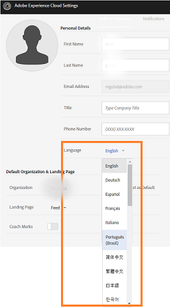
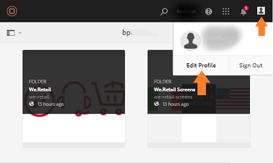

# Überblick über AEM Assets Brand Portal {#overview-of-aem-assets-brand-portal}

Als Marketingexperte müssen Sie gelegentlich mit Channel-Partnern und unternehmensinternen Nutzern zusammenarbeiten, um schnell relevante Inhalte für Kunden erstellen, verwalten und liefern zu können. Die zeitnahe Bereitstellung relevanter Inhalte für die gesamte Customer Journey ist ein wichtiger Faktor für Nachfragegenerierung, Konversionen, Interaktionen und Kundenloyalität.

Die Entwicklung von Lösungen, die die effiziente und sichere Freigabe genehmigter Marken-Logos, Richtlinien, Kampagnen-Assets oder Produktfotos für erweiterte interne Teams, Partner und Reseller unterstützen, ist jedoch eine Herausforderung.

**Adobe Experience Manager (AEM) Asset Brand Portal** konzentriert sich auf das Bedürfnis des Marketers nach einer effektiven Zusammenarbeit mit den weltweit verteilten Brand Portal-Benutzern, indem es Funktionen für die Asset-Verteilung und Asset-Beiträge bereitstellt.

Mit der Asset-Verteilung können Sie problemlos genehmigte Kreativ-Assets abrufen, kontrollieren und sicher an externe Parteien und interne Geschäftsbenutzer auf allen Geräten verteilen. Der Asset-Beitrag ermöglicht es den Brand Portal-Benutzern, Assets in Brand Portal hochzuladen und in AEM Assets zu veröffentlichen, ohne Zugriff auf die Autorenumgebung zu benötigen. Die Beitragsfunktion wird als **Asset-Beschaffung in Brand Portal** bezeichnet. Zusammengenommen verbessert sie die gesamte Brand Portal-Erfahrung bei der Verteilung von Assets und den Beiträgen der Brand Portal-Benutzer (externen Agenturen/Teams), beschleunigt die Markteinführung von Assets und verringert das Risiko von Nichteinhaltung und unbefugtem Zugriff.
Siehe [Asset-Beschaffung in Brand Portal](brand-portal-asset-sourcing.md).

Die Browser-basierte Portalumgebung erlaubt es Ihnen, Assets einfach hochzuladen, zu durchsuchen, zu suchen, in einer Vorschau anzuzeigen und in genehmigten Formaten zu exportieren.

## Benutzerrollen in Brand Portal {#Personas}

Brand Portal unterstützt die folgenden Benutzerrollen:

* Gastbenutzer
* Betrachter
* Bearbeiter
* Administrator

Die folgende Tabelle enthält die Aufgaben, die Benutzer mit diesen Rollen ausführen können:

|  | **Durchsuchen** | **Suchen** | **Download** | **Ordner freigeben** | **Sammlungen freigeben** | **Assets als Link freigeben** | **Zugriff auf Admin Tools** |
|--- |--- |--- |--- |--- |--- |--- |--- |
| **Gastbenutzer** | ✓* | ✓* | ✓* | x | x | x | x |
| **Betrachter** | ✓ | ✓ | ✓ | x | x | x | x |
| **Bearbeiter** | ✓ | ✓ | ✓ | ✓ | ✓ | ✓ | x |
| **Administrator** | ✓ | ✓ | ✓ | ✓ | ✓ | ✓ | ✓ |

* Gastbenutzer können nur Assets durchsuchen, auf Assets zugreifen oder nach Assets suchen, die sich in öffentlichen Ordnern und Sammlungen befinden.

### Gastbenutzer {#guest-user}

Jeder Benutzer mit eingeschränktem Zugriff auf Assets in Brand Portal, der nicht authentifiziert wird, ist ein Gastbenutzer. In der Gastsitzung können Benutzer auf öffentliche Ordner und Sammlungen zugreifen. Als Gastbenutzer haben Sie die Möglichkeit, Asset-Details zu durchsuchen und Assets der Mitglieder von öffentlichen Ordnern und Sammlungen vollständig anzuzeigen. Sie können öffentliche Assets durchsuchen, herunterladen und zu einer [!UICONTROL Lightbox]-Sammlung hinzuzufügen.

In einer Gastsitzung können Sie jedoch keine Sammlungen und gespeicherten Suchen erstellen und sie weiter freigeben. Benutzer in einer Gastsitzung können nicht auf Einstellungen für Ordner und Sammlungen zugreifen und keine Assets als    Link freigeben. Diese Aufgaben kann ein Gastbenutzer ausführen:

[Öffentliche Assets durchsuchen und darauf zugreifen](browse-assets-brand-portal.md)

[Nach öffentlichen Assets suchen](brand-portal-searching.md)

[Öffentliche Assets herunterladen](brand-portal-download-users.md)

[Assets zu [!UICONTROL Lightbox]](brand-portal-light-box.md#add-assets-to-lightbox) hinzufügen

### Betrachter {#viewer}

Ein Brand Portal-Standardbenutzer ist meist ein Benutzer mit der Rolle Betrachter. Ein Benutzer mit dieser Rolle kann auf erlaubte Ordner, Sammlungen und Assets zugreifen. Der Benutzer kann außerdem Assets durchsuchen, als Vorschau anzeigen, herunterladen und exportieren (ursprüngliche oder bestimmte Ausgabeformate), Kontoeinstellungen konfigurieren sowie Assets suchen. Diese Aufgaben kann ein Betrachter ausführen:

[Assets durchsuchen](browse-assets-brand-portal.md)

[Suchen nach Assets](brand-portal-searching.md)

[Herunterladen von Assets](brand-portal-download-users.md)

### Bearbeiter    {#editor}

Ein Benutzer mit der Rolle Bearbeiter kann alle Aufgaben ausführen, die einem Betrachter zur Verfügung stehen. Zusätzlich kann ein Bearbeiter die Dateien und Ordner anzeigen, die ein Administrator freigegeben hat. Ein Benutzer mit der Rolle Bearbeiter kann außerdem Inhalte (Dateien, Ordner und Sammlungen) für andere Benutzer freigeben.

Neben den Aufgaben, die ein Betrachter ausführen kann, stehen dem Bearbeiter folgende Aufgaben zur Verfügung:

[Ordner freigeben](brand-portal-sharing-folders.md)

[Sammlungen freigeben](brand-portal-share-collection.md)

[Assets als Link freigeben](brand-portal-link-share.md)

### Administrator {#administrator}

Zu den Administratoren gehören Benutzer, die in [!UICONTROL Admin Console] als Systemadministrator oder Brand Portal-Produkt-Administrator gekennzeichnet sind. Administratoren können Systemadministratoren und Benutzer hinzufügen und entfernen, Vorgaben definieren, E-Mails an Benutzer senden sowie Portalnutzung und Speicherberichte anzeigen.

Administratoren können alle Aufgaben ausführen, die ein Bearbeiter ausführen kann, und darüber hinaus die folgenden Aufgaben:

[Verwalten von Benutzern, Gruppen und Benutzerrollen](brand-portal-adding-users.md)

[Anpassen von Hintergrund, Seitenkopfzeilen und E-Mails](brand-portal-branding.md)

[Verwenden benutzerdefinierter Suchfacetten](brand-portal-search-facets.md)

[Verwenden von Metadatenschema-Formularen](brand-portal-metadata-schemas.md)

[Anwenden von Bildvorgaben oder dynamischen Ausgabeformaten](brand-portal-image-presets.md)

[Arbeiten mit Berichten](brand-portal-reports.md)

Zusätzlich zu den oben genannten Aufgaben stehen AEM Assets-Autoren folgende Aufgaben zur Verfügung:

[Konfigurieren der Integration von AEM Assets mit Brand Portal](https://helpx.adobe.com/experience-manager/6-5/assets/using/brand-portal-configuring-integration.html)

[Veröffentlichen von Ordnern in Brand Portal](https://helpx.adobe.com/experience-manager/6-5/assets/using/brand-portal-publish-folder.html)

[Veröffentlichen von Sammlungen in Brand Portal](https://helpx.adobe.com/experience-manager/6-5/assets/using/brand-portal-publish-collection.html)

## Alternativer Alias für Brand Portal-URL {#tenant-alias-for-portal-url}

Ab Brand Portal 6.4.3 steht Unternehmen eine alternative URL (Alias) für die vorhandene URL des Brand Portal-Mandanten zur Verfügung. Die Alias-URL kann erstellt werden, indem ein alternatives Präfix in die URL eingefügt wird.\
Beachten Sie, dass nur das Präfix der Brand Portal-URL angepasst werden kann und nicht die gesamte URL. Für eine Organisation mit der vorhandenen Domäne **[!UICONTROL geomettrix.brand-portal.adobe.com]** kann beispielsweise auf Anfrage die Domäne**[!UICONTROL  geomettrixinc.brand-portal.adobe.com]** erstellt werden.

Eine AEM-Autoreninstanz kann jedoch nur mit der Mandanten-ID-URL [konfiguriert](https://helpx.adobe.com/experience-manager/6-5/assets/using/brand-portal-configuring-integration.html) werden und nicht mit einer (alternativen) Mandantenalias-URL.

>[!NOTE]
>
>Um einen Alias für einen Mandantennamen in einer vorhandenen Portal-URL zu erhalten, müssen sich Organisationen an den Adobe-Support wenden und das Erstellen eines neuen Mandantenalias anfordern. Bei der Bearbeitung dieses Antrags wird zuerst geprüft, ob der Alias verfügbar ist. Trifft dies zu, wird der Alias erstellt.
>
>Um den alten Alias zu ersetzen oder zu löschen, muss der gleiche Prozess befolgt werden.

## Anfordern von Zugriff auf Brand Portal {#request-access-to-brand-portal}

Benutzer können über den Anmeldebildschirm Zugriff auf Brand Portal anfragen. Diese Anfragen werden an Brand Portal-Administratoren gesendet, die über [!UICONTROL Adobe Admin Console] den Zugriff für Benutzer gewähren. Sobald der Zugriff gewährt wurde, erhalten die Benutzer eine Benachrichtigungs-E-Mail.

Gehen Sie wie folgt vor, um Zugriff anzufragen:

1. Wählen Sie auf der Anmeldeseite von Brand Portal **[!UICONTROL Hier klicken]**neben**[!UICONTROL  Zugriff erforderlich?]**. Um jedoch einer Gastsitzung beizutreten, wählen Sie **[!UICONTROL Hier klicken]**neben**[!UICONTROL  Gastzugang?]**.

   

   Die Seite [!UICONTROL Zugriff anfragen] wird geöffnet.

1. Um Zugriff auf das Brand Portal eines Unternehmens anzufragen, benötigen Sie eine gültige [!UICONTROL Adobe ID], [!UICONTROL Enterprise ID] oder [!UICONTROL Federated ID].

   Melden Sie sich auf der Seite [!UICONTROL Zugriff anfordern] mit Ihrer ID an (Szenario 1) oder erstellen Sie eine [!UICONTROL Adobe ID] (Szenario 2): 
   ![[!UICONTROL Zugriff anfordern]](assets/bplogin_request_access_2.png)

   **Szenario 1**
   1. Wenn Sie bereits eine [!UICONTROL Adobe ID], [!UICONTROL Enterprise ID] oder [!UICONTROL Federated ID] haben, klicken Sie auf **[!UICONTROL Anmelden]**.

Die Seite[!UICONTROL Anmelden]wird geöffnet.
   1. Geben Sie Ihre [!UICONTROL Adobe ID]-Anmeldedaten ein und klicken Sie auf **[!UICONTROL Anmelden]**. 
   

   Sie werden zur Seite [!UICONTROL Zugriff anfordern] weitergeleitet. 
   **Szenario 2**
   1. Wenn Sie noch keine [!UICONTROL Adobe ID] haben, erstellen Sie die ID, indem Sie auf der Seite **[!UICONTROL Zugriff anfordern]**auf[!UICONTROL Adobe ID anfordern]klicken.

Die Seite[!UICONTROL Anmelden]wird geöffnet.
   1. Klicken Sie auf **[!UICONTROL Adobe ID anfordern]**.

Die Seite[!UICONTROL Registrieren]wird geöffnet.
   1. Geben Sie Ihren Vornamen und Nachnamen, E-Mail-Adresse und Passwort ein.
   1. Select **[!UICONTROL Sign up]**. 
   

   Sie werden zur Seite [!UICONTROL Zugriff anfordern] weitergeleitet.

1. Auf der nächsten Seite werden der Name des aktuellen Benutzers und die E-Mail-Adresse angezeigt, die zum Anfordern des Zugriffs genutzt werden. Geben Sie einen Kommentar für den Administrator ein und klicken Sie dann auf **[!UICONTROL Übermitteln]**. 

   

## Produkt-Administratoren gewähren Zugriff {#grant-access-to-brand-portal}

Brand Portal-Produkt-Administratoren erhalten die Zugriffsanforderungen im Brand Portal-Benachrichtigungsbereich und per E-Mail ins Postfach.

Für die Gewährung des Zugriffs müssen Produkt-Administratoren auf die entsprechende Benachrichtigung im Brand Portal-Benachrichtigungsbereich und anschließend auf **[!UICONTROL Zugriff gewähren]**klicken.
Alternativ können Produkt-Administratoren dem in der E-Mail mit der Zugriffsanforderung angegebenen Link folgen, um[!UICONTROL Adobe Admin Console]aufzurufen und um den Benutzer zur relevanten Produktkonfiguration hinzuzufügen.

Sie werden zur Homepage von [Adobe [!UICONTROL Admin Console]](https://adminconsole.adobe.com/enterprise/overview) weitergeleitet. Verwenden Sie [!UICONTROL Adobe Admin Console], um Benutzer zu erstellen und diese Produktprofilen (ehemals „Produktkonfigurationen“) zuzuweisen, die in Brand Portal als Gruppen angezeigt werden. Weitere Informationen zum Hinzufügen von Benutzern in [!UICONTROL Admin Console] finden Sie unter [Hinzufügen von Benutzern](brand-portal-adding-users.md#add-a-user) (befolgen Sie Schritte 4 bis 7, um einen Benutzer hinzuzufügen).

## Brand Portal-Sprachen {#brand-portal-language}

Sie können die Brand Portal-Sprache über die [!UICONTROL Adobe Experience Cloud-Einstellungen] ändern.

Gehen Sie wie folgt vor, um die Sprache zu ändern:

1. Wählen Sie im oberen Menü [!UICONTROL Benutzer] > [!UICONTROL Profil bearbeiten] aus. 
   

1. Wählen Sie auf der Seite [!UICONTROL Experience Cloud-Einstellungen] aus der [!UICONTROL Sprachen]-Dropdown-Liste die Sprache aus.

## Wartungsbenachrichtigung in Brand Portal {#brand-portal-maintenance-notification}

Bevor Brand Portal planmäßig zur Wartung heruntergefahren wird, wird nach dem Anmelden bei Brand Portal eine Benachrichtigung als Banner angezeigt. Beispiel für eine Benachrichtigung:

Sie können diese Benachrichtigung schließen und Brand Portal weiterhin verwenden. Diese Benachrichtigung erscheint bei jeder neuen Sitzung.

## Versions- und Systeminformationen {#release-and-system-information}

* [Neuerungen](whats-new.md)
* [Versionshinweise](brand-portal-release-notes.md)
* [Unterstützte Dateiformate](brand-portal-supported-formats.md)

## Verwandte Ressourcen {#related-resources}

* [Adobe-Kundendienst](https://helpx.adobe.com/marketing-cloud/contact-support.html)
* [AEM-Foren](https://www.adobe.com/go/aod_forums_en)