# Durchsuchen von Assets in Brand Portal {#browsing-assets-on-brand-portal}

AEM Assets Brand Portal bietet zahlreiche Funktionen und Benutzeroberflächen-Elemente, die das Durchsuchen von Ressourcen, Navigieren in Asset-Hierarchien und Suchen nach Assets unter Verwendung verschiedener Anzeigeoptionen erleichtern.

Das AEM-Logo oben in der AEM-Symbolleiste erleichtert Admin-Benutzern den Zugriff auf den Admin Tools-Bereich.

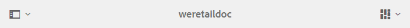 

Über den Leistenselektor oben links in Brand Portal öffnen Sie ein Dropdown-Menü mit Optionen zum Navigieren in Assethierarchien, Optimieren Ihrer Suche und Anzeigen von Ressourcen.

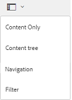

Sie können Assets in jeder der Ansichten, die im Ansichtselektor oben rechts in Brand Portal verfügbar sind (Karten-, Spalten- und Listenansicht), anzeigen, durchblättern und auswählen.

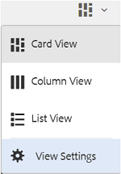

## Anzeigen und Auswählen von Ressourcen {#viewing-and-selecting-resources}

Anzeige, Navigation und Auswahl sind grundsätzlich in allen Ansichten gleich. Je nach verwendeter Ansicht kommt es aber zu geringfügigen Abweichungen beim Umgang.

Sie können Ressourcen in jeder der verfügbaren Ansichten anzeigen, durchblättern und auswählen (für weitere Aktionen):

* Spaltenansicht
* Kartenansicht
* Listenansicht

### Kartenansicht

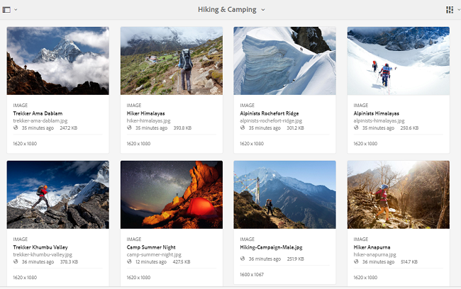

In der Kartenansicht werden Informationskarten für jedes Element auf der aktuellen Ebene angezeigt. Auf diesen Karten sind  die folgenden Details angegeben:

* eine visuelle Darstellung des Assets bzw. Ordners
* Typ
* Titel
* Name
* Datum und Uhrzeit, zu dem bzw. zu der das Asset in Brand Portal von AEM veröffentlicht wurde
* Größe
* Dimensionen

Sie können in der Hierarchie nach unten navigieren, indem Sie auf die Karten tippen/klicken (vermeiden Sie dabei die Schnellzugriffe) und über die [Breadcrumb-Navigation in der Kopfzeile](https://helpx.adobe.com/de/experience-manager/6-5/sites/authoring/using/basic-handling.html#TheHeader) wieder nach oben navigieren.

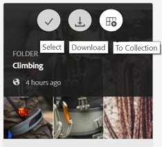

#### Kartenansicht für Benutzer ohne Administratorrechte

Karten von Ordnern in der Kartenansicht zeigen Benutzern ohne Administratorrechte (Bearbeitern, Betrachtern und Gastbenutzern) Informationen zur Ordnerhierarchie an. Diese Funktion informiert die Benutzer über den Speicherort der Ordner, auf die sie zugreifen, in Bezug auf die übergeordnete Hierarchie.
Informationen zur Ordnerhierarchie sind besonders hilfreich, um die Ordner zu unterscheiden, deren Namen anderen Ordnern ähneln, die in einer anderen Ordnerhierarchie freigegeben sind. Wenn Benutzer ohne Administratorrechte nicht die Ordnerstruktur der für sie freigegebenen Assets berücksichtigen, können Assets bzw. Ordner mit denselben Namen für Verwirrung sorgen.

* Die auf den entsprechenden Karten angezeigten Pfade werden so gekürzt, dass sie zu den Kartengrößen passen. Die Benutzer können den vollständigen Pfad jedoch in einer QuickInfo sehen, wenn sie den Mauszeiger über den verkürzten Pfad bewegen.

**Option „Überblick“ zur Anzeige der Asset-Eigenschaften**

Die Option „Überblick“ steht Benutzern ohne Administratorrechte (Bearbeitern, Betrachtern, Gastbenutzern) zum Anzeigen von Asset-Eigenschaften von ausgewählten Assets/Ordnern zur Verfügung. Die Option „Überblick“ finden Sie an folgenden Stellen:

* In der Symbolleiste am oberen Rand des ausgewählten Assets/Ordners
* In der Dropdown-Liste des ausgewählten Leistenselektors

Bei Auswahl der Option **[!UICONTROL Überblick]** bei ausgewähltem Asset/Ordner können die Benutzer den Titel, den Pfad und den Zeitpunkt der Asset-Erstellung sehen. Wohingegen die Benutzer bei Auswahl der Option „Überblick“ auf der Asset-Detailseite die Metadaten des Assets sehen können.

#### Anzeigeeinstellungen in der Kartenansicht

Das Dialogfeld **[!UICONTROL Anzeigeeinstellungen]** wird bei Auswahl der Option **[!UICONTROL Anzeigeeinstellungen]** im Ansichtselektor geöffnet. Hiermit können Sie die Größe der Asset-Miniaturansichten in der Kartenansicht ändern. Auf diese Weise können Sie Ihre Ansicht personalisieren und Einfluss auf die Anzahl der angezeigten Miniaturansichten nehmen.

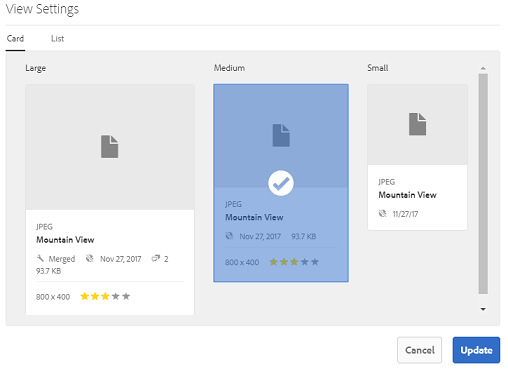

### Listenansicht

In der Listenansicht werden Informationen für jede Ressource auf der aktuellen Ebene aufgelistet. In der Listenansicht werden die folgenden Details angezeigt:

* Miniaturbild der Assets
* Name
* Titel
* Gebietsschema
* Typ
* Dimension
* Größe
* Bewertung
* Ordnerpfad, der die Asset-Hierarchie anzeigt*
* Datum der Veröffentlichung des Assets in Brand Portal

Über die Spalte „Pfad“ können Sie die Position des Assets in der Ordnerhierarchie identifizieren. Sie können die Hierarchie nach unten navigieren, indem Sie auf den Ressourcennamen tippen/klicken und mithilfe der [Breadcrumbs in der Kopfzeile](https://helpx.adobe.com/experience-manager/6-5/sites/authoring/using/basic-handling.html#TheHeader) wieder nach oben navigieren.

<!--
Comment Type: draft lastmodifiedby="mgulati" lastmodifieddate="2018-08-17T03:12:05.096-0400" type="annotation">Removed:- "Selecting assets in list view To select all items in the list, use the checkbox at the upper left of the list. When all items in the list are selected, this check box appears checked. To deselect all, click or tap the checkbox. When only some items are selected, it appears with a minus sign. To select all, click or tap the checkbox. To deselect all, click or tap the checkbox again. You can change the order of items using the dotted vertical bar at the far right of each item in the list. Tap/click the vertical selection bar and drag the item to a new position in the list."
 -->

### Anzeigeeinstellungen in der Listenansicht

Die Listenansicht zeigt das Asset **[!UICONTROL Name]** standardmäßig in der ersten Spalte an. Darüber hinaus werden weitere Informationen wie der **[!UICONTROL Titel]**, das **[!UICONTROL Gebietsschema]**, der **[!UICONTROL Typ]**, die **[!UICONTROL Dimensionen]**, die **[!UICONTROL Größe]**, die **[!UICONTROL Bewertung]** und der Veröffentlichungsstatus des Assets angezeigt. Sie können jedoch die anzuzeigenden Spalten über die **[!UICONTROL Anzeigeeinstellungen]** auswählen.

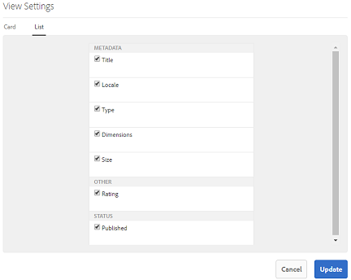

### Spaltenansicht

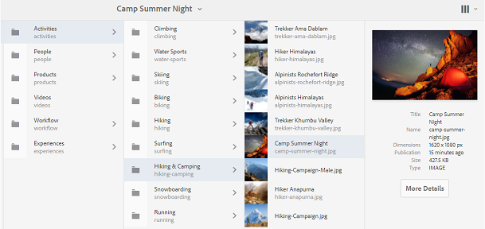

Navigieren Sie in der Spaltenansicht in der Inhaltsstruktur durch eine Reihe von kaskadierenden Spalten. Diese Ansicht hilft Ihnen, die Asset-Hierarchie zu visualisieren und in ihr zu navigieren.

Durch die Auswahl einer Ressource in der ersten Spalte (ganz links) werden die untergeordneten Ressourcen in der zweiten Spalte rechts daneben angezeigt. Durch die Auswahl einer Ressource in der zweiten Spalte werden die untergeordneten Ressourcen in der dritten Spalte rechts daneben angezeigt usw.

Sie können in der Struktur nach oben und unten navigieren, indem Sie auf einen Ressourcennamen oder den Pfeil rechts vom Ressourcennamen tippen oder klicken.

* Beim Tippen bzw. Klicken werden der Ressourcenname und der Pfeil hervorgehoben.
* Durch Tippen oder Klicken auf die Miniaturansicht wird die Ressource ausgewählt.
* Wenn diese Option ausgewählt ist, wird ein Häkchen auf der Miniaturansicht angezeigt und der Ressourcenname wird hervorgehoben.
* Die Details der ausgewählten Ressource werden in der letzten Spalte angezeigt.

Wird ein Asset in der Spaltenansicht ausgewählt, wird die visuelle Darstellung des Assets in der letzten Spalte zusammen mit den folgenden Details angezeigt:

* Titel
* Name
* Dimensionen
* Datum und Uhrzeit, zu dem bzw. zu der das Asset in Brand Portal von AEM veröffentlicht wurde
* Größe
* Typ
* Option „Weitere Details“ zum Aufrufen der Seite „Details“ des Assets

<!--
Comment Type: draft

<h3>Selecting Resources</h3>
-->

<!--
Comment Type: draft

Selecting a specific resource depends on a combination of the view and the device:

-->

<!--
Comment Type: draft

<table border="1" cellpadding="1" cellspacing="0" width="100%">
<tbody>
<tr>
<td> </td>
<td>Select</td>
<td>Deselect</td>
</tr>
<tr>
<td>Column View  </td>
<td>
<ul>
<li>Desktop:  Mouseover, then use the check mark quick action</li>
<li>Mobile device:  Tap the thumbnail</li>
</ul> </td>
<td>
<ul>
<li>Desktop:  Click the thumbnail</li>
<li>Mobile device:  Tap the thumbnail</li>
</ul> </td>
</tr>
<tr>
<td>Card View  </td>
<td>
<ul>
<li>Desktop:  Mouseover, then use the check mark quick action</li>
<li>Mobile device:  Tap-and-hold the card</li>
</ul> </td>
<td>
<ul>
<li>Desktop:  Click the card</li>
<li>Mobile device:  Tap the card</li>
</ul> </td>
</tr>
<tr>
<td>List View</td>
<td>
<ul>
<li>Desktop:  Mouseover, then use the check mark quick action</li>
<li>Mobile device:  Tap the thumbnail</li>
</ul> </td>
<td>
<ul>
<li>Desktop:  Click the thumbnail</li>
<li>Mobile device:  Tap the thumbnail</li>
</ul> </td>
</tr>
</tbody>
</table>
-->

<!--
Comment Type: draft

Deselecting All
-->

<!--
Comment Type: draft

In all cases, as you select items the count of the items selected is displayed at the upper right of the toolbar.

You can deselect all items and exit selection mode by clicking or tapping the X next to the count.

-->

<!--
Comment Type: draft

In all views, all items can be deselected by tapping escape on the keyboard if you are using a desktop device.

-->

## Inhaltsstruktur      {#content-tree}

Verwenden Sie zusätzlich zu diesen Ansichten die Strukturansicht, um einen Drilldown der Asset-Hierarchie durchzuführen, während Sie die gewünschten Assets oder Ordner anzeigen und auswählen.

Um die Baumansicht zu öffnen, tippen/klicken Sie auf die Schienenauswahl oben links und wählen Sie den **[!UICONTROL Inhaltsbaum]** aus dem Menü aus.

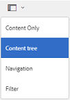

Navigieren Sie in der Inhaltshierarchie zum gewünschten Asset.

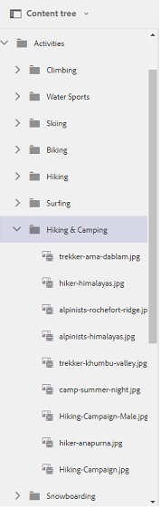

## Asset-Details       {#asset-details}

Auf der Seite „Details“ eines Assets können Sie das Asset anzeigen und herunterladen, einen Link zum Asset freigeben, das Asset in eine Sammlung verschieben oder dessen Seite „Eigenschaften“ anzeigen. Sie können nacheinander auch durch die Seite „Details“ anderer Assets im selben Ordner navigieren.

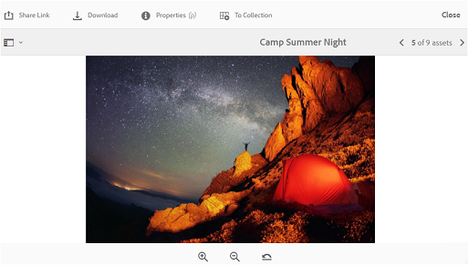

Zeigen Sie mithilfe des Leistenselektors auf der Seite „Details“ des Assets die Metadaten des Assets oder dessen zahlreiche Ausgabeformate an.

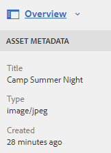

Sie können alle verfügbaren Ausgabeformate des Assets auf der Seite „Details“ des Assets anzeigen und ein Ausgabeformat zur Anzeige in der Vorschau auswählen.

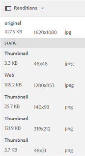

Öffnen Sie die Seite „Asset-Eigenschaften“ mit der Option **[!UICONTROL Eigenschaften (p)]** in der oberen Symbolleiste.

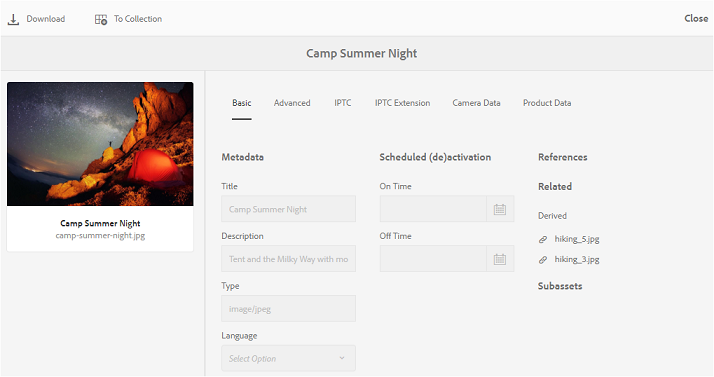

Sie können auch eine Liste aller zugehörigen Assets (Quelle oder abgeleitete Assets in AEM) auf der Seite „Eigenschaften“ eines Assets anzeigen, da die Asset-Beziehung auch von AEM in Brand Portal veröffentlicht wird.
