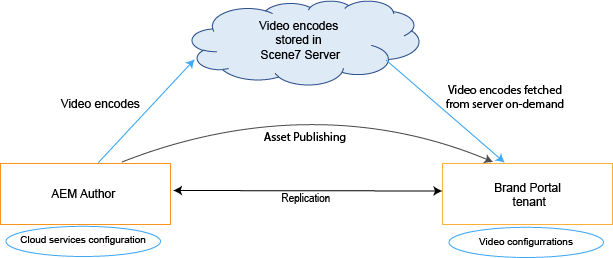
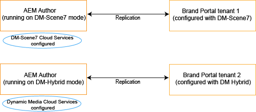
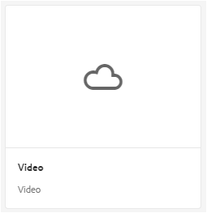
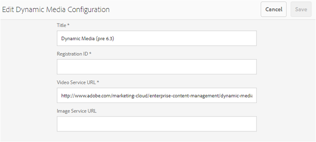
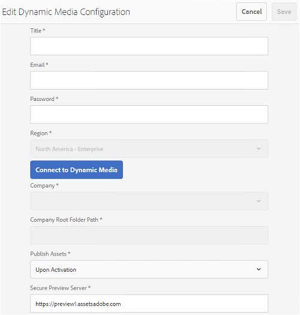

# Unterstützung dynamischer Videos in Brand Portal {#dynamic-video-support-on-brand-portal}

Profitieren Sie von einer Vorschau und adaptiven Wiedergabe von Videos in Brand Portal mit Dynamic Media-Unterstützung. Laden Sie auch die dynamischen Wiedergaben aus dem Portal und von freigegebenen Links herunter.
Brand Portal-Benutzer haben folgende Möglichkeiten:

* Vorschau von Videos auf der Seite „Asset-Details“, in der Kartenansicht und auf der Vorschauseite der Linkfreigabe
* Wiedergeben von Videokodierungen auf der Seite „Asset-Details“
* Anzeigen dynamischer Ausgabeformate auf der Registerkarte „Asset-Details“ der Seite „Asset-Details“
* Herunterladen von Videokodierungen und Ordnern mit Videos

>[!NOTE]
>
>To work with videos and to publish them to Brand Portal, make sure that your AEM Author instance is set up either on Dynamic Media Hybrid mode or Dynamic Media [!DNL Scene 7] mode.

Um Videos in einer Vorschau anzeigen, diese wiederzugeben und herunterzuladen, stellt Brand Portal die beiden folgenden Konfigurationen für Administratoren bereit:

* [Dynamic Media Hybrid-Konfiguration](#configure-dm-hybrid-settings), wenn die AEM Author-Instanz im Hybrid-Modus für dynamische Medien ausgeführt wird.
* [Konfiguration](#configure-dm-scene7-settings)für dynamische Medien [!DNL Scene7], wenn die AEM Author-Instanz im dynamischen Medienmodus ausgeführt wird[!DNL Scene 7] .
Legen Sie eine dieser Konfigurationen basierend auf den Konfigurationen fest, die Sie in Ihrer AEM-Autoreninstanz festgelegt haben, mit der der Brand Portal-Mandant repliziert wird.

>[!NOTE]
>
>Dynamic videos are not supported on Brand Portal tenants integrated with AEM Author running on [!UICONTROL Scene7Connect] runmode.

## Wie werden dynamische Videos abgespielt? {#how-are-dynamic-videos-played}

If Dynamic Media configurations ([Hybrid](../using/dynamic-video-brand-portal.md#configure-dm-hybrid-settings) or [[!DNL Scene 7]](../using/dynamic-video-brand-portal.md#configure-dm-scene7-settings) configurations) are set up on Brand Portal, the dynamic renditions are fetched from [!DNL Scene 7] server. Videokodierungen werden daher in einer Vorschau angezeigt und ohne Verzögerung und Qualitätsverluste wiedergegeben.

As video encodes are not stored in Brand Portal repository and are fetched from [!DNL Scene 7] server, ensure that the Dynamic Media configurations on AEM Author Instance and Brand Portal are the same.

>[!NOTE]
>
>Video Viewer und Viewer-Voreinstellungen werden in Brand Portal nicht unterstützt. Videos werden in den Standard-Viewern in Brand Portal als Vorschau angezeigt und abgespielt.

## Voraussetzungen {#prerequisites}

Um mit dynamischen Videos in Brand Portal zu arbeiten, müssen Sie Folgendes sicherstellen:

* **Starten Sie den AEM Author on DM-Modus**(Dynamic Media). Starten Sie die AEM Author-Instanz (mit der das Markenportal integriert ist) entweder im [Dynamic Media Hybrid-Modus](https://helpx.adobe.com/experience-manager/6-5/assets/using/config-dynamic.html#EnablingDynamicMedia) oder im [Dynamic Media [!DNL Scene7]-Modus](https://helpx.adobe.com/experience-manager/6-5/assets/using/config-dms7.html#EnablingDynamicMediainScene7mode).
* **Dynamische Medien-Cloud-Dienste auf AEM Author** basierend auf dem Dynamischen Medienmodus konfigurieren, auf dem AEM Author ausgeführt wird, Satz [Dynamische Medien-Cloud-Dienste](https://helpx.adobe.com/experience-manager/6-5/assets/using/config-dynamic.html#ConfiguringDynamicMediaCloudServices) oder [[!DNL Scene7] Cloud-Dienste](https://helpx.adobe.com/experience-manager/6-5/assets/using/config-dms7.html#ConfiguringDynamicMediaCloudServices) auf AEM Author aus **Tools** | **Cloud-Dienste** | **Dynamische Medien**.
* **Dynamische Medien im Markenportal** basierend auf den Konfigurationen der Dynamischen Medien in AEM Author konfigurieren, [Einstellungen](#configure-dm-hybrid-settings) für dynamische Medien konfigurieren oder [[!DNL Scene7] Einstellungen](#configure-dm-scene7-settings) aus den Verwaltungstools von Brand Portal.
Make sure that [separate Brand Portal tenants](#separate-tenants) are used for AEM Author instances configured with Dynamic Media Hybrid and Dynamic Media [!UICONTROL Scene7] modes, if you are using functionalities of Dynamic Media Hybrid and Dynamic Media [!UICONTROL S7].
* **Veröffentlichen Sie Ordner mit Videokodierungen, die auf das Markenportal** angewendet werden,wenden Sie [Videokodierungen](https://helpx.adobe.com/experience-manager/6-5/assets/using/video-profiles.html) an und veröffentlichen Sie den Ordner mit Rich-Media-Assets aus der AEM Author-Instanz im Markenportal.
* **Whitelist-Egress-IPs in SPS bei aktivierter** geschützter Vorschau bei Verwendung von Dynamic Media-[!DNL Scene 7] (bei aktivierter [sicherer Vorschau](https://docs.adobe.com/content/help/en/dynamic-media-classic/using/upload-publish/testing-assets-making-them-public.html) für ein Unternehmen), wird empfohlen, dass der [!DNL Scene 7] Unternehmensadministrator die öffentlich zugänglichen IPs[ mit der Flash-Benutzeroberfläche von SPS (](https://docs.adobe.com/content/help/en/dynamic-media-classic/using/upload-publish/testing-assets-making-them-public.html#testing-the-secure-testing-service)Scene 7[!UICONTROL  Publishing System) für die jeweiligen Regionen ]auf eine Positivliste setzt.
Die Egress-IPs lauten wie folgt:

| **Region** | **Egress-IP** |
|--- |--- |
| nicht vorhanden | 192.243.237.86 |
| EMEA | 185.34.189.4 |
| APAC | 63.140.44.54 |

To whitelist either of these egress IPs, see [prepare your account for secure testing service](https://docs.adobe.com/content/help/en/dynamic-media-classic/using/upload-publish/testing-assets-making-them-public.html#testing-the-secure-testing-service).

## Best Practices

Um sicherzustellen, dass Ihre dynamischen Video-Assets erfolgreich in einer Vorschau angezeigt, wiedergegeben und aus Brand Portal (und den freigegebenen Links) heruntergeladen werden, gehen Sie wie folgt vor:

### Aufteilen von Mandanten für den Dynamic Media-Hybridmodus und den Dynamic Media-Scene 7-Modus {#separate-tenants}

If you are using both Dynamic Media [!DNL Scene 7] and Dynamic Media Hybrid features, it is advised that you use different Brand Portal tenants for AEM Author instances configured with Dynamic Media Hybrid and Dynamic Media [!DNL Scene 7] modes.

### Gleiche Konfigurationsdetails in der AEM-Autoreninstanz und in Brand Portal

Ensure that the configuration details–such as [!UICONTROL Title], [!UICONTROL Registration ID], [!UICONTROL Video Service URL] (in [!UICONTROL Dynamic Media Hybrid]) and [!UICONTROL Title], credentials ([!UICONTROL Email] and Password), [!UICONTROL Region], [!UICONTROL Company] (in Dynamic Media [!DNL Scene 7])–are the same in Brand Portal and [!UICONTROL AEM cloud configuration].

### Öffentliche Ausgangs-IPs für den Dynamic Media-Scene7-Modus auf die Whitelist setzen

If Dynamic Media [!UICONTROL Scene 7]–having [secure preview enabled](https://docs.adobe.com/content/help/en/dynamic-media-classic/using/upload-publish/testing-assets-making-them-public.html)–is used to serve video assets to Brand Portal, then [!UICONTROL Scene 7] establishes a dedicated image server for staging environments or internal applications. Mit einer beliebigen Anforderung an diesen Server wird die IP-Ursprungsadresse geprüft. Wenn die eingehende Anforderung nicht in der Liste genehmigter IP-Adressen enthalten ist, wird eine Fehlerantwort zurückgegeben.
The [!UICONTROL Scene-7] Company Administrator, therefore, configures an approved list of IP addresses for their company’s [!UICONTROL Secure Testing] environment, through [!UICONTROL SPS] (Scene-7 Publishing System) flash UI. Stellen Sie sicher, dass die Egress-IP für Ihre jeweilige Region (siehe unten) in diese genehmigte Liste aufgenommen wird.
To whitelist either of these egress IPs, see [prepare your account for secure testing service](https://docs.adobe.com/content/help/en/dynamic-media-classic/using/upload-publish/testing-assets-making-them-public.html#testing-the-secure-testing-service).
Die Egress-IPs lauten wie folgt:

| **Region** | **Egress-IP** |
|--- |--- |
| nicht vorhanden | 192.243.237.86 |
| EMEA | 185.34.189.4 |
| APAC | 63.140.44.54 |

## Konfigurieren von Dynamic Media (Hybrid)-Einstellungen {#configure-dm-hybrid-settings}

If AEM Author instance is running on dynamic media hybrid mode, then use [!UICONTROL Video] tile from administrative tools panel to configure Dynamic Media gateway settings.
>[!NOTE]
>
>The [video encoding profiles](https://helpx.adobe.com/experience-manager/6-5/assets/using/video-profiles.html) are not published to Brand Portal, instead are fetched from the [!UICONTROL Scene 7] server. Therefore, for video encodes to be played successfully in Brand Portal, ensure that the configuration details are the same as the [[!UICONTROL Scene7 cloud configuration]](https://helpx.adobe.com/experience-manager/6-5/assets/using/config-dms7.html#ConfiguringDynamicMediaCloudServices) in your AEM Author instance.
So richten Sie Dynamic Media-Konfigurationen für Brand Portal-Mandanten ein:

1. Wählen Sie in Brand Portal in der Symbolleiste am oberen Rand das AEM-Logo aus, um die Admin Tools aufzurufen.

2. From the administrative tools panel, select the **[!UICONTROL Video]** tile. 
   
   **[!UICONTROL Die Seite Konfiguration für dynamische Medien bearbeiten]** wird geöffnet. 
   

3. Specify **[!UICONTROL Registration ID]** and **[!UICONTROL Video Service URL]** (DM-Gateway URL). Stellen Sie sicher, dass diese Details mit denen unter **[!UICONTROL Tools &gt; Cloud-Services]in Ihrer AEM-Autoreninstanz übereinstimmen.**

4. Wählen Sie **Speichern** aus, um die Konfiguration zu speichern.

## Konfigurieren von Dynamic Media-Scene 7-Einstellungen {#configure-dm-scene7-settings}

If AEM Author instance is running on Dynamic Media- [!UICONTROL Scene 7] mode, then use **[!UICONTROL Dynamic Media Configuration]** tile from administrative tools panel to configure the [!UICONTROL Scene 7] server settings.

To set up Dynamic Media [!UICONTROL Scene 7] configurations on Brand Portal tenants:

1. Wählen Sie in Brand Portal in der Symbolleiste am oberen Rand das AEM-Logo aus, um die Admin Tools aufzurufen.

2. From the administrative tools panel, select the **[!UICONTROL Dynamic Media Configuration]** tile. 
   ![[!UICONTROL DM Scene 7-Konfiguration in Brand Portal]](assets/DMS7-Tile.png)
   Die Seite [!UICONTROL Konfiguration für dynamische Medien bearbeiten] wird geöffnet. 
   

3. Geben Sie Folgendes an:
   * [!UICONTROL Titel]
   * Credentials ([!UICONTROL Email ID] and [!UICONTROL Password]) to access the Scene 7 server
   * [!UICONTROL Region]Vergewissern Sie sich, dass diese Werte mit denen in Ihrer AEM Author-Instanz übereinstimmen.

4. Wählen Sie **[!UICONTROL Mit Dynamic Media verbinden aus]**.

5. Geben Sie den **[!UICONTROL Unternehmensnamen]** an und **speichern]Sie die Konfiguration.[!UICONTROL **
