# Gastzugang für Brand Portal {#guest-access-to-brand-portal}

Experience Manager Assets Brand Portal ermöglicht den Gastzugang für das Portal. Ein Gastbenutzer benötigt keine Anmeldeinformationen, um das Portal aufzurufen, und hat Zugriff auf die öffentlichen Assets (und Sammlungen) des Portals. Benutzer in der Gastsitzung können Assets zu Lightbox (private Sammlung) hinzufügen und diese herunterladen, bis ihre Sitzung dauert oder der Gastbenutzer [[!UICONTROL Endsitzung]](#exit-guest-session). Eine Gastbenutzersitzung bleibt 15 Minuten lang aktiv, während das tatsächliche Timeout des Gastbenutzers 2 Stunden beträgt.

Die Gastzugangsfunktion bietet Unternehmen die Möglichkeit, schnell und skaliert [genehmigte Assets für die gewünschte Zielgruppe freizugeben](../using/brand-portal-sharing-folders.md#how-to-share-folders), ohne dass sie integriert werden müssen. Ab Version 6.4.2 unterstützt Brand Portal mehrere gleichzeitige Gastbenutzer. Die Anzahl entspricht 10 % des Gesamtbenutzerkontingents pro Unternehmen. Durch die Gewährung von Gastzugriffen sparen Sie Zeit bei der Verwaltung und Aufnahme von Bewertungen von Benutzern, die eingeschränkte Funktionen in Brand Portal benötigen.\
Unternehmen können den Gastzugriff in ihrem Brand Portal-Konto unter Verwendung der Option **[!UICONTROL Gastzugang zulassen]** über die **[!UICONTROL Zugriffseinstellungen]** im Admin-Tools-Bereich aktivieren bzw. deaktivieren.

<!--
Comment Type: annotation
Last Modified By: mgulati
Last Modified Date: 2018-08-17T10:42:59.879-0400
Removed the first para: "AEM Assets Brand Portal allows public users to enter the portal anonymously and have restricted access to the allowed public resources as guests. Organization users with guest role need not seek access and authentication from administrators."
-->

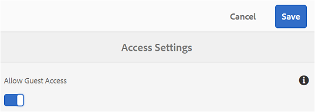

## Starten einer Gastsitzung {#begin-guest-session}

Um Brand Portal anonym aufzurufen, wählen Sie die Option **[!UICONTROL Hier klicken]** neben dem Link **[!UICONTROL Gastzugang?]** auf dem Brand Portal-Willkommensbildschirm aus. Geben Sie die Captcha-Sicherheitsprüfung ein, um Zugriff auf Brand Portal zu gewähren.

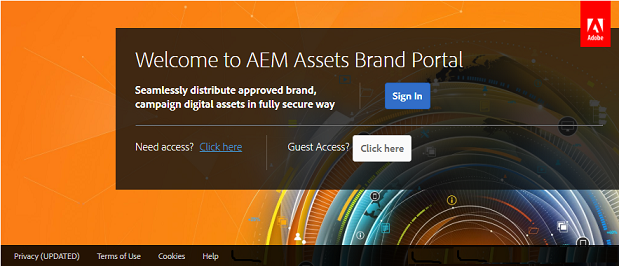

## Dauer der Gastsitzung {#guest-session-duration}

Eine Gastbenutzersitzung bleibt für 15 Minuten aktiv.
Dies bedeutet, dass der **[!UICONTROL Lightbox]**-Status ab dem Startzeitpunkt der Sitzung 15 Minuten lang beibehalten wird. Danach wird die aktuelle Gastsitzung neu gestartet, sodass der Lightbox-Status verloren geht.

Beispiel: Ein Gastbenutzer meldet sich um 15:00 Uhr bei Brand Portal an und fügt der **[!UICONTROL Lightbox]** um 15:05 Uhr Assets zum Herunterladen hinzu. Wenn der Benutzer die **[!UICONTROL Lightbox]**-Sammlung (oder ihre Assets) nicht vor 15:15 Stunden (innerhalb von 15 Minuten nach der Anmeldung) herunterlädt, muss er die Sitzung neu starten. Die **[!UICONTROL Lightbox]** ist leer, was bedeutet, dass die hochgeladenen Assets nicht mehr verfügbar sind, wenn die Sitzung verloren gegangen ist.

## Gleichzeitige Gastsitzungen zulässig {#concurrent-guest-sessions-allowed}

Die Zahl der gleichzeitigen Gastsitzungen ist auf 10 % des Gesamtbenutzerkontingents pro Organisation beschränkt. Das bedeutet für eine Organisation mit einem Benutzerkontingent von 200, dass maximal 20 Gastbenutzer gleichzeitig angemeldet sein können. Dem 21. Benutzer wird der Zugriff verweigert und er kann nur einen Gastzugriff erhalten, wenn die Sitzung von einem der 20 aktiven Gastbenutzer abläuft.

>[!NOTE]
>
>Brand Portal sendet keine Benachrichtigung, wenn die Anzahl der lizenzierten Benutzer den vertraglich vereinbarten Wert (Kontingent) überschreitet. Außerdem schränkt es die Aktivitäten der lizenzierten Benutzer nicht ein.

## Gastbenutzerinteraktion mit Brand Portal {#guest-user-interaction-with-brand-portal}

### Navigation in der Gast-Benutzeroberfläche

Nach dem Aufruf von Brand Portal als Gastbenutzer können Benutzer alle [Assets und Ordner](../using/brand-portal-sharing-folders.md#sharefolders) sehen, die öffentlich oder ausschließlich für Gastbenutzer freigegeben wurden. Bei dieser Ansicht handelt es sich um die Ansicht „Nur Inhalte“, in der Assets in einem Karten-, Listen- oder Spaltenlayout angezeigt werden.

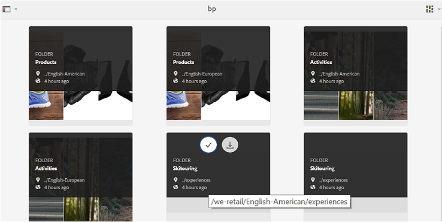

Gastbenutzer, die sich in Brand Portal anmelden, sehen jedoch die Ordnerstruktur (angefangen beim Stammordner) und die freigegebenen Ordner in den jeweiligen übergeordneten Ordnern, wenn Administratoren die Konfiguration [Ordnerhierarchie aktivieren](../using/brand-portal-general-configuration.md#main-pars-header-1621071021) ausgewählt haben.

Bei diesen übergeordneten Ordnern handelt es sich um die virtuellen Ordner, für die keine Aktionen ausgeführt werden können. Sie können diese virtuellen Ordner an einem Sperrsymbol erkennen.

Im Gegensatz zu freigegebenen Ordnern sind keine Aktionsaufgaben zu sehen, wenn Sie den Mauszeiger auf die Ordner bewegen oder sie in der **[!UICONTROL Kartenansicht]** auswählen. Die Schaltfläche **[!UICONTROL Überblick]** wird angezeigt, wenn Sie einen virtuellen Ordner in der **[!UICONTROL Spaltenansicht]** und **[!UICONTROL Listenansicht]** auswählen.

>[!NOTE]
>
>Das Standardminiaturbild der virtuellen Ordner ist das Miniaturbild des ersten freigegebenen Ordners.

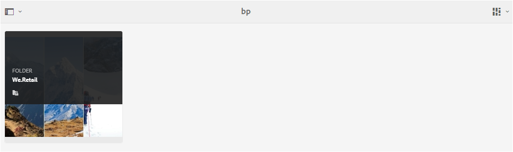 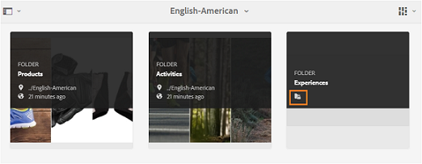 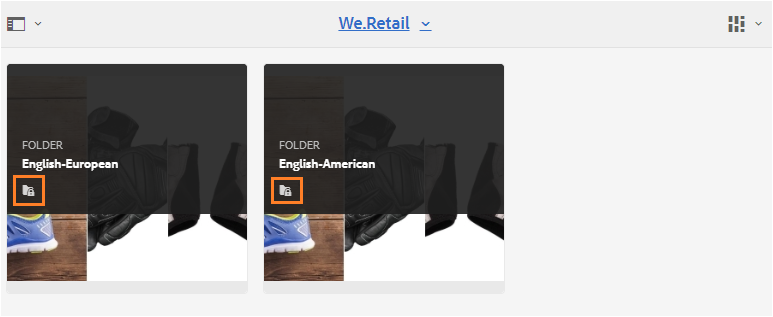 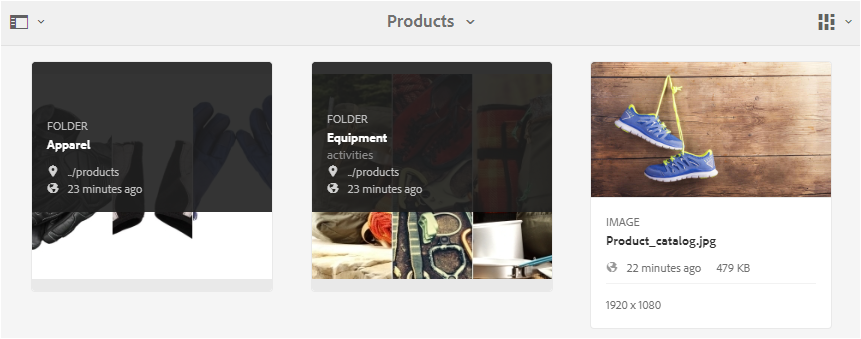

Über die Option **[!UICONTROL Anzeigeeinstellungen]** können die Gastbenutzer die Kartengrößen in der **[!UICONTROL Kartenansicht]** oder die in der **[!UICONTROL Listenansicht]** anzuzeigenden Spalten festlegen.

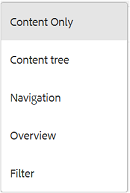

Über die **[!UICONTROL Inhaltsstruktur]** können Sie innerhalb der Assets-Hierarchie navigieren.

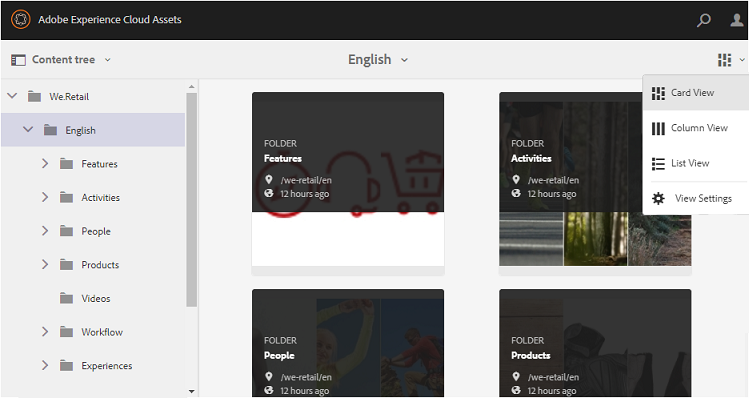

In Brand Portal steht Gastbenutzern mit der Option **[!UICONTROL Überblick]** eine Funktion zum Anzeigen von **[!UICONTROL Asset-Eigenschaften]** ausgewählter Assets/Ordner zur Verfügung. Die Option **[!UICONTROL Überblick]** finden Sie an folgenden Stellen:

* In der Symbolleiste am oberen Rand des ausgewählten Assets/Ordners.
* In der Dropdown-Liste des ausgewählten Leistenselektors.

Bei Auswahl der Option **[!UICONTROL Überblick]** bei ausgewähltem Asset/Ordner können die Benutzer den Titel, den Pfad und den Zeitpunkt der Asset-Erstellung sehen. Wohingegen die Benutzer bei Auswahl der Option **[!UICONTROL Überblick]** auf der Asset-Detailseite die Metadaten des Assets sehen können.

Die Option **[!UICONTROL Navigation]** in der linken Seitenschiene ermöglicht die Navigation von Dateien zu Sammlungen und zurück zur Gastsitzung, damit Benutzer durch Assets in Dateien oder Sammlungen navigieren können.

Über die Option **[!UICONTROL Filter]** können Gastbenutzer Asset-Dateien und Ordner nach den vom Administrator festgelegten Sucheigenschaften filtern.

### Funktionen der Gastbenutzer

Gastbenutzer können auf öffentliche Assets in Brand Portal zugreifen und haben auch einige Einschränkungen, die nachfolgend näher beschrieben werden.

**Gastbenutzer können Folgendes tun**:

* Auf alle öffentlichen Ordner und Sammlungen zugreifen, die für alle Brand Portal-Benutzer gedacht sind.
* Mitglieder und die Detailseite durchsuchen und alle Assets der Mitglieder sämtlicher öffentlicher Ordner und Sammlungen anzeigen.
* Assets in allen öffentlichen Ordnern und Sammlungen durchsuchen.
* Assets zur Lightbox-Sammlung hinzufügen. Diese Änderungen an der Sammlung bleiben für die Dauer der Sitzung bestehen.
* Assets direkt oder über die Lightbox-Sammlung herunterladen.

**Gastbenutzer können Folgendes nicht tun**:

* Sammlungen und gespeicherte Suchen erstellen oder diese weiter freigeben.
* Auf Einstellungen für Ordner und Sammlungen zugreifen.
* Assets als Links freigeben.

### Herunterladen von Assets in Gastsitzungen

Gastbenutzer können öffentlich oder ausschließlich für Gastbenutzer freigegebene Assets in Brand Portal herunterladen. Gastbenutzer können auch Assets zu **[!UICONTROL Lightbox]** (öffentliche Sammlung) hinzufügen und die **[!UICONTROL Lightbox]**-Sammlung herunterladen, bevor ihre Sitzung abläuft.

Verwenden Sie zum Herunterladen von Assets und Sammlungen das Symbol „Download“ an folgenden Stellen:

* Schnellzugriff-Miniaturansichten, die beim Bewegen des Mauszeigers über das Asset bzw. die Sammlung angezeigt werden
* Die Symbolleiste oben, die bei Auswahl des Assets bzw. der Sammlung angezeigt wird

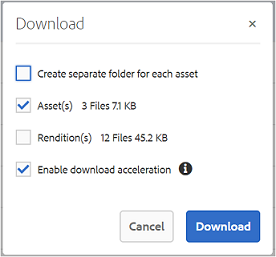

Mit der Option **[!UICONTROL Download-Beschleunigung aktivieren]** im Dialogfeld [!UICONTROL Download] können Sie die [Download-Zeit verkürzen](../using/accelerated-download.md).

## Beenden einer Gastsitzung {#exit-guest-session}

Beenden Sie die Gastsitzung durch Auswahl von **[!UICONTROL Sitzung beenden]** aus den in der Kopfzeile verfügbaren Optionen. Ist die für die Gastsitzung verwendete Browser-Registerkarte inaktiv, läuft die Sitzung automatisch nach 2 Stunden Inaktivität ab.

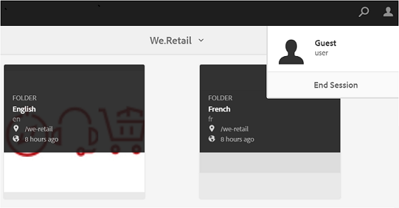

## Überwachen von Gastbenutzeraktivitäten {#monitoring-guest-user-activities}

Administratoren können die Gastbenutzerinteraktion mit der Brand Portal überwachen. In Brand Portal erstellte Berichte können wichtige Einblicke in Gastbenutzeraktivitäten bieten. So können Sie beispielsweise mithilfe des Berichts **[!UICONTROL Download]** die Anzahl an Assets nachverfolgen, die vom Gastbenutzer heruntergeladen wurden. Der Bericht **[!UICONTROL Benutzeranmeldungen]** kann darüber informieren, wann sich der Gastbenutzer zuletzt im Portal angemeldet hat und wie oft er sich in einer bestimmten Zeit angemeldet hat.
