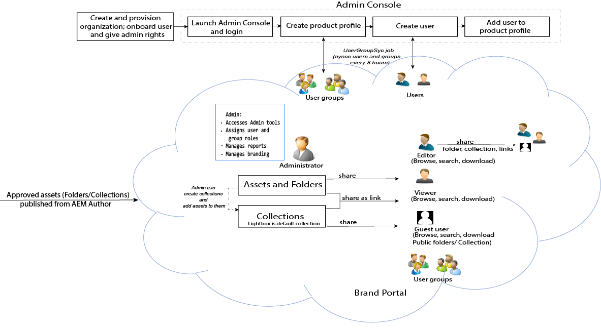

# Benutzerhandbuch für Adobe Experience Manager Assets Brand Portal {#aem-brand-portal}

**Adobe Experience Manager Assets Brand Portal** unterstützt Unternehmen dabei, ihre Marketing-Anforderungen zu erfüllen, indem freigegebene Marken- und Produktressourcen sicher zum Herunterladen an externe Agenturen, Partner, interne Teams und Wiederverkäufer verteilt werden.

Das Fehlen einer sicheren Lösung für die Asset-Freigabe kann zu folgenden Problemen führen:

* Manuelle Freigabe von Assets per E-Mail oder Cloud
* Probleme mit der Markenkonformität
* Mangelnde Kontrolle über die Asset-Nutzung
* Verzögerungen bei Kampagnen und Produktstarts
* Duplizierung von Inhalten über geografische Standorte und Organisationen hinweg
* Ungesicherte Speicherung von Assets vor der Veröffentlichung

Mit Brand Portal können Unternehmen Marken-Compliance sicherstellen, indem sie es Marketing-Fachleuten ermöglichen, mit Vertriebspartnern und internen Unternehmensbenutzern zusammenzuarbeiten, um die neuesten Design-Richtlinien, Logos, Kampagnen und Produktressourcen schnell zu erstellen, zu verwalten und an die Projektbeteiligten weiterzuleiten.
Brand Portal ist ein Cloud-basiertes SaaS-Angebot. Es ist als Add-on für Adobe Experience Manager Assets (on-premise oder als verwalteter Dienst) verfügbar. Sie können Brand Portal mit [!DNL Adobe Experience Manager Assets] as a [!DNL Cloud Service] nutzen. Nach der [Konfiguration](https://experienceleague.adobe.com/docs/experience-manager-cloud-service/content/assets/brand-portal/configure-aem-assets-with-brand-portal.html?lang=de) können genehmigte Assets aus einer Instanz von [!DNL Adobe Experience Manager Assets] as a [!DNL Cloud Service] in [!DNL Brand Portal] veröffentlicht werden und an Benutzerinnen und Benutzer von Brand Portal verteilt werden.

Der Lösungs-Workflow in Brand Portal ist in der folgenden Abbildung dargestellt.

## Adobe Experience Manager Brand Portal – Benutzerhandbuch

Dieses Benutzerhandbuch enthält Einblicke in Funktionen und wichtige Workflows in Brand Portal. Verwenden Sie die linke Leiste, um durch verschiedene Funktionen zu navigieren und um eine Recherche dazu durchzuführen, wie verschiedene Personen mit dem Portal interagieren.

### Siehe auch

| Benutzerhandbuch | Beschreibung |
|--- |---|
| [Neuerungen](whats-new.md) | Änderungen in früheren Versionen und die neuesten Angebote in Brand Portal. |
| [Versionshinweise](brand-portal-release-notes.md) | Verbesserungen, behobene kritische Probleme und bekannte Probleme in der aktuellen Version. |
| [Konfigurieren von Experience Manager Assets mit Brand Portal](../using/configure-aem-assets-with-brand-portal.md) | Replizieren von Brand Portal mit Experience Manager Assets, um Assets zu veröffentlichen. |
| [Fehlerbehebung bei Problemen in paralleler Veröffentlichung](troubleshoot-parallel-publishing.md) | Fehlerbehebung bei der Replikation zwischen Brand Portal und Experience Manager Assets. |
| [Unterstützte Dateiformate](brand-portal-supported-formats.md) | Unterstützte Dateiformate in Brand Portal für Vorschau und Download. |
| [Veröffentlichen von Assets in Brand Portal](brand-portal-sharing-folders.md) | Veröffentlichen von Ordnern, Sammlungen, Links, Vorgaben, Schemas, Facetten und Tags in Brand Portal. |
| [Asset-Beschaffung in Brand Portal](brand-portal-asset-sourcing.md) | Konfigurieren der Asset-Beschaffung in AEM Assets, Hochladen von Assets in Brand Portal und erneutes Veröffentlichen des Beitragsordners in AEM Assets. |
| [Videos zu Brand Portal-Funktionen](https://experienceleague.adobe.com/?lang=de&amp;tag=Brand+Portal#recommended/solutions/experience-manager) | Erfahren Sie in Video-Tutorials, wie Sie Experience Manager Assets Brand Portal verwenden. |

### Hilfreiche Ressourcen

* [Grundlagen von Brand Portal mit AEM Assets](https://experienceleague.adobe.com/docs/experience-manager-brand-portal/using/home.html?lang=de)
