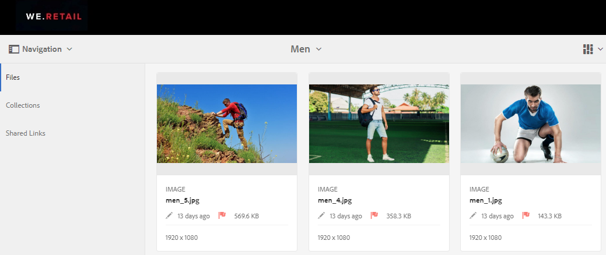
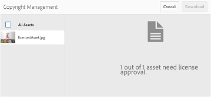
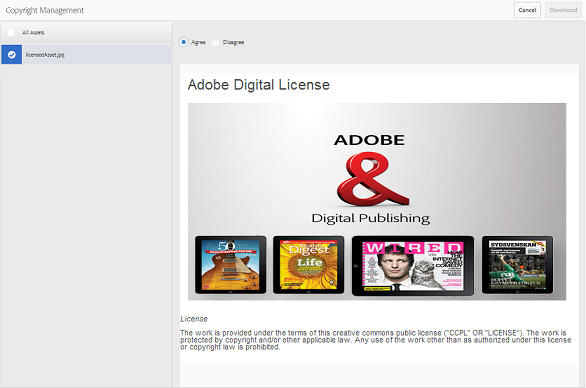
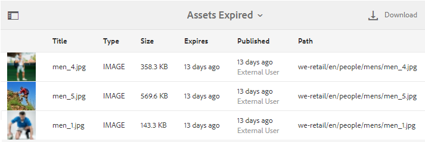

# Verwalten der digitalen Rechte von Assets {#manage-digital-rights-of-assets}

Eine sichere Verteilung und Nutzung von Kreativ-Assets und Markenmaterial ist für den Schutz Ihrer Marke wichtig. This can be enforced across the organization and outside by associating an expiration date (and time) with approved assets published from [!DNL AEM] to [!DNL Brand Portal], or by licensing these assets for conditional use. Also, [!DNL Brand Portal] allows you to specify an expiration date for links to the assets shared from [!DNL Brand Portal].

Read on to know how the assets are secured on [!DNL Brand Portal] and understand the associated usage permissions.

## Asset-Ablauf {#asset-expiration}

Der Asset-Ablauf ist eine effektive Möglichkeit, die Nutzung der genehmigten Assets in Brand Portal unternehmensweit zu kontrollieren. All the assets published from [!DNL AEM] Assets to Brand Portal can have an expiration date, which restricts the usage of these assets by different user roles.

### Nutzungsberechtigungen in Bezug auf abgelaufene Assets {#usage-permissions-expired-assets}

In [!DNL Brand Portal], Administrators can view, download, and add expired assets to collections. Bearbeiter und Betrachter können dagegen nur abgelaufene Assets anzeigen und sie zu Sammlungen hinzufügen.

Administrators can publish expired assets from [!DNL AEM] Assets to [!DNL Brand Portal]. However, expired assets cannot be shared via ink from [!DNL Brand Portal]. If you select any expired asset from a folder containing both expired and non-expired assets, the **[!UICONTROL Share Link]** action is not available. Wenn Sie jedoch einen Ordner auswählen, der abgelaufene und nicht abgelaufene Assets enthält, sind die [!UICONTROL Aktionen "Freigeben] «und **[!UICONTROL " Verknüpfen"]** verfügbar.

>[!NOTE]
>
>Ein Ordner kann weiterhin als Link freigegeben werden, auch wenn er abgelaufene Assets enthält. In diesem Fall enthält der Link keine abgelaufenen Assets, und nur die nicht abgelaufenen Assets werden freigegeben.

In der folgenden Tabelle werden die Nutzungsberechtigungen der abgelaufenen Assets angezeigt:

|  | **Linkfreigabe** | **Download** | **Eigenschaften** | **Zu Sammlung hinzufügen** | **Löschen** |
|---|---|---|---|---|---|
| **Administrator** | Nicht verfügbar | Verfügbar | Verfügbar | Verfügbar | Verfügbar |
| **Bearbeiter** | Nicht verfügbar | Nicht verfügbar | Verfügbar | Verfügbar | Nicht verfügbar |
| **Betrachter** | Nicht verfügbar | Nicht verfügbar | Verfügbar | Verfügbar | Nicht verfügbar |
| **Gastbenutzer** | Nicht verfügbar | Nicht verfügbar | Verfügbar | Verfügbar | Nicht verfügbar |

>[!NOTE]
>
>Wenn Viewer und Editors einen Ordner herunterladen, der abgelaufene und nicht abgelaufene Assets enthält, werden nur die nicht abgelaufenen Assets heruntergeladen. Wenn ein Ordner nur abgelaufene Assets enthält, wird ein leerer Ordner heruntergeladen.

### Gültigkeitsstatus und Assets {#expiration-status-of-assets}

Sie können den Gültigkeitsstatus der Assets in der Kartenansicht sehen. Abgelaufene Assets sind mit einer roten Flagge gekennzeichnet.

>[!NOTE]
>
>In den Listen- und Spaltenansichten wird der Gültigkeitsstatus der Assets nicht angezeigt.

## Ablauf des Asset-Links {#asset-link-expiration}

While sharing assets through links, Administrators and Editors can set a date and time of expiration using the **[!UICONTROL Expiration]** field in the **[!UICONTROL Link Sharing]** dialog box. Der Standardmäßige Link-Ablauf beträgt sieben Tage nach dem Datum der Freigabe des Links.

It ensures that assets shared as links expire at the date and time set by [!DNL Brand Portal] Administrators and Editors, and can no longer be viewed and downloaded beyond the expiration date. Da die über Links freigegebenen Assets auch von externen Benutzern angesehen werden können, die nicht Teil des Unternehmens sind, können Sie durch Angabe von Ablauf sicherstellen, dass Ihre genehmigten Assets geschützt sind und nicht unbekannte Entitäten nach einer bestimmten Zeit offen gelegt werden.

For more information about link sharing, refer to [Share assets as a link](../using/brand-portal-link-share.md).

## Lizenzierte Assets {#licensed-assets}

Das Herunterladen von lizenzierten Assets aus Brand Portal unterliegt einer Lizenzvereinbarung. This agreement for licensed assets comes when you directly download the asset from [!DNL Brand Portal] or via a shared link. Abgelaufene oder nicht abgelaufene Assets, die durch eine Lizenz geschützt sind, können von allen Benutzern angezeigt werden. Jedoch ist der Download und die Verwendung von abgelaufenen genehmigten Assets begrenzt. Informationen zum Verhalten von abgelaufenen lizenzierten Assets und den zulässigen Aktivitäten basierend auf Benutzerrollen finden Sie unter [Nutzungsberechtigungen in Bezug auf abgelaufene Assets](../using/manage-digital-rights-of-assets.md#usage-permissions-expired-assets).

License-protected assets have [license agreement attached](https://helpx.adobe.com/experience-manager/6-5/assets/using/drm.html#DigitalRightsManagementinAssets) to them, which is done by setting asset's [metadata property](https://helpx.adobe.com/experience-manager/6-5/assets/using/drm.html#DigitalRightsManagementinAssets) in [!DNL AEM] Assets.

If you choose to download license-protected asset(s), you are redirected to [!UICONTROL Copyright Management] page.

Hier müssen Sie das Asset auswählen, das Sie herunterladen möchten, und die zugehörige Lizenzvereinbarung annehmen. If you do not accept the license agreement, the **[!UICONTROL Download]** button is not enabled.

Falls die Auswahl mehrere geschützte Assets enthält, wählen Sie jeweils eines aus, nehmen Sie die Lizenzvereinbarung an und fahren Sie mit dem Herunterladen des Assets fort.

## Erstellen von Berichten zu abgelaufenen Assets {#generate-report-about-expired-assets}

Administratoren können einen Bericht erstellen und herunterladen, in dem alle Assets aufgeführt sind, die innerhalb eines bestimmten Zeitraums abgelaufen sind. Dieser Bericht enthält detaillierte Informationen (z. B. Größe, Typ, Pfad für den Asset-Speicherort in der Asset-Hierarchie, wann das Asset abläuft) und wann das Asset veröffentlicht wurde - zu den abgelaufenen Assets. Die Spalten dieses Berichts können angepasst werden, um basierend auf den Benutzeranforderungen mehr Daten anzuzeigen.

For more information about the reports feature, refer [Work with reports](../using/brand-portal-reports.md#work-with-reports).
